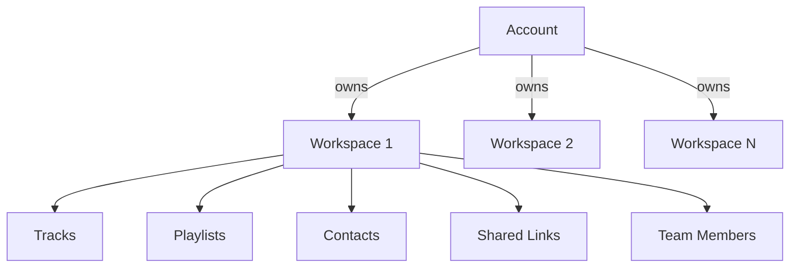
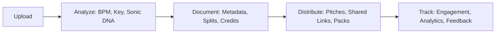
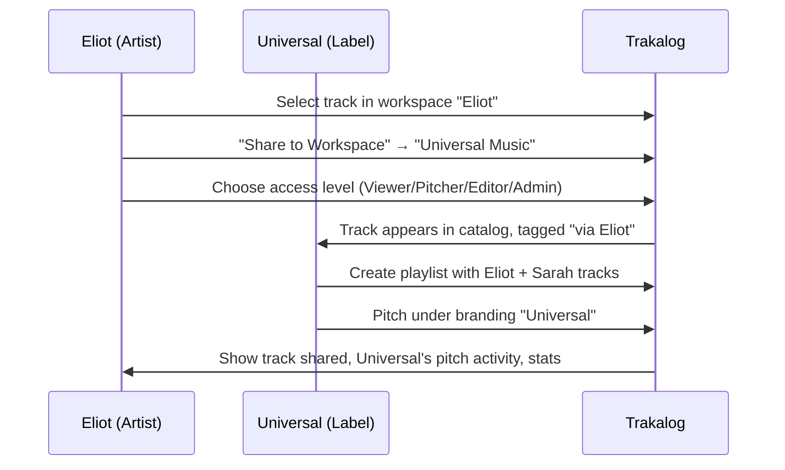
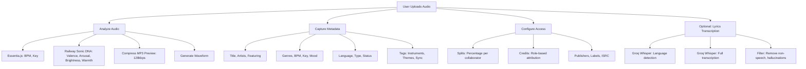
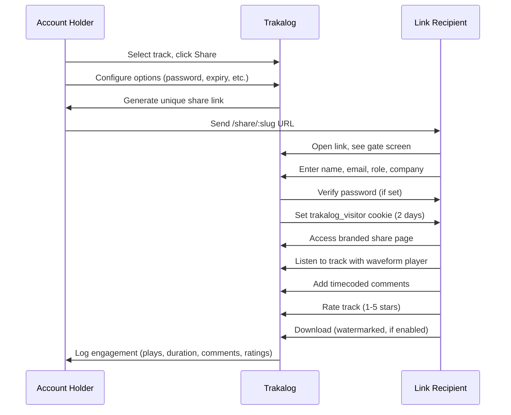
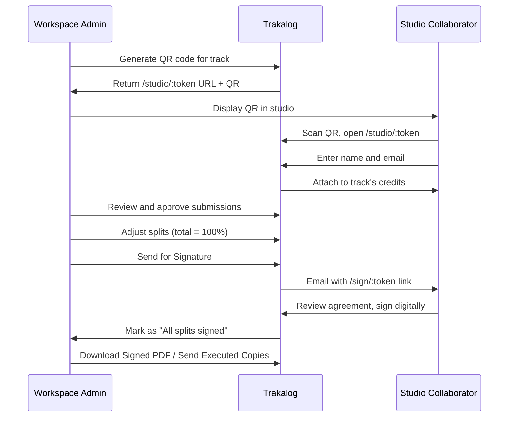

# 01 - Vision & Overview

> **Status:** Stable  
> **Version:** 1.0.0  
> **Created:** August 11, 2026  
> **Last Updated:** August 11, 2026  
> **Owner:** Ishan  
> **Related:** [02 - System Architecture](02-SYSTEM_ARCHITECTURE.md), [PRODUCT_AND_UX_OVERVIEW.md](PRODUCT_AND_UX_OVERVIEW.md), [TRAKALOG_ARCHITECTURE.md](../../TRAKALOG_ARCHITECTURE.md)

---

## Abstract

This document provides the **source of truth** for understanding Trakalog's purpose, vision, and core architectural principles. It synthesizes the existing French architecture documentation and English product overview into a unified vision that guides all technical decisions.

---

## 1. Executive Summary

### 1.1 One-Sentence Pitch

> Trakalog is the nervous system for unreleased music: it protects, analyzes, connects, and activates catalogs before they go public.

### 1.2 The Problem Space

Once a track is public, the music industry has abundant tooling. **Before release, a track is a confidential asset** that must be shared with A&Rs, supervisors, managers, labels, mix engineers, and other collaborators — and every share is a leak risk with no accountability.

Traditional solutions (Dropbox for music, file-sharing services) fail because they:
- ❌ Don't understand music metadata (BPM, key, ISRC, splits)
- ❌ Lack industry-specific workflows (pitching, approvals, signatures)
- ❌ Provide no leak protection or tracing
- ❌ Don't serve the recipient experience (forced account creation, poor branding)
- ❌ Can't handle the complexity of modern music collaboration (multiple workspaces, catalog sharing)

### 1.3 The Solution

Trakalog addresses these gaps with:

| Differentiator | Description | Value |
|---------------|-------------|-------|
| **Invisible Audio Watermarking** | Embeds recipient identity directly in audio | Leak tracing, deterrence |
| **Sonic DNA Profiler** | Advanced audio analysis (Essentia.js) | AI matching, catalog intelligence |
| **Dual Audience Architecture** | Separate experiences for account holders vs link recipients | Frictionless sharing, unlimited recipients |
| **Multi-Workspace Model** | Isolated catalogs with cross-workspace sharing | Flexibility for labels, managers, artists |
| **Digital Splits & Signatures** | Built-in rights management with legal validity | Professional workflow, compliance |
| **Industry-Standard Metadata** | ISRC, UPC, DDEX export, complete credits | Distribution readiness |

---

## 2. The Two Audiences — The Most Important Concept

> **🎯 This single distinction drives most product and billing decisions.**

### 2.1 Account Holders

**Who:** Producers, beatmakers, artists, managers, labels, A&Rs  
**Account:** Yes (required)  
**Entry Point:** `app.trakalog.com` (logged in)  
**Billed:** Yes, consumes a seat  
**Sees:** Full application  
**Purpose:** Manage catalogs, upload tracks, create shared links, manage teams

**Access Levels (4 tiers):**

| Level | View/Play | Create Shared Links | Edit Metadata | Manage Team | Manage Workspace |
|-------|:---------:|:-------------------:|:-------------:|:-----------:|:----------------:|
| **Viewer** | ✅ | ❌ | ❌ | ❌ | ❌ |
| **Editor** | ✅ | ✅ | ✅ | ❌ | ❌ |
| **Admin** | ✅ | ✅ | ✅ | ✅ | ✅ |
| **Owner** | ✅ | ✅ | ✅ | ✅ | ✅ |

> **Note:** Pitcher role is retired from the UI but remains in the server hierarchy for legacy members.

**Professional Titles (Display Only):**
- Producer, Songwriter, Musician, Mix Engineer, Mastering Engineer
- Manager, Publisher, A&R, Assistant, Artist, Viewer

> ⚠️ **CRITICAL:** Professional titles are **display metadata only** — they do NOT grant permissions. This is a common source of confusion.

### 2.2 Link Recipients

**Who:** A&Rs, supervisors, collaborators, engineers, clients  
**Account:** **No — never**  
**Entry Point:** A URL someone sent them (`/share/:slug`)  
**Billed:** **Never counted, unlimited**  
**Sees:** One page, scoped to what was shared  
**Purpose:** Listen, comment, rate, download, save to their own Trakalog

### 2.3 Business Model Implications

**The free, unlimited channel is the shared link.** This means:

1. **Anyone who needs permanent catalog access** becomes a member and consumes a seat
2. **Anyone who needs to hear a track** gets a link — no signup required
3. **An A&R receives a track or playlist by link and never signs up**
4. **For most people who ever touch Trakalog, the shared link page IS the entire product**

This architectural decision shapes:
- The recipient-facing surface (`/share/:slug`) design
- Branding and watermarking implementation
- Feedback capture and consent architecture
- Growth loop (recipients can save to their own Trakalog workspace)

---

## 3. Product Vision

### 3.1 The Long-Term Vision

Trakalog aims to become the **operating system for the music industry's pre-release workflow**. Beyond just storing and sharing files, Trakalog provides:

- **Intelligence:** AI-powered matching and catalog insights
- **Protection:** Invisible watermarking and leak tracing
- **Collaboration:** Multi-workspace catalog sharing with granular permissions
- **Professionalism:** Digital splits, signatures, and industry-standard exports
- **Frictionless Distribution:** Recipient-optimized shared links that don't require accounts

### 3.2 Core Value Propositions

#### 3.2.1 For Independent Creators

- **Protect your work** before it's released
- **Get intelligent feedback** with timecoded comments and ratings
- **Stay organized** with automatic metadata extraction and tagging
- **Look professional** with branded shared links and custom domains
- **Prepare for distribution** with ISRC generation and DDEX exports

#### 3.2.2 For Labels and Managers

- **Manage multiple artists** through separate workspaces
- **Control access** with granular permissions and catalog sharing
- **Track engagement** with detailed analytics on every share
- **Streamline approvals** with digital signatures and split agreements
- **Maintain oversight** with multi-workspace dashboards

#### 3.2.3 For Studios and Engineers

- **Capture credits in the moment** with QR code studio sessions
- **Collaborate seamlessly** across multiple projects and clients
- **Maintain version history** with track versioning and change tracking
- **Integrate with existing workflows** through flexible import/export options

### 3.3 What Trakalog Is NOT

❌ **Not a streaming platform** - Tracks are unreleased and confidential  
❌ **Not a social network** - No public profiles or discovery (Access feature is opt-in)  
❌ **Not a DAW or production tool** - Focuses on catalog management, not creation  
❌ **Not a distribution service** - Prepares tracks for distribution, doesn't distribute  
❌ **Not a generic file-sharing service** - Built specifically for music industry workflows  

---

## 4. Core Objects — The Mental Model

Trakalog's data model revolves around these fundamental entities:

### 4.1 Workspace

**The container.** Everything is scoped to a workspace.



**Characteristics:**
- A user can own **multiple workspaces**
- Each workspace has its own:
  - Catalog of tracks
  - Branding (hero image, logo, brand color)
  - Members with access levels
  - Pitches, shared links, contacts
- **Personal workspace** is created automatically for each user
- **Workspace switcher** allows navigation between owned workspaces

**Use Cases:**
- "Yannick Rastogi" → personal workspace for solo artist
- "Studio XYZ" → workspace for a label
- "Client — Eliot" → workspace for managing one artist
- "Client — Sarah" → workspace for managing another artist

### 4.2 Track

**The unit.** The central entity in Trakalog.

**Components:**
- Audio file (WAV/MP3 original)
- MP3 preview (128kbps compressed)
- Cover art
- Metadata (title, artists, featuring, genres, BPM, key, mood, language, type, status, tags)
- Credits (performer, production, technical roles)
- Splits (percentage ownership by collaborator)
- Lyrics
- Stems (component audio files: drums, bass, vocals, etc.)
- Documents (contracts, agreements, paperwork)
- Sonic DNA profile (audio analysis results)
- Version history

**Lifecycle:**


**File Storage:**
| File Type | Storage Bucket | Purpose |
|-----------|----------------|---------|
| Original Audio | `tracks` | Master WAV/MP3 |
| Preview MP3 | `tracks` | 128kbps streaming preview |
| Cover Art | `covers` | Album/track artwork |
| Stems | `stems` | Component audio files |
| Documents | `documents` | Contracts, agreements (watermarked) |

### 4.3 Shared Link

**The primary output.** How Trakalog content reaches recipients.

**Types:**
| Type | Contents | Watermarked |
|------|----------|-------------|
| `track` | One track with player + lyrics + comments | ✅ Always |
| `playlist` | Ordered set of tracks with player | ✅ Always |
| `stems` | Component audio files for collaboration | ⚠️ Working material |
| `pack` | Final delivery: track + cover + lyrics PDF + metadata PDF + splits PDF + paperwork | ❌ Clean audio (by design) |

> 🎯 **Design Decision:** Watermarking follows **intent** (share_type), not **format** (file vs ZIP). Packs deliver clean masters intentionally for final delivery.

**Protection Options:**
- Public (no password)
- Secured (password PBKDF2 100k iterations)
- Expiration date
- Download on/off
- Download quality selection
- "Save to Trakalog" on/off
- Watermarking on/off

**Gate Screen:**
Every shared link presents a gate screen collecting:
- Name
- Email
- Role (optional)
- Company (optional)

Cookie `trakalog_visitor` (2-day expiry) skips gate on return visits.

**Consent Architecture:**
- **Access + watermarking/tracing**: No consent needed (legitimate interest)
- **Added to artist's contacts**: Dedicated opt-in checkbox, unchecked by default, access never conditioned on it

### 4.4 Catalog Share

**Workspace-to-workspace sharing.**

**The Problem:** A label (Universal) manages multiple artists (Eliot, Sarah). Each artist has their workspace. The label wants to pitch tracks from multiple artists in one playlist under the label's branding.

**The Solution:** Catalog Share allows artists to share tracks to external workspaces while retaining ownership.



**Access Levels for Sharing:**
| Level | Description |
|-------|-------------|
| **Viewer** | Universal can view and listen only |
| **Pitcher** | Universal can listen + playlist + pitch + share links |
| **Editor** | + modify metadata, stems, lyrics, paperwork (NOT splits) |
| **Admin** | Full access, identical to Eliot |

**Rules:**
- Track remains in source workspace (Eliot)
- Target workspace (Universal) has **referenced access**
- Artist can **revoke** access anytime → track disappears from label's catalog
- Engagement stats flow to **both** artist and label
- Branding of pitches/share links uses **target workspace** (Universal), not source
- Artist can set different access **per track** or **entire catalog**

### 4.5 Other Core Objects

| Object | Description | Key Relationships |
|--------|-------------|-------------------|
| **Playlist** | Ordered selection of tracks, shareable as a unit | Belongs to workspace, contains tracks |
| **Contact** | Person in workspace's address book | Belongs to workspace, linked to shared link captures |
| **Split** | Ownership percentage for a track | Belongs to track, assigned to collaborator |
| **Signature** | Digital signature on split agreement | Belongs to split, linked to user |
| **Watermark Payload** | Hash mapping to recipient identity | Generated per download, used for leak tracing |

---

## 5. Architecture Principles

### 5.1 Design Philosophies

#### 5.1.1 The Recipient Never Signs Up

> **🚫 Any feature requiring a recipient to create an account to do something basic is wrong by construction.**

Basic actions that must work without account:
- Hear a track
- Leave a comment
- Rate a track
- Sign a split agreement
- Download a track (if enabled)

#### 5.1.2 Watermarking Follows Intent, Not Format

> **🎯 Watermarking branches on `share_type`, not on "is this a ZIP".**

If code branches on file format (ZIP vs individual file), it's likely a bug.

**Correct:**
```typescript
if (shareType === 'pack') {
  // Clean audio - final delivery
} else {
  // Watermarked - working material or shared content
}
```

**Incorrect:**
```typescript
if (isZip) {
  // Different behavior
}
```

#### 5.1.3 Metadata Completeness Is a Product Mechanism

> **📊 The nudges exist because Smart A&R, Sonic DNA, and future matching features are only as good as the metadata entered.**

Completeness bar isn't cosmetic — it directly enables AI features:
- Smart A&R matching quality
- Sonic DNA analysis usefulness
- Catalog intelligence
- Search and filtering effectiveness

#### 5.1.4 Product Honesty in Copy

> **🗣️ Describe what the product actually does, not what we wish it did.**

**Approved phrasing:**
- "Automatic BPM and key detection"
- "Audio fingerprinting that powers Smart A&R matching"
- "Sonic DNA analysis for catalog intelligence"

**Avoid:**
- "Automatic mood detection" (was removed - inaccurate)
- "Automatic structure detection" (was removed - inaccurate)
- "AI-powered everything" (be specific)

### 5.2 Technical Constraints

#### 5.2.1 Browser Limitations
- `@supabase/supabase-js@2.x` in browser only accepts HTTP/HTTPS URLs (not direct PostgreSQL)
- This necessitates Supabase REST API endpoints for all browser-based operations
- Direct PostgreSQL connections are Node.js-only

#### 5.2.2 Context Window Limitations
- Groq `llama-3.3-70b-versatile` has 128,000 token context window
- Smart A&R prompt saturates at ~1,250 tracks (~100 tokens/track)
- Business plan sells 5,000 tracks → will hit hard failure at 25% of quota
- **Mitigation needed:** Pre-filter catalog before LLM (see [GROQ_USAGE_AND_COSTS.md](GROQ_USAGE_AND_COSTS.md))

#### 5.2.3 Storage Constraints
- R2 has no egress fees (good for downloads)
- Supabase Edge Functions have memory limits
- Large audio files (WAV masters) can cause OOM in Edge Functions
- **Mitigation:** Check Content-Length via HEAD request before downloading

### 5.3 Non-Goals

Explicitly out of scope:
- Public social features (no public profiles, feed, etc.)
- Audio production/editing tools (DAW functionality)
- Distribution to streaming platforms
- Real-time collaboration (Google Docs-style)
- Mobile native apps (web-first, PWA support planned)

---

## 6. Key Workflows

### 6.1 Track Upload & Processing



**Completeness Bar:** Nudges users toward filling all metadata (enables AI features).

### 6.2 Sharing a Track



### 6.3 Leak Tracing

```mermaid
flowchart TD
    A[Admin suspects leak] --> B[Upload leaked audio file]
    B --> C[Extract watermark hash]
    C --> D[Query watermark_payloads table]
    D --> E[Match: recipient name, email, link used, date]
    E --> F[Generate leak tracing report]
    D -->|No match| G[State: "audio appears clean"]
```

**Database:** `watermark_payloads` table stores hash → recipient identity mapping (never in the file itself).

### 6.4 Studio QR Workflow (Splits Capture)



**Key Feature:** Works with **even one collaborator** (no minimum threshold).

---

## 7. Roadmap

### 7.1 Current Status (Private Beta)

- ✅ Core features (upload, player, lyrics, shared links, pitches, splits, signatures)
- ✅ UI/UX polish (all pages redesigned in Trakalog premium style)
- ✅ Branding workspace (hero image, logo, brand color)
- 🔄 Audit and bug fixes
- 🔄 Documentation (this effort)

### 7.2 Next: Multi-Workspace Phase

1. Multi-workspace per account + switcher
2. New permission system (4 access levels + professional titles)
3. Catalog sharing between workspaces

### 7.3 Phase 3: Security

1. Invisible audio watermarking (Railway/audiowmark)
2. Global rate limiting
3. CSP headers
4. IP logging
5. Audit logs

### 7.4 Phase 4: AI Agents

Order of implementation:
1. Sonic DNA Profiler (analysis audio avancée) - ✅ Deployed on Railway
2. Split Mediator (médiation splits en studio)
3. Sync Matchmaker (matching with briefs sync)
4. Session Replay Analyst (interprétation heatmaps)
5. Ghost Revenue Hunter (revenus non-réclamés)
6. Catalog Awakener (réactivation catalogues dormants)
7. Network Weaver (connexions artistes)

---

## 8. Reference: Existing Detailed Documentation

For deeper understanding of specific areas, see:

- **[PRODUCT_AND_UX_OVERVIEW.md](PRODUCT_AND_UX_OVERVIEW.md)** - Comprehensive product and UX deep-dive
- **[GROQ_USAGE_AND_COSTS.md](GROQ_USAGE_AND_COSTS.md)** - Detailed AI usage and cost analysis
- **[TRAKALOG_BILLING.md](../TRAKALOG_BILLING.md)** - Complete billing and pricing model
- **[TRAKALOG_ARCHITECTURE.md](../../TRAKALOG_ARCHITECTURE.md)** - Original French architecture document

---

## 📝 Document Metadata

| Property | Value |
|----------|-------|
| **Created** | August 11, 2026 |
| **Version** | 1.0.0 |
| **Owner** | Ishan |
| **Status** | Stable |
| **Next Review** | September 11, 2026 |
| **Related Documents** | [02 - System Architecture](02-SYSTEM_ARCHITECTURE.md), [Index](INDEX.md) |

---

*This document synthesizes the vision from [TRAKALOG_ARCHITECTURE.md](../../TRAKALOG_ARCHITECTURE.md) and [PRODUCT_AND_UX_OVERVIEW.md](PRODUCT_AND_UX_OVERVIEW.md) with additional insights from codebase analysis.*