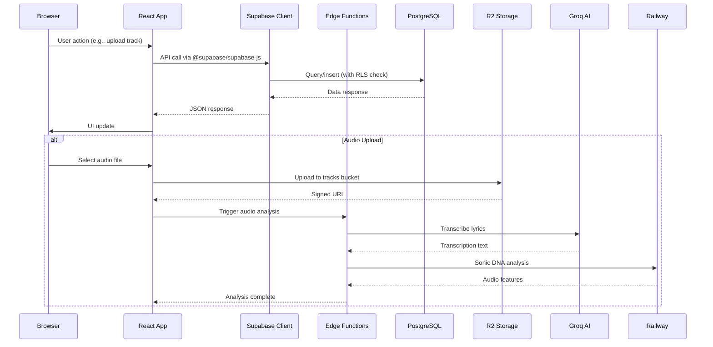
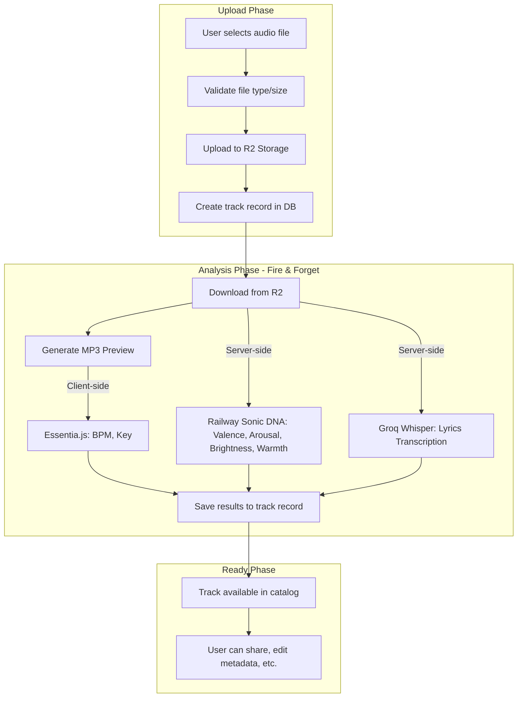
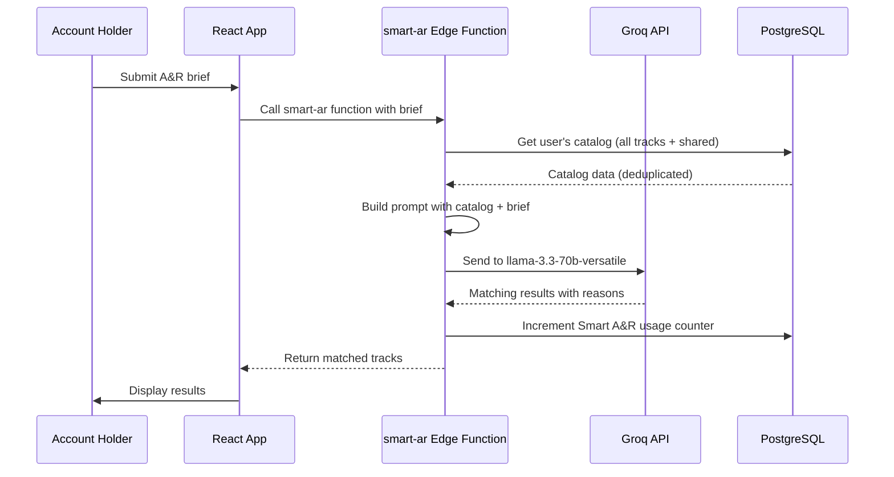
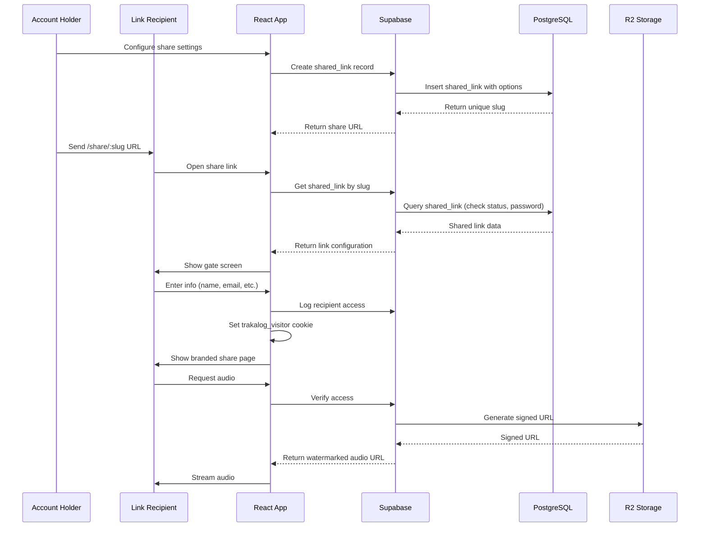
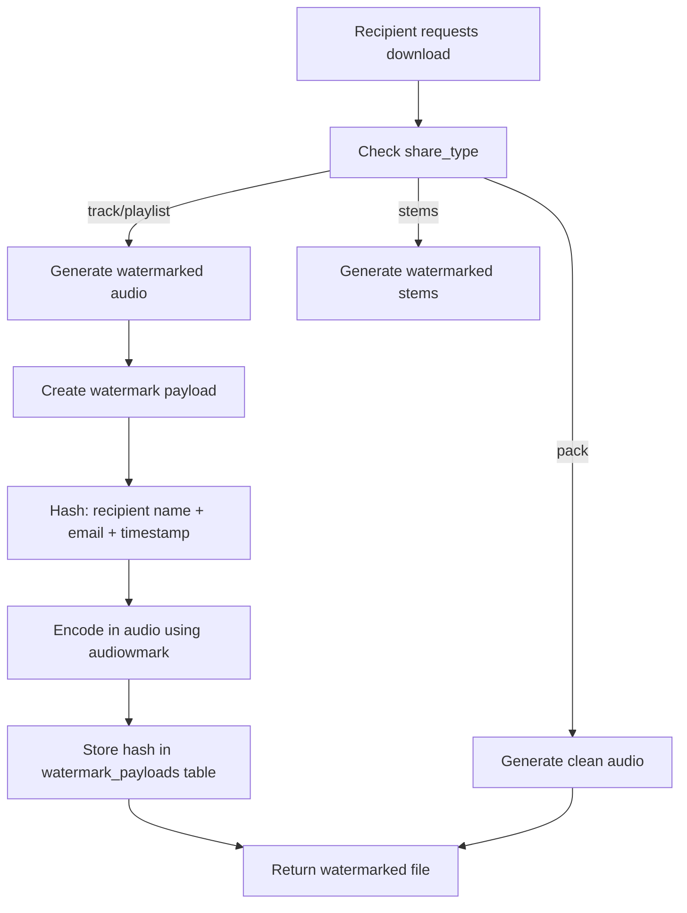
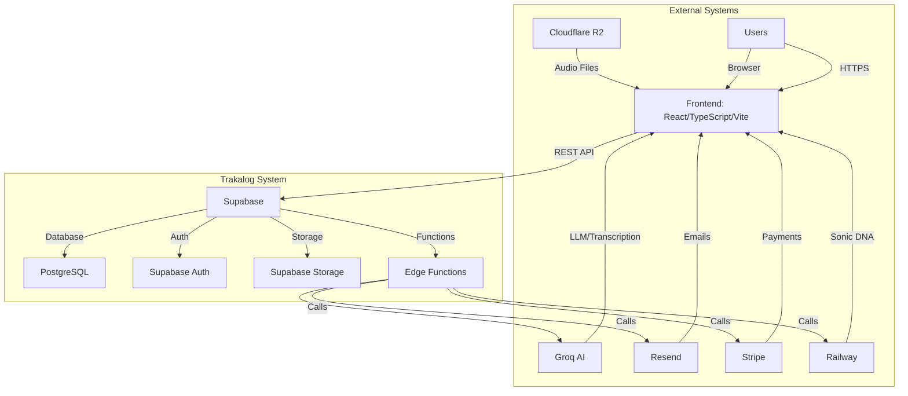
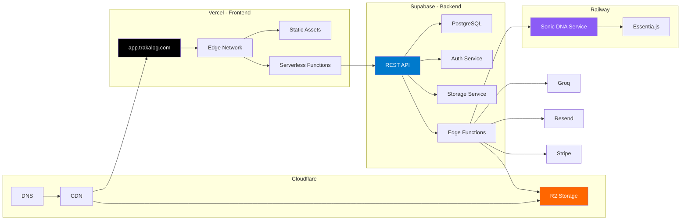

# 02 - System Architecture

> **Status:** Stable — verified against the code, September 2, 2026
> **Version:** 1.0.0  
> **Created:** August 11, 2026  
> **Last Updated:** September 2, 2026
> **Owner:** Ishan  
> **Related:** [01 - Vision & Overview](01-VISION_AND_OVERVIEW.md), [03 - Data Architecture](03-DATA_ARCHITECTURE.md)

---

## Abstract

This document provides a comprehensive technical overview of Trakalog's system architecture, including all components, layers, technology stack, and data flow patterns. It serves as the primary reference for understanding how the application is built and how its parts interact.

---

## 1. System Components Overview

Trakalog follows a **layered architecture** with clear separation of concerns:

```mermaid
layerDiagram
    direction TB
    layer "Client Layer" as CL {
        component "React App"
        component "UI Components"
        component "State Management"
    }
    layer "API Layer" as AL {
        component "Supabase Client"
        component "React Query"
        component "Custom Hooks"
    }
    layer "Backend Layer" as BL {
        component "Supabase"
        component "Edge Functions"
        component "PostgreSQL"
    }
    layer "Service Layer" as SL {
        component "R2 Storage"
        component "Railway"
        component "Groq AI"
        component "Resend"
        component "Stripe"
    }
    CL --> AL : HTTP/HTTPS
    AL --> BL : Supabase REST API
    BL --> SL : HTTP APIs
```

---

## 2. Technology Stack

### 2.1 Frontend Stack

| Category | Technology | Version | Purpose |
|----------|------------|---------|---------|
| **Framework** | React | 18.3.1 | UI rendering, component model |
| **Language** | TypeScript | 5.8.3 | Type safety, developer experience |
| **Bundler** | Vite | 5.4.19 | Fast development and builds |
| **Styling** | Tailwind CSS | 3.4.17 | Utility-first CSS framework |
| **UI Library** | shadcn/ui | Latest | Accessible, composable components |
| **Animations** | Framer Motion | 12.35.0 | Smooth transitions and interactions |
| **Icons** | Lucide React | 0.462.0 | Consistent iconography |

### 2.2 State Management Stack

| Technology | Purpose | Key Usage |
|------------|---------|-----------|
| **React Query** | Server state, caching, background updates | Data fetching, mutations |
| **React Context** | Global state, cross-component sharing | Auth, workspace, roles, audio player |
| **Local State** | Component-level state | useState, useReducer |

**State Management Philosophy:**
- **Server state → React Query** (remote data, needs caching/syncing)
- **Global client state → Context** (user preferences, current workspace, audio player)
- **Local state → useState/useReducer** (form inputs, UI toggles)

### 2.3 Backend Stack

| Category | Technology | Provider | Purpose |
|----------|------------|----------|---------|
| **Backend-as-a-Service** | Supabase | supabase.com | Database, Auth, Storage, Edge Functions |
| **Database** | PostgreSQL | Supabase | Primary data store, RLS, triggers |
| **Auth** | Supabase Auth | Supabase | User authentication, JWT, OAuth |
| **Storage** | Supabase Storage | Supabase | File storage (for smaller files) |
| **Edge Functions** | Deno | Supabase | Serverless functions, external integrations |

### 2.4 External Services Stack

| Service | Provider | Purpose | Integration Method |
|---------|----------|---------|-------------------|
| **Cloud Storage** | Cloudflare R2 | Audio files, documents (primary) | S3-compatible API |
| **AI Analysis** | Railway | Sonic DNA audio profiling | Railway service with Essentia.js |
| **AI Inference** | Groq | LLM (Llama), Transcription (Whisper) | REST API via Edge Functions |
| **Email** | Resend | Transactional emails | REST API via Edge Functions |
| **Payments** | Stripe | Subscriptions, billing, payments | Webhooks + REST API |
| **Hosting** | Vercel | Frontend deployment | Git integration |
| **DNS** | Cloudflare | Domain management, SSL | Cloudflare dashboard |

### 2.5 Audio Processing Stack

| Technology | Purpose | Library | Usage |
|------------|---------|--------|-------|
| **Audio Analysis** | BPM, Key detection | Essentia.js | Client-side + Railway service |
| **MP3 Compression** | Preview generation | @breezystack/lamejs | Client-side |
| **Waveform Generation** | Visual audio representation | Custom | Client-side Web Audio API |
| **Watermarking** | Audio fingerprinting | audiowmark | Railway service |
| **Audio Playback** | Streaming, crossfading | Custom | crossfadePlayer.ts |

### 2.6 PDF & Document Stack

| Technology | Purpose | Library |
|------------|---------|--------|
| **PDF Generation** | Metadata, lyrics, splits exports | jsPDF | Client-side |
| **PDF Watermarking** | Adding Trakalog branding | pdf-lib | Client-side |
| **PDF Text Extraction** | Reading uploaded documents | pdfjs-dist | Client-side |
| **ZIP Creation** | Pack exports | JSZip | Client-side |

### 2.7 Testing & Quality Stack

| Category | Technology | Purpose |
|----------|------------|---------|
| **Unit Testing** | Vitest | Component and utility testing |
| **React Testing** | @testing-library/react | React component testing |
| **Assertions** | @testing-library/jest-dom | DOM assertions |
| **ESLint** | ESLint | Code linting |
| **Type Checking** | TypeScript | Type safety |

---

## 3. Directory Structure

### 3.1 Frontend Structure (`/src/`)

```
src/
├── App.tsx                      # Main app entry, routing, provider hierarchy
├── main.tsx                     # React entry point
├── index.css                    # Global styles
├── App.css                      # App-specific styles
│
├── /components/                # Reusable UI components
│   ├── /ui/                    # shadcn/ui primitives (Button, Card, etc.)
│   ├── AppSidebar.tsx          # Main navigation sidebar
│   ├── TopBar.tsx              # Top navigation bar
│   ├── PageShell.tsx           # Layout wrapper
│   ├── ProtectedRoute.tsx      # Auth protection for routes
│   ├── PersistentPlayer.tsx    # Global audio player
│   ├── ErrorBoundary.tsx       # Error handling
│   └── ... (50+ feature components)
│
├── /pages/                     # Page-level components (routes)
│   ├── Index.tsx               # Dashboard landing page
│   ├── Auth.tsx                # Authentication pages
│   ├── Catalog.tsx             # Track catalog management
│   ├── TrackDetail.tsx         # Single track view and editing
│   ├── SharedLinkPage.tsx      # Recipient experience for shared links
│   ├── WorkspaceSettings.tsx   # Workspace configuration
│   └── ... (20+ pages)
│
├── /contexts/                  # React Context providers
│   ├── AuthContext.tsx         # User authentication state
│   ├── WorkspaceContext.tsx    # Current workspace state
│   ├── RoleContext.tsx         # User permissions and roles
│   ├── TrackContext.tsx        # Track state and operations
│   ├── AudioPlayerContext.tsx  # Audio playback state
│   ├── PlaylistContext.tsx     # Playlist management
│   └── ... (15 contexts in total)
│
├── /hooks/                     # Custom React hooks (9 files)
│   ├── use-mobile.tsx          # Viewport breakpoint (768px)
│   ├── use-global-shortcuts.ts # App-wide keyboard shortcuts
│   ├── use-toast.ts            # Toast queue
│   ├── useTrackCompleteness.ts # Weighted metadata completeness score
│   ├── useWorkspaceSeats.ts    # Seat usage vs plan limit
│   └── ...                     # useContactSuggestions, useResolveArtistNames,
│                               # use-saved-contacts, use-onboarding-status
│
├── /lib/                       # Utility libraries
│   ├── audio.ts                # Audio analysis and processing
│   ├── audio-compression.ts    # MP3 compression
│   ├── audio-analysis.ts       # BPM, key, Sonic DNA
│   ├── pdf-generators.ts       # PDF creation utilities
│   ├── theme.ts                # Theme mode + accent palette (localStorage)
│   ├── constants.ts            # Application constants
│   └── ... (20+ utility files)
│
├── /integrations/              # External service integrations
│   └── /supabase/              # Supabase client setup
│       ├── client.ts           # Supabase client configuration
│       └── constants.ts         # Supabase URLs and keys
│
├── /config/                   # Application configuration
│   └── features.ts             # Feature flags (3 compile-time constants)
│
├── /types/                     # TypeScript type definitions
│   ├── workspace.ts            # Workspace types
│   └── lamejs.d.ts             # Ambient types for the MP3 encoder
│                               # (generated DB types live in
│                               #  /integrations/supabase/types.ts)
│
├── /i18n/                     # Internationalization
│   ├── index.ts                # i18next init, detection, <html lang> sync
│   └── /locales/               # en, fr, es, pt, it, de, ko, ja
│       ├── en.json             # + landing.json (separate namespace)
│       └── ...                 # 8 languages
│
└── /test/                     # Test files
    ├── setup.ts                # jest-dom + matchMedia stub (15 lines)
    └── example.test.ts         # Placeholder — the repo's only test
```

### 3.2 Backend Structure (`/supabase/`)

```
supabase/
├── config.toml                 # Supabase project configuration
├── /functions/                 # Edge Functions (30+ functions)
│   ├── smart-ar/               # Groq LLM for A&R matching
│   │   └── index.ts
│   ├── transcribe-lyrics/      # Groq Whisper for lyrics
│   │   └── index.ts
│   ├── get-watermarked-audio/  # Audio watermarking service
│   │   └── index.ts
│   ├── send-invitation-email/   # Email invitations via Resend
│   │   └── index.ts
│   ├── create-checkout-session/ # Stripe checkout
│   │   └── index.ts
│   ├── stripe-webhook/         # Stripe webhook handler
│   │   └── index.ts
│   ├── send-shared-link/        # Shared link email notifications
│   │   └── index.ts
│   ├── submit-signature/        # Digital signature capture
│   │   └── index.ts
│   ├── send-split-signature/   # Split agreement emails
│   │   └── index.ts
│   ├── hash-link-password/     # Password hashing for links
│   │   └── index.ts
│   ├── verify-link-password/   # Password verification
│   │   └── index.ts
│   └── ... (20+ more functions)
│
├── /migrations/                # Database migrations
│   ├── 20260805153654_...      # Schema changes
│   └── ...
│
└── snippets/                   # SQL snippets and utilities
```

### 3.3 Service Structure

```
services/
└── watermark/                  # Audio watermarking service
    ├── index.js                # Main watermark service
    ├── worker.js               # Background worker
    ├── r2.js                   # R2 storage integration
    ├── env.js                  # Environment configuration
    └── package.json

sonic-dna-service/
├── server.py                  # HTTP server for audio analysis
├── analyzer.py                # Essentia.js audio analysis
└── railway.json               # Railway service configuration
```

---

## 4. Data Flow Architecture

### 4.1 User Request Flow



### 4.2 Audio Processing Pipeline



**Analysis Jobs:** All analysis runs asynchronously (fire-and-forget). The user can continue working while analysis completes in the background.

### 4.3 AI Processing Flow (Smart A&R)



**Context Window Consideration:**
- Prompt includes ~750 tokens (system) + ~100 tokens/track + brief
- 128,000 token limit ≈ 1,250 tracks maximum
- **Current issue:** Business plan allows 5,000 tracks but will fail at ~1,250
- **Planned fix:** Pre-filter catalog before sending to LLM

### 4.4 Shared Link Flow



### 4.5 Watermarking Flow



**Leak Tracing Reverse Flow:**
```mermaid
flowchart TD
    A[Admin uploads leaked audio] --> B[Extract watermark hash]
    B --> C[Query watermark_payloads table]
    C --> D{Match found?}
    D -->|Yes| E[Return recipient details]
    D -->|No| F[Return "audio appears clean"]
```

---

## 5. Communication Patterns

### 5.1 Frontend-Backend Communication

**Primary Pattern:** REST API via Supabase Client

```typescript
// Standard pattern throughout the codebase
import { supabase } from '@/integrations/supabase/client';

// Query with RLS
const { data, error } = await supabase
  .from('tracks')
  .select('*')
  .eq('workspace_id', currentWorkspaceId)
  .order('created_at', { ascending: false });

// Writes NEVER go direct — every insert/update on an RLS-protected table goes
// through a SECURITY DEFINER RPC that takes an explicit _user_id.
const { data: trackId, error } = await supabase
  .rpc('insert_track', {
    _user_id: user.id,
    _workspace_id: activeWorkspace.id,
    _title: '…',
    _artist: '…',
  });

// Extended metadata is a follow-up update_track call, not insert_track params.
await supabase.rpc('update_track', {
  _user_id: user.id,
  _track_id: trackId,
  _updates: { album, upc, copyright, credits, tags },
});
```

**Authentication:** All requests include JWT automatically via `@supabase/supabase-js`.

The `_user_id` is not redundant with the JWT: `assert_caller(_user_id)` inside each RPC
compares it against `auth.uid()` and rejects a mismatch. This is the anti-impersonation guard,
and it also fails closed when `auth.uid()` returns NULL on an unstable session — which is why
`ensureSession()` must run before reading `user.id`.

### 5.2 Service-to-Service Communication

**Pattern 1: Direct HTTP API Calls (from Edge Functions)**

```typescript
// From Edge Function to Groq
const response = await fetch('https://api.groq.com/openai/v1/chat/completions', {
  method: 'POST',
  headers: {
    'Authorization': `Bearer ${GROQ_API_KEY}`,
    'Content-Type': 'application/json',
  },
  body: JSON.stringify({
    model: 'llama-3.3-70b-versatile',
    messages: [...],
  }),
});
```

**Pattern 2: Signed URLs (for file access)**

```typescript
// Generate signed URL for private R2 bucket access
const { data: { publicUrl } } = supabase.storage
  .from('tracks')
  .getPublicUrl(audioPath);
```

**Pattern 3: Webhooks (Stripe, etc.)**

```typescript
// Stripe webhook handler in Edge Function
export async function handler(req: Request) {
  const signature = req.headers.get('stripe-signature');
  const body = await req.text();
  const event = stripe.webhooks.constructEvent(body, signature, WEBHOOK_SECRET);
  
  // Process event (checkout completed, subscription updated, etc.)
}
```

### 5.3 Event-Driven Patterns

**Database Triggers:**
```sql
-- Example: Trigger on track insert
CREATE OR REPLACE FUNCTION check_track_quota()
RETURNS TRIGGER AS $$
BEGIN
  -- Check if user has exceeded track limit
  -- If so, rollback insert
  RETURN NEW;
END;
$$ LANGUAGE plpgsql;

CREATE TRIGGER track_quota_trigger
  BEFORE INSERT ON tracks
  FOR EACH ROW EXECUTE FUNCTION check_track_quota();
```

**Supabase Realtime:** Not currently used but available for future features.

---

## 6. High-Level Diagrams

### 6.1 System Context Diagram



### 6.2 Component Interaction Diagram

```mermaid
C4Context
    title Trakalog Component Interaction
    
    Person(user, "Account Holder", "Uses Trakalog")
    Person(recipient, "Link Recipient", "Receives shared content")
    
    System_Boundary(trakalog, "Trakalog") {
        System_Queue(app, "React App", "Frontend")
        SystemDb(db, "PostgreSQL", "Database + RLS")
        SystemApi(api, "Edge Functions", "Serverless Logic")
        SystemStorage(storage, "R2 + Supabase Storage", "File Storage")
    }
    
    System_Ext(groq, "Groq", "AI Inference")
    System_Ext(resend, "Resend", "Email Service")
    System_Ext(stripe, "Stripe", "Payments")
    System_Ext(railway, "Railway Sonic DNA", "Audio Analysis")
    
    Rel(user, app, "Uses", "HTTPS")
    Rel(app, db, "Queries", "REST API")
    Rel(app, api, "Calls", "HTTP")
    Rel(app, storage, "Uploads/Downloads", "Signed URLs")
    Rel(api, groq, "AI Inference", "REST API")
    Rel(api, resend, "Sends Emails", "REST API")
    Rel(api, stripe, "Payments", "Webhooks + REST")
    Rel(api, railway, "Audio Analysis", "HTTP")
    Rel(recipient, app, "Accesses Shared Link", "HTTPS")
```

### 6.3 Deployment Topology



---

## 7. Environment Configuration

### 7.1 Environment Variables

**Frontend — there are no frontend environment variables.**

`src/` contains **zero** occurrences of `import.meta.env`. Supabase configuration is two
hardcoded string literals:

```typescript
// src/integrations/supabase/constants.ts — the entire file
export const SUPABASE_URL = "https://xhmeitivkclbeziqavxw.supabase.co";
export const SUPABASE_PUBLISHABLE_KEY = "eyJhbGciOiJIUzI1NiIsInR5cCI6IkpXVCJ9…";
```

> ⚠️ **A default checkout therefore talks to production Supabase.** Setting
> `VITE_SUPABASE_URL` in `.env.local` has no effect — nothing reads it. Pointing the app at a
> local stack means editing `constants.ts`. `NEXT_PUBLIC_*` is a Next.js prefix and is
> meaningless in this Vite app.

**Edge Functions:**
```typescript
{
  SUPABASE_URL: string;
  SUPABASE_SERVICE_ROLE_KEY: string;

  // Storage — provider selection and R2 credentials.
  // STORAGE_PROVIDER defaults to "supabase"; production sets it to "r2".
  STORAGE_PROVIDER: 'supabase' | 'r2';
  R2_ENDPOINT: string;              // path-style; there is no R2_ACCOUNT_ID
  R2_ACCESS_KEY_ID: string;
  R2_SECRET_ACCESS_KEY: string;
  R2_BUCKET_TRACKS: string;         // logical → physical bucket mapping,
  R2_BUCKET_STEMS: string;          // read as `R2_BUCKET_${bucket.toUpperCase()}`
  R2_BUCKET_WATERMARKED: string;
  R2_BUCKET_COVERS: string;
  R2_BUCKET_DOCUMENTS: string;

  // Railway microservices
  WATERMARK_API_URL: string;
  WATERMARK_API_KEY: string;
  SONIC_DNA_API_URL: string;
  SONIC_DNA_API_KEY: string;

  GROQ_API_KEY: string;
  RESEND_API_KEY: string;
  STRIPE_SECRET_KEY: string;
  STRIPE_WEBHOOK_SECRET: string;
}
```

**Feature flags are not environment variables.** They are three compile-time constants in
`src/config/features.ts` (`PITCH_ENABLED`, `APPROVALS_ENABLED`, `PITCHER_ROLE_ENABLED`), all
currently `false`. Changing one requires an edit and a redeploy.

### 7.2 Feature Flags

Managed in `/src/config/features.ts`:

```typescript
export const FEATURES = {
  // Feature toggles
  PITCH_ENABLED: false,        // Pitch module hidden
  APPROVALS_ENABLED: false,    // Approvals module hidden
  
  // Experimental features
  SMART_AR_ENABLED: true,       // AI matching
  WATERMARKING_ENABLED: true,  // Audio watermarking
  
  // Billing tiers
  FREE_PLAN: 'free',
  STARTER_PLAN: 'starter',
  PRO_PLAN: 'pro',
  BUSINESS_PLAN: 'business',
  ENTERPRISE_PLAN: 'enterprise',
};
```

---

## 8. Performance Considerations

### 8.1 Frontend Performance

**Bundle Optimization:**
- Vite for fast HMR and optimized builds
- Code splitting for large components (React.lazy + Suspense)
- Dynamic imports for heavy libraries (pdf-lib, essentia.js)

**Audio Performance:**
- Web Audio API for waveform rendering
- Custom crossfade player for smooth transitions
- MP3 preview compression (128kbps) for streaming

### 8.2 Backend Performance

**Database Optimization:**
- RLS policies indexed appropriately
- Queries limited and paginated
- Materialized views for complex aggregations

**Edge Function Optimization:**
- Memory-conscious for large audio processing
- HEAD requests before large downloads
- Rate limiting at function level

### 8.3 Known Bottlenecks

| Bottleneck | Impact | Mitigation |
|-----------|--------|------------|
| LLM Context Window | Smart A&R fails at ~1,250 tracks | Pre-filter catalog before LLM |
| Large WAV Downloads | Edge Function OOM risk | HEAD request before download |
| Audio Transcription | ~$0.01 per track | Batch API consideration |
| Watermark Extraction | Computationally intensive | Optimized audiowmark library |

---

## 9. Scalability Architecture

### 9.1 Horizontal Scaling

| Component | Scaling Mechanism | Current Status |
|-----------|-------------------|---------------|
| Frontend | Vercel auto-scaling | ✅ Automatic |
| Edge Functions | Supabase auto-scaling | ✅ Automatic |
| Database | Supabase managed | ✅ Automatic |
| R2 Storage | Cloudflare auto-scaling | ✅ Automatic |
| Railway Services | Container scaling | ⚠️ Manual configuration |

### 9.2 Data Partitioning

**Current:** Single PostgreSQL database with RLS for isolation  
**Future Considerations:**
- Multi-tenant schema separation
- Geographic database regions
- Read replicas for analytics queries

### 9.3 Caching Strategy

| Cache Level | Implementation | TTL |
|-------------|----------------|-----|
| Client Cache | React Query | 5-30 minutes |
| CDN Cache | Vercel/Cloudflare | 1 hour |
| Database Cache | PostgreSQL | Session |
| API Cache | Supabase | Configurable |

---

## 10. Security Architecture Overview

> 🔒 **Detailed security documentation in [06 - Security Architecture](06-SECURITY_ARCHITECTURE.md)**

### 10.1 Security Layers

```mermaid
layerDiagram
    direction TB
    layer "Network" as NET {
        component "HTTPS/TLS"
        component "CORS"
        component "Rate Limiting"
    }
    layer "Application" as APP {
        component "JWT Authentication"
        component "RLS Policies"
        component "Input Validation"
    }
    layer "Data" as DATA {
        component "Encryption at Rest"
        component "Signed URLs"
        component "Audit Logging"
    }
```

### 10.2 Key Security Features

- **End-to-End HTTPS:** All communications encrypted
- **JWT Authentication:** Supabase Auth with secure token handling
- **Row-Level Security:** PostgreSQL policies for data isolation
- **Signed URLs:** Temporary access to private files
- **Input Sanitization:** All user inputs validated and sanitized
- **Rate Limiting:** Per-user and platform-level limits
- **Audit Logging:** Key actions logged for tracing

---

## 📝 Document Metadata

| Property | Value |
|----------|-------|
| **Created** | August 11, 2026 |
| **Version** | 1.0.0 |
| **Owner** | Ishan |
| **Status** | Draft |
| **Next Review** | September 11, 2026 |
| **Related Documents** | [01 - Vision & Overview](01-VISION_AND_OVERVIEW.md), [03 - Data Architecture](03-DATA_ARCHITECTURE.md), [06 - Security Architecture](06-SECURITY_ARCHITECTURE.md) |

---

*This document provides the technical foundation for understanding Trakalog's system architecture. For implementation details of specific components, see the relevant feature or component documentation.*