# 03 - Data Architecture

> **Status:** Draft  
> **Version:** 1.0.0  
> **Created:** August 11, 2026  
> **Last Updated:** September 2, 2026  
> **Owner:** Ishan  
> **Related:** [01 - Vision & Overview](01-VISION_AND_OVERVIEW.md), [02 - System Architecture](02-SYSTEM_ARCHITECTURE.md), [06 - Security Architecture](06-SECURITY_ARCHITECTURE.md), [RPCS.md](../DEVELOPMENT/RPCS.md)

---

## Abstract

This document provides a comprehensive overview of Trakalog's data architecture, including database schema, entity relationships, Row-Level Security (RLS) policies, storage organization, and data flow patterns. It serves as the primary reference for understanding how data is structured and protected in Trakalog.

---

## 1. Database Overview

### 1.1 Database System

| Property | Value |
|----------|-------|
| **Database** | PostgreSQL (managed by Supabase; version not pinned in this repo) |
| **Provider** | Supabase |
| **Project ref** | `xhmeitivkclbeziqavxw` — the value used by `src/integrations/supabase/constants.ts` and the CSP in `vercel.json`. Note `supabase/config.toml` carries a different `project_id`; that entry appears stale. |
| **Deployment** | Managed cloud database |
| **Backup** | Automated daily backups |

> **Source of truth for everything in this document:**
> `supabase/migrations/20260626144305_baseline_prod.sql` plus the migrations that follow it.
> The baseline was laid down after total drift between repo and production; it mirrors prod.
> `supabase/migrations/_archive/` is history and **must not** be read as live schema.

### 1.2 Schema Organization

**Primary Schema:** `public`

All application tables and functions reside in the public schema. Supabase extensions use their own schemas (`auth`, `storage`).

```sql
public               -- Application tables and functions
auth                 -- Supabase Auth tables (users, providers)
storage              -- Supabase Storage metadata
pg_catalog           -- PostgreSQL system catalog
information_schema   -- Database metadata
```

### 1.3 Table Inventory

**41 tables** in `public`, grouped by concern. Every name below is verifiable with
`grep "CREATE TABLE public.<name> " supabase/migrations/20260626144305_baseline_prod.sql`.

| Area | Tables |
|---|---|
| **Identity & access** | `profiles` · `user_roles` · `workspaces` · `workspace_members` · `invitations` |
| **Catalog** | `tracks` · `track_versions` · `stems` · `track_documents` · `track_comments` · `track_ratings` · `artist_aliases` |
| **Playlists** | `playlists` · `playlist_tracks` |
| **Sharing & delivery** | `shared_links` · `shared_link_sessions` · `link_events` · `link_downloads` · `catalog_shares` · `watermark_payloads` · `leak_traces` |
| **Business & CRM** | `contacts` · `pitches` · `approvals` · `signature_requests` · `studio_submissions` · `marketplace_requests` |
| **Billing** | `subscriptions` · `plan_limits` · `stripe_prices` · `stripe_webhook_events` · `credit_purchases` · `beta_passes` |
| **Platform & ops** | `jobs` · `notifications` · `notification_preferences` · `rate_limits` · `audit_logs` · `site_visits` · `waitlist` · `whitelisted_emails` |

**Things that are *not* tables**, and are commonly assumed to be:

| Assumed table | Reality |
|---|---|
| `splits` | `tracks.splits` — a `jsonb` array on the track |
| `tags` | `tracks.tags` — `jsonb` |
| `documents` | the table is `track_documents` |
| `signatures` | the table is `signature_requests` |
| `shared_links_access` | split across `shared_link_sessions`, `link_events`, `link_downloads` |
| `contact_aliases` | the table is `artist_aliases` |
| `whitelist` | the table is `whitelisted_emails` |
| `usage_tracking` / `storage_usage` | counter columns on `subscriptions` (`tracks_uploaded_count`, `storage_bytes_used`, `pitches_sent_this_month`, `smart_ar_queries_this_month`) |
| `pitch_tracks` | `pitches.track_ids` — a `uuid[]` |
| `plans` | the table is `plan_limits`, keyed on `plan` (text), not a surrogate id |

### 1.4 Enum Types

Twelve enums are defined in `public`. Getting these wrong is a common source of bugs, and
RPCs require an **explicit cast** (`_status::track_status`, `'active'::link_status`).

| Enum | Values |
|---|---|
| `track_status` | `available` · `on_hold` · `released` |
| `track_type` | `instrumental` · `sample` · `acapella` · `song` |
| `track_gender` | `male` · `female` · `duet` · `n_a` |
| `link_status` | `active` · `expired` · `disabled` |
| `share_type` | `stems` · `track` · `playlist` · `pack` |
| `stem_type` | `kick` · `snare` · `bass` · `guitar` · `vocal` · `synth` · `drums` · `background_vocal` · `fx` · `other` |
| `document_status` | `draft` · `pending` · `signed` |
| `approval_status` | `pending` · `approved` · `rejected` |
| `pitch_status` | `draft` · `sent` · `opened` · `declined` · `accepted` |
| `job_status` | `pending` · `processing` · `done` · `failed` · `cancelled` |
| `app_role` | `admin` · `manager` · `a_r` · `assistant` · `producer` · `songwriter` · `musician` · `mix_engineer` · `mastering_engineer` · `publisher` · `viewer` |
| `notification_type` | `pitch_opened` · `pitch_accepted` · `pitch_declined` · `track_uploaded` · `track_status_changed` · `link_opened` · `link_downloaded` · `approval_requested` · `approval_resolved` · `member_invited` · `member_joined` · `comment_added` · `access_requested` · `access_granted` · `access_declined` |

> ⚠️ `track_status` is **not** a processing lifecycle. There is no `draft`, `ready`,
> `processing` or `error` value — it describes commercial availability. Upload progress is
> tracked by the `jobs` table (`job_status`), not on the track.

---

## 2. Entity Relationship Diagram

Only real tables appear below. Where a relationship is carried by a `jsonb` column or an
array rather than a join table (`tracks.splits`, `pitches.track_ids`), that is noted.

```mermaid
erDiagram
    users ||--o{ profiles : has
    users ||--o{ workspace_members : belongs_to
    users ||--o{ user_roles : has
    users ||--|| subscriptions : pays

    workspaces ||--o{ workspace_members : contains
    workspaces ||--o{ invitations : issues
    workspaces ||--o{ tracks : owns
    workspaces ||--o{ playlists : owns
    workspaces ||--o{ contacts : owns
    workspaces ||--o{ shared_links : creates
    workspaces ||--o{ catalog_shares : shares

    tracks ||--o{ track_versions : has
    tracks ||--o{ stems : has
    tracks ||--o{ track_documents : has
    tracks ||--o{ track_comments : has
    tracks ||--o{ track_ratings : rated_by
    tracks ||--o{ playlist_tracks : in
    tracks ||--o{ signature_requests : splits_signed_by
    tracks ||--o{ studio_submissions : captures

    playlists ||--o{ playlist_tracks : contains

    shared_links ||--o{ shared_link_sessions : visited_in
    shared_links ||--o{ link_events : logs
    shared_links ||--o{ link_downloads : logs
    shared_links ||--o{ watermark_payloads : embeds
    watermark_payloads ||--o{ leak_traces : identifies

    contacts ||--o{ artist_aliases : aka
    contacts ||--o{ pitches : addressed_to
    approvals ||--|| tracks : concerns

    subscriptions }o--|| plan_limits : constrained_by
    subscriptions ||--o{ credit_purchases : tops_up
    subscriptions }o--o| beta_passes : granted_by

    users ||--o{ notifications : receives
    users ||--|| notification_preferences : configures
    users ||--o{ audit_logs : acted_in
```



**Carried by columns, not join tables:**

| Relationship | How it is actually stored |
|---|---|
| track → splits | `tracks.splits` (jsonb array) |
| track → tags / mood / genre | `tracks.tags` (jsonb), `tracks.mood` / `tracks.genre` (`text[]`) |
| pitch → tracks | `pitches.track_ids` (`uuid[]`) |
| track → sonic analysis | `tracks.sonic_dna` (jsonb), and per version on `track_versions.sonic_dna` |

---

## 3. Core Tables

### 3.1 Authentication Tables (Supabase Auth)

Managed by Supabase Auth service:

#### `auth.users`

The primary user table. Contains authentication data and basic profile information.

| Column | Type | Nullable | Description |
|--------|------|----------|-------------|
| `id` | uuid | NO | Primary key, user identifier |
| `instance_id` | uuid | NO | Supabase instance identifier |
| `aud` | text | NO | Audience (default: 'authenticated') |
| `created_at` | timestamptz | NO | Account creation timestamp |
| `updated_at` | timestamptz | NO | Last update timestamp |
| `email` | text | YES | User email (unique when not null) |
| `email_confirmed_at` | timestamptz | YES | Email confirmation timestamp |
| `phone` | text | YES | Phone number |
| `phone_confirmed_at` | timestamptz | YES | Phone confirmation timestamp |
| `last_sign_in_at` | timestamptz | YES | Last login timestamp |
| `raw_app_meta_data` | jsonb | YES | Custom user metadata |
| `raw_user_meta_data` | jsonb | YES | User metadata from OAuth providers |
| `is_sso_user` | boolean | NO | Whether user signed up via SSO |
| `is_anonymous` | boolean | NO | Whether user is anonymous |
| `banned_until` | timestamptz | YES | Account suspension end time |
| `reauthentication_timeout` | timestamptz | YES | Reauthentication timeout |
| `recovery_sent_at` | timestamptz | YES | Password recovery timestamp |

#### `auth.providers`

OAuth provider configurations and user provider links.

#### `auth.refresh_tokens`

Refresh token storage for session management.

#### `auth.sessions`

Active user sessions.

---

### 3.2 User Profile Tables

#### `profiles`

Extended user profile. Deliberately minimal — this is **not** where personal detail lives.

| Column | Type | Nullable | Default | Description |
|--------|------|----------|---------|-------------|
| `id` | uuid | NO | | Primary key, references `auth.users.id` |
| `full_name` | text | YES | | Display name — a **single** field, not first/last |
| `email` | text | YES | | Denormalized from `auth.users` |
| `avatar_url` | text | YES | | Profile picture URL |
| `onboarding_complete` | boolean | NO | `false` | Gates the onboarding flow |
| `updated_at` | timestamptz | YES | `now()` | Last update |

> There is **no** `first_name`, `last_name`, `bio`, `phone`, or `created_at` on `profiles`.
> Code that needs a first name splits `full_name`. Professional detail such as role and
> title lives on `workspace_members.professional_title`, not here.

---

### 3.3 Workspace Tables

#### `workspaces`

The container for all user content. A user can own several.

| Column | Type | Nullable | Default | Description |
|--------|------|----------|---------|-------------|
| `id` | uuid | NO | `gen_random_uuid()` | Primary key |
| `name` | text | NO | | Display name |
| `slug` | text | **NO** | | URL identifier — required, not optional |
| `owner_id` | uuid | NO | | Owning user. **Not** `created_by`. Billing joins on this |
| `plan` | text | NO | `'free'` | Vestigial. CHECK: `free \| pro \| enterprise`. **Not** the billing plan — see the note below |
| `settings` | jsonb | NO | `'{}'` | Approval mode and similar |
| `is_personal` | boolean | YES | `false` | The auto-created workspace at signup |
| `created_at` | timestamptz | NO | `now()` | |
| `updated_at` | timestamptz | NO | `now()` | |

**Branding**

| Column | Type | Nullable | Default | Description |
|--------|------|----------|---------|-------------|
| `hero_image_url` | text | YES | | |
| `hero_position` | **integer** | YES | `50` | Vertical offset as a percentage — **not** a text keyword like `'center'` |
| `hero_focal_point` | **text** | YES | `'50% 50%'` | A CSS `object-position` string — **not** jsonb coordinates |
| `logo_url` | text | YES | | |
| `logo_size` | integer | NO | `100` | Percentage |
| `brand_color` | text | YES | | CHECK: `^#[0-9a-fA-F]{6}$` — 6-digit hex, or NULL |
| `bio` | text | YES | | |
| `epk_url` | text | YES | | Electronic press kit |

**Socials** — all default to `''`, not NULL

`social_instagram` · `social_tiktok` · `social_youtube` · `social_facebook` · `social_x` · `social_website` · `social_spotify` · `social_apple`

> There is **no** `description` and **no** `is_archived` column on `workspaces`.

> ⚠️ **`workspaces.plan` is not the billing plan.** Billing lives on
> `subscriptions.plan`, keyed by the owner, and is constrained to
> `free \| starter \| pro \| business \| founder`. The `workspaces.plan` column keeps an
> older `free \| pro \| enterprise` constraint and is not what the seat and quota triggers
> read. Do not use it for entitlement decisions.

#### `workspace_members`

Who can act in a workspace. Deliberately minimal — six columns.

| Column | Type | Nullable | Default | Description |
|--------|------|----------|---------|-------------|
| `id` | uuid | NO | `gen_random_uuid()` | Primary key |
| `workspace_id` | uuid | NO | | |
| `user_id` | uuid | NO | | |
| `joined_at` | timestamptz | NO | `now()` | |
| `access_level` | text | NO | `'viewer'` | `viewer \| editor \| admin` (plus a retired `pitcher`) |
| `professional_title` | text | YES | | Display only, grants nothing |

> **No `invited_by`, `invited_at`, `created_at` or `updated_at`.** Invitation state lives in
> the separate `invitations` table and is discarded on acceptance — `joined_at` is all that
> survives. Seat counting must therefore consult **both** tables (see
> [ADR-0002](DECISIONS/ADR-0002-SEAT-BASED-BILLING.md)).

> **`access_level` has no CHECK constraint.** The hierarchy is enforced by the
> `SECURITY DEFINER` helpers `has_workspace_access_level` and
> `require_workspace_access_level`, not by the column. A retired `pitcher` level still
> appears in RLS policies and renders for legacy members, but is hidden from role pickers
> by the `PITCHER_ROLE_ENABLED` flag.

#### `user_roles`

Professional titles. Reference data — **not** permissions.

| Column | Type | Nullable | Description |
|--------|------|----------|-------------|
| `id` | uuid | NO | Primary key |
| `user_id` | uuid | NO | |
| `workspace_id` | uuid | NO | |
| `role` | `app_role` | NO | `admin \| manager \| a_r \| assistant \| producer \| songwriter \| musician \| mix_engineer \| mastering_engineer \| publisher \| viewer` |

> These are **display titles only** and grant no access. Permission comes solely from
> `workspace_members.access_level`. The overlap in value names (`admin`, `viewer`) between
> `app_role` and `access_level` is a genuine footgun — they are unrelated.

---

### 3.4 Track Tables

#### `tracks`

The central table. 47 columns; grouped below by concern rather than declaration order.

**Identity and ownership**

| Column | Type | Nullable | Default | Description |
|--------|------|----------|---------|-------------|
| `id` | uuid | NO | `gen_random_uuid()` | Primary key |
| `workspace_id` | uuid | NO | | Owning workspace |
| `uploaded_by` | uuid | YES | | Uploader — **not** `created_by` |

**Core metadata**

| Column | Type | Nullable | Default | Description |
|--------|------|----------|---------|-------------|
| `title` | text | NO | | Track title |
| `artist` | text | NO | | Primary artist — a **single text field**, not an array |
| `featuring` | text | YES | | Featured artists |
| `album` | text | YES | | Album name |
| `track_type` | `track_type` | NO | `'song'` | `instrumental \| sample \| acapella \| song` |
| `status` | `track_status` | NO | `'available'` | `available \| on_hold \| released` |
| `production_stage` | text | YES | `'work_in_progress'` | CHECK: `work_in_progress \| finished` |
| `gender` | `track_gender` | YES | | `male \| female \| duet \| n_a` |
| `language` | text | YES | `'Instrumental'` | |
| `explicit` | boolean | YES | `false` | |

**Musical attributes**

| Column | Type | Nullable | Default | Description |
|--------|------|----------|---------|-------------|
| `bpm` | **smallint** | YES | | CHECK: `> 0 AND < 999` |
| `key` | text | YES | | Musical key |
| `duration_sec` | integer | YES | | CHECK: `> 0`. Named `duration_sec`, not `duration` |
| `genre` | **text[]** | YES | | Array — see the gotcha below |
| `mood` | **text[]** | YES | `'{}'` | Array |
| `tags` | jsonb | YES | `'{}'` | |

**Files** — all are URLs/keys into object storage, never local paths

| Column | Type | Nullable | Default | Description |
|--------|------|----------|---------|-------------|
| `audio_url` | text | YES | | Master audio. **Nullable** — a row can exist before upload completes |
| `audio_preview_url` | text | YES | | 128 kbps MP3 preview |
| `cover_url` | text | YES | | Cover art |
| `video_url` | text | YES | | Optional video |
| `video_filename` | text | YES | | |
| `video_visible_on_share` | boolean | YES | `false` | |
| `file_size_bytes` | bigint | YES | `0` | Feeds `compute_user_storage_bytes` |
| `waveform_data` | jsonb | YES | | Precomputed peaks for the player |

**Rights and identifiers**

| Column | Type | Nullable | Default | Description |
|--------|------|----------|---------|-------------|
| `isrc` | text | YES | | |
| `iswc` | text | YES | | |
| `upc` | text | YES | | |
| `copyright` | text | YES | | |
| `labels` | text[] | YES | `'{}'` | Plural |
| `publishers` | text[] | YES | `'{}'` | Plural |
| `splits` | **jsonb** | YES | `'[]'` | Ownership splits — a column, **not** a table |
| `credits` | jsonb | YES | `'{}'` | |

**Content and analysis**

| Column | Type | Nullable | Default | Description |
|--------|------|----------|---------|-------------|
| `lyrics` | text | YES | | |
| `lyrics_segments` | jsonb | YES | | Timestamped segments from Whisper |
| `sonic_dna` | jsonb | YES | | Essentia/librosa analysis |
| `chapters` | jsonb | YES | | |
| `notes` | text | YES | | |

**Versioning, marketplace, lifecycle**

| Column | Type | Nullable | Default | Description |
|--------|------|----------|---------|-------------|
| `has_versions` | boolean | YES | `false` | |
| `version_count` | integer | YES | `1` | |
| `qr_token` | text | YES | | QR Studio token |
| `is_marketplace_public` | boolean | NO | `false` | |
| `marketplace_published_at` | timestamptz | YES | | |
| `created_at` | timestamptz | NO | `now()` | |
| `updated_at` | timestamptz | NO | `now()` | |
| `released_at` | timestamptz | YES | | |

> ⚠️ **There is no soft delete.** `tracks` has no `is_deleted` and no `deleted_at`.
> Deletion is a real `DELETE`. Never write `.eq('is_deleted', false)` — the filter will
> throw, not silently pass.

> ⚠️ **`genre` and `mood` are `text[]`, not text.** To collect the genres in a catalog,
> flatten every array, dedupe, then sort. To filter, use `Array.includes` — never `===`.
> This has caused real bugs.

> ⚠️ **`splits` is jsonb on the track**, so splits move with the track. Each entry carries
> `roles[]` and `pros[]` arrays, with legacy scalar `role` / `pro` still tolerated for
> backwards compatibility.

> ℹ️ `insert_track` does not accept every column. Extended metadata (written_by and
> friends) is saved by a follow-up `update_track` call, not in the initial insert.

#### `track_versions`

Multiple audio versions under one track (V1, V2, Radio Edit).

| Column | Type | Nullable | Default | Description |
|--------|------|----------|---------|-------------|
| `id` | uuid | NO | `gen_random_uuid()` | Primary key |
| `track_id` | uuid | NO | | Parent track |
| `version_number` | integer | NO | `1` | |
| `version_name` | text | NO | `'V1'` | Display label — **not** `title` |
| `audio_url` | text | YES | | |
| `audio_preview_url` | text | YES | | |
| `waveform_data` | jsonb | YES | | |
| `sonic_dna` | jsonb | YES | | Analysis is per version |
| `duration_sec` | **numeric** | YES | | Note: numeric here, integer on `tracks` |
| `is_active` | boolean | YES | `false` | The version used for pitches and shared links |
| `chapters` | jsonb | YES | `'[]'` | |
| `notes` | text | YES | | |
| `created_by` | uuid | YES | | |
| `created_at` | timestamptz | YES | `now()` | |

> There is no `title`, `artist` or `metadata_snapshot` on a version — metadata belongs to
> the parent track. A version carries audio and analysis only.

---

### 3.5 Stems Tables

#### `stems`

| Column | Type | Nullable | Default | Description |
|--------|------|----------|---------|-------------|
| `id` | uuid | NO | `gen_random_uuid()` | Primary key |
| `workspace_id` | uuid | NO | | Owning workspace (denormalized from the track) |
| `track_id` | uuid | NO | | Parent track |
| `uploaded_by` | uuid | YES | | **Not** `created_by` |
| `file_name` | text | NO | | **Not** `name` |
| `stem_type` | `stem_type` | NO | `'other'` | `kick \| snare \| bass \| guitar \| vocal \| synth \| drums \| background_vocal \| fx \| other` |
| `file_url` | text | NO | | **Not** `file_path` |
| `file_size_bytes` | bigint | YES | | CHECK: `> 0` |
| `duration_sec` | integer | YES | | |
| `sample_rate` | integer | YES | | |
| `bit_depth` | smallint | YES | | |
| `created_at` | timestamptz | NO | `now()` | |

> There is no `updated_at` on `stems` — a stem is replaced, not edited.

---

### 3.6 Playlist Tables

#### `playlists`

Ordered collections of tracks.

| Column | Type | Nullable | Default | Description |
|--------|------|----------|---------|-------------|
| `id` | uuid | NO | | Primary key |
| `workspace_id` | uuid | NO | | Owning workspace ID |
| `created_by` | uuid | NO | | User who created the playlist |
| `name` | text | NO | | Playlist name |
| `description` | text | YES | | Playlist description |
| `cover_url` | text | YES | | Playlist cover image URL |
| `is_public` | boolean | NO | false | Whether playlist is publicly shareable |
| `position` | integer | YES | | Sort order |
| `created_at` | timestamptz | NO | now() | Creation timestamp |
| `updated_at` | timestamptz | NO | now() | Last update timestamp |
| `is_deleted` | boolean | NO | false | Soft delete flag |

**Indexes:**
- `playlists_workspace_id_idx` (workspace_id)
- `playlists_created_by_idx` (created_by)

#### `playlist_tracks`

Many-to-many relationship between playlists and tracks with ordering.

| Column | Type | Nullable | Default | Description |
|--------|------|----------|---------|-------------|
| `id` | uuid | NO | | Primary key |
| `playlist_id` | uuid | NO | | References playlists.id |
| `track_id` | uuid | NO | | References tracks.id |
| `position` | integer | NO | | Position in playlist (0-based) |
| `added_by` | uuid | YES | | User who added the track |
| `added_at` | timestamptz | NO | now() | When track was added |

**Indexes:**
- `playlist_tracks_playlist_id_position_idx` (playlist_id, position) - For ordered queries
- `playlist_tracks_playlist_id_idx` (playlist_id)
- `playlist_tracks_track_id_idx` (track_id)

---

### 3.7 Sharing Tables

#### `shared_links`

URLs for sharing tracks, playlists, stems, or packs externally.

| Column | Type | Nullable | Default | Description |
|--------|------|----------|---------|-------------|
| `id` | uuid | NO | | Primary key |
| `workspace_id` | uuid | NO | | Creating workspace ID |
| `created_by` | uuid | NO | | User who created the link |
| `share_type` | share_type | NO | | Type: track, playlist, stems, pack |
| `link_name` | text | YES | | Human-readable link name |
| `link_slug` | text | NO | | URL slug (unique) |
| `link_type` | text | YES | | Link classification |
| `track_id` | uuid | YES | | Shared track ID (for track/stems shares) |
| `playlist_id` | uuid | YES | | Shared playlist ID |
| `password_hash` | text | YES | | PBKDF2 hashed password |
| `message` | text | YES | | Custom message for recipients |
| `allow_download` | boolean | NO | true | Whether downloads are enabled |
| `allow_save` | boolean | NO | true | Whether recipients can save to their Trakalog |
| `download_quality` | text | YES | 'high' | Download quality: low, medium, high |
| `expires_at` | timestamptz | YES | | Expiration timestamp |
| `disabled` | boolean | NO | false | Whether link is disabled |
| `disabled_at` | timestamptz | YES | | When link was disabled |
| `pack_items` | jsonb | YES | | Items included in pack shares |
| `branding_overrides` | jsonb | YES | | Custom branding for this link |
| `created_at` | timestamptz | NO | now() | Creation timestamp |
| `updated_at` | timestamptz | NO | now() | Last update timestamp |

**Indexes:**
- `shared_links_link_slug_idx` (link_slug) - Unique
- `shared_links_workspace_id_idx` (workspace_id)
- `shared_links_created_by_idx` (created_by)
- `shared_links_share_type_idx` (share_type)
- `shared_links_track_id_idx` (track_id)
- `shared_links_playlist_id_idx` (playlist_id)

#### `shared_links_access`

Logs of who accessed shared links.

| Column | Type | Nullable | Description |
|--------|------|----------|-------------|
| `id` | uuid | NO | Primary key |
| `link_id` | uuid | NO | References shared_links.id |
| `name` | text | YES | Recipient name |
| `email` | text | YES | Recipient email |
| `role` | text | YES | Recipient role |
| `company` | text | YES | Recipient company |
| `ip_address` | text | YES | Recipient IP address |
| `user_agent` | text | YES | Recipient browser/device |
| `accessed_at` | timestamptz | NO | now() | Access timestamp |
| `has_opted_in` | boolean | NO | false | Whether recipient opted into contact list |

**Indexes:**
- `shared_links_access_link_id_idx` (link_id)
- `shared_links_access_email_idx` (email)
- `shared_links_access_accessed_at_idx` (accessed_at)

---

### 3.8 Catalog Sharing Tables

#### `catalog_shares`

Workspace-to-workspace sharing of tracks.

| Column | Type | Nullable | Default | Description |
|--------|------|----------|---------|-------------|
| `id` | uuid | NO | | Primary key |
| `track_id` | uuid | YES | | Specific track being shared (NULL = entire catalog) |
| `source_workspace_id` | uuid | NO | | Workspace sharing the track/catalog |
| `target_workspace_id` | uuid | NO | | Workspace receiving the share |
| `shared_by` | uuid | NO | | User who created the share |
| `access_level` | text | NO | 'pitcher' | Access level: viewer, pitcher, editor, admin |
| `status` | text | NO | 'active' | Status: active, revoked |
| `created_at` | timestamptz | NO | now() | Creation timestamp |
| `revoked_at` | timestamptz | YES | | When share was revoked |

**Indexes:**
- `catalog_shares_source_workspace_id_idx` (source_workspace_id)
- `catalog_shares_target_workspace_id_idx` (target_workspace_id)
- `catalog_shares_track_id_idx` (track_id)
- `catalog_shares_status_idx` (status)
- `catalog_shares_source_target_idx` (source_workspace_id, target_workspace_id)

---

### 3.9 Comment and Rating Tables

#### `track_comments`

Timecoded comments on tracks from recipients and team members.

| Column | Type | Nullable | Default | Description |
|--------|------|----------|---------|-------------|
| `id` | uuid | NO | | Primary key |
| `track_id` | uuid | NO | | Commented track ID |
| `author_name` | text | NO | | Comment author name |
| `author_email` | text | YES | | Comment author email |
| `author_type` | text | YES | | Author type: team, recipient, guest |
| `timestamp_sec` | numeric | NO | | Timestamp in seconds (for waveform positioning) |
| `content` | text | NO | | Comment text content |
| `rating` | integer | YES | | Star rating (1-5) |
| `is_public` | boolean | NO | true | Whether comment is visible to recipient |
| `created_at` | timestamptz | NO | now() | Creation timestamp |
| `updated_at` | timestamptz | NO | now() | Last update timestamp |
| `is_deleted` | boolean | NO | false | Soft delete flag |

**Indexes:**
- `track_comments_track_id_timestamp_idx` (track_id, timestamp_sec)
- `track_comments_track_id_idx` (track_id)

---

### 3.10 Contact Tables

#### `contacts`

Address book entries for workspaces.

| Column | Type | Nullable | Default | Description |
|--------|------|----------|---------|-------------|
| `id` | uuid | NO | | Primary key |
| `workspace_id` | uuid | NO | | Owning workspace ID |
| `created_by` | uuid | NO | | User who created the contact |
| `first_name` | text | NO | | First name |
| `last_name` | text | YES | | Last name |
| `email` | text | YES | | Email address |
| `role` | text | YES | | Professional role |
| `stage_name` | text | YES | | Stage/artist name |
| `company` | text | YES | | Company/organization |
| `phone` | text | YES | | Phone number |
| `pro` | text[] | YES | | Professional specialties |
| `ipi` | text | YES | | Interested Parties Information code |
| `publisher` | text | YES | | Publisher name |
| `notes` | text | YES | | Internal notes |
| `is_verified` | boolean | NO | false | Whether contact has verified their identity |
| `created_at` | timestamptz | NO | now() | Creation timestamp |
| `updated_at` | timestamptz | NO | now() | Last update timestamp |
| `is_deleted` | boolean | NO | false | Soft delete flag |

**Indexes:**
- `contacts_workspace_id_idx` (workspace_id)
- `contacts_workspace_id_email_idx` (workspace_id, LOWER(email)) - Unique per workspace
- `contacts_created_by_idx` (created_by)

#### `contact_aliases`

Alternative names for contacts (e.g., artist names, stage names).

| Column | Type | Nullable | Description |
|--------|------|----------|-------------|
| `id` | uuid | NO | Primary key |
| `contact_id` | uuid | NO | References contacts.id |
| `name` | text | NO | Alias name |
| `is_primary` | boolean | NO | Whether this is the primary display name |
| `created_at` | timestamptz | NO | now() | Creation timestamp |

---

### 3.11 Split and Signature Tables

#### `splits`

Ownership percentages for tracks.

| Column | Type | Nullable | Default | Description |
|--------|------|----------|---------|-------------|
| `id` | uuid | NO | | Primary key |
| `track_id` | uuid | NO | | Track ID |
| `collaborator_name` | text | NO | | Collaborator name |
| `collaborator_email` | text | YES | | Collaborator email |
| `role` | text | YES | | Role in collaboration |
| `percentage` | numeric | NO | | Ownership percentage (0-100) |
| `ipi_code` | text | YES | | IPI code for rights management |
| `publisher` | text | YES | | Publisher name |
| `status` | text | NO | 'pending' | Status: pending, approved, rejected |
| `notes` | text | YES | | Internal notes |
| `created_at` | timestamptz | NO | now() | Creation timestamp |
| `updated_at` | timestamptz | NO | now() | Last update timestamp |

**Constraint:** Sum of percentages for a track must equal 100.

#### `signatures`

Digital signatures on split agreements.

| Column | Type | Nullable | Description |
|--------|------|----------|-------------|
| `id` | uuid | NO | Primary key |
| `split_id` | uuid | NO | References splits.id |
| `signer_name` | text | NO | Signer name |
| `signer_email` | text | NO | Signer email |
| `signature_data` | text | YES | Base64-encoded signature image |
| `signed_at` | timestamptz | NO | now() | Signature timestamp |
| `ip_address` | text | YES | Signer IP address |
| `user_agent` | text | YES | Signer browser/device |

#### `studio_submissions`

Collaborator submissions captured via QR code in studio sessions.

| Column | Type | Nullable | Default | Description |
|--------|------|----------|---------|-------------|
| `id` | uuid | NO | | Primary key |
| `track_id` | uuid | NO | | Track being worked on |
| `name` | text | NO | | Collaborator name |
| `email` | text | NO | | Collaborator email |
| `role` | text | YES | | Professional role |
| `submitted_at` | timestamptz | NO | now() | Submission timestamp |
| `status` | text | NO | 'pending' | Status: pending, accepted, rejected |
| `accepted_by` | uuid | YES | | Admin who accepted/rejected |
| `accepted_at` | timestamptz | YES | | Acceptance timestamp |

---

### 3.12 Pitch and Approval Tables

#### `pitches`

Pitches sent to external recipients (currently flagged off in UI).

| Column | Type | Nullable | Default | Description |
|--------|------|----------|---------|-------------|
| `id` | uuid | NO | | Primary key |
| `workspace_id` | uuid | NO | | Sending workspace ID |
| `created_by` | uuid | NO | | User who created the pitch |
| `recipient_name` | text | NO | | Recipient name |
| `recipient_email` | text | NO | | Recipient email |
| `recipient_company` | text | YES | | Recipient company |
| `subject` | text | NO | | Pitch email subject |
| `message` | text | NO | | Pitch message content |
| `track_ids` | uuid[] | YES | | Array of track IDs included |
| `playlist_ids` | uuid[] | YES | | Array of playlist IDs included |
| `link_type` | text | YES | | Type of shared link created |
| `status` | pitch_status | NO | 'draft' | Status: draft, sent, opened, declined, accepted |
| `sent_at` | timestamptz | YES | | When pitch was sent |
| `opened_at` | timestamptz | YES | | When recipient opened pitch |
| `branding` | jsonb | YES | | Custom branding for pitch |
| `created_at` | timestamptz | NO | now() | Creation timestamp |
| `updated_at` | timestamptz | NO | now() | Last update timestamp |

#### `approvals`

Approval requests for track sends (currently flagged off in UI).

| Column | Type | Nullable | Default | Description |
|--------|------|----------|---------|-------------|
| `id` | uuid | NO | | Primary key |
| `workspace_id` | uuid | NO | | Workspace ID |
| `track_id` | uuid | NO | | Track needing approval |
| `created_by` | uuid | NO | | User requesting approval |
| `send_type` | text | NO | | Type of send (pitch, share, etc.) |
| `team_id` | uuid | YES | | Team member to approve |
| `status` | approval_status | NO | 'pending' | Status: pending, approved, rejected |
| `note` | text | YES | | Approval/rejection note |
| `resolved_by` | uuid | YES | | User who resolved approval |
| `resolved_at` | timestamptz | YES | | Resolution timestamp |
| `created_at` | timestamptz | NO | now() | Creation timestamp |

---

### 3.13 Billing and Usage Tables

#### `subscriptions`

One row per **user** (the workspace owner), not per workspace. This is where entitlement
and usage counters both live.

| Column | Type | Nullable | Default | Description |
|--------|------|----------|---------|-------------|
| `id` | uuid | NO | `gen_random_uuid()` | Primary key |
| `user_id` | uuid | NO | | The paying account |
| `plan` | text | NO | `'free'` | CHECK: `free \| starter \| pro \| business \| founder`. Named `plan`, **not** `plan_id` |
| `billing_cycle` | text | YES | `'monthly'` | CHECK: `monthly \| annual` |
| `subscription_status` | text | YES | `'active'` | CHECK: `active \| past_due \| canceled \| incomplete \| trialing \| paused`. Named `subscription_status`, **not** `status` |
| `stripe_customer_id` | text | YES | | **Not** `customer_id` |
| `stripe_subscription_id` | text | YES | | **Not** `subscription_id` |
| `current_period_start` | timestamptz | YES | | |
| `current_period_end` | timestamptz | YES | | |
| `cancel_at_period_end` | boolean | YES | `false` | |
| `canceled_at` | timestamptz | YES | | |
| `trial_ends_at` | timestamptz | YES | | |
| `beta_pass_id` | uuid | YES | | Links to `beta_passes` |
| `created_at` | timestamptz | YES | `now()` | |
| `updated_at` | timestamptz | YES | `now()` | |

**Purchased capacity** — add-ons on top of the plan's included allowance:

| Column | Type | Nullable | Default | Description |
|--------|------|----------|---------|-------------|
| `purchased_seats` | integer | NO | `0` | Extra seats beyond `plan_limits.seats_included` |
| `purchased_workspaces` | integer | NO | `0` | Extra workspaces (added by `20260802173016`) |

**Usage counters** — this is what people look for under the name `usage_tracking`:

| Column | Type | Nullable | Default | Description |
|--------|------|----------|---------|-------------|
| `tracks_uploaded_count` | integer | YES | `0` | Maintained by `sync_subscription_usage` |
| `storage_bytes_used` | bigint | YES | `0` | See `compute_user_storage_bytes` |
| `pitches_sent_this_month` | integer | YES | `0` | |
| `smart_ar_queries_this_month` | integer | YES | `0` | |
| `ai_credits_purchased` | integer | YES | `0` | |
| `ai_credits_monthly_used` | integer | YES | `0` | |
| `ai_credits_reset_at` | timestamptz | YES | `now() + 1 month` | |

> ⚠️ **There is no `usage_tracking` table and no `storage_usage` table.** All usage is
> denormalized onto these counter columns. Quotas follow the **uploader** — they are the
> user's totals across every workspace they own, not per-workspace figures.

> ⚠️ **There is no `smart_ar_queries_lifetime` column.** The lifetime cap for Free lives on
> `plan_limits.smart_ar_lifetime`; only the monthly counter is on `subscriptions`.

#### `plan_limits`

Entitlements per tier. Primary key is **`plan` (text)** — there is no `id` column, and no
`plans` table anywhere. Convention: **`-1` means unlimited**.

| Column | Type | Nullable | Description |
|--------|------|----------|-------------|
| `plan` | text | NO | **Primary key.** CHECK: `free \| starter \| pro \| business \| founder` |
| `tracks_max` | integer | NO | |
| `storage_bytes_max` | bigint | NO | Free 1.5 GB · Starter 40 GB · Pro 400 GB · Business 1 TB |
| `playlists_max` | integer | NO | |
| `shared_links_max` | integer | NO | |
| `contacts_max` | integer | NO | |
| `pitches_per_month` | integer | NO | |
| `smart_ar_per_month` | integer | NO | |
| `smart_ar_lifetime` | integer | YES | Free's lifetime cap |
| `workspaces_max` | integer | NO | Pro 4 · Business 10 |
| `seats_included` | integer | NO | Pro 2 · Business 5 |
| `seats_addon_allowed` | boolean | NO | |
| `seat_addon_price_cents` | integer | YES | 1000 ($10) on Pro/Business |
| `viewers_unlimited` | boolean | NO | **`false` everywhere** since 2026-08-02 — every member takes a seat |
| `workspace_addon_allowed` | boolean | NO | Added by `20260802173016` |
| `workspace_addon_price_cents` | integer | YES | 500 ($5) on Pro/Business |
| `workspaces_hard_cap` | integer | YES | **15** on Pro/Business, NULL elsewhere |
| `can_buy_credits` | boolean | NO | Free cannot |
| `price_monthly_cents` | integer | NO | |
| `price_yearly_cents` | integer | NO | |
| `features` | jsonb | NO | Per-plan feature switches (`watermarking`, `stems`, `qr_studio`, …) |
| `updated_at` | timestamptz | NO | |

> Not one of the column names in the pre-September 2026 version of this document
> (`plan_name`, `max_tracks`, `max_storage_bytes`, `max_seats`, …) exists. Read the real
> names above.

Effective allowance is computed, not stored:

```
seats      = seats_included + subscriptions.purchased_seats
workspaces = least(workspaces_max + subscriptions.purchased_workspaces, workspaces_hard_cap)
```

#### `stripe_prices`

Maps Stripe price IDs to plans.

| Column | Type | Nullable | Description |
|--------|------|----------|-------------|
| `stripe_price_id` | text | NO | **Primary key** — there is no `id` and no `created_at` |
| `plan` | text | NO | CHECK: `starter \| pro \| business` (no `free`, no `founder`, no `enterprise`) |
| `amount_cents` | integer | NO | |
| `updated_at` | timestamptz | | |

#### `stripe_webhook_events`

Idempotency ledger for Stripe webhook delivery.

#### `credit_purchases`

Records of AI credit top-ups.

#### `beta_passes`

Pre-launch access grants. `plan_granted` is CHECK-constrained to `starter | pro | business`.

---

### 3.14 System and Audit Tables

#### `audit_logs`

Audit trail for important actions.

| Column | Type | Nullable | Description |
|--------|------|----------|-------------|
| `id` | uuid | NO | Primary key |
| `user_id` | uuid | NO | References auth.users.id |
| `workspace_id` | uuid | YES | Related workspace (if applicable) |
| `action` | text | NO | Action performed |
| `entity_type` | text | YES | Type of entity affected |
| `entity_id` | uuid | YES | ID of affected entity |
| `metadata` | jsonb | YES | Additional action metadata |
| `ip_address` | text | YES | User IP address |
| `user_agent` | text | YES | User browser/device |
| `created_at` | timestamptz | NO | now() | Log entry timestamp |

**Indexes:**
- `audit_logs_user_id_idx` (user_id)
- `audit_logs_workspace_id_idx` (workspace_id)
- `audit_logs_created_at_idx` (created_at)
- `audit_logs_action_idx` (action)

#### `rate_limits`

Rate limiting tracking.

| Column | Type | Nullable | Description |
|--------|------|----------|-------------|
| `id` | uuid | NO | Primary key |
| `key` | text | NO | Rate limit key (IP, user ID, etc.) |
| `endpoint` | text | YES | API endpoint being rate limited |
| `request_count` | integer | NO | Number of requests in current window |
| `window_start` | timestamptz | NO | Start of current window |
| `max_requests` | integer | NO | Maximum requests per window |

#### `notifications`

In-app notifications.

| Column | Type | Nullable | Default | Description |
|--------|------|----------|---------|-------------|
| `id` | uuid | NO | | Primary key |
| `user_id` | uuid | NO | | Recipient user ID |
| `type` | notification_type | NO | | Notification type |
| `title` | text | NO | | Notification title |
| `message` | text | YES | | Notification message |
| `data` | jsonb | YES | | Additional notification data |
| `is_read` | boolean | NO | false | Whether notification has been read |
| `link` | text | YES | | Deep link for notification |
| `created_at` | timestamptz | NO | now() | Creation timestamp |

**Indexes:**
- `notifications_user_id_idx` (user_id)
- `notifications_user_id_is_read_idx` (user_id, is_read)
- `notifications_created_at_idx` (created_at)

#### `notification_preferences`

User notification preferences.

| Column | Type | Nullable | Description |
|--------|------|----------|-------------|
| `id` | uuid | NO | Primary key |
| `user_id` | uuid | NO | References auth.users.id |
| `preferences` | jsonb | NO | Notification preferences object |
| `updated_at` | timestamptz | NO | now() | Last update timestamp |

---

### 3.15 Document Tables

#### `documents`

Files attached to tracks (contracts, agreements, riders, etc.).

| Column | Type | Nullable | Default | Description |
|--------|------|----------|---------|-------------|
| `id` | uuid | NO | | Primary key |
| `track_id` | uuid | NO | | Parent track ID |
| `name` | text | NO | | Document name |
| `file_url` | text | NO | | R2 storage URL |
| `file_path` | text | YES | | File path in R2 bucket |
| `file_size` | bigint | YES | | File size in bytes |
| `doc_type` | text | YES | | Document type/category |
| `status` | document_status | NO | 'draft' | Status: draft, pending, signed |
| `uploaded_by` | uuid | YES | | User who uploaded |
| `created_at` | timestamptz | NO | now() | Upload timestamp |
| `updated_at` | timestamptz | NO | now() | Last update timestamp |

---

### 3.16 Other Reference Tables

#### `whitelist`

Beta access whitelist.

| Column | Type | Nullable | Description |
|--------|------|----------|-------------|
| `id` | uuid | NO | Primary key |
| `email` | text | NO | Email address |
| `reason` | text | YES | Reason for whitelisting |
| `created_at` | timestamptz | NO | now() | Creation timestamp |

---

## 4. Entity Relationships

### 4.1 Ownership Hierarchy

```
Account (auth.users)
└── Workspaces (workspaces)
    ├── Tracks (tracks)
    │   ├── Stems (stems)
    │   ├── Documents (documents)
    │   ├── Comments (track_comments)
    │   ├── Splits (splits)
    │   │   └── Signatures (signatures)
    │   └── Studio Submissions (studio_submissions)
    ├── Playlists (playlists)
    │   └── Playlist Tracks (playlist_tracks) → Tracks
    ├── Contacts (contacts)
    │   └── Contact Aliases (contact_aliases)
    ├── Shared Links (shared_links)
    │   └── Shared Links Access (shared_links_access)
    ├── Catalog Shares (catalog_shares) → Target Workspace
    └── Team Members (workspace_members)
```

### 4.2 Cross-Workspace Relationships

```
Catalog Share (catalog_shares)
├── Source: Workspace (source_workspace_id)
│   └── Track (track_id)
└── Target: Workspace (target_workspace_id)
    └── Access: Tracks appear in target catalog with reference to source
```

### 4.3 Key Constraints

1. **No soft deletes.** No table in this schema has an `is_deleted` or `deleted_at`
   column. Deletion is a real `DELETE`.
2. **Cascading deletes.** Child rows are removed with their parent via
   `REFERENCES ... ON DELETE CASCADE` — deleting a track takes its versions, stems,
   documents, comments and ratings with it.
3. **Quota enforcement is by trigger**, not by constraint: `enforce_seat_limit_member`,
   `enforce_seat_limit_invitation` and `enforce_workspace_limit` raise
   `plan_limit_reached: …` with `ERRCODE = 'check_violation'`.
4. **Value constraints** worth knowing: `tracks.bpm` must be `> 0 AND < 999`;
   `tracks.duration_sec > 0`; `stems.file_size_bytes > 0`;
   `workspaces.brand_color` must match `^#[0-9a-fA-F]{6}$` or be NULL;
   `tracks.production_stage` is `work_in_progress | finished`.
5. **Unique constraints:** workspace slugs, and one membership row per
   (`workspace_id`, `user_id`).

---

## 5. Row-Level Security (RLS)

### 5.1 RLS Overview

All tables have **Row-Level Security** policies that automatically filter data based on user permissions. This is the primary security mechanism in Trakalog.

**Key Principle:** Users can only see and modify data they have permission to access within their workspaces.

### 5.2 RLS Policy Structure

```sql
-- Standard RLS policy pattern
CREATE POLICY "policy_name ON table FOR operation"
USING (
  -- Condition that must be true for row to be accessible
  workspace_id = current_workspace_id()
  OR exists (
    select 1 from workspace_members
    where workspace_id = table.workspace_id
    and user_id = auth.uid()
  )
);
```

### 5.3 Key RLS Policies by Table

#### Workspaces

```sql
-- Users can see workspaces they belong to
CREATE POLICY "Users can view workspaces they belong to"
ON workspaces FOR SELECT
USING (
  exists (
    select 1 from workspace_members
    where workspace_id = workspaces.id
    and user_id = auth.uid()
  )
);

-- Users can insert their own workspaces
CREATE POLICY "Users can create workspaces"
ON workspaces FOR INSERT
WITH CHECK (
  created_by = auth.uid()
);

-- Users can update workspaces they own
CREATE POLICY "Users can update workspaces they own"
ON workspaces FOR UPDATE
USING (
  created_by = auth.uid()
) WITH CHECK (
  created_by = auth.uid()
);

-- Users can delete workspaces they own
CREATE POLICY "Users can delete workspaces they own"
ON workspaces FOR DELETE
USING (
  created_by = auth.uid()
);
```

#### Tracks

```sql
-- Users can see tracks in workspaces they belong to
CREATE POLICY "Users can view tracks in their workspaces"
ON tracks FOR SELECT
USING (
  is_deleted = false AND (
    workspace_id = current_workspace_id() OR
    exists (
      select 1 from catalog_shares
      where track_id = tracks.id
      and target_workspace_id = current_workspace_id()
      and status = 'active'
    )
  )
);

-- Users can insert tracks in their workspaces
CREATE POLICY "Users can create tracks in their workspaces"
ON tracks FOR INSERT
WITH CHECK (
  workspace_id = current_workspace_id() AND
  created_by = auth.uid()
);

-- Users can update tracks they own or have edit access to
CREATE POLICY "Users can update tracks in their workspaces"
ON tracks FOR UPDATE
USING (
  workspace_id = current_workspace_id() AND
  exists (
    select 1 from workspace_members
    where workspace_id = current_workspace_id()
    and user_id = auth.uid()
    and access_level IN ('editor', 'admin')
  )
) WITH CHECK (
  workspace_id = current_workspace_id()
);

-- Users can delete tracks they own
CREATE POLICY "Users can delete tracks they own"
ON tracks FOR DELETE
USING (
  workspace_id = current_workspace_id() AND
  exists (
    select 1 from workspace_members
    where workspace_id = current_workspace_id()
    and user_id = auth.uid()
    and access_level = 'admin'
  )
);
```

#### Shared Links

```sql
-- Anyone with the link can view it (public access)
CREATE POLICY "Public access to shared links"
ON shared_links FOR SELECT
USING (
  disabled = false AND (
    expires_at IS NULL OR expires_at > now()
  )
);

-- Only workspace members can create shared links
CREATE POLICY "Users can create shared links in their workspaces"
ON shared_links FOR INSERT
WITH CHECK (
  workspace_id = current_workspace_id() AND
  created_by = auth.uid()
);

-- Only link creators or workspace admins can manage links
CREATE POLICY "Users can manage their own shared links"
ON shared_links FOR UPDATE, DELETE
USING (
  workspace_id = current_workspace_id() AND (
    created_by = auth.uid() OR
    exists (
      select 1 from workspace_members
      where workspace_id = current_workspace_id()
      and user_id = auth.uid()
      and access_level = 'admin'
    )
  )
);
```

#### Catalog Shares

```sql
-- Source workspace can see shares they created
CREATE POLICY "Source workspace can view their outgoing shares"
ON catalog_shares FOR SELECT
USING (
  source_workspace_id = current_workspace_id()
);

-- Target workspace can see shares coming to them
CREATE POLICY "Target workspace can view incoming shares"
ON catalog_shares FOR SELECT
USING (
  target_workspace_id = current_workspace_id() AND
  status = 'active'
);

-- Only source workspace can create shares
CREATE POLICY "Source workspace can create shares"
ON catalog_shares FOR INSERT
WITH CHECK (
  source_workspace_id = current_workspace_id() AND
  shared_by = auth.uid()
);

-- Only source workspace can revoke shares
CREATE POLICY "Source workspace can revoke their shares"
ON catalog_shares FOR UPDATE
USING (
  source_workspace_id = current_workspace_id() AND
  shared_by = auth.uid()
) WITH CHECK (
  source_workspace_id = current_workspace_id()
);
```

### 5.4 RLS Helper Functions

```sql
-- Get current workspace ID from JWT
CREATE OR REPLACE FUNCTION current_workspace_id()
RETURNS uuid AS $$
BEGIN
  RETURN (select workspace_id from workspace_members
         where user_id = auth.uid()
         order by is_personal desc, created_at asc
         limit 1);
END;
$$ LANGUAGE plpgsql SECURITY DEFINER;

-- Check if user is admin in current workspace
CREATE OR REPLACE FUNCTION is_workspace_admin()
RETURNS boolean AS $$
BEGIN
  RETURN exists (
    select 1 from workspace_members
    where workspace_id = current_workspace_id()
    and user_id = auth.uid()
    and access_level = 'admin'
  );
END;
$$ LANGUAGE plpgsql SECURITY DEFINER;
```

---

## 6. Storage Organization

### 6.1 Storage Providers

| Provider | Purpose | Bucket | URL Pattern |
|----------|---------|--------|-------------|
| **Cloudflare R2** | Primary storage | `trakalog-tracks` | `https://trakalog-tracks.r2.cloudflarestorage.com/` |
| **Supabase Storage** | Secondary storage | `tracks`, `covers`, `stems`, `documents` | Supabase URLs |

### 6.2 R2 Bucket Structure

```
r2-bucket/
├── tracks/
│   ├── {workspace_id}/
│   │   ├── {track_id}/
│   │   │   ├── original.{ext}          # Original WAV/MP3
│   │   │   ├── preview.mp3             # 128kbps MP3 preview
│   │   │   └── watermarked/
│   │   │       └── {hash}-{recipient}.mp3  # Watermarked versions
│   └── temp/
│       └── {upload_id}.{ext}          # Temporary uploads
├── covers/
│   └── {workspace_id}/
│       └── {track_id}-{timestamp}.{ext}  # Cover art images
├── stems/
│   └── {workspace_id}/
│       └── {track_id}/
│           └── {stem_id}.{ext}          # Individual stem files
└── documents/
    └── {workspace_id}/
        └── {track_id}/
            └── {document_id}.{ext}      # Contracts, agreements, etc.
```

### 6.3 Supabase Storage Structure

```
supabase-storage/
├── tracks/
│   └── {workspace_id}/
│       └── previews/
│           └── {track_id}.mp3           # MP3 previews (legacy)
├── covers/
│   └── {workspace_id}/
│       └── {cover_id}.{ext}             # Cover art (smaller files)
├── stems/
│   └── {workspace_id}/
│       └── {track_id}/
│           └── {stem_id}.{ext}          # Stem files (smaller)
└── documents/
    └── {workspace_id}/
        └── {document_id}.{ext}          # PDFs, text documents
```

### 6.4 File Naming Conventions

- **UUIDs:** All files use UUID-based names to prevent collisions
- **Timestamps:** Some files include timestamps for versioning
- **Hashes:** Watermarked files include recipient hash for tracing
- **Extensions:** Original extensions preserved where possible

---

## 7. Data Flow Patterns

### 7.1 CRUD Patterns

**Writes and sensitive reads go through `SECURITY DEFINER` RPCs, not direct table access.**
In `src/` there are roughly **169** `supabase.rpc(...)` call sites against **12**
`supabase.from(...)`. The handful of `from()` calls are simple public reads.

The reason is `auth.uid()`: on an unstable session it can return NULL server-side even
though the user looks signed in client-side. A policy that trusts `auth.uid()` then denies
a legitimate request. So the caller passes `_user_id` explicitly and the function asserts
it with `assert_caller(_user_id uuid)`, which rejects impersonation. Workspace permission
is checked with `require_workspace_access_level(_user_id, _workspace_id, _min_level)`.

#### Create

```typescript
// src/contexts/TrackContext.tsx
const { data, error } = await supabase.rpc("insert_track", {
  _user_id: user.id,                 // asserted server-side by assert_caller()
  _workspace_id: activeWorkspace.id,
  _title: trackInput.title,
  _artist: trackInput.artist,
  _type: mapTrackTypeToDb(trackInput.type),      // enum values need mapping
  _status: mapStatusToDb(trackInput.status),     // 'available' | 'on_hold' | 'released'
  _genre: trackInput.genres,                     // text[], not a string
  // ...
});
```

Two things to know about `insert_track`:

- **It does not accept every column.** Extended metadata (`written_by` and similar) is
  saved by a follow-up `update_track` call.
- **Enums must be cast explicitly** inside the function (`_status::track_status`), and the
  client must send the DB value, not the display label — hence the `mapStatusToDb` helpers.

#### Read

```typescript
// Composed payloads come back from a single RPC -- no client-side joins.
const { data, error } = await supabase.rpc("get_shared_workspace_tracks", {
  _workspace_id: activeWorkspace.id,
});
```

> ⚠️ **Never filter on `is_deleted`.** There is no such column on `tracks` (or anywhere
> else). The filter will error, not silently pass.

#### Update

```typescript
await supabase.rpc("update_track", {
  _user_id: user.id,
  _track_id: trackId,
  _title: "Updated Title",
  // ...
});
```

`updated_at` is maintained by the function, not by the client.

#### Delete

**Deletion is a real `DELETE`.** There is no soft-delete flag anywhere in this schema —
no `is_deleted`, no `deleted_at`. Cascades are declared with
`REFERENCES ... ON DELETE CASCADE`, so removing a track removes its versions, stems,
documents and comments with it.

Sensitive deletions — audit records, leak traces — are admin-gated inside the RPC via
`require_workspace_access_level(..., 'admin')`.

### 7.2 Transaction Patterns

```typescript
// For operations requiring multiple updates
const { data, error } = await supabase.rpc('complex_operation', {
  track_id: trackId,
  user_id: userId,
  workspace_id: workspaceId
});
```

---

## 8. Key Data Constraints

### 8.1 Business Rules Enforced at Database Level

1. **Split Totals:** Sum of split percentages for a track = 100
2. **Unique Slugs:** Shared link slugs must be unique
3. **Unique ISRC:** ISRC codes must be unique across all workspaces
4. **Version Sequences:** Track version numbers auto-increment
5. **Access Level Hierarchy:** admin > editor > pitcher > viewer (enforced in RLS)

### 8.2 Validation Rules

**Application-Level:**
- File size limits (configurable per plan)
- File type restrictions (audio files only for track uploads)
- Metadata completeness calculations
- Permission checks before sensitive operations

**Database-Level:**
- NOT NULL constraints on required fields
- CHECK constraints on numeric ranges (percentages 0-100)
- Foreign key constraints
- Unique constraints

---

## 9. Backup and Recovery

### 9.1 Backup Strategy

- **Automated Daily:** Supabase managed backups
- **Point-in-Time Recovery:** Available for disaster recovery
- **Manual Export:** Database dumps can be generated on demand

### 9.2 Data Retention

| Data Type | Retention Policy |
|-----------|-----------------|
| Soft-deleted data | Retained indefinitely, can be restored |
| Audit logs | Retained for 7 years |
| Usage tracking | Retained for 2 years |
| Temporary files | Automatically cleaned after 30 days |

---

## 📝 Document Metadata

| Property | Value |
|----------|-------|
| **Created** | August 11, 2026 |
| **Version** | 1.0.0 |
| **Owner** | Ishan |
| **Status** | Draft |
| **Next Review** | September 11, 2026 |
| **Related Documents** | [01 - Vision & Overview](01-VISION_AND_OVERVIEW.md), [02 - System Architecture](02-SYSTEM_ARCHITECTURE.md), [06 - Security Architecture](06-SECURITY_ARCHITECTURE.md) |
| **Source Files** | [RPCS.md](../DEVELOPMENT/RPCS.md), [supabase/migrations/](../../supabase/migrations/) |

---

*This document is based on analysis of the existing database schema, RPCs, and migrations. For the most current schema, always check the actual database or the latest migrations.*