# 03 - Data Architecture

> **Status:** Stable  
> **Version:** 2.0.0  
> **Created:** August 11, 2026  
> **Last Updated:** September 2, 2026  
> **Owner:** Ishan  
> **Related:** [01 - Vision & Overview](01-VISION_AND_OVERVIEW.md), [02 - System Architecture](02-SYSTEM_ARCHITECTURE.md), [06 - Security Architecture](06-SECURITY_ARCHITECTURE.md), [RPCS.md](../DEVELOPMENT/RPCS.md)

---

## Abstract

This document provides a comprehensive overview of Trakalog's data architecture, including database schema, entity relationships, Row-Level Security (RLS) policies, storage organization, and data flow patterns. It serves as the primary reference for understanding how data is structured and protected in Trakalog.

---

## 1. Database Overview

### 1.1 Database System

| Property | Value |
|----------|-------|
| **Database** | PostgreSQL (managed by Supabase; version not pinned in this repo) |
| **Provider** | Supabase |
| **Project ref** | `xhmeitivkclbeziqavxw` — the value used by `src/integrations/supabase/constants.ts` and the CSP in `vercel.json`. Note `supabase/config.toml` carries a different `project_id`; that entry appears stale. |
| **Deployment** | Managed cloud database |
| **Backup** | Automated daily backups |

> **Source of truth for everything in this document:**
> `supabase/migrations/20260626144305_baseline_prod.sql` plus the migrations that follow it.
> The baseline was laid down after total drift between repo and production; it mirrors prod.
> `supabase/migrations/_archive/` is history and **must not** be read as live schema.

### 1.2 Schema Organization

**Primary Schema:** `public`

All application tables and functions reside in the public schema. Supabase extensions use their own schemas (`auth`, `storage`).

```sql
public               -- Application tables and functions
auth                 -- Supabase Auth tables (users, providers)
storage              -- Supabase Storage metadata
pg_catalog           -- PostgreSQL system catalog
information_schema   -- Database metadata
```

### 1.3 Table Inventory

**41 tables** in `public`, grouped by concern. Every name below is verifiable with
`grep "CREATE TABLE public.<name> " supabase/migrations/20260626144305_baseline_prod.sql`.

| Area | Tables |
|---|---|
| **Identity & access** | `profiles` · `user_roles` · `workspaces` · `workspace_members` · `invitations` |
| **Catalog** | `tracks` · `track_versions` · `stems` · `track_documents` · `track_comments` · `track_ratings` · `artist_aliases` |
| **Playlists** | `playlists` · `playlist_tracks` |
| **Sharing & delivery** | `shared_links` · `shared_link_sessions` · `link_events` · `link_downloads` · `catalog_shares` · `watermark_payloads` · `leak_traces` |
| **Business & CRM** | `contacts` · `pitches` · `approvals` · `signature_requests` · `studio_submissions` · `marketplace_requests` |
| **Billing** | `subscriptions` · `plan_limits` · `stripe_prices` · `stripe_webhook_events` · `credit_purchases` · `beta_passes` |
| **Platform & ops** | `jobs` · `notifications` · `notification_preferences` · `rate_limits` · `audit_logs` · `site_visits` · `waitlist` · `whitelisted_emails` |

**Things that are *not* tables**, and are commonly assumed to be:

| Assumed table | Reality |
|---|---|
| `splits` | `tracks.splits` — a `jsonb` array on the track |
| `tags` | `tracks.tags` — `jsonb` |
| `documents` | the table is `track_documents` |
| `signatures` | the table is `signature_requests` |
| `shared_links_access` | split across `shared_link_sessions`, `link_events`, `link_downloads` |
| `contact_aliases` | the table is `artist_aliases` |
| `whitelist` | the table is `whitelisted_emails` |
| `usage_tracking` / `storage_usage` | counter columns on `subscriptions` (`tracks_uploaded_count`, `storage_bytes_used`, `pitches_sent_this_month`, `smart_ar_queries_this_month`) |
| `pitch_tracks` | `pitches.track_ids` — a `uuid[]` |
| `plans` | the table is `plan_limits`, keyed on `plan` (text), not a surrogate id |

### 1.4 Enum Types

Twelve enums are defined in `public`. Getting these wrong is a common source of bugs, and
RPCs require an **explicit cast** (`_status::track_status`, `'active'::link_status`).

| Enum | Values |
|---|---|
| `track_status` | `available` · `on_hold` · `released` |
| `track_type` | `instrumental` · `sample` · `acapella` · `song` |
| `track_gender` | `male` · `female` · `duet` · `n_a` |
| `link_status` | `active` · `expired` · `disabled` |
| `share_type` | `stems` · `track` · `playlist` · `pack` |
| `stem_type` | `kick` · `snare` · `bass` · `guitar` · `vocal` · `synth` · `drums` · `background_vocal` · `fx` · `other` |
| `document_status` | `draft` · `pending` · `signed` |
| `approval_status` | `pending` · `approved` · `rejected` |
| `pitch_status` | `draft` · `sent` · `opened` · `declined` · `accepted` |
| `job_status` | `pending` · `processing` · `done` · `failed` · `cancelled` |
| `app_role` | `admin` · `manager` · `a_r` · `assistant` · `producer` · `songwriter` · `musician` · `mix_engineer` · `mastering_engineer` · `publisher` · `viewer` |
| `notification_type` | `pitch_opened` · `pitch_accepted` · `pitch_declined` · `track_uploaded` · `track_status_changed` · `link_opened` · `link_downloaded` · `approval_requested` · `approval_resolved` · `member_invited` · `member_joined` · `comment_added` · `access_requested` · `access_granted` · `access_declined` |

> ⚠️ `track_status` is **not** a processing lifecycle. There is no `draft`, `ready`,
> `processing` or `error` value — it describes commercial availability. Upload progress is
> tracked by the `jobs` table (`job_status`), not on the track.

---

## 2. Entity Relationship Diagram

Only real tables appear below. Where a relationship is carried by a `jsonb` column or an
array rather than a join table (`tracks.splits`, `pitches.track_ids`), that is noted.

```mermaid
erDiagram
    users ||--o{ profiles : has
    users ||--o{ workspace_members : belongs_to
    users ||--o{ user_roles : has
    users ||--|| subscriptions : pays

    workspaces ||--o{ workspace_members : contains
    workspaces ||--o{ invitations : issues
    workspaces ||--o{ tracks : owns
    workspaces ||--o{ playlists : owns
    workspaces ||--o{ contacts : owns
    workspaces ||--o{ shared_links : creates
    workspaces ||--o{ catalog_shares : shares

    tracks ||--o{ track_versions : has
    tracks ||--o{ stems : has
    tracks ||--o{ track_documents : has
    tracks ||--o{ track_comments : has
    tracks ||--o{ track_ratings : rated_by
    tracks ||--o{ playlist_tracks : in
    tracks ||--o{ signature_requests : splits_signed_by
    tracks ||--o{ studio_submissions : captures

    playlists ||--o{ playlist_tracks : contains

    shared_links ||--o{ shared_link_sessions : visited_in
    shared_links ||--o{ link_events : logs
    shared_links ||--o{ link_downloads : logs
    shared_links ||--o{ watermark_payloads : embeds
    watermark_payloads ||--o{ leak_traces : identifies

    contacts ||--o{ artist_aliases : aka
    contacts ||--o{ pitches : addressed_to
    approvals ||--|| tracks : concerns

    subscriptions }o--|| plan_limits : constrained_by
    subscriptions ||--o{ credit_purchases : tops_up
    subscriptions }o--o| beta_passes : granted_by

    users ||--o{ notifications : receives
    users ||--|| notification_preferences : configures
    users ||--o{ audit_logs : acted_in
```



**Carried by columns, not join tables:**

| Relationship | How it is actually stored |
|---|---|
| track → splits | `tracks.splits` (jsonb array) |
| track → tags / mood / genre | `tracks.tags` (jsonb), `tracks.mood` / `tracks.genre` (`text[]`) |
| pitch → tracks | `pitches.track_ids` (`uuid[]`) |
| track → sonic analysis | `tracks.sonic_dna` (jsonb), and per version on `track_versions.sonic_dna` |

---

## 3. Core Tables

### 3.1 Authentication Tables (Supabase Auth)

Managed by Supabase Auth service:

#### `auth.users`

The primary user table. Contains authentication data and basic profile information.

| Column | Type | Nullable | Description |
|--------|------|----------|-------------|
| `id` | uuid | NO | Primary key, user identifier |
| `instance_id` | uuid | NO | Supabase instance identifier |
| `aud` | text | NO | Audience (default: 'authenticated') |
| `created_at` | timestamptz | NO | Account creation timestamp |
| `updated_at` | timestamptz | NO | Last update timestamp |
| `email` | text | YES | User email (unique when not null) |
| `email_confirmed_at` | timestamptz | YES | Email confirmation timestamp |
| `phone` | text | YES | Phone number |
| `phone_confirmed_at` | timestamptz | YES | Phone confirmation timestamp |
| `last_sign_in_at` | timestamptz | YES | Last login timestamp |
| `raw_app_meta_data` | jsonb | YES | Custom user metadata |
| `raw_user_meta_data` | jsonb | YES | User metadata from OAuth providers |
| `is_sso_user` | boolean | NO | Whether user signed up via SSO |
| `is_anonymous` | boolean | NO | Whether user is anonymous |
| `banned_until` | timestamptz | YES | Account suspension end time |
| `reauthentication_timeout` | timestamptz | YES | Reauthentication timeout |
| `recovery_sent_at` | timestamptz | YES | Password recovery timestamp |

#### `auth.providers`

OAuth provider configurations and user provider links.

#### `auth.refresh_tokens`

Refresh token storage for session management.

#### `auth.sessions`

Active user sessions.

---

### 3.2 User Profile Tables

#### `profiles`

Extended user profile. Deliberately minimal — this is **not** where personal detail lives.

| Column | Type | Nullable | Default | Description |
|--------|------|----------|---------|-------------|
| `id` | uuid | NO | | Primary key, references `auth.users.id` |
| `full_name` | text | YES | | Display name — a **single** field, not first/last |
| `email` | text | YES | | Denormalized from `auth.users` |
| `avatar_url` | text | YES | | Profile picture URL |
| `onboarding_complete` | boolean | NO | `false` | Gates the onboarding flow |
| `updated_at` | timestamptz | YES | `now()` | Last update |

> There is **no** `first_name`, `last_name`, `bio`, `phone`, or `created_at` on `profiles`.
> Code that needs a first name splits `full_name`. Professional detail such as role and
> title lives on `workspace_members.professional_title`, not here.

---

### 3.3 Workspace Tables

#### `workspaces`

The container for all user content. A user can own several.

| Column | Type | Nullable | Default | Description |
|--------|------|----------|---------|-------------|
| `id` | uuid | NO | `gen_random_uuid()` | Primary key |
| `name` | text | NO | | Display name |
| `slug` | text | **NO** | | URL identifier — required, not optional |
| `owner_id` | uuid | NO | | Owning user. **Not** `created_by`. Billing joins on this |
| `plan` | text | NO | `'free'` | Vestigial. CHECK: `free \| pro \| enterprise`. **Not** the billing plan — see the note below |
| `settings` | jsonb | NO | `'{}'` | Approval mode and similar |
| `is_personal` | boolean | YES | `false` | The auto-created workspace at signup |
| `created_at` | timestamptz | NO | `now()` | |
| `updated_at` | timestamptz | NO | `now()` | |

**Branding**

| Column | Type | Nullable | Default | Description |
|--------|------|----------|---------|-------------|
| `hero_image_url` | text | YES | | |
| `hero_position` | **integer** | YES | `50` | Vertical offset as a percentage — **not** a text keyword like `'center'` |
| `hero_focal_point` | **text** | YES | `'50% 50%'` | A CSS `object-position` string — **not** jsonb coordinates |
| `logo_url` | text | YES | | |
| `logo_size` | integer | NO | `100` | Percentage |
| `brand_color` | text | YES | | CHECK: `^#[0-9a-fA-F]{6}$` — 6-digit hex, or NULL |
| `bio` | text | YES | | |
| `epk_url` | text | YES | | Electronic press kit |

**Socials** — all default to `''`, not NULL

`social_instagram` · `social_tiktok` · `social_youtube` · `social_facebook` · `social_x` · `social_website` · `social_spotify` · `social_apple`

> There is **no** `description` and **no** `is_archived` column on `workspaces`.

> ⚠️ **`workspaces.plan` is not the billing plan.** Billing lives on
> `subscriptions.plan`, keyed by the owner, and is constrained to
> `free \| starter \| pro \| business \| founder`. The `workspaces.plan` column keeps an
> older `free \| pro \| enterprise` constraint and is not what the seat and quota triggers
> read. Do not use it for entitlement decisions.

#### `workspace_members`

Who can act in a workspace. Deliberately minimal — six columns.

| Column | Type | Nullable | Default | Description |
|--------|------|----------|---------|-------------|
| `id` | uuid | NO | `gen_random_uuid()` | Primary key |
| `workspace_id` | uuid | NO | | |
| `user_id` | uuid | NO | | |
| `joined_at` | timestamptz | NO | `now()` | |
| `access_level` | text | NO | `'viewer'` | `viewer \| editor \| admin` (plus a retired `pitcher`) |
| `professional_title` | text | YES | | Display only, grants nothing |

> **No `invited_by`, `invited_at`, `created_at` or `updated_at`.** Invitation state lives in
> the separate `invitations` table and is discarded on acceptance — `joined_at` is all that
> survives. Seat counting must therefore consult **both** tables (see
> [ADR-0002](DECISIONS/ADR-0002-SEAT-BASED-BILLING.md)).

> **`access_level` has no CHECK constraint.** The hierarchy is enforced by the
> `SECURITY DEFINER` helpers `has_workspace_access_level` and
> `require_workspace_access_level`, not by the column. A retired `pitcher` level still
> appears in RLS policies and renders for legacy members, but is hidden from role pickers
> by the `PITCHER_ROLE_ENABLED` flag.

#### `user_roles`

Professional titles. Reference data — **not** permissions.

| Column | Type | Nullable | Description |
|--------|------|----------|-------------|
| `id` | uuid | NO | Primary key |
| `user_id` | uuid | NO | |
| `workspace_id` | uuid | NO | |
| `role` | `app_role` | NO | `admin \| manager \| a_r \| assistant \| producer \| songwriter \| musician \| mix_engineer \| mastering_engineer \| publisher \| viewer` |

> These are **display titles only** and grant no access. Permission comes solely from
> `workspace_members.access_level`. The overlap in value names (`admin`, `viewer`) between
> `app_role` and `access_level` is a genuine footgun — they are unrelated.

---

### 3.4 Track Tables

#### `tracks`

The central table. 47 columns; grouped below by concern rather than declaration order.

**Identity and ownership**

| Column | Type | Nullable | Default | Description |
|--------|------|----------|---------|-------------|
| `id` | uuid | NO | `gen_random_uuid()` | Primary key |
| `workspace_id` | uuid | NO | | Owning workspace |
| `uploaded_by` | uuid | YES | | Uploader — **not** `created_by` |

**Core metadata**

| Column | Type | Nullable | Default | Description |
|--------|------|----------|---------|-------------|
| `title` | text | NO | | Track title |
| `artist` | text | NO | | Primary artist — a **single text field**, not an array |
| `featuring` | text | YES | | Featured artists |
| `album` | text | YES | | Album name |
| `track_type` | `track_type` | NO | `'song'` | `instrumental \| sample \| acapella \| song` |
| `status` | `track_status` | NO | `'available'` | `available \| on_hold \| released` |
| `production_stage` | text | YES | `'work_in_progress'` | CHECK: `work_in_progress \| finished` |
| `gender` | `track_gender` | YES | | `male \| female \| duet \| n_a` |
| `language` | text | YES | `'Instrumental'` | |
| `explicit` | boolean | YES | `false` | |

**Musical attributes**

| Column | Type | Nullable | Default | Description |
|--------|------|----------|---------|-------------|
| `bpm` | **smallint** | YES | | CHECK: `> 0 AND < 999` |
| `key` | text | YES | | Musical key |
| `duration_sec` | integer | YES | | CHECK: `> 0`. Named `duration_sec`, not `duration` |
| `genre` | **text[]** | YES | | Array — see the gotcha below |
| `mood` | **text[]** | YES | `'{}'` | Array |
| `tags` | jsonb | YES | `'{}'` | |

**Files** — all are URLs/keys into object storage, never local paths

| Column | Type | Nullable | Default | Description |
|--------|------|----------|---------|-------------|
| `audio_url` | text | YES | | Master audio. **Nullable** — a row can exist before upload completes |
| `audio_preview_url` | text | YES | | 128 kbps MP3 preview |
| `cover_url` | text | YES | | Cover art |
| `video_url` | text | YES | | Optional video |
| `video_filename` | text | YES | | |
| `video_visible_on_share` | boolean | YES | `false` | |
| `file_size_bytes` | bigint | YES | `0` | Feeds `compute_user_storage_bytes` |
| `waveform_data` | jsonb | YES | | Precomputed peaks for the player |

**Rights and identifiers**

| Column | Type | Nullable | Default | Description |
|--------|------|----------|---------|-------------|
| `isrc` | text | YES | | |
| `iswc` | text | YES | | |
| `upc` | text | YES | | |
| `copyright` | text | YES | | |
| `labels` | text[] | YES | `'{}'` | Plural |
| `publishers` | text[] | YES | `'{}'` | Plural |
| `splits` | **jsonb** | YES | `'[]'` | Ownership splits — a column, **not** a table |
| `credits` | jsonb | YES | `'{}'` | |

**Content and analysis**

| Column | Type | Nullable | Default | Description |
|--------|------|----------|---------|-------------|
| `lyrics` | text | YES | | |
| `lyrics_segments` | jsonb | YES | | Timestamped segments from Whisper |
| `sonic_dna` | jsonb | YES | | Essentia/librosa analysis |
| `chapters` | jsonb | YES | | |
| `notes` | text | YES | | |

**Versioning, marketplace, lifecycle**

| Column | Type | Nullable | Default | Description |
|--------|------|----------|---------|-------------|
| `has_versions` | boolean | YES | `false` | |
| `version_count` | integer | YES | `1` | |
| `qr_token` | text | YES | | QR Studio token |
| `is_marketplace_public` | boolean | NO | `false` | |
| `marketplace_published_at` | timestamptz | YES | | |
| `created_at` | timestamptz | NO | `now()` | |
| `updated_at` | timestamptz | NO | `now()` | |
| `released_at` | timestamptz | YES | | |

> ⚠️ **There is no soft delete.** `tracks` has no `is_deleted` and no `deleted_at`.
> Deletion is a real `DELETE`. Never write `.eq('is_deleted', false)` — the filter will
> throw, not silently pass.

> ⚠️ **`genre` and `mood` are `text[]`, not text.** To collect the genres in a catalog,
> flatten every array, dedupe, then sort. To filter, use `Array.includes` — never `===`.
> This has caused real bugs.

> ⚠️ **`splits` is jsonb on the track**, so splits move with the track. Each entry carries
> `roles[]` and `pros[]` arrays, with legacy scalar `role` / `pro` still tolerated for
> backwards compatibility.

> ℹ️ `insert_track` does not accept every column. Extended metadata (written_by and
> friends) is saved by a follow-up `update_track` call, not in the initial insert.

#### `track_versions`

Multiple audio versions under one track (V1, V2, Radio Edit).

| Column | Type | Nullable | Default | Description |
|--------|------|----------|---------|-------------|
| `id` | uuid | NO | `gen_random_uuid()` | Primary key |
| `track_id` | uuid | NO | | Parent track |
| `version_number` | integer | NO | `1` | |
| `version_name` | text | NO | `'V1'` | Display label — **not** `title` |
| `audio_url` | text | YES | | |
| `audio_preview_url` | text | YES | | |
| `waveform_data` | jsonb | YES | | |
| `sonic_dna` | jsonb | YES | | Analysis is per version |
| `duration_sec` | **numeric** | YES | | Note: numeric here, integer on `tracks` |
| `is_active` | boolean | YES | `false` | The version used for pitches and shared links |
| `chapters` | jsonb | YES | `'[]'` | |
| `notes` | text | YES | | |
| `created_by` | uuid | YES | | |
| `created_at` | timestamptz | YES | `now()` | |

> There is no `title`, `artist` or `metadata_snapshot` on a version — metadata belongs to
> the parent track. A version carries audio and analysis only.

---

### 3.5 Stems Tables

#### `stems`

| Column | Type | Nullable | Default | Description |
|--------|------|----------|---------|-------------|
| `id` | uuid | NO | `gen_random_uuid()` | Primary key |
| `workspace_id` | uuid | NO | | Owning workspace (denormalized from the track) |
| `track_id` | uuid | NO | | Parent track |
| `uploaded_by` | uuid | YES | | **Not** `created_by` |
| `file_name` | text | NO | | **Not** `name` |
| `stem_type` | `stem_type` | NO | `'other'` | `kick \| snare \| bass \| guitar \| vocal \| synth \| drums \| background_vocal \| fx \| other` |
| `file_url` | text | NO | | **Not** `file_path` |
| `file_size_bytes` | bigint | YES | | CHECK: `> 0` |
| `duration_sec` | integer | YES | | |
| `sample_rate` | integer | YES | | |
| `bit_depth` | smallint | YES | | |
| `created_at` | timestamptz | NO | `now()` | |

> There is no `updated_at` on `stems` — a stem is replaced, not edited.

---

### 3.6 Playlist Tables

#### `playlists`

| Column | Type | Nullable | Default | Description |
|--------|------|----------|---------|-------------|
| `id` | uuid | NO | `gen_random_uuid()` | Primary key |
| `workspace_id` | uuid | NO | | |
| `created_by` | uuid | YES | | |
| `name` | text | NO | | |
| `description` | text | YES | | |
| `cover_url` | text | YES | | |
| `is_public` | boolean | NO | `false` | |
| `created_at` | timestamptz | NO | `now()` | |
| `updated_at` | timestamptz | NO | `now()` | |

#### `playlist_tracks`

| Column | Type | Nullable | Default | Description |
|--------|------|----------|---------|-------------|
| `id` | uuid | NO | `gen_random_uuid()` | Primary key |
| `playlist_id` | uuid | NO | | |
| `track_id` | uuid | NO | | |
| `position` | **smallint** | NO | `0` | Ordering. A **reserved word** — quote it as `"position"` in raw SQL |
| `added_at` | timestamptz | NO | `now()` | |
| `added_by` | uuid | YES | | |

---

### 3.7 Sharing Tables

#### `shared_links`

The delivery surface. One row per link created.

| Column | Type | Nullable | Default | Description |
|--------|------|----------|---------|-------------|
| `id` | uuid | NO | `gen_random_uuid()` | Primary key |
| `workspace_id` | uuid | NO | | |
| `created_by` | uuid | YES | | |
| `share_type` | `share_type` | NO | | `stems \| track \| playlist \| pack` — **drives the watermark rule** |
| `track_id` | uuid | YES | | Set for `track` links |
| `playlist_id` | uuid | YES | | Set for `playlist` links |
| `pack_items` | jsonb | YES | `'[]'` | Contents of a `pack` link |
| `link_name` | text | NO | | Display name — **not** `title` |
| `link_slug` | text | NO | | The public URL segment |
| `link_type` | text | NO | `'public'` | CHECK: `public \| secured` |
| `password_hash` | text | YES | | PBKDF2-SHA256, stored `saltHex:hashHex` — **not** bcrypt |
| `message` | text | YES | | Note shown to the recipient |
| `allow_download` | boolean | NO | **`false`** | Default is off |
| `download_quality` | text | YES | | CHECK: **`hi-res \| low-res`** only |
| `allow_save` | boolean | NO | `true` | "Save to Trakalog" |
| `watermarking_enabled` | boolean | NO | `true` | |
| `gate_screen_enabled` | boolean | NO | `true` | Ask for name/email before playback |
| `expires_at` | timestamptz | YES | | |
| `status` | `link_status` | NO | `'active'` | `active \| expired \| disabled` |
| `created_at` | timestamptz | NO | `now()` | |
| `updated_at` | timestamptz | NO | `now()` | |

> There is **no** `is_active`, `disabled`, `disabled_at`, `max_accesses`, `access_count`,
> `branding_override` or `notification_email` column. Enable/disable is the `status` enum;
> branding is read from the owning workspace.

> ⚠️ **`download_quality` accepts only `hi-res` and `low-res`.** Not `low`/`medium`/`high`,
> and not bitrates.

> ⚠️ **The watermark rule keys on `share_type`, not on delivery format.** `track` and
> `playlist` links always route through `get-watermarked-audio`, including "Download all",
> which delivers individual files. Only `pack` produces a ZIP, and it carries **clean**
> audio by design — packs are for delivering final masters.

#### `shared_link_sessions`

A visitor's session against a link, after the gate screen.

| Column | Type | Nullable | Default | Description |
|--------|------|----------|---------|-------------|
| `id` | uuid | NO | `gen_random_uuid()` | Primary key |
| `link_id` | uuid | NO | | |
| `token_hash` | text | NO | | Hashed session token — the raw token is never stored |
| `created_at` | timestamptz | NO | `now()` | |
| `expires_at` | timestamptz | NO | | |

#### `link_events`

Play / download / view telemetry.

| Column | Type | Nullable | Default | Description |
|--------|------|----------|---------|-------------|
| `id` | uuid | NO | `gen_random_uuid()` | Primary key |
| `link_id` | uuid | YES | | |
| `track_id` | uuid | YES | | |
| `visitor_email` | text | YES | | |
| `visitor_ip` | text | YES | | |
| `event_type` | text | NO | | CHECK: `play \| download \| view` |
| `created_at` | timestamptz | YES | `now()` | |

#### `link_downloads`

Richer record captured at download time, including the gate-screen identity.

| Column | Type | Nullable | Default | Description |
|--------|------|----------|---------|-------------|
| `id` | uuid | NO | `gen_random_uuid()` | Primary key |
| `link_id` | uuid | NO | | |
| `downloader_name` | text | YES | | |
| `downloader_email` | text | YES | | |
| `organization` | text | YES | | |
| `role` | text | YES | | |
| `track_name` | text | YES | | |
| `stems_downloaded` | text[] | YES | `'{}'` | |
| `ip_address` | **inet** | YES | | Note: `inet`, while `link_events.visitor_ip` is `text` |
| `visitor_ip` | text | YES | | |
| `user_agent` | text | YES | | |
| `downloaded_at` | timestamptz | NO | `now()` | |

> These three tables are what the pre-September 2026 version of this document called
> `shared_links_access`. **No such table exists.** Access analytics are assembled from
> `shared_link_sessions` (who opened a session), `link_events` (what they played or viewed)
> and `link_downloads` (what they took).

#### `watermark_payloads`

Maps an embedded watermark back to the visitor who received the file.

| Column | Type | Nullable | Default | Description |
|--------|------|----------|---------|-------------|
| `hash_hex` | text | NO | | **Primary key.** The 32-hex audiowmark payload. There is no `id` column |
| `raw_payload` | text | NO | | The pre-hash string, `lid_{link_id}_v_{email}` |
| `link_id` | uuid | YES | | |
| `visitor_email` | text | YES | | |
| `visitor_name` | text | YES | | |
| `created_at` | timestamptz | YES | `now()` | |

> There is no `track_id` on this table — the link plus the storage path identify the audio.
> Derivation: `hash_hex = SHA-256("lid_{link_id}_v_{email}").substring(0, 32)`.
> The **cache filename** is a *different* hash: `SHA-256(link_id_email_storage_path)`.

#### `leak_traces`

Result of decoding a suspect file uploaded to `trace-leak`.

| Column | Type | Nullable | Default | Description |
|--------|------|----------|---------|-------------|
| `id` | uuid | NO | `gen_random_uuid()` | Primary key |
| `workspace_id` | uuid | NO | | |
| `user_id` | uuid | NO | | Who ran the trace |
| `file_name` | text | NO | | The suspect file |
| `hash_hex` | text | YES | | Decoded payload, joins to `watermark_payloads` |
| `confidence` | **real** | YES | `0` | Detection score — threshold is `1.0` |
| `match` | boolean | YES | `false` | |
| `visitor_email` / `visitor_name` | text | YES | | Resolved leaker identity |
| `link_id` | uuid | YES | | |
| `raw_payload` | text | YES | | |
| `leaker_ip` | text | YES | | |
| `ip_source` | text | YES | | Which table the IP came from |
| `created_at` | timestamptz | YES | `now()` | |

> Deleting leak traces is **admin-only**, gated inside the RPC by
> `require_workspace_access_level(..., 'admin')`.

---

### 3.8 Catalog Sharing Tables

#### `catalog_shares`

Cross-workspace sharing: workspace A exposes a track or playlist to workspace B.

| Column | Type | Nullable | Default | Description |
|--------|------|----------|---------|-------------|
| `id` | uuid | NO | `gen_random_uuid()` | Primary key |
| `track_id` | uuid | YES | | Track-level share |
| `playlist_id` | uuid | YES | | Playlist-level share |
| `source_workspace_id` | uuid | NO | | Owner |
| `target_workspace_id` | uuid | NO | | Recipient |
| `shared_by` | uuid | NO | | **Not** `created_by` |
| `access_level` | text | NO | `'pitcher'` | A plain text level — **not** a `permissions` jsonb |
| `status` | text | NO | `'active'` | Plain text, no CHECK; revocation sets `revoked_at` |
| `revoked_at` | timestamptz | YES | | |
| `created_at` | timestamptz | YES | `now()` | |

> Splits stay with the **source** workspace: if a track is shared through `catalog_shares`,
> the artist's workspace still owns and manages its splits.

---

### 3.9 Comment and Rating Tables

#### `track_comments`

Timestamped comments. Authors may be **anonymous link recipients**, which shapes the schema.

| Column | Type | Nullable | Default | Description |
|--------|------|----------|---------|-------------|
| `id` | uuid | NO | `gen_random_uuid()` | Primary key |
| `track_id` | uuid | NO | | |
| `workspace_id` | uuid | YES | | Denormalized for RLS |
| `shared_link_id` | uuid | YES | | Set when the comment came in through a link |
| `author_name` | text | NO | | |
| `author_email` | text | YES | | |
| `author_type` | text | NO | `'guest_recipient'` | CHECK: `owner \| team_member \| recipient \| guest_recipient` |
| `author_secret_hash` | text | YES | | Lets an anonymous author edit their own comment without an account |
| `timestamp_sec` | numeric | NO | `0` | Position in the track |
| `content` | text | NO | | |
| `is_edited` | boolean | NO | `false` | |
| `created_at` | timestamptz | NO | `now()` | |
| `updated_at` | timestamptz | YES | | |

> No `rating`, `is_public` or `is_deleted` column. The `author_type` values are the four
> above — not `team`/`recipient`/`guest`.

#### `track_ratings`

| Column | Type | Nullable | Default | Description |
|--------|------|----------|---------|-------------|
| `id` | uuid | NO | `gen_random_uuid()` | Primary key |
| `track_id` | uuid | NO | | |
| `workspace_id` | uuid | NO | | |
| `user_id` | uuid | NO | | Ratings require an account |
| `rating` | integer | NO | | CHECK: `>= 1 AND <= 5` |
| `created_at` | timestamptz | YES | `now()` | |
| `updated_at` | timestamptz | YES | `now()` | |

---

### 3.10 Contact Tables

#### `contacts`

Workspace CRM. Doubles as the autofill source for splits.

| Column | Type | Nullable | Default | Description |
|--------|------|----------|---------|-------------|
| `id` | uuid | NO | `gen_random_uuid()` | Primary key |
| `workspace_id` | uuid | NO | | |
| `created_by` | uuid | YES | | |
| `first_name` | text | NO | | |
| `last_name` | text | YES | | |
| `stage_name` | text | YES | | Artist/professional name |
| `email` | text | YES | | |
| `phone` | text | YES | | |
| `company` | text | YES | | |
| `role` | text | YES | | |
| `pro` | **text[]** | YES | | Performing-rights organisations — an **array** |
| `ipi` | text | YES | `''` | |
| `publisher` | text | YES | `''` | |
| `tags` | text[] | YES | `'{}'` | |
| `city` | text | YES | | |
| `country` | text | YES | | |
| `favorite` | boolean | NO | `false` | |
| `notes` | text | YES | | |
| `created_at` | timestamptz | NO | `now()` | |
| `updated_at` | timestamptz | NO | `now()` | |

> ⚠️ **`contacts.pro` is `text[]`, not text** — same class of gotcha as `tracks.genre`.
> No `is_verified` and no `is_deleted` column.

#### `artist_aliases`

Alternate names mapping to one or more contacts. **This is the table sometimes called
`contact_aliases` — that name does not exist.**

| Column | Type | Nullable | Default | Description |
|--------|------|----------|---------|-------------|
| `id` | uuid | NO | `gen_random_uuid()` | Primary key |
| `workspace_id` | uuid | NO | | |
| `alias_name` | text | NO | | |
| `contact_ids` | **uuid[]** | NO | `'{}'` | An alias can resolve to several contacts |
| `created_by` | uuid | YES | | |
| `created_at` | timestamptz | YES | `now()` | |
| `updated_at` | timestamptz | YES | `now()` | |

> The relationship is an array column, not a join table — one alias row covers N contacts.

---

### 3.11 Split and Signature Tables

#### Splits are a column, not a table

**There is no `splits` table.** Ownership splits live in `tracks.splits`, a `jsonb` array,
so they travel with the track and are versioned with it.

Each entry carries:

```jsonc
{
  "name": "Jane Doe",
  "stage_name": "JD",
  "email": "jane@example.com",
  "share": 25,
  "roles":  ["Songwriter", "Producer"],   // array, max 4
  "pros":   ["ASCAP"],                    // array, max 3 of 68 worldwide PROs
  "ipi": "00000000000",
  "publisher": "Some Publishing"
}
```

> **Retro-compatibility:** older rows may carry scalar `role` and `pro` keys instead of the
> `roles[]` / `pros[]` arrays. Readers must tolerate both.

Splits autofill from `contacts` and save back to it, so editing a split can create or
update a contact.

#### `signature_requests`

Signature requests against a track's splits. **The table is not called `signatures`.**

| Column | Type | Nullable | Default | Description |
|--------|------|----------|---------|-------------|
| `id` | uuid | NO | `gen_random_uuid()` | Primary key |
| `track_id` | uuid | NO | | Signatures attach to the **track**, not to a split row |
| `collaborator_name` | text | NO | | |
| `collaborator_email` | text | NO | | |
| `role` | text | NO | `''` | |
| `split_share` | numeric | NO | `0` | The share being signed for |
| `pro` | text | YES | `''` | |
| `ipi` | text | YES | `''` | |
| `publisher` | text | YES | `''` | |
| `token` | text | NO | | Bearer token for the public `/sign/:token` page |
| `status` | text | NO | `'pending'` | CHECK: `pending \| signed \| declined` |
| `signature_data` | text | YES | | Captured signature |
| `signed_at` | timestamptz | YES | | |
| `signed_externally` | boolean | NO | `false` | Signed on paper, recorded manually |
| `created_at` | timestamptz | NO | `now()` | |

> There is **no `updated_at`** and no `split_id` — the link to a split is by
> `track_id` plus the collaborator's identity.

#### `studio_submissions`

Self-service split claims captured through the public Studio page.

| Column | Type | Nullable | Default | Description |
|--------|------|----------|---------|-------------|
| `id` | uuid | NO | `gen_random_uuid()` | Primary key |
| `track_id` | uuid | NO | | |
| `email` | text | NO | | |
| `full_name` | text | NO | | **Not** `name` |
| `artist_name` | text | YES | | |
| `roles` | text[] | YES | `'{}'` | |
| `pro_name` | text | YES | | |
| `ipi_number` | text | YES | | |
| `publisher_name` | text | YES | | |
| `proposed_split` | numeric | NO | `0` | |
| `justification` | text | YES | | |
| `status` | text | NO | `'pending'` | CHECK: `pending \| accepted \| rejected` |
| `created_at` | timestamptz | NO | `now()` | |

> No `submitted_at`, `accepted_by` or `accepted_at` — `created_at` and `status` are all
> that is tracked.

---

### 3.12 Pitch and Approval Tables

> Both surfaces are currently **hidden in the UI** behind `PITCH_ENABLED` and
> `APPROVALS_ENABLED` (see [ADR-0009](DECISIONS/ADR-0009-FEATURE-FLAGS.md)). The tables,
> RPCs and Edge Functions remain deployed.

#### `pitches`

| Column | Type | Nullable | Default | Description |
|--------|------|----------|---------|-------------|
| `id` | uuid | NO | `gen_random_uuid()` | Primary key |
| `workspace_id` | uuid | NO | | |
| `sent_by` | uuid | YES | | |
| `contact_id` | uuid | YES | | |
| `recipient_name` | text | NO | | |
| `recipient_email` | text | YES | | |
| `recipient_company` | text | YES | | |
| `subject` | text | NO | | |
| `message` | text | YES | | |
| `track_ids` | **uuid[]** | NO | `'{}'` | The tracks pitched — **an array, not a `pitch_tracks` join table** |
| `share_link_id` | uuid | YES | | The shared link generated for this pitch |
| `status` | `pitch_status` | NO | `'draft'` | `draft \| sent \| opened \| declined \| accepted` |
| `sent_at` / `opened_at` / `responded_at` | timestamptz | YES | | |
| `response_note` | text | YES | | |
| `created_at` / `updated_at` | timestamptz | NO | `now()` | |

#### `approvals`

| Column | Type | Nullable | Default | Description |
|--------|------|----------|---------|-------------|
| `id` | uuid | NO | `gen_random_uuid()` | Primary key |
| `workspace_id` | uuid | NO | | |
| `track_id` | uuid | NO | | |
| `requested_by` | uuid | YES | | |
| `reviewed_by` | uuid | YES | | |
| `status` | `approval_status` | NO | `'pending'` | `pending \| approved \| rejected` |
| `changes` | jsonb | NO | `'{}'` | The proposed edit, held until approved |
| `review_note` | text | YES | | |
| `requested_at` | timestamptz | NO | `now()` | |
| `reviewed_at` | timestamptz | YES | | |

#### `marketplace_requests`

Access requests against tracks published to Trakalog Access
(`tracks.is_marketplace_public`).

| Column | Type | Nullable | Description |
|--------|------|----------|-------------|
| `id` | uuid | NO | Primary key |
| `track_id` | uuid | | |
| `requester_user_id` / `requester_workspace_id` | uuid | | Who is asking |
| `owner_workspace_id` | uuid | | Who owns the track |
| `requester_name` / `requester_company` / `requester_email` | text | | |
| `status` | text | | |
| `message` | text | | |
| `created_at` / `resolved_at` | timestamptz | | |

---

### 3.13 Billing and Usage Tables

#### `subscriptions`

One row per **user** (the workspace owner), not per workspace. This is where entitlement
and usage counters both live.

| Column | Type | Nullable | Default | Description |
|--------|------|----------|---------|-------------|
| `id` | uuid | NO | `gen_random_uuid()` | Primary key |
| `user_id` | uuid | NO | | The paying account |
| `plan` | text | NO | `'free'` | CHECK: `free \| starter \| pro \| business \| founder`. Named `plan`, **not** `plan_id` |
| `billing_cycle` | text | YES | `'monthly'` | CHECK: `monthly \| annual` |
| `subscription_status` | text | YES | `'active'` | CHECK: `active \| past_due \| canceled \| incomplete \| trialing \| paused`. Named `subscription_status`, **not** `status` |
| `stripe_customer_id` | text | YES | | **Not** `customer_id` |
| `stripe_subscription_id` | text | YES | | **Not** `subscription_id` |
| `current_period_start` | timestamptz | YES | | |
| `current_period_end` | timestamptz | YES | | |
| `cancel_at_period_end` | boolean | YES | `false` | |
| `canceled_at` | timestamptz | YES | | |
| `trial_ends_at` | timestamptz | YES | | |
| `beta_pass_id` | uuid | YES | | Links to `beta_passes` |
| `created_at` | timestamptz | YES | `now()` | |
| `updated_at` | timestamptz | YES | `now()` | |

**Purchased capacity** — add-ons on top of the plan's included allowance:

| Column | Type | Nullable | Default | Description |
|--------|------|----------|---------|-------------|
| `purchased_seats` | integer | NO | `0` | Extra seats beyond `plan_limits.seats_included` |
| `purchased_workspaces` | integer | NO | `0` | Extra workspaces (added by `20260802173016`) |

**Usage counters** — this is what people look for under the name `usage_tracking`:

| Column | Type | Nullable | Default | Description |
|--------|------|----------|---------|-------------|
| `tracks_uploaded_count` | integer | YES | `0` | Maintained by `sync_subscription_usage` |
| `storage_bytes_used` | bigint | YES | `0` | See `compute_user_storage_bytes` |
| `pitches_sent_this_month` | integer | YES | `0` | |
| `smart_ar_queries_this_month` | integer | YES | `0` | |
| `ai_credits_purchased` | integer | YES | `0` | |
| `ai_credits_monthly_used` | integer | YES | `0` | |
| `ai_credits_reset_at` | timestamptz | YES | `now() + 1 month` | |

> ⚠️ **There is no `usage_tracking` table and no `storage_usage` table.** All usage is
> denormalized onto these counter columns. Quotas follow the **uploader** — they are the
> user's totals across every workspace they own, not per-workspace figures.

> ⚠️ **There is no `smart_ar_queries_lifetime` column.** The lifetime cap for Free lives on
> `plan_limits.smart_ar_lifetime`; only the monthly counter is on `subscriptions`.

#### `plan_limits`

Entitlements per tier. Primary key is **`plan` (text)** — there is no `id` column, and no
`plans` table anywhere. Convention: **`-1` means unlimited**.

| Column | Type | Nullable | Description |
|--------|------|----------|-------------|
| `plan` | text | NO | **Primary key.** CHECK: `free \| starter \| pro \| business \| founder` |
| `tracks_max` | integer | NO | |
| `storage_bytes_max` | bigint | NO | Free 1.5 GB · Starter 40 GB · Pro 400 GB · Business 1 TB |
| `playlists_max` | integer | NO | |
| `shared_links_max` | integer | NO | |
| `contacts_max` | integer | NO | |
| `pitches_per_month` | integer | NO | |
| `smart_ar_per_month` | integer | NO | |
| `smart_ar_lifetime` | integer | YES | Free's lifetime cap |
| `workspaces_max` | integer | NO | Pro 4 · Business 10 |
| `seats_included` | integer | NO | Pro 2 · Business 5 |
| `seats_addon_allowed` | boolean | NO | |
| `seat_addon_price_cents` | integer | YES | 1000 ($10) on Pro/Business |
| `viewers_unlimited` | boolean | NO | **`false` everywhere** since 2026-08-02 — every member takes a seat |
| `workspace_addon_allowed` | boolean | NO | Added by `20260802173016` |
| `workspace_addon_price_cents` | integer | YES | 500 ($5) on Pro/Business |
| `workspaces_hard_cap` | integer | YES | **15** on Pro/Business, NULL elsewhere |
| `can_buy_credits` | boolean | NO | Free cannot |
| `price_monthly_cents` | integer | NO | |
| `price_yearly_cents` | integer | NO | |
| `features` | jsonb | NO | Per-plan feature switches (`watermarking`, `stems`, `qr_studio`, …) |
| `updated_at` | timestamptz | NO | |

> Not one of the column names in the pre-September 2026 version of this document
> (`plan_name`, `max_tracks`, `max_storage_bytes`, `max_seats`, …) exists. Read the real
> names above.

Effective allowance is computed, not stored:

```
seats      = seats_included + subscriptions.purchased_seats
workspaces = least(workspaces_max + subscriptions.purchased_workspaces, workspaces_hard_cap)
```

#### `stripe_prices`

Maps Stripe price IDs to plans.

| Column | Type | Nullable | Description |
|--------|------|----------|-------------|
| `stripe_price_id` | text | NO | **Primary key** — there is no `id` and no `created_at` |
| `plan` | text | NO | CHECK: `starter \| pro \| business` (no `free`, no `founder`, no `enterprise`) |
| `amount_cents` | integer | NO | |
| `updated_at` | timestamptz | | |

#### `stripe_webhook_events`

Idempotency ledger for Stripe webhook delivery.

#### `credit_purchases`

Records of AI credit top-ups.

#### `beta_passes`

Pre-launch access grants. `plan_granted` is CHECK-constrained to `starter | pro | business`.

---

### 3.14 System and Audit Tables

#### `audit_logs`

| Column | Type | Nullable | Description |
|--------|------|----------|-------------|
| `id` | uuid | NO | Primary key |
| `user_id` | uuid | | Actor |
| `action` | text | NO | What happened |
| `resource_type` | text | | **Not** `entity_type` |
| `resource_id` | uuid | | **Not** `entity_id` |
| `metadata` | jsonb | | |
| `ip_address` | text | | |
| `created_at` | timestamptz | | |

> No `workspace_id` and no `user_agent` column. Deleting audit rows is **admin-only**, via
> an RPC gated on `require_workspace_access_level(..., 'admin')`.

#### `rate_limits`

Deliberately tiny — a counter per key per window.

| Column | Type | Nullable | Description |
|--------|------|----------|-------------|
| `id` | uuid | NO | Primary key |
| `key` | text | NO | Composite key, e.g. `watermark:<ip>` or `smart_ar:<user_id>` |
| `window_start` | timestamptz | NO | Start of the current window |
| `request_count` | integer | NO | Requests so far in the window |

> **No `endpoint` and no `max_requests` column.** The endpoint is encoded in the `key`
> prefix, and the limit lives in each Edge Function's own constants — not in the database.
> Enforcement is the `check_rate_limit` RPC. There is **no Redis** in this stack.

#### `jobs`

Generic async work queue — used for watermark encoding and Sonic DNA analysis.

| Column | Type | Nullable | Description |
|--------|------|----------|-------------|
| `id` | uuid | NO | Primary key |
| `job_type` | text | NO | |
| `status` | `job_status` | NO | `pending \| processing \| done \| failed \| cancelled` |
| `priority` | integer | | |
| `workspace_id` / `created_by` | uuid | | |
| `dedupe_key` | text | | Prevents duplicate enqueues |
| `payload` / `result` | jsonb | | |
| `error` | text | | |
| `attempts` / `max_attempts` | integer | | |
| `locked_by` / `locked_at` | | | Worker lease |
| `run_after` | timestamptz | | Delayed execution |
| `created_at` / `started_at` / `finished_at` | timestamptz | | |

> This — not `tracks.status` — is where upload and processing progress is tracked.
> Enqueue via the `enqueue_job` RPC.

#### `notifications`

| Column | Type | Nullable | Default | Description |
|--------|------|----------|---------|-------------|
| `id` | uuid | NO | | Primary key |
| `workspace_id` | uuid | | | |
| `user_id` | uuid | NO | | Recipient |
| `type` | `notification_type` | NO | | 14 values — see §1.4 |
| `title` | text | NO | | |
| `message` | text | | | |
| `is_read` | boolean | NO | `false` | |
| `track_id` / `pitch_id` / `link_id` / `approval_id` | uuid | | | **Typed FK columns**, one per subject |
| `created_at` | timestamptz | | `now()` | |

> There is no generic `data` jsonb and no `link` text column. The subject is carried by
> whichever of the four typed FK columns applies.

#### `notification_preferences`

| Column | Type | Nullable | Description |
|--------|------|----------|-------------|
| `user_id` | uuid | NO | **Primary key** — there is no separate `id` |
| `link_activity` | boolean | | |
| `comments` | boolean | | |
| `signatures` | boolean | | |
| `new_member_joined` | boolean | | |
| `track_uploads` | boolean | | |
| `updated_at` | timestamptz | | |

> Preferences are **five boolean columns**, not a `preferences` jsonb blob.

#### `site_visits`

Anonymous marketing analytics, written by the `log_site_visit` RPC from
`src/lib/analytics.ts`.

| Column | Type | Description |
|--------|------|-------------|
| `id` | uuid | Primary key |
| `visitor_id` / `session_id` | | Anonymous identifiers |
| `path` / `referrer` / `referrer_domain` / `source` | text | |
| `utm_source` / `utm_medium` / `utm_campaign` | text | |
| `created_at` | timestamptz | |

> Admin paths and signed-in users are excluded client-side before the call is made.
> There is no `engagement` or `analytics` table.

---

### 3.15 Document Tables

#### `track_documents`

Contracts and paperwork attached to a track. **The table is not called `documents`.**

| Column | Type | Nullable | Default | Description |
|--------|------|----------|---------|-------------|
| `id` | uuid | NO | `gen_random_uuid()` | Primary key |
| `track_id` | uuid | NO | | |
| `workspace_id` | uuid | NO | | |
| `uploaded_by` | uuid | **NO** | | Required |
| `name` | text | NO | | Display name |
| `file_name` | text | NO | | Original filename |
| `file_path` | text | NO | | Key in the `documents` bucket |
| `file_size` | bigint | NO | `0` | Counts toward the storage quota |
| `mime_type` | text | NO | `'application/pdf'` | |
| `status` | `document_status` | NO | `'draft'` | `draft \| pending \| signed` |
| `created_at` / `updated_at` | timestamptz | | `now()` | |

> No `file_url` and no `doc_type` column. Note the naming collision: the **bucket** is
> called `documents`, the **table** is `track_documents`.

---

### 3.16 Other Reference Tables

#### `whitelisted_emails`

Pre-launch access allowlist. **Not called `whitelist`.**

| Column | Type | Nullable | Description |
|--------|------|----------|-------------|
| `id` | uuid | NO | Primary key |
| `email` | text | NO | |
| `created_at` | timestamptz | | |

> Three columns only — there is no `reason`.

#### `waitlist`

| Column | Type | Description |
|--------|------|-------------|
| `id` | uuid | Primary key |
| `email` / `name` | text | |
| `created_at` | timestamptz | |
| `invited_at` | timestamptz | Set when an invitation goes out |
| `invitation_sent_by` | uuid | |

#### `invitations`

Pending workspace invitations. **Seat counting reads this table as well as
`workspace_members`** — an unexpired pending invitation holds a seat.

| Column | Type | Description |
|--------|------|-------------|
| `id` | uuid | Primary key |
| `workspace_id` | uuid | |
| `invited_by` | uuid | |
| `email` / `first_name` / `last_name` | text | |
| `access_level` | text | The level granted on acceptance |
| `professional_title` | text | Display only |
| `role` | text | |
| `token` | text | Bearer token for the accept link |
| `status` | text | `pending` until accepted or expired |
| `expires_at` / `created_at` | timestamptz | |

#### `beta_passes`

Pre-launch plan grants. `plan_granted` is CHECK-constrained to `starter | pro | business`.
Referenced by `subscriptions.beta_pass_id`.

---

## 4. Entity Relationships

### 4.1 Ownership Hierarchy

```
Account (auth.users)
├── Subscription (subscriptions) ──constrained by──> plan_limits
└── Workspaces (workspaces, via owner_id)
    ├── Tracks (tracks)
    │   ├── Versions (track_versions)
    │   ├── Stems (stems)
    │   ├── Documents (track_documents)
    │   ├── Comments (track_comments)
    │   ├── Ratings (track_ratings)
    │   ├── Splits ── tracks.splits, a jsonb column, not a table
    │   │   └── Signature Requests (signature_requests, by track_id)
    │   └── Studio Submissions (studio_submissions)
    ├── Playlists (playlists)
    │   └── Playlist Tracks (playlist_tracks) -> Tracks
    ├── Contacts (contacts)
    │   └── Artist Aliases (artist_aliases, contact_ids uuid[])
    ├── Shared Links (shared_links)
    │   ├── Sessions (shared_link_sessions)
    │   ├── Events (link_events)
    │   ├── Downloads (link_downloads)
    │   └── Watermark Payloads (watermark_payloads)
    │       └── Leak Traces (leak_traces)
    ├── Catalog Shares (catalog_shares) -> Target Workspace
    ├── Invitations (invitations)
    └── Team Members (workspace_members)
```

> Ownership runs through `workspaces.owner_id`, and **billing attaches to the owner**, not
> to the workspace — `subscriptions` is keyed on `user_id`. Quotas are therefore the
> owner's totals across every workspace they own.

### 4.2 Cross-Workspace Relationships

```
Catalog Share (catalog_shares)
├── Source: Workspace (source_workspace_id)
│   └── Track (track_id)
└── Target: Workspace (target_workspace_id)
    └── Access: Tracks appear in target catalog with reference to source
```

### 4.3 Key Constraints

1. **No soft deletes.** No table in this schema has an `is_deleted` or `deleted_at`
   column. Deletion is a real `DELETE`.
2. **Cascading deletes.** Child rows are removed with their parent via
   `REFERENCES ... ON DELETE CASCADE` — deleting a track takes its versions, stems,
   documents, comments and ratings with it.
3. **Quota enforcement is by trigger**, not by constraint: `enforce_seat_limit_member`,
   `enforce_seat_limit_invitation` and `enforce_workspace_limit` raise
   `plan_limit_reached: …` with `ERRCODE = 'check_violation'`.
4. **Value constraints** worth knowing: `tracks.bpm` must be `> 0 AND < 999`;
   `tracks.duration_sec > 0`; `stems.file_size_bytes > 0`;
   `workspaces.brand_color` must match `^#[0-9a-fA-F]{6}$` or be NULL;
   `tracks.production_stage` is `work_in_progress | finished`.
5. **Unique constraints:** workspace slugs, and one membership row per
   (`workspace_id`, `user_id`).

---

## 5. Row-Level Security (RLS)

### 5.1 RLS Overview

All tables have **Row-Level Security** policies that automatically filter data based on user permissions. This is the primary security mechanism in Trakalog.

**Key Principle:** Users can only see and modify data they have permission to access within their workspaces.

### 5.2 RLS Policy Structure

**103 policies** are defined in the baseline. They are built from five
`SECURITY DEFINER` helper functions — never from an inline subquery, and never from a
session variable.

Two conventions run through all of them:

1. **`auth.uid()` is wrapped in a scalar subquery** — `( SELECT auth.uid() )` — so Postgres
   evaluates it once per statement instead of once per row. Every policy in the baseline
   does this.
2. **Access is checked by helper, not by join.** This keeps the hierarchy in one place and
   lets the owner short-circuit.

```sql
-- The canonical read policy
CREATE POLICY "Members can view tracks" ON public.tracks
  FOR SELECT TO authenticated
  USING (public.is_workspace_member(( SELECT auth.uid() ), workspace_id));

-- The canonical write policy: minimum level, plus ownership where relevant
CREATE POLICY tracks_insert_pitcher ON public.tracks
  FOR INSERT TO authenticated
  WITH CHECK (
    public.has_workspace_access_level(( SELECT auth.uid() ), workspace_id, 'pitcher')
    AND uploaded_by = ( SELECT auth.uid() )
  );
```

> ⚠️ **`current_workspace_id()` and `is_workspace_admin()` do not exist.** Earlier versions
> of this document built every example on them. `is_workspace_admin` appears only in
> `supabase/migrations/_archive/rls_audit_fixes.sql`, which is history and must never be
> replayed. Use the helpers in §5.4.

### 5.3 Key RLS Policies by Table

#### `workspaces`

```sql
CREATE POLICY "Members can view their workspace" ON public.workspaces
  FOR SELECT TO authenticated
  USING (public.is_workspace_member(( SELECT auth.uid() ), id));

CREATE POLICY "Authenticated users can create workspaces" ON public.workspaces
  FOR INSERT TO authenticated
  WITH CHECK (owner_id = ( SELECT auth.uid() ));

CREATE POLICY workspaces_update_admin ON public.workspaces
  FOR UPDATE TO authenticated
  USING      (public.has_workspace_access_level(( SELECT auth.uid() ), id, 'admin'))
  WITH CHECK (public.has_workspace_access_level(( SELECT auth.uid() ), id, 'admin'));

CREATE POLICY "Owner can delete workspace" ON public.workspaces
  FOR DELETE TO authenticated
  USING (owner_id = ( SELECT auth.uid() ));
```

Note the asymmetry: **update** is delegated to any admin, but **delete** is reserved to the
`owner_id` alone.

#### `tracks`

| Policy | Operation | Rule |
|---|---|---|
| `Members can view tracks` | SELECT | any member of the workspace |
| `tracks_insert_pitcher` | INSERT | ≥ `pitcher` **and** `uploaded_by = auth.uid()` |
| `tracks_update_editor_all` | UPDATE | ≥ `editor`, any track |
| `tracks_update_pitcher_own` | UPDATE | ≥ `pitcher`, but only their own uploads |
| `tracks_delete_admin` | DELETE | ≥ `admin` |

The two UPDATE policies are permissive and OR together: an editor may edit anything, a
pitcher only their own uploads.

#### `shared_links` and `contacts`

Both follow the same shape — read for any member, write from `pitcher` up, delete at
`admin`, plus an "own row" escape hatch:

```sql
CREATE POLICY shared_links_insert_pitcher ON public.shared_links
  FOR INSERT TO authenticated
  WITH CHECK (
    public.has_workspace_access_level(( SELECT auth.uid() ), workspace_id, 'pitcher')
    AND created_by = ( SELECT auth.uid() )
  );

CREATE POLICY shared_links_delete_pitcher_own ON public.shared_links
  FOR DELETE TO authenticated
  USING (created_by = ( SELECT auth.uid() )
         AND public.has_workspace_access_level(( SELECT auth.uid() ), workspace_id, 'pitcher'));

CREATE POLICY shared_links_delete_admin ON public.shared_links
  FOR DELETE TO authenticated
  USING (public.has_workspace_access_level(( SELECT auth.uid() ), workspace_id, 'admin'));
```

#### Anonymous access (`TO anon`)

Link recipients have no `auth.uid()`, so a handful of narrowly-scoped `anon` policies exist
alongside the RPC path:

| Policy | Table | Scope |
|---|---|---|
| `anon_read_workspace_branding` | `workspaces` | only workspaces reachable from a shared link |
| `anon_read_playlists_via_shared_link` | `playlists` | gated by `playlist_has_active_shared_link(id)` |
| `anon_read_playlist_tracks_via_shared_link` | `playlist_tracks` | playlists exposed by a link |
| `anon_read_invitations` | `invitations` | `status = 'pending' AND expires_at > now()` |
| `Anonymous users can insert link events` | `link_events` | insert-only telemetry |
| `studio_submissions_anon_insert` | `studio_submissions` | insert-only, track must exist |
| `Allow anon insert` | `waitlist` | insert-only |
| `anon_sign` | `signature_requests` | **`USING (false) WITH CHECK (false)`** — deliberately closed |

> `anon_sign` denies everything on purpose. Signing goes through a `SECURITY DEFINER` RPC
> that validates the bearer token, so the table itself stays sealed to anonymous writes.
> The bulk of recipient-side reading is not RLS at all — it is
> `assert_shared_link_access_by_slug` plus the `get_*_for_shared_link` RPCs
> (see [ADR-0008](DECISIONS/ADR-0008-DUAL-AUDIENCE.md)).

### 5.4 RLS Helper Functions

These exist. Nothing else does.

| Function | Returns | Purpose |
|---|---|---|
| `is_workspace_member(_user_id, _workspace_id)` | boolean | Membership only, no level |
| `has_workspace_access_level(_user_id, _workspace_id, _min_level)` | boolean | Level comparison; **the workspace owner always passes** |
| `require_workspace_access_level(_user_id, _workspace_id, _min_level)` | void | Same test, but **raises** — for use inside RPCs |
| `has_workspace_role(_user_id, _workspace_id, _role)` | boolean | Checks `user_roles.role` (an `app_role` *title*, not a permission) |
| `is_platform_admin(_user_id)` | boolean | Platform staff, matched by email allowlist |
| `assert_caller(_user_id)` | void | Anti-impersonation guard for RPCs |

**The access-level hierarchy**, as implemented in `has_workspace_access_level`:

```
viewer (1)  <  pitcher (2)  <  editor (3)  <  admin (4)
```

Anything unrecognised maps to `0` and therefore fails every check. The owner is short-circuited
to `true` before the hierarchy is consulted, so **an owner never needs a `workspace_members`
row** to pass.

> `pitcher` is retired from the UI but still occupies level 2 in the hierarchy and appears
> in live policy names (`tracks_insert_pitcher`, `contacts_update_pitcher`). Legacy members
> at that level continue to work; the level is simply no longer offered in role pickers.

**`assert_caller` — why RPCs take an explicit `_user_id`:**

```sql
-- Edge Functions call as service_role: no user identity to verify.
IF coalesce(auth.role(), '') = 'service_role' THEN RETURN; END IF;
IF auth.uid() IS NULL THEN
  RAISE EXCEPTION 'not_authenticated' USING ERRCODE = 'insufficient_privilege';
END IF;
IF _user_id IS DISTINCT FROM auth.uid() THEN
  RAISE EXCEPTION 'forbidden: caller identity mismatch' ...
END IF;
```

The client passes `_user_id` so the function has a stable identity even when `auth.uid()`
is briefly unreliable, and `assert_caller` makes passing someone else's id impossible.

> `is_platform_admin` currently matches a **hardcoded email allowlist** in the function
> body. Moving that to a table would be an improvement; note it before relying on it.

---

## 6. Storage Organization

### 6.1 Storage Providers

| Provider | Purpose | Bucket | URL Pattern |
|----------|---------|--------|-------------|
| **Cloudflare R2** | Primary storage | `trakalog-tracks` | `https://trakalog-tracks.r2.cloudflarestorage.com/` |
| **Supabase Storage** | Secondary storage | `tracks`, `covers`, `stems`, `documents` | Supabase URLs |

### 6.2 R2 Bucket Structure

```
r2-bucket/
├── tracks/
│   ├── {workspace_id}/
│   │   ├── {track_id}/
│   │   │   ├── original.{ext}          # Original WAV/MP3
│   │   │   ├── preview.mp3             # 128kbps MP3 preview
│   │   │   └── watermarked/
│   │   │       └── {hash}-{recipient}.mp3  # Watermarked versions
│   └── temp/
│       └── {upload_id}.{ext}          # Temporary uploads
├── covers/
│   └── {workspace_id}/
│       └── {track_id}-{timestamp}.{ext}  # Cover art images
├── stems/
│   └── {workspace_id}/
│       └── {track_id}/
│           └── {stem_id}.{ext}          # Individual stem files
└── documents/
    └── {workspace_id}/
        └── {track_id}/
            └── {document_id}.{ext}      # Contracts, agreements, etc.
```

### 6.3 Supabase Storage Structure

```
supabase-storage/
├── tracks/
│   └── {workspace_id}/
│       └── previews/
│           └── {track_id}.mp3           # MP3 previews (legacy)
├── covers/
│   └── {workspace_id}/
│       └── {cover_id}.{ext}             # Cover art (smaller files)
├── stems/
│   └── {workspace_id}/
│       └── {track_id}/
│           └── {stem_id}.{ext}          # Stem files (smaller)
└── documents/
    └── {workspace_id}/
        └── {document_id}.{ext}          # PDFs, text documents
```

### 6.4 File Naming Conventions

- **UUIDs:** All files use UUID-based names to prevent collisions
- **Timestamps:** Some files include timestamps for versioning
- **Hashes:** Watermarked files include recipient hash for tracing
- **Extensions:** Original extensions preserved where possible

---

## 7. Data Flow Patterns

### 7.1 CRUD Patterns

**Writes and sensitive reads go through `SECURITY DEFINER` RPCs, not direct table access.**
In `src/` there are roughly **169** `supabase.rpc(...)` call sites against **12**
`supabase.from(...)`. The handful of `from()` calls are simple public reads.

The reason is `auth.uid()`: on an unstable session it can return NULL server-side even
though the user looks signed in client-side. A policy that trusts `auth.uid()` then denies
a legitimate request. So the caller passes `_user_id` explicitly and the function asserts
it with `assert_caller(_user_id uuid)`, which rejects impersonation. Workspace permission
is checked with `require_workspace_access_level(_user_id, _workspace_id, _min_level)`.

#### Create

```typescript
// src/contexts/TrackContext.tsx
const { data, error } = await supabase.rpc("insert_track", {
  _user_id: user.id,                 // asserted server-side by assert_caller()
  _workspace_id: activeWorkspace.id,
  _title: trackInput.title,
  _artist: trackInput.artist,
  _type: mapTrackTypeToDb(trackInput.type),      // enum values need mapping
  _status: mapStatusToDb(trackInput.status),     // 'available' | 'on_hold' | 'released'
  _genre: trackInput.genres,                     // text[], not a string
  // ...
});
```

Two things to know about `insert_track`:

- **It does not accept every column.** Extended metadata (`written_by` and similar) is
  saved by a follow-up `update_track` call.
- **Enums must be cast explicitly** inside the function (`_status::track_status`), and the
  client must send the DB value, not the display label — hence the `mapStatusToDb` helpers.

#### Read

```typescript
// Composed payloads come back from a single RPC -- no client-side joins.
const { data, error } = await supabase.rpc("get_shared_workspace_tracks", {
  _workspace_id: activeWorkspace.id,
});
```

> ⚠️ **Never filter on `is_deleted`.** There is no such column on `tracks` (or anywhere
> else). The filter will error, not silently pass.

#### Update

```typescript
await supabase.rpc("update_track", {
  _user_id: user.id,
  _track_id: trackId,
  _title: "Updated Title",
  // ...
});
```

`updated_at` is maintained by the function, not by the client.

#### Delete

**Deletion is a real `DELETE`.** There is no soft-delete flag anywhere in this schema —
no `is_deleted`, no `deleted_at`. Cascades are declared with
`REFERENCES ... ON DELETE CASCADE`, so removing a track removes its versions, stems,
documents and comments with it.

Sensitive deletions — audit records, leak traces — are admin-gated inside the RPC via
`require_workspace_access_level(..., 'admin')`.

### 7.2 Transaction Patterns

```typescript
// For operations requiring multiple updates
const { data, error } = await supabase.rpc('complex_operation', {
  track_id: trackId,
  user_id: userId,
  workspace_id: workspaceId
});
```

---

## 8. Key Data Constraints

### 8.1 Business Rules Enforced at Database Level

1. **Split Totals:** Sum of split percentages for a track = 100
2. **Unique Slugs:** Shared link slugs must be unique
3. **Unique ISRC:** ISRC codes must be unique across all workspaces
4. **Version Sequences:** Track version numbers auto-increment
5. **Access Level Hierarchy:** admin > editor > pitcher > viewer (enforced in RLS)

### 8.2 Validation Rules

**Application-Level:**
- File size limits (configurable per plan)
- File type restrictions (audio files only for track uploads)
- Metadata completeness calculations
- Permission checks before sensitive operations

**Database-Level:**
- NOT NULL constraints on required fields
- CHECK constraints on numeric ranges (percentages 0-100)
- Foreign key constraints
- Unique constraints

---

## 9. Backup and Recovery

### 9.1 Backup Strategy

- **Automated Daily:** Supabase managed backups
- **Point-in-Time Recovery:** Available for disaster recovery
- **Manual Export:** Database dumps can be generated on demand

### 9.2 Data Retention

| Data Type | Retention Policy |
|-----------|-----------------|
| Soft-deleted data | Retained indefinitely, can be restored |
| Audit logs | Retained for 7 years |
| Usage tracking | Retained for 2 years |
| Temporary files | Automatically cleaned after 30 days |

---

## 📝 Document Metadata

| Property | Value |
|----------|-------|
| **Created** | August 11, 2026 |
| **Version** | 1.0.0 |
| **Owner** | Ishan |
| **Status** | Draft |
| **Next Review** | September 11, 2026 |
| **Related Documents** | [01 - Vision & Overview](01-VISION_AND_OVERVIEW.md), [02 - System Architecture](02-SYSTEM_ARCHITECTURE.md), [06 - Security Architecture](06-SECURITY_ARCHITECTURE.md) |
| **Source Files** | [RPCS.md](../DEVELOPMENT/RPCS.md), [supabase/migrations/](../../supabase/migrations/) |

---

*This document is based on analysis of the existing database schema, RPCs, and migrations. For the most current schema, always check the actual database or the latest migrations.*