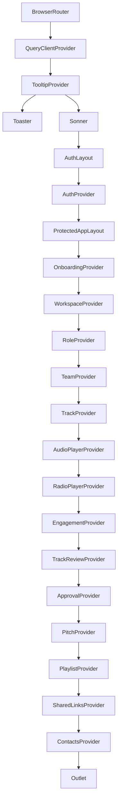
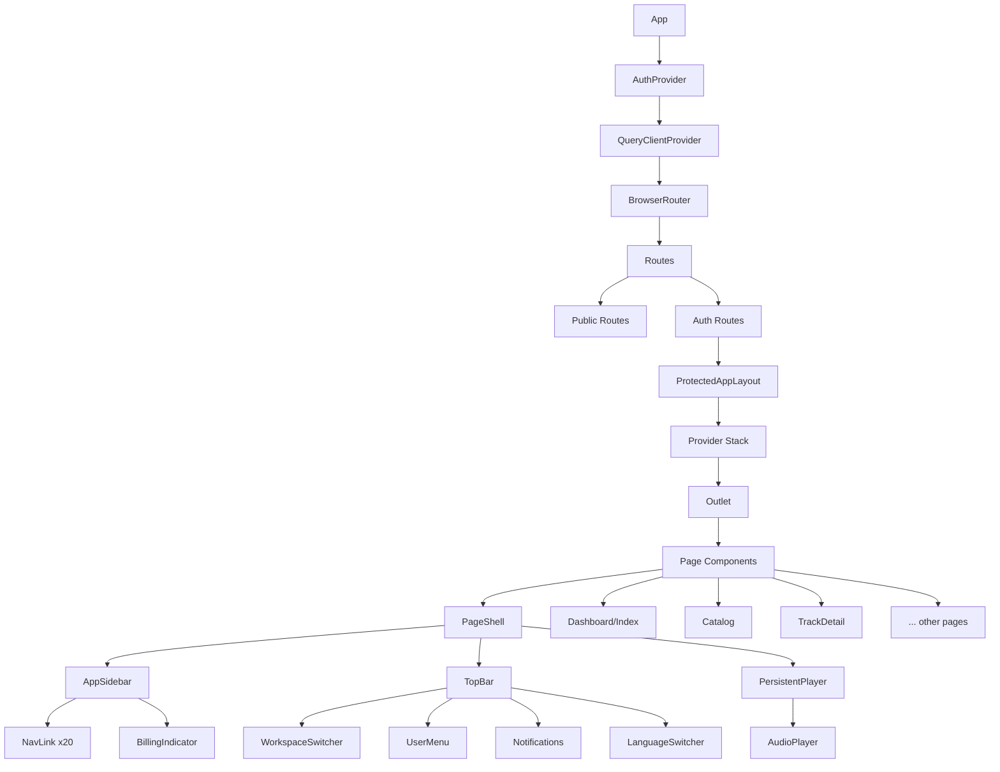

# 04 - Component Architecture

> **Status:** Draft  
> **Version:** 1.0.0  
> **Created:** August 11, 2026  
> **Last Updated:** August 11, 2026  
> **Owner:** Ishan  
> **Related:** [01 - Vision & Overview](01-VISION_AND_OVERVIEW.md), [02 - System Architecture](02-SYSTEM_ARCHITECTURE.md), [03 - Data Architecture](03-DATA_ARCHITECTURE.md)

---

## Abstract

This document provides a comprehensive overview of Trakalog's frontend component architecture, including the React component hierarchy, state management patterns, routing structure, and UI organization. It serves as the primary reference for understanding how the frontend is structured and how components interact.

---

## 1. Architecture Overview

### 1.1 Layered Component Structure

Trakalog's frontend follows a **hierarchical component architecture** with clear separation of concerns:

```mermaid
layerDiagram
    direction TB
    layer "App Shell" as SHELL {
        component "App.tsx"
        component "Provider Stack"
        component "Routing"
    }
    layer "Pages" as PAGES {
        component "Page Components"
        component "Route Handlers"
    }
    layer "Features" as FEATURES {
        component "Feature Components"
        component "Domain Logic"
    }
    layer "UI" as UI {
        component "shadcn/ui Primitives"
        component "Custom UI Components"
    }
    SHELL --> PAGES : Props/Context
    PAGES --> FEATURES : Composition
    FEATURES --> UI : Usage
```

### 1.2 Design Principles

**1. Composition Over Inheritance**
- Components are composed together rather than extended
- Shared logic extracted to custom hooks or contexts
- Reusable UI primitives via shadcn/ui

**2. Separation of Concerns**
- **Pages:** Route-level components, data fetching, layout
- **Features:** Domain-specific functionality (tracks, playlists, sharing)
- **UI:** Presentational components, styling, interaction
- **Contexts:** State management, business logic

**3. Colocation**
- Components and their related files (styles, tests, types) live together
- Feature-specific components grouped by domain
- Clear file naming conventions

**4. Progressive Enhancement**
- Core functionality works without JavaScript (where possible)
- Enhanced interactions with React
- Graceful degradation for older browsers

---

## 2. Application Shell

### 2.1 Main Entry Points

#### `src/main.tsx`

The React entry point that renders the application:

```typescript
import React from 'react';
import ReactDOM from 'react-dom/client';
import { MotionConfig } from 'framer-motion';
import App from './App';
import './index.css';

ReactDOM.createRoot(document.getElementById('root')!).render(
  <React.StrictMode>
    <MotionConfig reducedMotion="user">
      <App />
    </MotionConfig>
  </React.StrictMode>
);
```

**Key Features:**
- React Strict Mode for development checks
- Framer Motion with reduced motion preference support (WCAG 2.3.3)
- CSS imports for global styles

#### `src/App.tsx`

The main application component containing routing, provider stack, and error boundaries:

```typescript
// Key structure from App.tsx
function App() {
  return (
    <MotionConfig reducedMotion="user">
      {isAdminMode() ? <AdminApp /> : <MainApp />}
    </MotionConfig>
  );
}
```

**Two Modes:**
- **MainApp:** Standard user application
- **AdminApp:** Admin console (separate routing, different providers)

---

## 3. Provider Hierarchy

### 3.1 Provider Stack

The application uses a **nested provider pattern** for state management. All providers mount once and stay mounted across navigation:



### 3.2 Provider Descriptions

| Provider | Purpose | Key Data | Initialization |
|----------|---------|----------|----------------|
| **QueryClientProvider** | React Query caching | Query cache | Global, once |
| **TooltipProvider** | Tooltip rendering | Tooltip state | Global, once |
| **Toaster** | Toast notifications | Toast queue | Global, once |
| **Sonner** | Additional notifications | Notification queue | Global, once |
| **AuthProvider** | User authentication | Session, user | Auth layout |
| **OnboardingProvider** | Onboarding state | Tour state, checklist | Protected routes |
| **WorkspaceProvider** | Workspace management | Active workspace, all workspaces | Protected routes |
| **RoleProvider** | User permissions | Access level, professional title | Per workspace |
| **TeamProvider** | Team management | Team members, invitations | Per workspace |
| **TrackProvider** | Track state | Tracks, filtering, sorting | Per workspace |
| **AudioPlayerProvider** | Audio playback | Current track, queue, player state | Global |
| **RadioPlayerProvider** | Radio mode | Radio tracks, shuffle state | Global |
| **EngagementProvider** | Engagement tracking | Plays, downloads, analytics | Per workspace |
| **TrackReviewProvider** | Review features | Comments, ratings | Per track |
| **ApprovalProvider** | Approval workflow | Approval requests | Per workspace |
| **PitchProvider** | Pitch management | Pitches, recipients | Per workspace |
| **PlaylistProvider** | Playlist state | Playlists, tracks | Per workspace |
| **SharedLinksProvider** | Link management | Shared links, access logs | Per workspace |
| **ContactsProvider** | Contact management | Contacts, aliases | Per workspace |

### 3.3 Provider Pattern

**Single Mount Pattern:**
```typescript
// App.tsx - All providers mount once
function ProtectedAppLayout() {
  return (
    <ProtectedRoute>
      <OnboardingProvider>
        <WorkspaceProvider>
          <RoleProvider>
            <TeamProvider>
              {/* ... more providers ... */}
              <ContactsProvider>
                <Outlet />  // Child routes swap here
              </ContactsProvider>
            </TeamProvider>
          </RoleProvider>
        </WorkspaceProvider>
      </OnboardingProvider>
    </ProtectedRoute>
  );
}
```

**Benefits:**
- Providers mount **once** and stay mounted
- **No remounting** when navigating between routes
- **State persists** across navigation
- Better performance (no context re-creation)

---

## 4. Routing Architecture

### 4.1 Router Configuration

Trakalog uses **React Router DOM v6** with a structured routing configuration:

```typescript
// App.tsx routing structure
function MainApp() {
  return (
    <QueryClientProvider client={queryClient}>
      <TooltipProvider>
        <Toaster />
        <Sonner />
        <BrowserRouter>
          <Routes>
            {/* Public routes */}
            <Route path="/share/:slug" element={<SharedLinkPage />} />
            <Route path="/shared/:linkId" element={<SharedStemAccess />} />
            <Route path="/studio/:token" element={<StudioSession />} />
            <Route path="/sign/:token" element={<SignAgreement />} />
            
            {/* Auth routes */}
            <Route element={<AuthLayout />}>
              <Route path="/auth" element={<Auth />} />
              <Route path="/" element={<HomeRoute />} />
              <Route path="/invite/:token" element={<AcceptInvitation />} />
              
              {/* Protected routes */}
              <Route element={<ProtectedAppLayout />}>
                <Route path="/dashboard" element={<Index />} />
                <Route path="/tracks" element={<Catalog />} />
                <Route path="/track/:id" element={<TrackDetail />} />
                <Route path="/playlists" element={<Playlists />} />
                {/* ... 20+ more protected routes */}
              </Route>
            </Route>
            
            <Route path="*" element={<NotFound />} />
          </Routes>
        </BrowserRouter>
      </TooltipProvider>
    </QueryClientProvider>
  );
}
```

### 4.2 Route Categories

#### Public Routes (No Authentication Required)

| Route | Component | Purpose | Auth Required |
|-------|-----------|---------|---------------|
| `/share/:slug` | SharedLinkPage | Recipient experience | ❌ No |
| `/shared/:linkId` | SharedStemAccess | Stem set access | ❌ No |
| `/studio/:token` | StudioSession | QR code credit capture | ❌ No |
| `/sign/:token` | SignAgreement | Digital signature | ❌ No |
| `/privacy` | PrivacyPolicy | Legal page | ❌ No |
| `/terms` | TermsOfService | Legal page | ❌ No |

#### Authentication Routes

| Route | Component | Purpose | Auth Required |
|-------|-----------|---------|---------------|
| `/auth` | Auth | Login/Register | ❌ No (but redirects if logged in) |
| `/` | HomeRoute | Landing page | ❌ No (redirects to /dashboard if logged in) |
| `/invite/:token` | AcceptInvitation | Accept workspace invite | ⚠️ Partial |

#### Protected Routes (Require Authentication)

| Route | Component | Purpose | Workspace Context |
|-------|-----------|---------|------------------|
| `/dashboard` | Index | Overview, stats | ✅ Current workspace |
| `/tracks` | Catalog | Track catalog | ✅ Current workspace |
| `/track/:id` | TrackDetail | Single track view | ✅ Track's workspace |
| `/playlists` | Playlists | Playlist management | ✅ Current workspace |
| `/playlist/:id` | PlaylistDetail | Playlist view | ✅ Playlist's workspace |
| `/stems` | Stems | Stem management | ✅ Current workspace |
| `/smart-ar` | SmartAR | AI matching | ✅ Current workspace |
| `/radio` | RadioPage | Continuous playback | ✅ Current workspace |
| `/access` | Access | Discovery & requests | ✅ Current workspace |
| `/team` | Team | Team management | ✅ Current workspace |
| `/workspaces` | Workspaces | Workspace management | ✅ All workspaces |
| `/contacts` | Contacts | Address book | ✅ Current workspace |
| `/shared-links` | SharedLinks | Link management | ✅ Current workspace |
| `/settings` | SettingsPage | User settings | ✅ Current user |
| `/settings/billing` | BillingPage | Billing & subscriptions | ✅ Current user |
| `/workspace-settings` | WorkspaceSettings | Workspace configuration | ✅ Current workspace |
| `/notifications` | NotificationCenter | Notifications | ✅ Current user |
| `/approvals` | ApprovalQueue | Approval requests | ✅ Current workspace |
| `/guide` | Guide | Help & documentation | ✅ N/A |

#### Feature-Flagged Routes

Some routes are hidden behind feature flags:

```typescript
// In App.tsx
<Route 
  path="/pitch" 
  element={FEATURES.PITCH_ENABLED ? <Pitch /> : <Navigate to="/dashboard" replace />} 
/>
<Route 
  path="/approvals" 
  element={FEATURES.APPROVALS_ENABLED ? <ApprovalQueue /> : <Navigate to="/dashboard" replace />} 
/>
```

**Current Status:**
- `PITCH_ENABLED: false` - Pitch module hidden
- `APPROVALS_ENABLED: false` - Approvals module hidden
- Routes remain in code for backward compatibility

#### Admin Routes

| Route | Component | Purpose | Access |
|-------|-----------|---------|--------|
| `/` | AdminLogin | Admin login | Admin only |
| `/dashboard` | AdminDashboard | Admin console | Admin only |

**Access Control:**
```typescript
// lib/adminMode.ts
const ADMIN_EMAILS = ['admin@trakalog.com'];
export function isAdminMode(): boolean {
  return ADMIN_EMAILS.includes(getCurrentUserEmail());
}
```

### 4.3 Route Protection

#### ProtectedRoute Component

```typescript
// components/ProtectedRoute.tsx
export function ProtectedRoute({ children }: { children: ReactNode }) {
  const { session, loading } = useAuth();
  const location = useLocation();
  
  if (loading) {
    return <LoadingSpinner />;
  }
  
  if (!session) {
    // Save redirect location for after login
    safeLocalStorage.setItem('trakalog_auth_redirect', location.pathname);
    return <Navigate to="/auth" replace />;
  }
  
  return <>{children}</>;
}
```

**Features:**
- Session validation
- Loading state handling
- Redirect persistence (remember where user was going)
- Works with OAuth callback flow

#### HomeRoute Component

Special handling for the root route:

```typescript
function HomeRoute() {
  const { session, loading } = useAuth();
  
  if (loading) {
    return <LoadingSpinner />;
  }
  
  if (session) {
    // Check for stored redirect from OAuth
    const storedRedirect = safeLocalStorage.getItem('trakalog_auth_redirect');
    if (storedRedirect) {
      safeLocalStorage.removeItem('trakalog_auth_redirect');
      return <Navigate to={storedRedirect} replace />;
    }
    return <Navigate to="/dashboard" replace />;
  }
  
  return <LandingPage />;
}
```

---

## 5. Component Hierarchy

### 5.1 Directory Structure

```
src/
├── App.tsx                      # Main app with routing and providers
├── main.tsx                     # React entry point
│
├── /components/                # Reusable components
│   ├── AppSidebar.tsx          # Main navigation sidebar
│   ├── TopBar.tsx              # Top navigation bar
│   ├── PageShell.tsx           # Layout wrapper for pages
│   ├── ProtectedRoute.tsx      # Authentication protection
│   ├── PersistentPlayer.tsx    # Global audio player (docked)
│   ├── ErrorBoundary.tsx       # Error handling wrapper
│   │
│   ├── /onboarding/            # Onboarding-specific components
│   │   ├── GuidedTour.tsx
│   │   ├── OnboardingChecklist.tsx
│   │   └── WelcomeOnboarding.tsx
│   │
│   ├── /admin/                 # Admin console components
│   │   ├── OverviewTab.tsx
│   │   ├── UsersTab.tsx
│   │   ├── ContactsTab.tsx
│   │   ├── TrafficSection.tsx
│   │   └── WaitlistTab.tsx
│   │
│   └── /ui/                    # shadcn/ui primitives (30+ components)
│       ├── accordion.tsx
│       ├── alert-dialog.tsx
│       ├── alert.tsx
│       ├── avatar.tsx
│       ├── badge.tsx
│       ├── button.tsx
│       ├── card.tsx
│       ├── checkbox.tsx
│       ├── dialog.tsx
│       ├── dropdown-menu.tsx
│       ├── form.tsx
│       ├── input.tsx
│       ├── label.tsx
│       ├── popover.tsx
│       ├── select.tsx
│       ├── separator.tsx
│       ├── sheet.tsx
│       ├── skeleton.tsx
│       ├── slider.tsx
│       ├── switch.tsx
│       ├── table.tsx
│       ├── tabs.tsx
│       ├── toast.tsx
│       ├── toggle.tsx
│       └── tooltip.tsx
│
├── /pages/                     # Page-level components (routes)
│   ├── Index.tsx               # Dashboard landing page
│   ├── Auth.tsx                # Authentication pages
│   ├── Catalog.tsx             # Track catalog management
│   ├── TrackDetail.tsx         # Single track view and editing
│   ├── SharedLinkPage.tsx      # Recipient experience
│   ├── PlaylistDetail.tsx      # Playlist view
│   ├── Playlists.tsx           # Playlist management
│   ├── Stems.tsx               # Stem management
│   ├── SmartAR.tsx             # AI matching interface
│   ├── Radio.tsx               # Radio mode player
│   ├── Access.tsx              # Discovery and requests
│   ├── Team.tsx                # Team management
│   ├── Workspaces.tsx          # Workspace management
│   ├── Contacts.tsx            # Address book
│   ├── SharedLinks.tsx         # Shared link management
│   ├── SettingsPage.tsx        # User settings
│   ├── WorkspaceSettings.tsx   # Workspace configuration
│   ├── BillingPage.tsx         # Billing and subscriptions
│   ├── NotificationCenter.tsx  # Notifications
│   ├── ApprovalQueue.tsx       # Approval workflow
│   ├── Pitch.tsx               # Pitch management
│   ├── StudioSession.tsx       # Studio QR session
│   ├── SignAgreement.tsx       # Signature capture
│   ├── AcceptInvitation.tsx    # Invitation acceptance
│   ├── Guide.tsx               # Help and documentation
│   └── admin/                  # Admin console
│       ├── AdminLogin.tsx
│       └── AdminDashboard.tsx
```

### 5.2 Component Tree



### 5.3 Key Layout Components

#### PageShell.tsx

The layout wrapper for all authenticated pages:

```typescript
// components/PageShell.tsx
export function PageShell({ children }: { children: ReactNode }) {
  const { session } = useAuth();
  const { activeWorkspace } = useWorkspace();
  
  if (!session || !activeWorkspace) {
    return <FullPageLoader />;
  }
  
  return (
    <div className="flex h-screen w-full overflow-hidden">
      <AppSidebar />
      <div className="flex flex-1 flex-col">
        <TopBar />
        <main className="flex-1 overflow-auto">
          {children}
        </main>
      </div>
      <PersistentPlayer />
      <ErrorBoundary>
        <Toaster />
      </ErrorBoundary>
    </div>
  );
}
```

**Responsibilities:**
- Authentication and workspace loading checks
- Sidebar and top bar layout
- Main content area
- Persistent player overlay
- Error boundary for toast notifications

#### AppSidebar.tsx

Main navigation with workspace switcher:

```typescript
// components/AppSidebar.tsx
export function AppSidebar() {
  const { session } = useAuth();
  const { workspaces, activeWorkspace, switchWorkspace } = useWorkspace();
  const { user } = useAuth();
  const { role } = useRole();
  
  if (!session || !activeWorkspace) return null;
  
  return (
    <Sidebar>
      <SidebarHeader>
        <WorkspaceSwitcher 
          workspaces={workspaces} 
          activeWorkspace={activeWorkspace} 
          onSwitch={switchWorkspace}
        />
      </SidebarHeader>
      
      <SidebarContent>
        <Nav>
          <NavLink to="/dashboard" icon={<Home />}>
            Dashboard
          </NavLink>
          <NavLink to="/tracks" icon={<Music2 />}>
            Catalog
          </NavLink>
          <NavLink to="/playlists" icon={<ListMusic />}>
            Playlists
          </NavLink>
          {/* 15+ more nav links */}
        </Nav>
      </SidebarContent>
      
      <SidebarFooter>
        <UserProfile user={user} />
        <BillingStatus />
      </SidebarFooter>
    </Sidebar>
  );
}
```

**Features:**
- Workspace switcher at the top
- Navigation links with icons
- Active state highlighting
- Permission-based visibility (hide admin links from non-admins)
- User profile and billing status in footer

#### TopBar.tsx

Top navigation bar:

```typescript
// components/TopBar.tsx
export function TopBar() {
  const { activeWorkspace } = useWorkspace();
  
  return (
    <header className="flex items-center justify-between border-b px-4 py-2">
      <div className="flex items-center gap-4">
        <SidebarTrigger />
        <Breadcrumbs />
      </div>
      <div className="flex items-center gap-2">
        <LanguageSwitcher />
        <Notifications />
        <UserMenu />
      </div>
    </header>
  );
}
```

**Features:**
- Mobile sidebar trigger
- Breadcrumbs for navigation context
- Language switcher (8 languages)
- Notifications indicator
- User menu with profile and logout

#### PersistentPlayer.tsx

Global audio player that stays visible across navigation:

```typescript
// components/PersistentPlayer.tsx
export function PersistentPlayer() {
  const { 
    currentTrack, 
    isPlaying, 
    playPause, 
    nextTrack, 
    previousTrack,
    progress,
    volume,
    setVolume,
    setProgress
  } = useAudioPlayer();
  
  if (!currentTrack) return null;
  
  return (
    <div className="fixed bottom-0 left-0 right-0 border-t bg-background">
      <TrackInfo 
        track={currentTrack} 
        showArtwork 
        showMetadata
      />
      <PlayerControls
        isPlaying={isPlaying}
        onPlayPause={playPause}
        onNext={nextTrack}
        onPrevious={previousTrack}
      />
      <ProgressBar 
        progress={progress}
        onSeek={setProgress}
      />
      <VolumeControl 
        volume={volume}
        onVolumeChange={setVolume}
      />
    </div>
  );
}
```

**Features:**
- Play/pause, next, previous controls
- Progress bar with seek
- Volume control
- Track information display
- Keyboard shortcuts
- Persists across navigation

---

## 6. Feature Components

### 6.1 Track Management Components

```
src/components/
├── TrackCard.tsx           # Track card for catalog view
├── TrackGrid.tsx           # Grid layout for tracks
├── TrackList.tsx           # List layout for tracks
├── TrackFields.tsx         # Form fields for track editing
├── TrackCompletenessBar.tsx # Metadata completeness indicator
├── MiniWaveform.tsx        # Compact waveform visualization
├── TrackWaveformPlayer.tsx # Full waveform with player
├── BulkEditBar.tsx         # Bulk edit controls
├── BulkEditModal.tsx       # Bulk edit dialog
├── EditTrackModal.tsx      # Track editing modal
├── UploadTrackModal.tsx    # Track upload workflow
└── SelectTrackForStemsModal.tsx
```

#### TrackCard.tsx

The primary track display component:

```typescript
// components/TrackCard.tsx
interface TrackCardProps {
  track: Track;
  onClick?: () => void;
  selected?: boolean;
  onSelect?: () => void;
  showCheckbox?: boolean;
  showActions?: boolean;
}

export function TrackCard({ track, ...props }: TrackCardProps) {
  const { workspace } = useWorkspace();
  const { role } = useRole();
  
  return (
    <Card className={cn("group relative", props.selected && "ring-2 ring-primary")}>
      {props.showCheckbox && (
        <Checkbox 
          checked={props.selected} 
          onCheckedChange={props.onSelect}
        />
      )}
      
      <div className="aspect-square relative overflow-hidden">
        {track.cover_url ? (
          
        ) : (
          <TrackArtworkPlaceholder />
        )}
        
        <PlayButtonOverlay />
        <TrackDurationBadge duration={track.duration} />
        {track.explicit && <ExplicitBadge />}
      </div>
      
      <CardContent>
        <TrackTitle title={track.title} featuring={track.featuring} />
        <TrackMeta 
          artist={track.artist}
          bpm={track.bpm}
          key={track.key}
          genre={track.genre}
        />
        <TrackCompletenessBar completeness={track.completeness} />
        
        {props.showActions && (
          <TrackActions 
            track={track} 
            role={role}
            workspace={workspace}
          />
        )}
      </CardContent>
    </Card>
  );
}
```

### 6.2 Playlist Components

```
src/components/
├── PlaylistCard.tsx
├── PlaylistTrackItem.tsx
├── CreatePlaylistModal.tsx
├── PlaylistWorkspaceShare.tsx
└── SharedPlaylistView.tsx
```

### 6.3 Sharing Components

```
src/components/
├── ShareModal.tsx
├── SharePackModal.tsx
├── ShareToWorkspaceModal.tsx
└── PlaylistWorkspaceShare.tsx
```

### 6.4 Contact Components

```
src/components/
├── ContactCard.tsx
├── ContactDetailSheet.tsx
├── ContactSuggestInput.tsx
├── NameAutocomplete.tsx
└── AddContactModal.tsx
```

### 6.5 Credit and Split Components

```
src/components/
├── MultiRoleCreditAssigner.tsx
├── MultiSelectChips.tsx
├── PerformerCreditsSection.tsx
├── ProductionCreditsSection.tsx
├── ArtistAliasesTab.tsx
└── ArtistsInput.tsx
```

### 6.6 Audio Player Components

```
src/components/
├── PersistentPlayer.tsx
├── TrackWaveformPlayer.tsx
├── MiniWaveform.tsx
├── RecipientReviewPlayer.tsx
└── crossfadePlayer.ts (utility)
```

### 6.7 UI Components (shadcn/ui)

30+ primitive UI components following the shadcn/ui pattern:

```typescript
// Example: Button component
const Button = React.forwardRef<HTMLButtonElement, ButtonProps>(
  ({ className, variant, size, asChild = false, ...props }, ref) => {
    const Comp = asChild ? Slot : "button"
    return (
      <Comp 
        className={cn(buttonVariants({ variant, size, className }))}
        ref={ref}
        {...props} 
      />
    )
  }
)
```

**shadcn/ui Components:**
- Accordion, Alert Dialog, Alert
- Avatar, Badge, Breadcrumb
- Button, Calendar, Card, Checkbox
- Collapsible, Command, Context Menu
- Dialog, Drawer, Dropdown Menu
- Form, Hover Card, Input
- Label, Menubar, Navigation Menu
- Popover, Progress, Radio Group
- Scroll Area, Select, Separator
- Sheet, Skeleton, Slider
- Switch, Table, Tabs
- Toast, Toggle, Tooltip

---

## 7. State Management

### 7.1 State Management Strategy

Trakalog uses a **hybrid state management approach**:

| State Type | Management | Use Cases | Example |
|------------|------------|-----------|---------|
| **Server State** | React Query | Remote data, caching, syncing | Tracks, playlists, users |
| **Global Client State** | React Context | Cross-component, persistent | Workspace, auth, audio player |
| **Local State** | useState/useReducer | Component-level, ephemeral | Form inputs, modals, toggles |
| **Derived State** | useMemo, selectors | Computed from other state | Filtered tracks, aggregates |

### 7.2 React Query Usage

**Pattern:** All server data fetching uses React Query

```typescript
// Standard query pattern
const { data: tracks, error, isLoading } = useQuery({
  queryKey: ['tracks', workspaceId, { status, genre, search }],
  queryFn: () => fetchTracks({ workspaceId, status, genre, search }),
  staleTime: 5 * 60 * 1000, // 5 minutes
});
```

**Key Features:**
- Automatic caching and deduplication
- Background refetching
- Optimistic updates
- Pagination support
- Error handling
- Loading states

**Custom Hooks:**
```typescript
// Example: useTracks hook
function useTracks(workspaceId: string, options?: TrackQueryOptions) {
  return useQuery({
    queryKey: ['tracks', workspaceId, options],
    queryFn: () => getTracks(workspaceId, options),
    ...options,
  });
}
```

### 7.3 Context Usage Patterns

#### AuthContext

Manages user authentication state:

```typescript
// Key functions
interface AuthContextValue {
  session: Session | null;
  user: User | null;
  loading: boolean;
  signInWithGoogle: () => Promise<{ error?: Error }>;
  signInWithEmail: (email: string, password: string) => Promise<{ error?: Error }>;
  signUpWithEmail: (email: string, password: string) => Promise<{ error?: Error }>;
  signOut: () => Promise<void>;
}
```

#### WorkspaceContext

Manages workspace state and switching:

```typescript
// Key functions
interface WorkspaceContextValue {
  activeWorkspace: Workspace;
  workspaces: Workspace[];
  loading: boolean;
  isSwitchingWorkspace: boolean;
  switchWorkspace: (workspaceId: string) => void;
  createWorkspace: (name: string) => Promise<{ id: string | null }>;
  updateWorkspaceSettings: (updates: Partial<WorkspaceSettings>) => void;
  refreshWorkspaces: () => Promise<void>;
}
```

#### RoleContext

Manages user permissions within a workspace:

```typescript
// Key data
interface RoleContextValue {
  accessLevel: AccessLevel; // 'viewer' | 'editor' | 'admin'
  professionalTitle: string | null;
  canEdit: boolean;
  canDelete: boolean;
  canManageTeam: boolean;
  canManageWorkspace: boolean;
}
```

#### AudioPlayerContext

Manages global audio playback:

```typescript
// Key data
interface AudioPlayerContextValue {
  currentTrack: Track | null;
  queue: Track[];
  isPlaying: boolean;
  progress: number;
  volume: number;
  play: (track: Track, queue?: Track[]) => void;
  pause: () => void;
  togglePlay: () => void;
  next: () => void;
  previous: () => void;
  seek: (position: number) => void;
  setVolume: (volume: number) => void;
}
```

### 7.4 State Management Guidelines

**When to use React Query:**
- Data comes from an API/server
- Data needs caching
- Data should be shared across components
- Data needs to be kept in sync with server

**When to use Context:**
- Global state needed by many components
- State that changes infrequently
- Theme, authentication, configuration
- Cross-cutting concerns

**When to use Local State:**
- Component-specific state
- Form state
- UI state (modals, toggles, selections)
- Ephemeral state

---

## 8. Hooks

### 8.1 Custom Hooks Directory

```
src/hooks/
├── useSupabase.ts          # Supabase client hooks
├── useAudio.ts             # Audio playback hooks
├── useDebounce.ts          # Debounce utility
├── useMediaQuery.ts        # Responsive design hooks
├── useLocalStorage.ts      # Local storage hooks
└── useOnClickOutside.ts     # Click outside detection
```

### 8.2 Key Custom Hooks

#### useSupabase.ts

```typescript
// Custom Supabase hooks
export function useSupabase() {
  return { supabase, session, user };
}

export function useUser() {
  const { user } = useAuth();
  return user;
}

export function useSession() {
  const { session } = useAuth();
  return session;
}
```

#### useAudio.ts

```typescript
// Audio playback hooks
export function useAudioPlayer() {
  const context = useContext(AudioPlayerContext);
  if (!context) throw new Error('useAudioPlayer must be used within AudioPlayerProvider');
  return context;
}

export function useAudioAnalysis() {
  // Audio analysis hooks
  const analyzeAudio = useCallback(async (file: File) => {
    // Analyze BPM, key, waveform
  }, []);
  
  return { analyzeAudio, isAnalyzing };
}
```

---

## 9. Styling Architecture

### 9.1 Tailwind CSS

Trakalog uses **Tailwind CSS v3.4.17** with:
- Utility-first approach
- Custom theme configuration
- Dark mode support (via next-themes)

#### Theme Configuration (`tailwind.config.ts`)

```typescript
export default {
  content: [
    './index.html',
    './src/**/*.{js,ts,jsx,tsx}',
  ],
  darkMode: ['class', '[data-theme="dark"]'],
  theme: {
    extend: {
      colors: {
        primary: {
          DEFAULT: '#000000',
          foreground: '#ffffff',
        },
        secondary: {
          DEFAULT: '#f4f4f5',
          foreground: '#18181b',
        },
      },
      fontFamily: {
        sans: ['Inter', 'system-ui', 'sans-serif'],
      },
    },
  },
  plugins: [require('tailwindcss-animate')],
};
```

### 9.2 CSS Organization

```
src/
├── index.css              # Global styles, Tailwind directives
├── App.css                # App-specific styles
└── components/
    └── /ui/
        └── *.css          # Component-specific styles (if needed)
```

**index.css:**
```css
@tailwind base;
@tailwind components;
@tailwind utilities;

/* Custom base styles */
@layer base {
  html {
    @apply antialiased;
    font-feature-settings: "cv02", "cv03", "cv04", "cv11";
  }
  
  body {
    @apply bg-background text-foreground;
  }
}

/* Custom component styles */
@layer components {
  .btn-primary {
    @apply bg-primary text-primary-foreground hover:bg-primary/90;
  }
}

/* Custom utility styles */
@layer utilities {
  .text-balance {
    text-wrap: balance;
  }
}
```

### 9.3 Design System

**Color System:**
- Uses Tailwind's built-in color palette
- Custom primary and secondary colors
- Semantic color variables (background, foreground, muted, etc.)

**Typography:**
- Font: Inter
- Responsive font sizes
- Line height and letter spacing scale

**Spacing:**
- Consistent spacing scale (4px increments)
- Padding and margin utilities

**Components:**
- shadcn/ui primitives for consistency
- Custom styling via Tailwind classes
- Dark mode variants

---

## 10. Internationalization (i18n)

### 10.1 Setup

Trakalog supports **8 languages**: English, French, Spanish, German, Italian, Portuguese, Japanese, Korean

```
src/i18n/
├── en.json
├── fr.json
├── es.json
├── de.json
├── it.json
├── pt.json
├── ja.json
└── ko.json
```

### 10.2 Usage Pattern

```typescript
// In components
import { useTranslation } from 'react-i18next';

function MyComponent() {
  const { t } = useTranslation();
  
  return (
    <button>
      {t('common.save')}
    </button>
  );
}
```

### 10.3 Language Switcher

```typescript
// components/LanguageSwitcher.tsx
const LANGUAGES = [
  { code: 'en', name: 'English' },
  { code: 'fr', name: 'Français' },
  { code: 'es', name: 'Español' },
  { code: 'de', name: 'Deutsch' },
  { code: 'it', name: 'Italiano' },
  { code: 'pt', name: 'Português' },
  { code: 'ja', name: '日本語' },
  { code: 'ko', name: '한국어' },
];

export function LanguageSwitcher() {
  const { i18n } = useTranslation();
  
  return (
    <Select 
      value={i18n.language} 
      onValueChange={(value) => i18n.changeLanguage(value)}
    >
      {LANGUAGES.map(lang => (
        <SelectItem key={lang.code} value={lang.code}>
          {lang.name}
        </SelectItem>
      ))}
    </Select>
  );
}
```

---

## 11. Error Handling

### 11.1 ErrorBoundary Component

```typescript
// components/ErrorBoundary.tsx
export class ErrorBoundary extends React.Component<ErrorBoundaryProps, ErrorBoundaryState> {
  state = { hasError: false, error: null };
  
  static getDerivedStateFromError(error: Error) {
    return { hasError: true, error };
  }
  
  componentDidCatch(error: Error, errorInfo: ErrorInfo) {
    logErrorToService(error, errorInfo);
  }
  
  render() {
    if (this.state.hasError) {
      return (
        <ErrorFallback 
          error={this.state.error} 
          onRetry={this.reset} 
        />
      );
    }
    return this.props.children;
  }
  
  reset = () => {
    this.setState({ hasError: false, error: null });
  };
}
```

### 11.2 Error Display

```typescript
// components/ErrorFallback.tsx
export function ErrorFallback({ error, onRetry }: ErrorFallbackProps) {
  return (
    <div className="flex flex-col items-center justify-center gap-4 p-8">
      <AlertCircle className="h-12 w-12 text-destructive" />
      <h2 className="text-xl font-semibold">Something went wrong</h2>
      <p className="text-muted-foreground">{error?.message}</p>
      <div className="flex gap-2">
        <Button variant="outline" onClick={onRetry}>
          Try Again
        </Button>
        <Button asChild>
          <Link to="/">Go Home</Link>
        </Button>
      </div>
      {import.meta.env.DEV && (
        <details className="text-sm">
          <summary>Technical Details</summary>
          <pre>{error?.stack}</pre>
        </details>
      )}
    </div>
  );
}
```

---

## 12. Testing Strategy

### 12.1 Testing Tools

- **Vitest:** Test runner and assertions
- **@testing-library/react:** React component testing
- **@testing-library/jest-dom:** DOM assertions
- **jsdom:** DOM environment for tests

### 12.2 Test Organization

```
src/test/
├── components/
│   └── TrackCard.test.tsx
├── pages/
│   └── Catalog.test.tsx
├── hooks/
│   └── useTracks.test.tsx
├── lib/
│   └── audio.test.ts
├── contexts/
│   └── WorkspaceContext.test.tsx
└── setup.ts
```

### 12.3 Test Example

```typescript
// TrackCard.test.tsx
import { render, screen, fireEvent } from '@testing-library/react';
import { describe, it, expect, vi } from 'vitest';
import { TrackCard } from '@/components/TrackCard';
import { MemoryRouter } from 'react-router-dom';

const mockTrack = {
  id: '1',
  title: 'Test Track',
  artist: 'Test Artist',
  cover_url: null,
  duration: 180,
  explicit: false,
  completeness: 100,
};

describe('TrackCard', () => {
  it('renders track title and artist', () => {
    render(
      <MemoryRouter>
        <TrackCard track={mockTrack} />
      </MemoryRouter>
    );
    
    expect(screen.getByText('Test Track')).toBeInTheDocument();
    expect(screen.getByText('Test Artist')).toBeInTheDocument();
  });
  
  it('shows explicit badge when track is explicit', () => {
    render(
      <MemoryRouter>
        <TrackCard track={{ ...mockTrack, explicit: true }} />
      </MemoryRouter>
    );
    
    expect(screen.getByText('E')).toBeInTheDocument();
  });
  
  it('shows checkbox when showCheckbox is true', () => {
    render(
      <MemoryRouter>
        <TrackCard track={mockTrack} showCheckbox onSelect={vi.fn()} />
      </MemoryRouter>
    );
    
    expect(screen.getByRole('checkbox')).toBeInTheDocument();
  });
});
```

---

## 13. Performance Optimization

### 13.1 Code Splitting

Large components use **React.lazy + Suspense** for code splitting:

```typescript
// App.tsx
const Workspaces = lazy(() => import('./pages/Workspaces'));
const Onboarding = lazy(() => import('./pages/Onboarding'));
const Catalog = lazy(() => import('./pages/Catalog'));
const TrackDetail = lazy(() => import('./pages/TrackDetail'));

// Usage in routes
<Route 
  path="/workspaces" 
  element={
    <Suspense fallback={<LazyFallback />}>
      <Workspaces />
    </Suspense>
  } 
/>
```

### 13.2 Lazy Fallback

```typescript
// App.tsx
const LazyFallback = () => (
  <div className="flex min-h-screen items-center justify-center bg-background">
    <div className="h-8 w-8 animate-spin rounded-full border-2 border-primary border-t-transparent" />
  </div>
);
```

### 13.3 Image Optimization

```typescript
// Next.js Image component for optimization
import { Image } from '@/components/ui/image';

<Image 
  src={track.cover_url} 
  alt={track.title}
  width={300} 
  height={300}
  quality={85}
  placeholder="blur"
  blurDataURL={track.cover_blurhash}
/>
```

### 13.4 Memoization

```typescript
// useMemo for expensive calculations
const filteredTracks = useMemo(() => {
  return tracks.filter(track => 
    track.title.toLowerCase().includes(search.toLowerCase())
  );
}, [tracks, search]);

// useCallback for event handlers
const handleSelect = useCallback((trackId: string) => {
  setSelectedTracks(prev => 
    prev.includes(trackId) 
      ? prev.filter(id => id !== trackId)
      : [...prev, trackId]
  );
}, [selectedTracks]);
```

---

## 📝 Document Metadata

| Property | Value |
|----------|-------|
| **Created** | August 11, 2026 |
| **Version** | 1.0.0 |
| **Owner** | Ishan |
| **Status** | Draft |
| **Next Review** | September 11, 2026 |
| **Related Documents** | [01 - Vision & Overview](01-VISION_AND_OVERVIEW.md), [02 - System Architecture](02-SYSTEM_ARCHITECTURE.md), [03 - Data Architecture](03-DATA_ARCHITECTURE.md) |

---

*This document provides a comprehensive overview of Trakalog's frontend component architecture. For implementation details of specific components, see the component source files.*