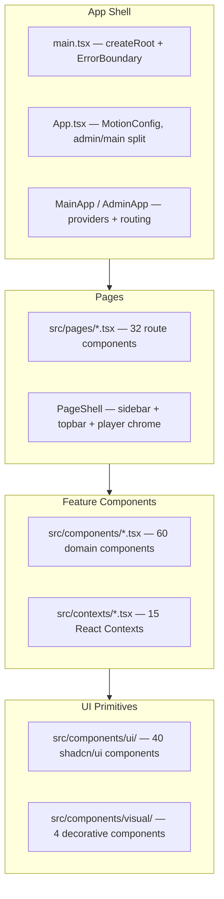
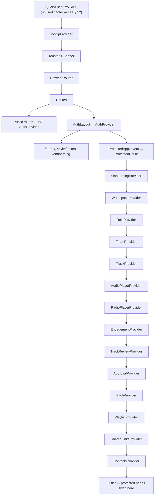
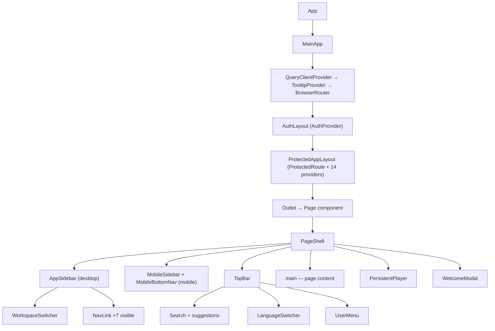

# 04 - Component Architecture

> **Status:** Stable — verified against the code, September 2, 2026
> **Version:** 2.0.0  
> **Created:** August 11, 2026  
> **Last Updated:** September 2, 2026
> **Owner:** Ishan  
> **Related:** [01 - Vision & Overview](01-VISION_AND_OVERVIEW.md), [02 - System Architecture](02-SYSTEM_ARCHITECTURE.md), [03 - Data Architecture](03-DATA_ARCHITECTURE.md)

---

## Abstract

This document describes Trakalog's frontend component architecture: the React component
hierarchy, the provider stack, routing, styling, and the hooks and contexts that carry state.

Every file path, component name, hook, route and config value below was verified against the
source tree on September 2, 2026. Where the code differs from what you might expect from a
conventional React app — no React Query usage, hostname-based admin mode, a single provider
mount point — the document says so plainly rather than describing the conventional pattern.

---

## 1. Architecture Overview

### 1.1 Layered Component Structure

Trakalog's frontend follows a **hierarchical component architecture** with clear separation of
concerns:



### 1.2 Design Principles

**1. Composition over inheritance**
- Components are composed, never extended.
- Shared logic lives in contexts (state) or hooks (computation).
- Reusable primitives come from shadcn/ui, vendored into `src/components/ui/`.

**2. Separation of concerns**
- **Pages** (`src/pages/`) — route-level components; they own data orchestration and layout.
- **Components** (`src/components/`) — domain components: modals, panels, players, inputs.
- **UI** (`src/components/ui/`) — presentational primitives, styling and interaction only.
- **Contexts** (`src/contexts/`) — state and the Supabase calls that populate it.

**3. Flat component directory**
There is **no per-feature subdirectory** under `src/components/`. The 60 domain components sit
flat, with only three subdirectories: `admin/`, `onboarding/`, `ui/` and `visual/`. Naming, not
foldering, carries the grouping — `Track*`, `Share*`, `Create*Modal`, `*Section`, `*Tab`.

**4. Single provider mount**
All protected pages share **one** layout route, so the fourteen-deep provider stack mounts once
and never remounts on navigation. Context state survives every in-app route change.

---

## 2. Application Shell

### 2.1 `src/main.tsx`

The React entry point. It is deliberately minimal — no `StrictMode`, no `MotionConfig` (that
lives in `App.tsx`), and one piece of real logic: stale-chunk recovery.

```typescript
// src/main.tsx
import { createRoot } from "react-dom/client";
import App from "./App.tsx";
import "./index.css";
import "./i18n";
import { ErrorBoundary } from "./components/ErrorBoundary";

// Auto-recover from stale lazy chunks after a new deploy. Vite fires
// `vite:preloadError` when a dynamically-imported chunk 404s; reload (up to 3×
// per session) instead of leaving a black screen.
window.addEventListener("vite:preloadError", (event) => {
  try {
    const reloads = parseInt(sessionStorage.getItem("trakalog-chunk-reloads") || "0", 10);
    if (reloads < 3) {
      event.preventDefault();
      sessionStorage.setItem("trakalog-chunk-reloads", String(reloads + 1));
      window.location.reload();
    }
  } catch { /* sessionStorage unavailable (private mode) — let Vite handle it */ }
});

createRoot(document.getElementById("root")!).render(
  <ErrorBoundary>
    <App />
  </ErrorBoundary>
);
```

**Why this matters:** Trakalog code-splits eleven pages with `React.lazy`. After a Vercel
deploy, an open tab still references the previous build's chunk hashes. Without this handler
the first lazy navigation after a deploy renders a black screen. The counter caps recovery at
three reloads per session so a genuinely missing chunk cannot cause an infinite reload loop —
past the cap Vite is allowed to throw and `ErrorBoundary` shows its fallback (§11).

### 2.2 `src/App.tsx`

`App` sets the global motion policy and picks one of two entirely separate applications:

```typescript
// src/App.tsx:217-235
const App = () => {
  useEffect(() => {
    const t = setTimeout(() => {
      try { sessionStorage.removeItem("trakalog-chunk-reloads"); } catch { /* ignore */ }
    }, 5000);
    return () => clearTimeout(t);
  }, []);

  return (
    <MotionConfig reducedMotion="user">
      {isAdminMode() ? <AdminApp /> : <MainApp />}
    </MotionConfig>
  );
};
```

- `MotionConfig reducedMotion="user"` makes every Framer Motion animation in the tree honour
  the OS "reduce motion" setting at once (WCAG 2.3.3), without touching individual animations.
- The `useEffect` clears the chunk-reload counter five seconds after a stable mount. The delay
  is deliberate: clearing it immediately would allow a reload loop when a chunk is *still*
  stale right after reloading.

**Two applications:**

| | `MainApp` | `AdminApp` |
|---|---|---|
| Routing | 32 routes, public / auth / protected tiers | 2 routes (`/`, `/dashboard`) |
| Providers | `QueryClientProvider` → `TooltipProvider` → `AuthProvider` → 14 domain providers | `QueryClientProvider` → `TooltipProvider` → `AuthProvider` only |
| Entry pages | `LandingPage`, `Auth`, `Index`… | `AdminLogin`, `AdminDashboard` |

### 2.3 Admin mode detection

`isAdminMode()` is **hostname-based**, not an email allowlist:

```typescript
// src/lib/adminMode.ts
const ADMIN_HOST = "admin.trakalog.com";
const ADMIN_DEV_KEY = "trakalog_admin_dev_mode";

export function isAdminMode(): boolean {
  if (typeof window === "undefined") return false;
  if (window.location.hostname === ADMIN_HOST) return true;
  // Dev: ?admin=1 sets a localStorage flag, ?admin=0 clears it
  // (hostname is localhost during development).
  ...
}
```

This selects which **application shell** renders. It is a routing switch, not an authorization
check: actual admin authority is enforced server-side by the `is_platform_admin()` Postgres
helper and the RLS policies built on it (see
[03 - Data Architecture](03-DATA_ARCHITECTURE.md) §5). A user who flips `?admin=1` locally gets
the admin *shell* and nothing else — every query it issues still fails RLS.

---

## 3. Provider Hierarchy

### 3.1 Provider Stack



**Public routes sit outside `AuthProvider` entirely.** `/share/:slug`, `/shared/:linkId`,
`/studio/:token`, `/sign/:token`, `/privacy` and `/terms` mount no auth context at all — they
must work for a recipient with no Trakalog account. This is the frontend half of the rule in
CLAUDE.md: public pages instantiate **zero GoTrueClient** and talk to Supabase through direct
REST fetches using the constants in `src/integrations/supabase/constants.ts`.

### 3.2 The fifteen contexts

`src/contexts/` holds 15 providers — `AuthProvider` plus the 14 in `ProtectedAppLayout`.

| Provider | File | Purpose |
|---|---|---|
| **AuthProvider** | `AuthContext.tsx` | Supabase session, user, MFA gate, sign-in/up/out |
| **OnboardingProvider** | `OnboardingContext.tsx` | Guided-tour state, checklist progress |
| **WorkspaceProvider** | `WorkspaceContext.tsx` | Active workspace, workspace list, switching |
| **RoleProvider** | `RoleContext.tsx` | Access level → permission matrix, professional title |
| **TeamProvider** | `TeamContext.tsx` | Members, invitations, seat management |
| **TrackProvider** | `TrackContext.tsx` | Catalog: tracks, stems, splits, filtering |
| **AudioPlayerProvider** | `AudioPlayerContext.tsx` | Global playback, queue, shuffle/repeat |
| **RadioPlayerProvider** | `RadioPlayerContext.tsx` | Radio mode — a second, independent player |
| **EngagementProvider** | `EngagementContext.tsx` | Play/download/engagement counters |
| **TrackReviewProvider** | `TrackReviewContext.tsx` | Timecoded comments, ratings |
| **ApprovalProvider** | `ApprovalContext.tsx` | Approval workflow (flag-disabled) |
| **PitchProvider** | `PitchContext.tsx` | Pitches and recipients (flag-disabled) |
| **PlaylistProvider** | `PlaylistContext.tsx` | Playlists and their tracks |
| **SharedLinksProvider** | `SharedLinksContext.tsx` | Shared-link CRUD, slug generation |
| **ContactsProvider** | `ContactsContext.tsx` | Address book, artist aliases |

`ApprovalProvider` and `PitchProvider` stay mounted even though their UI is hidden behind
`FEATURES.APPROVALS_ENABLED` / `FEATURES.PITCH_ENABLED` (§4.4). Nothing is deleted when a flag
is off — flipping it back to `true` fully restores the section with no other change.

### 3.3 The single-mount pattern

```typescript
// src/App.tsx:95-129 — abridged
function ProtectedAppLayout() {
  return (
    <ProtectedRoute>
      <OnboardingProvider>
      <WorkspaceProvider>
      {/* …twelve more providers… */}
      <ContactsProvider>
        <Outlet />
      </ContactsProvider>
      {/* …closing tags… */}
      </WorkspaceProvider>
      </OnboardingProvider>
    </ProtectedRoute>
  );
}
```

React Router's `<Outlet />` swaps only the *child* route. The layout route — and therefore the
whole provider stack — is a stable element across navigation, so React reconciles it in place
rather than unmounting it.

**What this buys:**
- Providers mount **once** per session; no re-fetch storm on every navigation.
- The audio player keeps playing while you move between pages (`PersistentPlayer` reads
  `AudioPlayerContext`, which never unmounts).
- Catalog filters, the loaded track list and the workspace selection all survive navigation.

**The cost to be aware of:** because nothing remounts, a provider's data does not refresh on
navigation either. Workspace switching is therefore handled explicitly —
`WorkspaceContext` exposes `isSwitchingWorkspace`, set the moment a switch starts, and
`TrackContext` calls `endWorkspaceSwitch()` once the new workspace's tracks have loaded.
`PageShell` renders a full-screen blocking overlay for the duration.

---

## 4. Routing Architecture

React Router DOM v6 (`react-router-dom` ^6.30.1), configured declaratively in `src/App.tsx`.

### 4.1 Route tiers

```typescript
// src/App.tsx:157-215 — structure
const MainApp = () => (
  <QueryClientProvider client={queryClient}>
    <TooltipProvider>
      <Toaster />
      <Sonner />
      <BrowserRouter>
        <Routes>
          {/* Public routes — no AuthProvider */}
          <Route path="/share/:slug" element={<Suspense …><SharedLinkPage /></Suspense>} />
          …

          {/* Auth-wrapped routes */}
          <Route element={<AuthLayout />}>
            <Route path="/auth" element={<Auth />} />
            <Route path="/" element={<HomeRoute />} />
            …
            {/* Protected pages — single layout route, one provider stack mount */}
            <Route element={<ProtectedAppLayout />}>
              …22 routes…
            </Route>
          </Route>

          <Route path="*" element={<NotFound />} />
        </Routes>
      </BrowserRouter>
    </TooltipProvider>
  </QueryClientProvider>
);
```

#### Public routes — no authentication, no auth context

| Route | Component | Purpose |
|---|---|---|
| `/share/:slug` | `SharedLinkPage` (lazy) | Recipient experience for a shared link |
| `/shared/:linkId` | `SharedStemAccess` | Stem-set access |
| `/studio/:token` | `StudioSession` | QR-code studio credit capture |
| `/sign/:token` | `SignAgreement` | Split-agreement signature |
| `/privacy` | `PrivacyPolicy` | Legal page |
| `/terms` | `TermsOfService` | Legal page |

#### Auth-context routes — mounted inside `AuthProvider`, session optional

| Route | Component | Notes |
|---|---|---|
| `/auth` | `Auth` | Login / register / MFA |
| `/` | `HomeRoute` | `LandingPage` when signed out, redirect when signed in |
| `/invite/:token` | `AcceptInvitation` | Calls `useAuth()` but must render without a session — the "Sign up to accept" branch |
| `/onboarding` | `Onboarding` (lazy) | Post-signup flow; outside `ProtectedAppLayout` so it does not need a workspace |

#### Protected routes — inside `ProtectedAppLayout`

| Route | Component | Lazy |
|---|---|---|
| `/dashboard` | `Index` | |
| `/tracks` | `Catalog` | ✅ |
| `/track/:id` | `TrackDetail` | ✅ |
| `/tracks/:id` | `TrackDetail` | ✅ — alias kept for older shared URLs |
| `/playlists` | `Playlists` | |
| `/playlist/:id` | `PlaylistDetail` | |
| `/playlist/shared/:playlistId` | `SharedPlaylistView` | |
| `/stems` | `Stems` | |
| `/pitch` | `Pitch` | ✅ — flag-gated |
| `/smart-ar` | `SmartAR` | ✅ |
| `/radio` | `RadioPage` (`pages/Radio.tsx`) | |
| `/access` | `Access` | ✅ |
| `/team` | `Team` | |
| `/workspaces` | `Workspaces` | ✅ |
| `/contacts` | `Contacts` | ✅ |
| `/shared-links` | `SharedLinks` | |
| `/settings` | `SettingsPage` | |
| `/settings/billing` | `BillingPage` | ✅ |
| `/workspace-settings` | `WorkspaceSettings` | ✅ |
| `/notifications` | `NotificationCenter` | |
| `/approvals` | `ApprovalQueue` | flag-gated |
| `/guide` | `Guide` | ✅ |

`*` falls through to `NotFound`.

> **Note on `/playlist/shared/:playlistId`** — despite the name, this route is *protected*.
> It renders a playlist that another workspace shared with you internally, which requires a
> session. Public link sharing is `/share/:slug`.

#### Admin routes

| Route | Component |
|---|---|
| `/` | `AdminLogin` |
| `/dashboard` | `AdminDashboard` |
| `*` | redirect to `/` |

### 4.2 Feature-flagged routes

Two routes stay **mounted** but redirect while their flag is off, so bookmarked URLs resolve to
the dashboard instead of a 404:

```typescript
// src/App.tsx:192, 205
<Route path="/pitch"     element={FEATURES.PITCH_ENABLED     ? <Suspense …><Pitch /></Suspense> : <Navigate to="/dashboard" replace />} />
<Route path="/approvals" element={FEATURES.APPROVALS_ENABLED ? <ApprovalQueue />                : <Navigate to="/dashboard" replace />} />
```

```typescript
// src/config/features.ts — the single source of truth, three compile-time constants
export const FEATURES = {
  PITCH_ENABLED: false,
  APPROVALS_ENABLED: false,
  PITCHER_ROLE_ENABLED: false,
} as const;
```

These are **compile-time constants**, not database rows — there is no feature-flag table, no
`useFeatureFlag()` hook and no admin toggle UI. Flipping a flag requires an edit and a deploy.
See [ADR-0009](DECISIONS/ADR-0009-FEATURE-FLAGS.md).

The same `FEATURES` object gates the sidebar (`AppSidebar.tsx:35-49`) and the TopBar search
suggestions, so a disabled section disappears from navigation as well as routing.

### 4.3 Route protection

```typescript
// src/components/ProtectedRoute.tsx
export function ProtectedRoute({ children }: { children: React.ReactNode }) {
  const { session, loading, needsMfaVerification } = useAuth();
  const [timedOut, setTimedOut] = useState(false);

  // Safety timeout: if loading takes more than 5 seconds, stop waiting
  useEffect(() => {
    if (!loading) { setTimedOut(false); return; }
    const timer = setTimeout(() => setTimedOut(true), 5000);
    return () => clearTimeout(timer);
  }, [loading]);

  if (session && needsMfaVerification) { window.location.href = "/auth"; return <Spinner />; }
  if (session) return <>{children}</>;
  if (loading && !timedOut) return <Spinner />;

  window.location.href = "/auth";   // hard navigation, not <Navigate>
  return <Spinner />;
}
```

Three things are worth noting, because each is a deliberate deviation:

1. **Hard redirect, not `<Navigate>`.** `window.location.href = "/auth"` triggers a full page
   load. That discards all in-memory React state, which is what you want when a session has
   gone invalid — a soft redirect would leave the previous user's context data resident.
2. **A 5-second loading timeout.** If `AuthContext` never settles (an unstable session, a
   refresh that hangs), the guard stops waiting and redirects rather than showing a spinner
   forever.
3. **MFA is a separate gate.** A session can exist and still be unusable; `needsMfaVerification`
   bounces the user back to `/auth` for the second factor.

#### `HomeRoute`

```typescript
// src/App.tsx:71-90
function HomeRoute() {
  const { session, loading } = useAuth();
  if (loading) return <Spinner />;
  if (session) {
    const storedRedirect = safeLocalStorage.getItem("trakalog_auth_redirect");
    if (storedRedirect) {
      safeLocalStorage.removeItem("trakalog_auth_redirect");
      return <Navigate to={storedRedirect} replace />;
    }
    return <Navigate to="/dashboard" replace />;
  }
  return <LandingPage />;
}
```

`trakalog_auth_redirect` is written by `src/pages/Auth.tsx:124` from a `redirect` query
parameter, and consumed exactly once here. It exists because Google OAuth returns to the site
root, losing whatever deep link the user originally followed.

All `localStorage` access goes through `safeLocalStorage` (`src/lib/safeStorage.ts`), which
swallows the exceptions Safari private mode throws on `getItem`/`setItem`.

---

## 5. Component Hierarchy

### 5.1 Directory Structure

```
src/
├── App.tsx                      # Providers, routing, admin/main split
├── main.tsx                     # createRoot + ErrorBoundary + chunk recovery
├── index.css                    # Tailwind directives + all CSS variables
├── App.css                      # Vite scaffold leftover — imported by nothing
│
├── assets/                      # Static images (trakalog-logo.png…)
├── config/
│   └── features.ts              # The three feature flags
├── contexts/                    # 15 React Contexts (§3.2)
├── hooks/                       # 9 custom hooks (§8)
├── i18n/
│   ├── index.ts                 # i18next init, 8 languages, 2 namespaces
│   └── locales/                 # en, fr, es, pt, it, de, ko, ja + landing.json
├── integrations/supabase/       # client.ts, constants.ts, types.ts
├── lib/                         # 24 utility modules (§5.4)
├── pages/                       # 32 route components + admin/ (2)
├── test/                        # example.test.ts, setup.ts
├── types/                       # lamejs.d.ts, workspace.ts
│
└── components/                  # 60 flat domain components
    ├── AppSidebar.tsx           #   + AppSidebar, MobileSidebar, MobileBottomNav,
    │                            #     MobileMenuTrigger — all exported from this file
    ├── TopBar.tsx               # Search, notifications, language, user menu
    ├── PageShell.tsx            # Layout wrapper for authenticated pages
    ├── PersistentPlayer.tsx     # Global docked player (catalog + radio)
    ├── ProtectedRoute.tsx       # Auth guard
    ├── ErrorBoundary.tsx        # Class boundary + chunk-error recovery
    ├── NavLink.tsx              # react-router NavLink with activeClassName compat
    ├── …54 more…
    │
    ├── admin/                   # OverviewTab, UsersTab, ContactsTab,
    │                            # TrafficSection, WaitlistTab
    ├── onboarding/              # GuidedTour, OnboardingChecklist, WelcomeOnboarding
    ├── ui/                      # 40 shadcn/ui primitives (§6.7)
    └── visual/                  # AmbientWaveform, AnimatedCounter,
                                 # AuroraBackground, MiniEqualizer
```

**There is no `components/audio/`, `components/sharing/`, `components/layout/` or
`components/common/`.** Domain components are flat; the only subdirectories are the four above.

`src/components/visual/` holds purely decorative components, each of which self-disables by
reading `VISUAL_FLAGS` from `src/lib/visualFlags.ts` as its first statement:

```typescript
// src/lib/visualFlags.ts
export const VISUAL_FLAGS = {
  auroraBackground: true,
  ambientWaveform: false,
  animatedCounters: true,
  miniEqualizer: true,
};
```

```typescript
// src/components/visual/AuroraBackground.tsx
export function AuroraBackground() {
  if (!VISUAL_FLAGS.auroraBackground) return null;
  …
}
```

This is a second, separate flag mechanism from `src/config/features.ts` — `VISUAL_FLAGS` gates
ornament, `FEATURES` gates product surface area.

### 5.2 Component Tree



### 5.3 Key Layout Components

#### `PageShell.tsx`

The layout wrapper every authenticated page renders inside. 53 lines, and every one of them
does something:

```typescript
// src/components/PageShell.tsx
export function PageShell({ children }: { children: React.ReactNode }) {
  const { t } = useTranslation();
  const [mobileMenuOpen, setMobileMenuOpen] = useState(false);
  const { currentTrack } = useAudioPlayer();
  const { isRadioActive } = useRadioPlayer();
  const { isSwitchingWorkspace } = useWorkspace();
  const isMobile = useIsMobile();
  useGlobalShortcuts();

  // A bottom bar is shown for either the catalog player or the radio mini-bar.
  // On mobile: bottom nav (52px) + bar (~56px if shown) + safe area
  const hasBottomBar = !!currentTrack || isRadioActive;
  const bottomPadding = isMobile
    ? hasBottomBar ? "pb-[120px]" : "pb-[60px]"
    : hasBottomBar ? "pb-16" : "";

  return (
    <div className="flex min-h-screen w-full bg-background">
      <AppSidebar />
      <MobileSidebar open={mobileMenuOpen} onOpenChange={setMobileMenuOpen} />
      <div className="flex-1 flex flex-col min-w-0">
        <TopBar onMenuClick={() => setMobileMenuOpen(true)} />
        <main className={"flex-1 overflow-auto " + bottomPadding}>{children}</main>
      </div>
      <PersistentPlayer />
      <MobileBottomNav />
      <WelcomeModal />
      {isSwitchingWorkspace && <BlockingOverlay label={t("workspace.switching", "Loading workspace…")} />}
    </div>
  );
}
```

**Responsibilities:**
- Composes the chrome: sidebar (desktop *or* mobile), top bar, main scroll area, docked player,
  mobile bottom nav.
- Computes bottom padding so the docked player never covers page content. Two players can
  occupy that slot — the catalog player (`currentTrack`) and the radio mini-bar
  (`isRadioActive`) — and the padding accounts for either, plus the 52px mobile bottom nav.
- Installs global keyboard shortcuts via `useGlobalShortcuts()`.
- Renders the workspace-switch blocking overlay described in §3.3.

`PageShell` does **no** auth or workspace guarding — `ProtectedRoute` already did that upstream.

#### `AppSidebar.tsx`

Exports four components: `AppSidebar` (desktop), `MobileSidebar` (a `Sheet` drawer),
`MobileBottomNav`, and `MobileMenuTrigger`. All four read one navigation array, so hiding an
entry hides it everywhere at once:

```typescript
// src/components/AppSidebar.tsx:35-49
const navItems = [
  { titleKey: "nav.dashboard",   icon: LayoutDashboard, url: "/dashboard",          permKey: null },
  { titleKey: "nav.tracks",      icon: Music,           url: "/tracks",             permKey: null },
  { titleKey: "nav.playlists",   icon: ListMusic,       url: "/playlists",          permKey: null },
  { titleKey: "nav.pitch",       icon: Send,            url: "/pitch",              permKey: "canSendPitches" },
  { titleKey: "nav.contacts",    icon: Users,           url: "/contacts",           permKey: null },
  { titleKey: "nav.access",      icon: Compass,         url: "/access",             permKey: null },
  { titleKey: "nav.sharedLinks", icon: Link2,           url: "/shared-links",       permKey: null },
  { titleKey: "nav.workspace",   icon: Building2,       url: "/workspace-settings", permKey: "canAccessSettings" },
  { titleKey: "nav.approvals",   icon: CheckCircle,     url: "/approvals",          permKey: "canManageTeam" },
].filter((item) => {
  if (item.url === "/pitch")     return FEATURES.PITCH_ENABLED;
  if (item.url === "/approvals") return FEATURES.APPROVALS_ENABLED;
  return true;
});
```

**Two independent filters apply, in order:**
1. **Build time** — the `.filter()` above drops `/pitch` and `/approvals` while their flags are
   off. Nine entries become seven.
2. **Render time** — `AppSidebar` filters again on `permissions[item.permKey]` from
   `RoleContext`, so a viewer never sees `/workspace-settings`.

Several routed pages are deliberately **not** in the sidebar and are reached from elsewhere:
`/stems`, `/smart-ar`, `/radio`, `/team`, `/workspaces`, `/settings`, `/settings/billing`,
`/notifications`, `/guide`, `/track/:id`, `/playlist/:id`.

The collapsed/expanded state is a `motion.aside` animating between 80px and 260px, persisted to
`localStorage` under `trakalog-sidebar-collapsed` and also driven by a `trakalog-sidebar`
`CustomEvent` so the settings page can toggle it remotely.

#### `TopBar.tsx`

404 lines, and mostly search. `TopBarProps` is a single optional `onMenuClick`.

```typescript
// src/components/TopBar.tsx:41-45
export function TopBar({ onMenuClick }: TopBarProps) {
  const isMobile = useIsMobile();
  const { t } = useTranslation();
  const navigate = useNavigate();
  const { tracks } = useTrack();
  …
}
```

**Contents, left to right:** mobile menu trigger → search field with a typeahead suggestion
panel → notifications bell → `LanguageSwitcher` → `UserMenu`.

The search is **client-side over already-loaded context data** — it reads `useTrack()`,
`usePlaylists()`, `useContacts()` and `usePitches()` and produces suggestions typed as
`"contact_view" | "contact_tracks" | "track" | "playlist" | "pitch"`. No network request is
issued per keystroke, which is only viable because the provider stack already holds the
workspace's catalog in memory (§3.3). Pitch suggestions are gated on `FEATURES.PITCH_ENABLED`.

On mobile the search collapses to an icon that expands into the bar (`mobileSearchOpen`), and
touch targets are held to a 44×44px minimum.

#### `PersistentPlayer.tsx`

461 lines. It is the visible surface of **two** contexts, not one:

```typescript
// src/components/PersistentPlayer.tsx:21-41
export function PersistentPlayer() {
  const { t } = useTranslation();
  const { currentTrack, isPlaying, progress, volume, duration, currentTime,
          togglePlay, pause, seek, seekToTime, setVolume,
          nextTrack, prevTrack, repeatMode, cycleRepeatMode,
          shuffle, toggleShuffle, … } = useAudioPlayer();
  const { radioState, isRadioActive, radioToggle, radioNext, radioPrev, radioStop } = useRadioPlayer();
  …
}
```

Catalog playback and Radio mode are separate state machines sharing one docked bar. The
component renders the radio mini-bar when `isRadioActive`, the catalog player when
`currentTrack` is set, and nothing at all when neither is true — which is why `PageShell`
computes its bottom padding from exactly those two conditions.

### 5.4 `src/lib/` — utility modules

24 modules, none of them React components:

| Module | Purpose |
|---|---|
| `adminMode.ts` | Hostname-based admin shell detection (§2.3) |
| `safeStorage.ts` | `localStorage` wrapper that survives Safari private mode |
| `theme.ts` | Theme mode + accent palette, applied to `documentElement` |
| `visualFlags.ts` | Decorative-component flags (§5.1) |
| `crossfadePlayer.ts` | Gapless/crossfade audio engine for Radio mode |
| `audio.ts`, `audio-analysis.ts`, `audio-compression.ts`, `mp3Encoder.ts` | Client-side audio handling |
| `waveformGenerator.ts` | Peak extraction for waveform rendering |
| `pdf-generators.ts`, `pdf-text-extract.ts` | Split agreements, EPKs, ingest |
| `split-utils.ts` | `equalSplit`, `extractArtistNameCandidates` |
| `aliasAutoPopulate.ts`, `detectCollaboratorsFromText.ts`, `performerInstrumentSync.ts` | Credit inference |
| `analytics.ts`, `commentSecrets.ts`, `contact-export.ts`, `social-urls.ts`, `tagsVocabulary.ts`, `whitelist.ts`, `constants.ts`, `utils.ts` | Assorted |

Note `crossfadePlayer.ts` lives in `src/lib/`, **not** `src/components/`.

---

## 6. Feature Components

### 6.1 Track components

```
src/components/
├── TrackFields.tsx            # The shared track metadata form body
├── TrackCompletenessBar.tsx   # Completeness ring / bar (§6.2)
├── TrackWaveformPlayer.tsx    # Full waveform with transport
├── TrackReviewPanel.tsx       # Comments + ratings side panel
├── MiniWaveform.tsx           # Compact waveform
├── VersionSelector.tsx        # A/B version switch
├── StemsTab.tsx               # Stems for one track
├── BulkEditBar.tsx            # Selection action bar
├── BulkEditModal.tsx          # Bulk metadata edit
├── EditTrackModal.tsx         # Single-track edit
├── UploadTrackModal.tsx       # Upload workflow
├── DownloadTrackModal.tsx     # Download format/quality picker
├── SelectTrackForStemsModal.tsx
├── TagsSection.tsx / TagFilterDropdown.tsx / GenreMultiSelect.tsx
└── StarRating.tsx / CommentMarkerLayer.tsx / TimecodedCommentComposer.tsx
```

> There is **no `TrackCard.tsx`, `TrackGrid.tsx` or `TrackList.tsx`.** The catalog renders its
> rows inline in `src/pages/Catalog.tsx` (see the `` row markup around
> `Catalog.tsx:722`), and the dashboard renders its own variants in
> `src/components/DashboardContent.tsx`. If you are looking for "the track card component",
> it does not exist as an extracted component — that is a real duplication worth addressing,
> but the docs should not pretend it has already happened.

### 6.2 Worked example — `TrackCompletenessBar` + `useTrackCompleteness`

A representative pair: a pure computation hook and a pure presentational component, with no
data fetching in either.

**The hook** owns the scoring rules:

```typescript
// src/hooks/useTrackCompleteness.ts
export interface CompletenessResult {
  score: number;              // 0-100
  missing: string[];          // i18n keys of missing elements
  color: "green" | "amber" | "red";   // green >=80, amber 50-79, red <50
}

const CRITERIA: { key: string; weight: number; check: (c: CompletenessCtx) => boolean }[] = [
  { key: "coreInfo",     weight:  8, check: (c) => !!c.track.title?.trim() && !!c.track.artist?.trim() },
  { key: "cover",        weight: 10, check: (c) => !!c.track.coverImage },
  { key: "genreMood",    weight: 12, check: (c) => (c.track.genre?.length ?? 0) > 0 && (c.track.mood?.length ?? 0) > 0 },
  { key: "lyrics",       weight:  8, … },
  { key: "credits",      weight: 15, … },
  { key: "splits",       weight: 15, … },
  { key: "splitsSigned", weight: 10, … },
  { key: "stems",        weight:  5, … },
  { key: "isrc",         weight:  4, … },
  { key: "metadata",     weight:  6, … },
  { key: "bpmKey",       weight:  7, … },
];

export function useTrackCompleteness(track: TrackData, opts?: CompletenessOptions): CompletenessResult {
  return useMemo(() => { /* sum weights, collect missing keys, derive colour */ },
                 [track, stems, splitsAllSigned]);
}
```

Two design decisions are encoded here and worth understanding before you change the weights:

- **Weights reflect rights-readiness, not field count.** Credits and splits carry 15 each
  because a track without them cannot be licensed; BPM/key carry 7 combined because Sonic DNA
  fills them automatically. A track missing only BPM/key still scores 93.
- **`splitsAllSigned` is optional on purpose.** `signature_requests` is PII-restricted and is
  not part of `TrackData`, so only `TrackDetail` can supply it. The catalog leaves it
  `undefined`, the criterion stays unmet, and the catalog ring reads as an approximation while
  `TrackDetail` shows the exact score. This is intentional, not a bug.

**The component** renders that result and nothing else:

```typescript
// src/components/TrackCompletenessBar.tsx
interface TrackCompletenessBarProps {
  result: CompletenessResult;
  compact?: boolean;
  className?: string;
}

export function TrackCompletenessBar({ result, compact = false, className = "" }: TrackCompletenessBarProps) {
  const { t } = useTranslation();
  const { score, missing, color } = result;

  if (compact) {
    // SVG progress ring: r=14 → circumference = 2·π·14 ≈ 87.96,
    // stroke-dasharray drives the arc, rotate(-90) starts it at 12 o'clock.
    return (
      <div className={"inline-flex shrink-0 " + className} title={tooltip} aria-label={tooltip}>
        <svg viewBox="0 0 32 32" className="w-8 h-8">…</svg>
      </div>
    );
  }

  // Full mode: label + percentage + progress bar + chips for each missing element
  return <div className={"space-y-2 " + className}>…</div>;
}
```

Note the pattern this illustrates, which recurs throughout the codebase:

- **The component takes the computed `result`, not the `track`.** The caller runs the hook.
  That keeps the component pure and lets `TrackDetail` pass richer options than `Catalog` can.
- **Colour is carried as a semantic token**, mapped through three `Record<color, string>`
  lookup tables (`STROKE_COLOR`, `TEXT_COLOR`, `BG_COLOR`) rather than interpolated into a
  class string — Tailwind's compiler only sees complete class names, so
  `` `text-${color}-500` `` would be purged from the build.
- **Every user-visible string goes through `t()`**, including the `title`/`aria-label` tooltip.

### 6.3 Sharing components

```
src/components/
├── ShareModal.tsx             # Create/edit a shared link
├── SharePackModal.tsx         # Pack links (ZIP, clean audio)
├── ShareToWorkspaceModal.tsx  # Internal cross-workspace share
├── PlaylistWorkspaceShare.tsx # Playlist → workspace share
├── StudioQRModal.tsx          # QR for /studio/:token
└── RecipientReviewPlayer.tsx  # Player used on the recipient side
```

Shared-link state lives in `src/contexts/SharedLinksContext.tsx` — there is no
`useSharedLink.ts` hook and no `components/sharing/` directory. See
[FEATURES/SHARING_SYSTEM.md](../FEATURES/SHARING_SYSTEM.md).

### 6.4 Contact and credit components

```
src/components/
├── AddContactModal.tsx / ContactDetailSheet.tsx / ContactSuggestInput.tsx
├── NameAutocomplete.tsx / CollaboratorAutocomplete.tsx
├── ArtistsInput.tsx / ArtistAliasesTab.tsx
├── MultiRoleCreditAssigner.tsx / MultiSelectChips.tsx
├── PerformerCreditsSection.tsx / ProductionCreditsSection.tsx
└── SendApprovalSettings.tsx
```

There is no `ContactCard.tsx`; contact rows are rendered inline in `src/pages/Contacts.tsx`.

### 6.5 Workspace, team and playlist components

```
src/components/
├── WorkspaceSwitcher.tsx / CreateWorkspaceModal.tsx
├── CreateTeamModal.tsx / InviteMemberModal.tsx / EditMemberModal.tsx
├── TeamSharedCatalog.tsx
├── CreatePlaylistModal.tsx
├── PlaylistGridSkeleton.tsx
├── UserMenu.tsx / LanguageSwitcher.tsx
├── WelcomeModal.tsx / FirstUseTooltip.tsx / EmptyState.tsx
└── ImageCropperModal.tsx / VideoSection.tsx
```

There is no `PlaylistCard.tsx` or `PlaylistTrackItem.tsx` either — `src/pages/Playlists.tsx`
and `src/pages/PlaylistDetail.tsx` render their own rows, the same way the catalog does (§6.1).

`PlaylistGridSkeleton.tsx` (added August 2026) is the one exception worth knowing: a
standalone, dependency-free loading placeholder shaped like the playlist cards. It renders
**in place of the "no playlists" empty state while data loads**, so a reload never flashes
"No playlists" before the real cards arrive — a distinction that matters, since the empty
state and the loading state are otherwise indistinguishable to the user. It carries
`role="status"`, `aria-busy` and `aria-live`, and is deliberately reusable by other list
pages.

### 6.6 Onboarding and admin

```
src/components/onboarding/     src/components/admin/
├── GuidedTour.tsx             ├── OverviewTab.tsx
├── OnboardingChecklist.tsx    ├── UsersTab.tsx
└── WelcomeOnboarding.tsx      ├── ContactsTab.tsx
                               ├── TrafficSection.tsx
                               └── WaitlistTab.tsx
```

`GuidedTour` anchors on the `data-tour` attributes declared in `AppSidebar.tsx`'s `navItems`
(`sidebar-dashboard`, `sidebar-tracks`, …) and on `data-tour="workspace-switcher"`. Renaming or
removing one of those attributes silently breaks a tour step.

### 6.7 UI primitives (shadcn/ui)

`src/components/ui/` holds **41 files** — 40 components plus `use-toast.ts`, which re-exports
the toast store from `src/hooks/use-toast.ts`:

```
accordion, alert, alert-dialog, aspect-ratio, avatar, badge, breadcrumb, button,
calendar, card, checkbox, collapsible, command, dialog, drawer, dropdown-menu,
form, input, label, popover, progress, radio-group, resizable, scroll-area,
select, separator, sheet, sidebar, skeleton, slider, sonner, switch, table,
tabs, textarea, toast, toaster, toggle, toggle-group, tooltip
```

These are vendored source, not an installed package — edit them in place. They follow the
standard shadcn/ui shape: a `cva` variant map plus `forwardRef` and `cn()` class merging.

```typescript
// src/components/ui/button.tsx — the shape every primitive follows
const Button = React.forwardRef<HTMLButtonElement, ButtonProps>(
  ({ className, variant, size, asChild = false, ...props }, ref) => {
    const Comp = asChild ? Slot : "button";
    return <Comp className={cn(buttonVariants({ variant, size, className }))} ref={ref} {...props} />;
  }
);
```

`sonner.tsx` is the one primitive with an external dependency of its own: it reads
`useTheme()` from `next-themes`, which is the **only** use of that package in `src/`.

---

## 7. State Management

### 7.1 Strategy as implemented

| State type | Mechanism | Example |
|---|---|---|
| **Server state** | React **Context** + Supabase calls in `useEffect` | `TrackContext` loads the workspace catalog |
| **Global client state** | React Context | Active workspace, audio player, permissions |
| **Local state** | `useState` / `useReducer` | Form inputs, modal open/closed, selections |
| **Derived state** | `useMemo` | Completeness score, filtered tracks, search suggestions |
| **Persisted preferences** | `safeLocalStorage` | Sidebar collapsed, theme, language, saved contacts |

### 7.2 ⚠️ React Query is installed and mounted, but unused

`@tanstack/react-query` ^5.83.0 is a dependency, a `QueryClient` is constructed at
`src/App.tsx:63`, and `QueryClientProvider` wraps both `MainApp` and `AdminApp`. Despite that:

```bash
$ grep -rn "useQuery\|useMutation" src/
# (no matches)
```

**There are zero `useQuery` and zero `useMutation` call sites in the entire frontend.** Every
piece of server data is fetched imperatively inside a context's `useEffect` and held in
`useState`. The provider is dead weight: no cache, no deduplication, no background refetch, no
stale-while-revalidate. Do not write documentation, plans or code that assumes otherwise.

Consequences you will actually run into:
- Data refreshes only when a context explicitly re-fetches. There is no `invalidateQueries`;
  after a mutation, the context must update its own state or re-run its loader.
- The single-mount provider stack (§3.3) is doing the job a query cache would otherwise do —
  that is *why* it matters so much that providers never remount.

Adopting React Query properly or removing it is tracked as the open question in
[ADR-0004 — React Context for Server State](DECISIONS/ADR-0004-STATE-MANAGEMENT.md).

### 7.3 Context interfaces

These are the real exported shapes. Reproduced verbatim, because the property names are the
part that gets guessed wrong.

#### `AuthContext`

```typescript
interface AuthContextValue {
  session: Session | null;
  user: User | null;
  loading: boolean;
  needsMfaVerification: boolean;
  signInWithGoogle: () => Promise<{ error?: Error }>;
  signInWithEmail: (email: string, password: string) => Promise<{ error?: Error }>;
  signUpWithEmail: (email: string, password: string) => Promise<{ error?: Error; needsConfirmation?: boolean }>;
  signOut: () => Promise<void>;
  verifyMfa: (code: string) => Promise<{ error?: Error }>;
}
```

Per CLAUDE.md: **never write to the native Supabase session key** — `persistSession: true` lets
Supabase manage it. `autoRefreshToken` is `false` at module level and started manually only
once a session is known valid.

#### `WorkspaceContext`

```typescript
interface WorkspaceContextValue {
  activeWorkspace: Workspace;
  workspaces: Workspace[];
  loading: boolean;
  /** True from the moment a workspace switch starts until the new workspace's core data is ready */
  isSwitchingWorkspace: boolean;
  /** Called by the core data context (tracks) to signal the switched workspace is ready */
  endWorkspaceSwitch: () => void;
  switchWorkspace: (workspaceId: string) => void;
  updateWorkspaceSettings: (updates: Partial<WorkspaceSettings>) => void;
  createWorkspace: (name: string, description?: string) => Promise<{ id: string | null; errorCode?: string }>;
  refreshWorkspaces: () => Promise<void>;
}
```

`createWorkspace` returns `{ id: null, errorCode }` rather than throwing, so callers can render
a specific message — `errorCode: "workspaces_limit"` when the plan's workspace cap is reached
(`plan_limits.workspaces_max`).

#### `RoleContext`

```typescript
export type AccessLevel = "viewer" | "pitcher" | "editor" | "admin";

interface RoleContextValue {
  accessLevel: AccessLevel;
  professionalTitle: string | null;
  permissions: Permissions;
  role: AppRole;   // Legacy — kept for the UserMenu role switcher (read-only derived value)
}
```

`Permissions` is a flat boolean record resolved from a static
`Record<AccessLevel, Permissions>` table:

```typescript
export interface Permissions {
  canViewTracks: boolean;      canPlayTracks: boolean;
  canUploadTracks: boolean;    canEditTracks: boolean;      canDeleteTracks: boolean;
  canCreatePlaylists: boolean; canEditPlaylists: boolean;
  canSendPitches: boolean;     canCreateSharedLinks: boolean;
  canManageSplits: boolean;    canInviteMembers: boolean;   canManageTeam: boolean;
  canEditBranding: boolean;    canAccessSettings: boolean;
  canEditAllTracks: boolean;   canEditOwnTracks: boolean;   isReadOnly: boolean;  // legacy aliases
}
```

**This is UI affordance, not security.** Hiding a button does not stop a request; every write
is re-authorized server-side by RLS and by `SECURITY DEFINER` RPCs taking an explicit
`_user_id`, guarded by `assert_caller()` and `require_workspace_access_level()`. Treat
`permissions` as "what to render", never as "what is allowed".

`"pitcher"` remains in the type and in the server-side hierarchy so legacy members still render,
but it is no longer offered in role pickers — `FEATURES.PITCHER_ROLE_ENABLED` is `false`.

#### `AudioPlayerContext`

```typescript
interface AudioPlayerState {
  currentTrack: TrackData | null;
  isPlaying: boolean;
  progress: number;     // 0-100
  volume: number;       // 0-1
  duration: number;     // seconds
  currentTime: number;  // seconds
}

interface AudioPlayerContextValue extends AudioPlayerState {
  playTrack: (track: TrackData) => void;
  togglePlay: () => void;
  pause: () => void;
  seek: (percent: number) => void;
  seekToTime: (seconds: number) => void;
  setVolume: (vol: number) => void;
  nextTrack: () => void;
  prevTrack: () => void;
  setQueue: (tracks: TrackData[]) => void;
  queue: TrackData[];
  isTrackPlaying: (trackId: number) => boolean;
  repeatMode: RepeatMode;          // off | all | one
  cycleRepeatMode: () => void;
  shuffle: boolean;
  toggleShuffle: () => void;
  /** Swap the audio source while preserving timecode and play state — used by
   *  Track Versioning's A/B switch. Caller passes a raw path in the "tracks" bucket. */
  swapAudioSource: (rawStoragePath: string, opts?: { playWhenReady?: boolean }) => Promise<void>;
}
```

Note `seek(percent)` takes 0-100 while `seekToTime(seconds)` takes seconds — two different
units, two different methods. `isTrackPlaying` takes a **numeric** `trackId`: `TrackData` carries
both `id: number` (a client-side index) and `uuid: string` (the Supabase primary key).

### 7.4 Guidelines

**Use a Context when** state is needed by several unrelated components, must survive
navigation, or wraps a Supabase resource the whole app reads (tracks, workspaces, contacts).

**Use local state when** it is confined to one component or its immediate children — modal
open/closed, form drafts, hover and selection state. Most of the 60 domain components need
nothing more.

**Use `useMemo` when** deriving from context data. Because the provider stack never remounts,
context values change reference on every provider render; expensive derivations over the full
catalog must be memoized or they run on unrelated updates.

**Do not add a sixteenth context reflexively.** The stack is already fourteen deep for protected
routes, and each level adds a re-render boundary. Prefer extending an existing context that
already owns the resource.

---

## 8. Hooks

### 8.1 The nine hooks in `src/hooks/`

```
src/hooks/
├── use-global-shortcuts.ts    # Global keyboard shortcuts (installed by PageShell)
├── use-mobile.tsx             # useIsMobile() — 768px breakpoint
├── use-onboarding-status.ts   # useOnboardingStatus() — checklist/tour progress
├── use-saved-contacts.ts      # localStorage-backed recent contacts
├── use-toast.ts               # Toast store + useToast() (re-exported by ui/use-toast.ts)
├── useContactSuggestions.ts   # Typeahead over contacts
├── useResolveArtistNames.ts   # Artist name → contact resolution
├── useTrackCompleteness.ts    # Metadata completeness score (§6.2)
└── useWorkspaceSeats.ts       # Seat usage vs plan limit
```

Two naming conventions coexist — `use-kebab-case.ts` for hooks vendored or adapted from
shadcn/ui, `useCamelCase.ts` for Trakalog's own. Follow whichever matches the hook's lineage
rather than renaming existing files.

**There are no `useSupabase`, `useAudio`, `useDebounce`, `useMediaQuery`, `useLocalStorage`,
`useOnClickOutside`, `useTracks`, `useTrackUpload` or `useSharedLink` hooks.** The equivalents
live elsewhere:

| Looking for | Use instead |
|---|---|
| Supabase client | `import { supabase } from "@/integrations/supabase/client"` |
| Audio playback | `useAudioPlayer()` from `@/contexts/AudioPlayerContext` |
| Radio playback | `useRadioPlayer()` from `@/contexts/RadioPlayerContext` |
| Responsive breakpoint | `useIsMobile()` from `@/hooks/use-mobile` |
| `localStorage` | `safeLocalStorage` from `@/lib/safeStorage` |
| Track list / upload | `useTrack()` from `@/contexts/TrackContext` |
| Shared links | `useSharedLinks()` from `@/contexts/SharedLinksContext` |

### 8.2 Selected hooks

#### `use-mobile.tsx`

```typescript
const MOBILE_BREAKPOINT = 768;
export function useIsMobile() { … }   // matchMedia-backed, re-renders on change
```

768px is the single source of truth for "mobile" in the app — `AppSidebar` returns `null` below
it, `MobileBottomNav` returns `null` above it, `PageShell` swaps its bottom padding, and
`TopBar` collapses its search. `src/test/setup.ts` stubs `window.matchMedia` precisely so this
hook does not throw under jsdom (§12).

#### `use-global-shortcuts.ts`

Mounted once, by `PageShell`. Because `PageShell` renders inside the never-remounting provider
stack, the listeners are installed once per session rather than per navigation.

#### `useWorkspaceSeats.ts`

```typescript
export interface WorkspaceSeats { … }
export const SEAT_LIMIT_ERROR = "plan_limit_reached: seats";
export function useWorkspaceSeats(enabled = true) { … }
```

`SEAT_LIMIT_ERROR` is the exact string the server-side RPC raises when the seat cap is hit;
callers compare against this constant rather than matching on message text. Under Billing v5.0
**every member consumes a seat regardless of access level**, owner included — shared links are
the free channel, and never count.

#### `useTrackCompleteness.ts`

Covered in §6.2 — the reference example of a pure, memoized derivation hook.

---

## 9. Styling Architecture

### 9.1 Tailwind CSS 3.4.17

```typescript
// tailwind.config.ts
export default {
  darkMode: ["class"],
  content: ["./pages/**/*.{ts,tsx}", "./components/**/*.{ts,tsx}", "./app/**/*.{ts,tsx}", "./src/**/*.{ts,tsx}"],
  prefix: "",
  theme: {
    container: { center: true, padding: "2rem", screens: { "2xl": "1400px" } },
    extend: {
      fontFamily: {
        sans:    ["Sora", "Inter", "system-ui", "sans-serif"],
        display: ["Sora", "Inter", "system-ui", "sans-serif"],
        mono:    ["JetBrains Mono", "monospace"],
      },
      fontSize: { "2xs": ["0.625rem", { lineHeight: "0.875rem" }] },
      colors: {
        border: "hsl(var(--border))",
        background: "hsl(var(--background))",
        foreground: "hsl(var(--foreground))",
        primary:   { DEFAULT: "hsl(var(--primary))",   foreground: "hsl(var(--primary-foreground))" },
        secondary: { DEFAULT: "hsl(var(--secondary))", foreground: "hsl(var(--secondary-foreground))" },
        // …destructive, muted, accent, popover, card…
        sidebar: { DEFAULT: "hsl(var(--sidebar-background))", /* …8 sidebar tokens… */ },
        brand:   { orange: "hsl(var(--brand-orange))", pink: "hsl(var(--brand-pink))", purple: "hsl(var(--brand-purple))" },
      },
      borderRadius: { lg: "var(--radius)", md: "calc(var(--radius) - 2px)", sm: "calc(var(--radius) - 4px)" },
      keyframes: { "accordion-down", "accordion-up", "pulse-glow", shimmer },
      animation:  { "accordion-down", "accordion-up", "pulse-glow", shimmer },
    },
  },
  plugins: [require("tailwindcss-animate")],
} satisfies Config;
```

**Every colour is `hsl(var(--token))`.** There is not a single hardcoded hex in the Tailwind
config. This is what makes the runtime accent-palette switch possible (§9.3): changing a CSS
variable restyles the whole app without rebuilding Tailwind.

The `content` globs include `./pages/`, `./components/` and `./app/` at the repo root. Those
directories do not exist — only `./src/**` matches anything. Harmless, but do not read them as
evidence of a Next.js-style layout.

### 9.2 CSS organization

```
src/
├── index.css     # Google Fonts import, Tailwind directives, ALL CSS variables — imported by main.tsx
└── App.css       # Vite scaffold leftover (42 lines, `#root { max-width: 1280px }`) — imported by NOTHING
```

`src/App.css` is dead: no file imports it. Do not add styles there expecting them to apply.

`index.css` opens with the webfont import and then defines the token set:

```css
@import url('https://fonts.googleapis.com/css2?family=Inter:…&family=JetBrains+Mono:…&family=Sora:…&display=swap');

@tailwind base;
@tailwind components;
@tailwind utilities;

@layer base {
  /* ── Dark theme (default) ── */
  :root, .dark {
    --background: 240 6% 6%;
    --foreground: 0 0% 96%;
    --primary: 24 95% 53%;        /* brand orange */
    --accent: 330 72% 56%;        /* brand pink */
    --radius: 0.75rem;
    --sidebar-background: 240 6% 7%;
    /* …brand accent tokens, overridden per palette… */
  }
}
```

Two things follow from this that regularly surprise people:

- **Dark is the default theme**, not light — `:root` *is* the dark palette, and `.dark` is an
  alias. Light mode is the opt-in override.
- **Variables hold bare HSL components** (`240 6% 6%`), not complete colour functions. The
  `hsl()` wrapper lives in the Tailwind config. This is what allows
  `hsl(var(--primary) / 0.5)` for opacity variants.

### 9.3 Design system

**Typography:** Sora is the primary face (headings and body), Inter the fallback, JetBrains
Mono for monospace. All three load from Google Fonts via the `@import` at the top of
`index.css`. `font-sans` and `font-display` resolve to the same stack today — the distinction
exists so display type can diverge later without touching call sites.

**Colour:** brand orange (`--primary`, `24 95% 53%`) and brand pink (`--accent`,
`330 72% 56%`), plus a `brand.{orange,pink,purple}` scale, over a near-black neutral ramp.
`--gradient-brand-horizontal` is used for the hairline dividers in the sidebar.

**Theming at runtime** is handled by `src/lib/theme.ts`, not `next-themes`:

```typescript
export type ThemeMode = "dark" | "light" | "system";
export type AccentPalette = "sunset" | "ocean" | "mint" | "violet" | "mono";

export function applyTheme(mode: ThemeMode)      // swaps the dark/light class on <html>
export function applyAccent(accent: AccentPalette) // sets data-accent="…" on <html>
export function getStoredTheme(): ThemeMode        // localStorage "trakalog-theme", default "dark"
```

`applyTheme` toggles a class on `documentElement` (matching Tailwind's `darkMode: ["class"]`),
`applyAccent` sets a `data-accent` attribute that `index.css` uses to override the brand tokens,
and both persist through `safeLocalStorage`. `next-themes` is a dependency but is used only by
`src/components/ui/sonner.tsx`, to colour toasts.

**Radius:** one `--radius: 0.75rem` token, with `md` and `sm` derived by `calc()`.

**Class composition:** always via `cn()` from `src/lib/utils.ts` (`clsx` + `tailwind-merge`),
so a caller's `className` can override a component's defaults rather than merely appending.
Never build class names by string interpolation — Tailwind's compiler cannot see them (§6.2).

---

## 10. Internationalization

### 10.1 Setup

Eight languages: English, French, Spanish, Portuguese, Italian, German, Korean, Japanese.

```
src/i18n/
├── index.ts                 # i18next init — imported by main.tsx
└── locales/
    ├── en.json  fr.json  es.json  pt.json
    ├── it.json  de.json  ko.json  ja.json
    └── landing.json         # ALL languages in one file, keyed by code
```

```typescript
// src/i18n/index.ts
i18n.use(LanguageDetector).use(initReactI18next).init({
  resources: {
    en: { translation: en, landing: landing.en },
    fr: { translation: fr, landing: landing.fr },
    // …
  },
  ns: ["translation", "landing"],
  defaultNS: "translation",
  supportedLngs: ["en", "fr", "es", "pt", "it", "de", "ko", "ja"],
  fallbackLng: "en",
  load: "languageOnly",
  interpolation: { escapeValue: false },
  detection: {
    order: ["localStorage", "navigator"],
    caches: ["localStorage"],
    lookupLocalStorage: "i18nextLng",
  },
});
```

Note the structure: **two namespaces**, not one. Per-language files supply `translation`;
`landing.json` is a single file holding every language's marketing copy, split by key into the
`landing` namespace. Adding a language means adding a locale file *and* a key in
`landing.json`, *and* an entry in both `resources` and `supportedLngs`.

`load: "languageOnly"` collapses regional variants — a browser reporting `fr-CA` resolves to
`fr`. Detection prefers the `i18nextLng` localStorage key over the navigator language, so an
explicit choice survives.

### 10.2 Accessibility — `<html lang>`

```typescript
// src/i18n/index.ts — keeps <html lang> in sync so screen readers use the right pronunciation
const applyDocumentLang = (lng?: string) => {
  if (typeof document !== "undefined" && lng) document.documentElement.lang = lng;
};
applyDocumentLang(i18n.language);
i18n.on("languageChanged", applyDocumentLang);
```

WCAG 3.1.1 (Language of Page). Together with `MotionConfig reducedMotion="user"` (§2.2) and the
44px mobile touch targets in `TopBar`, this is part of a deliberate baseline — keep it intact.

### 10.3 Usage

```typescript
import { useTranslation } from "react-i18next";

function MyComponent() {
  const { t } = useTranslation();
  return <button>{t("common.save")}</button>;
}
```

Supply a default as the second argument when adding a key mid-flight, as `PageShell` does:
`t("workspace.switching", "Loading workspace…")`. The English string renders even before
`en.json` gains the key.

`LanguageSwitcher.tsx` (in `TopBar`) calls `i18n.changeLanguage(code)`; the detector's
`caches: ["localStorage"]` persists the choice.

---

## 11. Error Handling

### 11.1 `ErrorBoundary`

One class boundary, wrapping the entire app in `main.tsx`. It does double duty: it catches
render errors *and* recovers from post-deploy stale chunks.

```typescript
// src/components/ErrorBoundary.tsx
function isChunkLoadError(error: Error | null | undefined): boolean {
  const m = ((error && error.message) || "").toLowerCase();
  return m.includes("dynamically imported module")
      || m.includes("chunkloaderror")
      || m.includes("failed to fetch")
      || m.includes("importing a module script failed")
      || m.includes("networkerror when attempting to fetch resource")  // Firefox
      || m.includes("load failed")                                     // Safari
      || m.includes("loading chunk");                                  // Webpack compat
}

export class ErrorBoundary extends Component<Props, State> {
  state: State = { hasError: false, isChunkError: false };

  static getDerivedStateFromError(error: Error): State {
    return { hasError: true, isChunkError: isChunkLoadError(error) };
  }

  componentDidCatch(error: Error, info: ErrorInfo) {
    console.error("ErrorBoundary caught:", error, info);
    if (isChunkLoadError(error)) { /* reload, capped at 3 per session */ }
  }

  render() {
    if (this.state.hasError) return <FallbackUI />;   // "Something went wrong" + Refresh button
    return this.props.children;
  }
}
```

Three details that are easy to get wrong if you rewrite this:

1. **The browser-specific message matching is load-bearing.** Chrome, Firefox and Safari each
   phrase a failed dynamic import differently. Dropping a variant means that browser gets a
   crash screen instead of a reload after every deploy.
2. **It renders the fallback on *any* error, not only chunk errors.** Re-rendering the throwing
   subtree would re-throw immediately and loop. For chunk errors a reload is already in flight,
   so the fallback only flashes.
3. **The 3-reload cap** shares the `trakalog-chunk-reloads` sessionStorage counter with the
   `vite:preloadError` handler in `main.tsx` (§2.1) — they are two halves of one mechanism, and
   `App.tsx` clears the counter after five stable seconds.

There is **no `ErrorFallback.tsx` component**; the fallback is inline in `ErrorBoundary.render`.
It is intentionally minimal — no stack trace, no error message, just "Something went wrong",
"Please refresh the page to continue", and a Refresh button. Errors go to `console.error`;
there is no error-reporting service wired up.

### 11.2 Recoverable errors

Render-time crashes are the boundary's job. Everything else — a failed RPC, a rejected upload,
a seat-limit violation — is handled locally and surfaced through the toast system
(`useToast()` / `sonner`), typically with a translated message keyed off an `errorCode` the
server returned (§7.3, `createWorkspace`).

---

## 12. Testing

### 12.1 Current state — one placeholder test

```
src/test/
├── example.test.ts    # expect(true).toBe(true)
└── setup.ts           # 15 lines
```

That is the whole suite. `src/test/` has **no** `components/`, `pages/`, `hooks/`, `lib/` or
`contexts/` subdirectories. Anything below describes how to add tests, not tests that exist.

Tooling that *is* configured: Vitest, `@testing-library/react`, `@testing-library/jest-dom`,
jsdom. `npm run test` and `npm run test:watch` both work. `@vitest/ui` is **not** a dependency —
`npx vitest --ui` would fetch it ad hoc. See
[DEVELOPMENT/TESTING_STRATEGY.md](../DEVELOPMENT/TESTING_STRATEGY.md).

### 12.2 `src/test/setup.ts`

```typescript
import "@testing-library/jest-dom";

Object.defineProperty(window, "matchMedia", {
  writable: true,
  value: (query: string) => ({
    matches: false, media: query, onchange: null,
    addListener: () => {}, removeListener: () => {},
    addEventListener: () => {}, removeEventListener: () => {},
    dispatchEvent: () => {},
  }),
});
```

Fifteen lines: jest-dom matchers, and a `matchMedia` stub because jsdom does not implement it
and `useIsMobile()` (§8.2) calls it on mount. `matches: false` means every component under test
renders in its **desktop** branch.

**What is not stubbed, and matters:** `src/integrations/supabase/client.ts` installs a custom
`localStorage`-backed auth store. Any test that mounts a component reaching a context which
touches Supabase will exercise that store against jsdom's `localStorage`. Prefer testing pure
hooks and presentational components; mock `@/integrations/supabase/client` explicitly when you
cannot avoid it.

### 12.3 Test example

`TrackCompletenessBar` and `useTrackCompleteness` (§6.2) are the natural first targets: pure
input → output, no Supabase, no router, no provider stack.

```typescript
// src/test/components/TrackCompletenessBar.test.tsx  (does not exist yet)
import { render, screen } from "@testing-library/react";
import { describe, it, expect } from "vitest";
import { TrackCompletenessBar } from "@/components/TrackCompletenessBar";
import type { CompletenessResult } from "@/hooks/useTrackCompleteness";

const complete: CompletenessResult = { score: 100, missing: [], color: "green" };
const partial:  CompletenessResult = { score: 62, missing: ["completeness.splits"], color: "amber" };

describe("TrackCompletenessBar", () => {
  it("renders the score", () => {
    render(<TrackCompletenessBar result={complete} />);
    expect(screen.getByText("100%")).toBeInTheDocument();
  });

  it("lists missing elements as chips", () => {
    render(<TrackCompletenessBar result={partial} />);
    expect(screen.getByText("completeness.splits")).toBeInTheDocument();
  });

  it("exposes the score through an accessible label in compact mode", () => {
    render(<TrackCompletenessBar result={partial} compact />);
    expect(screen.getByLabelText(/62%/)).toBeInTheDocument();
  });
});
```

Because `i18next` is not initialised in the test environment, `t("completeness.splits")`
returns the key itself — hence asserting on the key. Initialise i18n in `setup.ts` if you would
rather assert on English copy.

---

## 13. Performance

### 13.1 Code splitting

Twelve pages are lazy-loaded with `React.lazy`, each wrapped in `<Suspense>` at its route:

```typescript
// src/App.tsx:32-44
const Workspaces       = lazy(() => import("./pages/Workspaces"));
const Onboarding       = lazy(() => import("./pages/Onboarding"));
const Catalog          = lazy(() => import("./pages/Catalog"));
const TrackDetail      = lazy(() => import("./pages/TrackDetail"));
const Pitch            = lazy(() => import("./pages/Pitch"));
const SmartAR          = lazy(() => import("./pages/SmartAR"));
const SharedLinkPage   = lazy(() => import("./pages/SharedLinkPage"));
const Guide            = lazy(() => import("./pages/Guide"));
const WorkspaceSettings= lazy(() => import("./pages/WorkspaceSettings"));
const Contacts         = lazy(() => import("./pages/Contacts"));
const Access           = lazy(() => import("./pages/Access"));
const BillingPage      = lazy(() => import("./pages/BillingPage"));
```

The split is by weight and by frequency, not uniformly: `Index` (dashboard), `Playlists`,
`Stems`, `Team`, `SharedLinks`, `SettingsPage` and the public pages are imported eagerly
because they are on the critical path or small.

`SharedLinkPage` being lazy is notable — it is a *public* route, so a recipient pays one extra
round trip. It is split because it pulls in the waveform player and its dependencies.

Vite's `manualChunks` in `vite.config.ts` handles vendor splitting; see
[07 - Deployment Architecture](07-DEPLOYMENT_ARCHITECTURE.md) §6.

### 13.2 Suspense fallback

```typescript
// src/App.tsx:65-69
const LazyFallback = () => (
  <div className="flex min-h-screen items-center justify-center bg-background">
    <div className="h-8 w-8 animate-spin rounded-full border-2 border-primary border-t-transparent" />
  </div>
);
```

The same spinner markup appears in `HomeRoute` and `ProtectedRoute`, so an auth check flowing
into a lazy load reads as one continuous state rather than two flashes.

### 13.3 Images

Trakalog is a **Vite SPA**. There is no `next/image`, no `@/components/ui/image.tsx`, and no
build-time image pipeline. Covers and artwork are plain `` elements pointing at R2 or
Supabase Storage URLs, with native lazy loading and fixed dimensions:

```tsx
// src/pages/Catalog.tsx:722 — the pattern used throughout

```

`loading="lazy"` plus explicit Tailwind width/height classes is the whole strategy: the browser
defers offscreen fetches and the fixed box prevents layout shift. Always supply the
`|| DEFAULT_COVER` fallback — a null `src` renders a broken-image icon.

### 13.4 Memoization

With no query cache (§7.2), `useMemo` is the primary defence against recomputation on context
updates:

```typescript
// The pattern — see useTrackCompleteness.ts and TopBar.tsx's suggestion builder
const filtered = useMemo(
  () => tracks.filter((t) => t.title.toLowerCase().includes(search.toLowerCase())),
  [tracks, search],
);
```

Derivations over the full catalog — filtering, sorting, search suggestions, completeness —
should always be memoized. Because the provider stack never remounts, an unrelated context
update still re-renders consumers, and an unmemoized full-catalog scan runs again each time.

### 13.5 Animation

Framer Motion is used sparingly and mostly on layout: the sidebar's collapse
(`motion.aside` animating `width` 80 ↔ 260 over 200ms), the mobile search expansion, and the
decorative `visual/` components. `MotionConfig reducedMotion="user"` (§2.2) makes every one of
them respect the OS setting, and `VISUAL_FLAGS` can disable the decorative ones outright.

---

## 📝 Document Metadata

| Property | Value |
|----------|-------|
| **Created** | August 11, 2026 |
| **Last Updated** | September 2, 2026 |
| **Version** | 2.0.0 |
| **Owner** | Ishan |
| **Status** | Draft |
| **Verified against** | `src/` at commit `f9d115f`, September 2, 2026 |
| **Related Documents** | [01 - Vision & Overview](01-VISION_AND_OVERVIEW.md), [02 - System Architecture](02-SYSTEM_ARCHITECTURE.md), [03 - Data Architecture](03-DATA_ARCHITECTURE.md), [05 - Service Architecture](05-SERVICE_ARCHITECTURE.md) |

---
