# 05 - Service Architecture

> **Status:** Stable — verified against the code, September 2, 2026
> **Version:** 1.0.0  
> **Created:** August 11, 2026  
> **Last Updated:** September 2, 2026
> **Owner:** Ishan  
> **Related:** [02 - System Architecture](02-SYSTEM_ARCHITECTURE.md), [04 - Component Architecture](04-COMPONENT_ARCHITECTURE.md), [03 - Data Architecture](03-DATA_ARCHITECTURE.md)

---

## Abstract

This document provides a comprehensive overview of Trakalog's external service integrations, detailing how each service is architecturally integrated, the communication patterns used, security considerations, performance characteristics, and operational considerations. It serves as the primary reference for understanding how Trakalog interacts with external providers to deliver its core functionality.

---

## 1. Service Overview

Trakalog integrates with multiple external services to provide its complete feature set. Each service integration follows specific patterns based on its purpose and requirements.

### 1.1 Service Classification

| Category | Service | Provider | Primary Purpose | Integration Pattern |
|----------|---------|----------|----------------|-------------------|
| **Storage** | R2 Storage | Cloudflare | Primary audio/file storage | S3-compatible API via Edge Functions |
| **AI Analysis** | Sonic DNA | Railway | Audio profiling (BPM, key, mood, spectral) | HTTP API via Edge Functions |
| **AI Inference** | Groq | Groq | LLM (Smart A&R), Transcription (Whisper) | REST API via Edge Functions |
| **Email** | Resend | Resend | Transactional emails | REST API via Edge Functions |
| **Payments** | Stripe | Stripe | Subscriptions, billing, one-time payments | Webhooks + REST API |
| **Watermarking** | Watermark Service | Custom (Railway) | Audio watermarking for leak tracing | HTTP API + Background Workers |

### 1.2 Service Dependency Map

```mermaid
graph TD
    subgraph Trakalog["Trakalog Core"]
        A[Frontend: React/TypeScript]
        B[Backend: Supabase]
        C[Edge Functions: Deno]
        D[Services: Node.js/Python]
    end
    
    subgraph External["External Services"]
        R2[Cloudflare R2\n(Audio Files)]
        Railway Sonic[Railway Sonic DNA\n(Audio Analysis)]
        Groq[Groq\n(AI Inference)]
        Resend[Resend\n(Email)]
        Stripe[Stripe\n(Payments)]
        Watermark[Watermark Service\n(Railway)]
    end
    
    A -->|Upload/Download| R2
    A -->|API Calls| B
    B -->|Signed URLs| R2
    C -->|Direct API| Groq
    C -->|Direct API| Railway Sonic
    C -->|Direct API| Resend
    C -->|Webhooks| Stripe
    C -->|HTTP Calls| Watermark
    D -->|Process Audio| R2
    D -->|Watermark| Watermark
    
    style R2 fill:#FF6600,color:#fff
    style Railway Sonic fill:#8B5CF6,color:#fff
    style Groq fill:#000000,color:#fff
    style Resend fill:#007ACC,color:#fff
    style Stripe fill:#6772E5,color:#fff
    style Watermark fill:#FF4444,color:#fff
```

---

## 2. Individual Service Architectures

### 2.1 Cloudflare R2 Storage

**Purpose:** Primary storage for audio files (tracks, stems, watermarked copies), cover images, and documents.

#### 2.1.1 Architecture Pattern

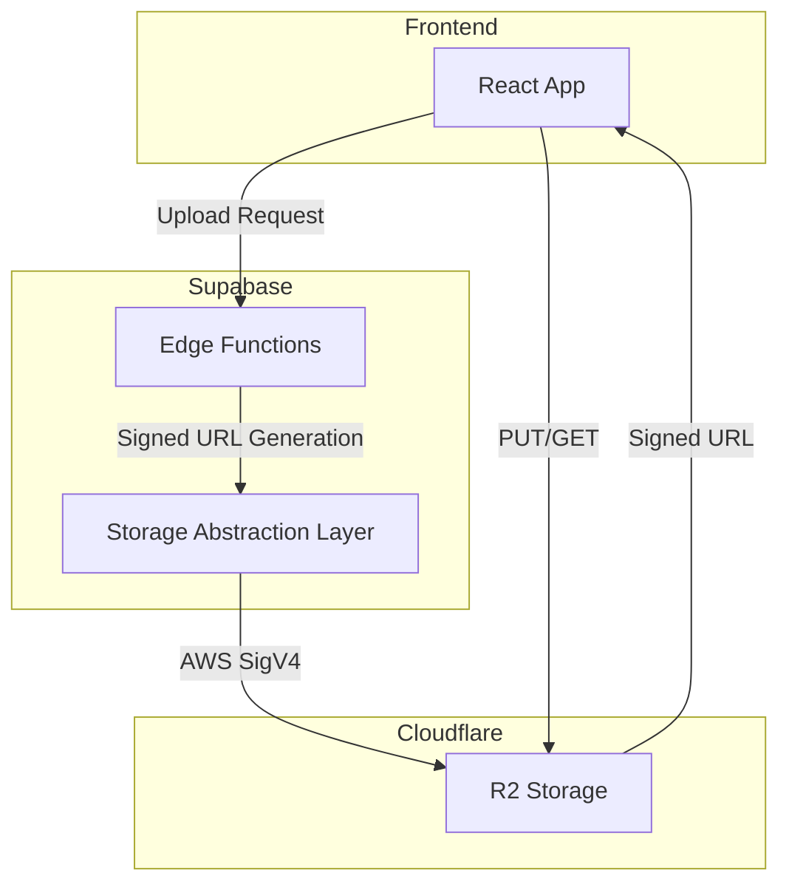
```mermaid
flowchart TD
    subgraph Frontend
        A[React App]
    end
    
    subgraph Supabase
        B[Edge Functions]
        C[Storage Abstraction Layer]
    end
    
    subgraph Cloudflare
        D[R2 Storage]
    end
    
    A -->|Upload Request| B
    B -->|Signed URL Generation| C
    C -->|AWS SigV4| D
    D -->|Signed URL| A
    A -->|PUT/GET| D
```

#### 2.1.2 Storage Abstraction Layer

The **storage abstraction layer** (`/supabase/functions/_shared/storage.ts`) provides a provider-agnostic interface that allows switching between Supabase Storage and Cloudflare R2 via the `STORAGE_PROVIDER` environment variable.

**Provider Interface:**
```typescript
export interface StorageProvider {
  createSignedUrl(bucket: BucketName, key: string, expiresInSec?: number): Promise<string>;
  createSignedUploadUrl(bucket: BucketName, key: string, contentType: string, expiresInSec?: number): Promise<SignedUploadDescriptor>;
  upload(bucket: BucketName, key: string, body: Uint8Array | ArrayBuffer | Blob, contentType?: string): Promise<void>;
  download(bucket: BucketName, key: string): Promise<Uint8Array>;
  delete(bucket: BucketName, key: string): Promise<void>;
  exists(bucket: BucketName, key: string): Promise<boolean>;
  readonly name: "supabase" | "r2";
}
```

**Bucket Mapping:**
| Logical Bucket | Purpose | R2 Physical Bucket (env var) |
|---------------|---------|----------------------------|
| `tracks` | Original audio files | `R2_BUCKET_TRACKS` |
| `stems` | Individual track stems | `R2_BUCKET_STEMS` |
| `watermarked` | Watermarked audio for sharing | `R2_BUCKET_WATERMARKED` |
| `covers` | Album/track cover images | `R2_BUCKET_COVERS` |
| `documents` | PDFs, contracts, exports | `R2_BUCKET_DOCUMENTS` |

#### 2.1.3 AWS Signature V4 Implementation

Both the Edge Functions (Deno) and Watermark Service (Node.js) implement **AWS Signature V4** for R2 authentication using pure Web Crypto APIs without external dependencies.

**Key Features:**
- Path-style addressing (`/{bucket}/{key}`)
- UNSIGNED-PAYLOAD for large file uploads
- Consistent signature generation across both runtimes
- 300-second default expiry for signed URLs (5 minutes)
- 600-second default expiry for upload URLs (10 minutes)

#### 2.1.4 File Flow

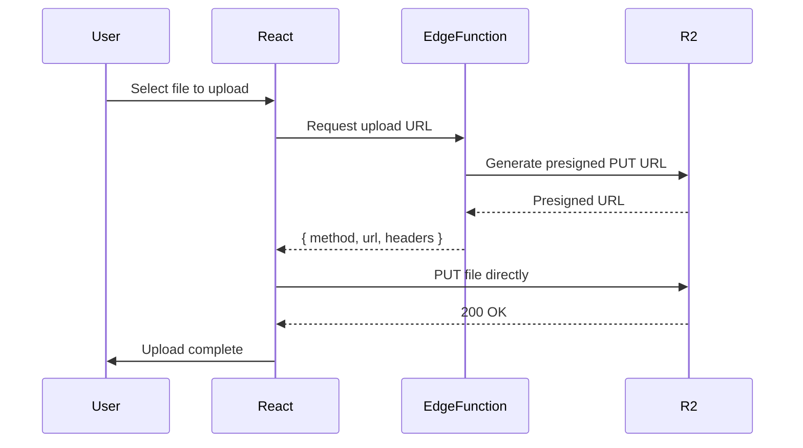
```mermaid
sequenceDiagram
    participant User
    participant React
    participant EdgeFunction
    participant R2
    
    User->>React: Select file to upload
    React->>EdgeFunction: Request upload URL
    EdgeFunction->>R2: Generate presigned PUT URL
    R2-->>EdgeFunction: Presigned URL
    EdgeFunction-->>React: { method, url, headers }
    React->>R2: PUT file directly
    R2-->>React: 200 OK
    React->>User: Upload complete
```

#### 2.1.5 Configuration

**Environment Variables:**
```bash
# R2 Provider Selection
STORAGE_PROVIDER=r2

# R2 Credentials
R2_ENDPOINT=https://<account-id>.r2.cloudflarestorage.com
R2_ACCESS_KEY_ID=<32-char-hex-key>
R2_SECRET_ACCESS_KEY=<40-char-secret>

# Bucket Mappings
R2_BUCKET_TRACKS=trakalog-tracks
R2_BUCKET_STEMS=trakalog-stems
R2_BUCKET_WATERMARKED=trakalog-watermarked
R2_BUCKET_COVERS=trakalog-covers
R2_BUCKET_DOCUMENTS=trakalog-documents
```

---

### 2.2 Railway Sonic DNA Service

**Purpose:** Advanced audio analysis providing BPM detection, key detection, mood analysis (valence/arousal), spectral features (brightness/warmth), and structural analysis.

#### 2.2.1 Architecture Pattern

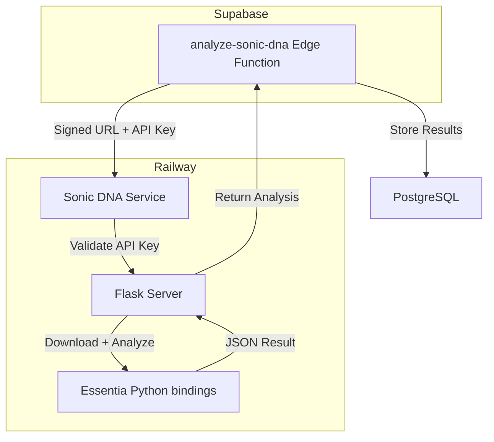
```mermaid
flowchart TD
    subgraph Supabase
        A[analyze-sonic-dna Edge Function]
    end
    
    subgraph Railway
        B[Sonic DNA Service]
        C[Flask Server]
        D[Essentia Python bindings]
    end
    
    A -->|Signed URL + API Key| B
    B -->|Validate API Key| C
    C -->|Download + Analyze| D
    D -->|JSON Result| C
    C -->|Return Analysis| A
    A -->|Store Results| PostgreSQL
```

#### 2.2.2 Service Components

**`sonic-dna-service/` Structure:**
```
sonic-dna-service/
├── server.py          # Flask HTTP server with /analyze endpoint
├── analyzer.py        # Core audio analysis logic
├── requirements.txt   # Python dependencies
├── railway.json       # Railway deployment configuration
└── Dockerfile         # Container image
```

#### 2.2.3 Analysis Pipeline

The analysis uses a combination of **Essentia** (the `essentia.standard` Python bindings — not Essentia.js, which is the WebAssembly build and is not used here) and **librosa** for comprehensive audio profiling:

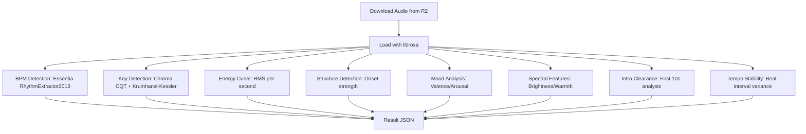
```mermaid
flowchart TD
    A[Download Audio from R2] --> B[Load with librosa]
    B --> C[BPM Detection: Essentia RhythmExtractor2013]
    B --> D[Key Detection: Chroma CQT + Krumhansl-Kessler]
    B --> E[Energy Curve: RMS per second]
    B --> F[Structure Detection: Onset strength]
    B --> G[Mood Analysis: Valence/Arousal]
    B --> H[Spectral Features: Brightness/Warmth]
    B --> I[Intro Clearance: First 10s analysis]
    B --> J[Tempo Stability: Beat interval variance]
    
    C --> K[Result JSON]
    D --> K
    E --> K
    F --> K
    G --> K
    H --> K
    I --> K
    J --> K
```

**Analysis Output Structure:**
```json
{
  "duration_sec": 180.5,
  "bpm": {
    "bpm": 128.0,
    "confidence": 0.95,
    "alternatives": [128.0, 64.0, 256.0],
    "method": "essentia_rhythm_extractor_normalized"
  },
  "key": {
    "key": "A",
    "mode": "Minor",
    "confidence": 0.87
  },
  "energy_curve": [0.1, 0.2, ..., 0.9],
  "structure": [
    {
      "start_sec": 0.0,
      "end_sec": 8.5,
      "energy_avg": 0.2,
      "type": "intro"
    },
    {
      "start_sec": 8.5,
      "end_sec": 172.0,
      "energy_avg": 0.8,
      "type": "section"
    }
  ],
  "mood": {
    "valence": 0.45,
    "arousal": 0.85,
    "descriptors": ["dark", "intense", "aggressive"]
  },
  "spectral": {
    "brightness": 0.6,
    "warmth": 0.4,
    "roughness": 0.3
  },
  "intro_clearance": {
    "energy": 0.3,
    "vocal_presence": 0.2,
    "sync_ready": true
  },
  "tempo_stability": 0.92
}
```

#### 2.2.4 Integration Flow

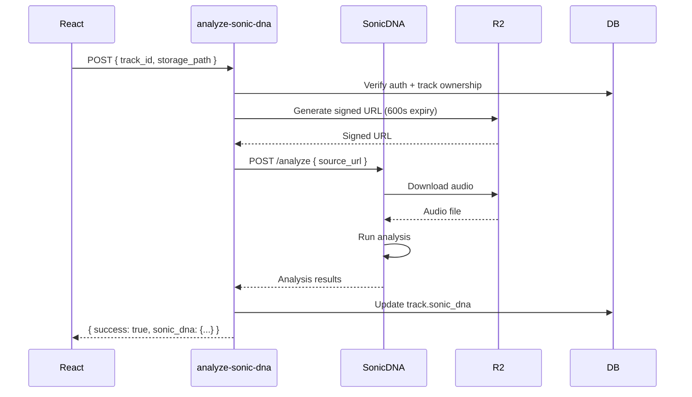
```mermaid
sequenceDiagram
    participant React
    participant analyze-sonic-dna
    participant SonicDNA
    participant R2
    participant DB
    
    React->>analyze-sonic-dna: POST { track_id, storage_path }
    analyze-sonic-dna->>DB: Verify auth + track ownership
    analyze-sonic-dna->>R2: Generate signed URL (600s expiry)
    R2-->>analyze-sonic-dna: Signed URL
    analyze-sonic-dna->>SonicDNA: POST /analyze { source_url }
    SonicDNA->>R2: Download audio
    R2-->>SonicDNA: Audio file
    SonicDNA->>SonicDNA: Run analysis
    SonicDNA-->>analyze-sonic-dna: Analysis results
    analyze-sonic-dna->>DB: Update track.sonic_dna
    analyze-sonic-dna-->>React: { success: true, sonic_dna: {...} }
```

#### 2.2.5 Configuration

**Railway Configuration (`railway.json`):**
```json
{
  "$schema": "https://railway.app/railway.schema.json",
  "build": {
    "builder": "DOCKERFILE",
    "dockerfilePath": "Dockerfile"
  },
  "deploy": {
    "startCommand": "python server.py",
    "restartPolicyType": "ON_FAILURE",
    "restartPolicyMaxRetries": 3
  }
}
```

**Dockerfile:**
```dockerfile
FROM python:3.11-slim

RUN apt-get update && apt-get install -y --no-install-recommends \
    libsndfile1 \
    ffmpeg \
    && rm -rf /var/lib/apt/lists/*

WORKDIR /app

COPY requirements.txt .
RUN pip install --no-cache-dir -r requirements.txt

COPY . .

CMD ["python", "server.py"]
```

**Environment Variables:**
```bash
SONIC_DNA_API_KEY=<internal-api-key>
PORT=8081
```

#### 2.2.6 Dependencies

**`requirements.txt`:**
```
flask==3.1.0
librosa==0.10.2
numpy==1.26.4
essentia==2.1b6.dev1110
requests==2.32.3
soundfile==0.12.1
```

Note `essentia==2.1b6.dev1110` — a pre-release build. Essentia has no stable PyPI wheel for
this use, so the pin is deliberate and must not be "helpfully" rounded to a release version.

---

### 2.3 Groq AI Integration

**Purpose:** AI-powered features including Smart A&R (track matching via LLM) and lyrics transcription via Whisper.

#### 2.3.1 Architecture Pattern

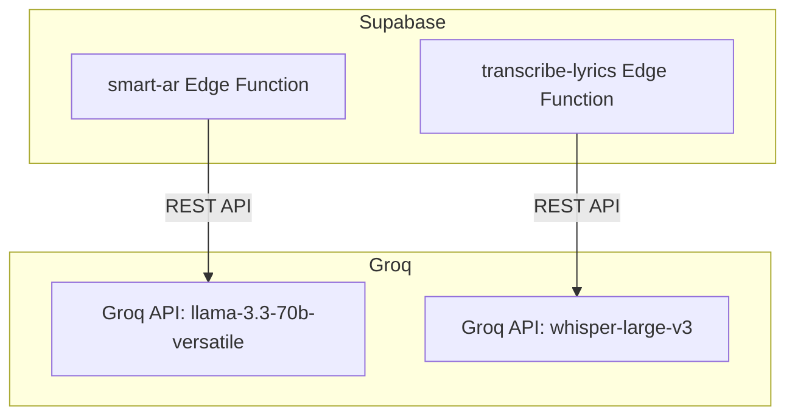
```mermaid
flowchart TD
    subgraph Supabase
        A[smart-ar Edge Function]
        B[transcribe-lyrics Edge Function]
    end
    
    subgraph Groq
        C[Groq API: llama-3.3-70b-versatile]
        D[Groq API: whisper-large-v3]
    end
    
    A -->|REST API| C
    B -->|REST API| D
```

#### 2.3.2 Smart A&R Integration

**Location:** `/supabase/functions/smart-ar/index.ts`

The Smart A&R feature uses Groq's **llama-3.3-70b-versatile** model to match tracks against user briefs. It's one of the most complex integrations due to:
- Context window management (128,000 tokens ≈ 1,250 tracks max)
- Catalog deduplication across workspaces and shares
- Rate limiting at multiple levels
- Plan-based quota enforcement

**Request Flow:**
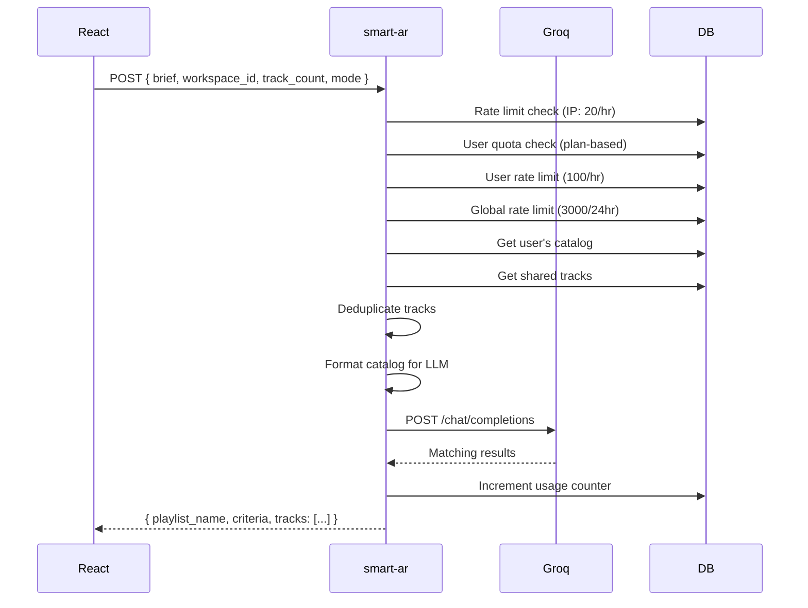
```mermaid
sequenceDiagram
    participant React
    participant smart-ar
    participant Groq
    participant DB
    
    React->>smart-ar: POST { brief, workspace_id, track_count, mode }
    smart-ar->>DB: Rate limit check (IP: 20/hr)
    smart-ar->>DB: User quota check (plan-based)
    smart-ar->>DB: User rate limit (100/hr)
    smart-ar->>DB: Global rate limit (3000/24hr)
    smart-ar->>DB: Get user's catalog
    smart-ar->>DB: Get shared tracks
    smart-ar->>smart-ar: Deduplicate tracks
    smart-ar->>smart-ar: Format catalog for LLM
    smart-ar->>Groq: POST /chat/completions
    Groq-->>smart-ar: Matching results
    smart-ar->>DB: Increment usage counter
    smart-ar-->>React: { playlist_name, criteria, tracks: [...] }
```

**Catalog Assembly Logic:**
1. **Personal Mode:** Fetches tracks from the user's workspace + all shared tracks (both individual track shares and full catalog shares)
2. **Marketplace Mode:** Fetches all tracks with `is_marketplace_public = true` and `status = available`
3. **Deduplication:** Ensures each track appears only once, even if shared through multiple paths

**LLM Prompt Structure:**
- System prompt with matching rules and internal data usage guidelines
- User prompt with brief + formatted catalog
- Response format: JSON with playlist name, criteria, and ranked tracks with scores and reasons

**Context Window Management:**
- **Current Issue:** Business plan allows 5,000 tracks but LLM fails at ~1,250 tracks
- **Planned Fix:** Pre-filter catalog before sending to LLM
- **Token Calculation:** ~750 tokens (system) + ~100 tokens/track + brief

#### 2.3.3 Lyrics Transcription Integration

**Location:** `/supabase/functions/transcribe-lyrics/index.ts`

Uses Groq's **whisper-large-v3** model for high-quality lyrics transcription with advanced confidence filtering.

**Key Features:**
- Two-pass transcription: Detection pass (90 seconds) + full pass with forced language
- Language detection and auto-forcing to prevent mid-song drift
- Hallucination filtering using per-segment confidence metrics
- Support for 8+ languages with ISO-639-1 code mapping

**Transcription Flow:**
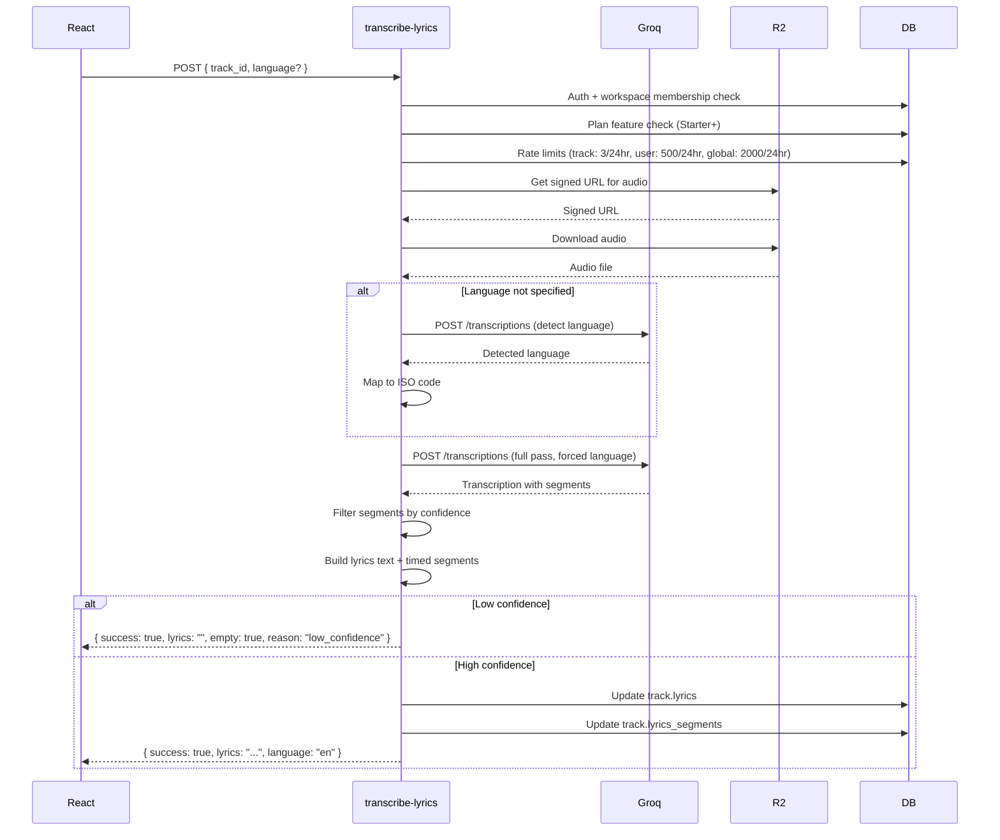
```mermaid
sequenceDiagram
    participant React
    participant transcribe-lyrics
    participant Groq
    participant R2
    participant DB
    
    React->>transcribe-lyrics: POST { track_id, language? }
    transcribe-lyrics->>DB: Auth + workspace membership check
    transcribe-lyrics->>DB: Plan feature check (Starter+)
    transcribe-lyrics->>DB: Rate limits (track: 3/24hr, user: 500/24hr, global: 2000/24hr)
    transcribe-lyrics->>R2: Get signed URL for audio
    R2-->>transcribe-lyrics: Signed URL
    transcribe-lyrics->>R2: Download audio
    R2-->>transcribe-lyrics: Audio file
    
    alt Language not specified
        transcribe-lyrics->>Groq: POST /transcriptions (detect language)
        Groq-->>transcribe-lyrics: Detected language
        transcribe-lyrics->>transcribe-lyrics: Map to ISO code
    end
    
    transcribe-lyrics->>Groq: POST /transcriptions (full pass, forced language)
    Groq-->>transcribe-lyrics: Transcription with segments
    transcribe-lyrics->>transcribe-lyrics: Filter segments by confidence
    transcribe-lyrics->>transcribe-lyrics: Build lyrics text + timed segments
    
    alt Low confidence
        transcribe-lyrics-->>React: { success: true, lyrics: "", empty: true, reason: "low_confidence" }
    else High confidence
        transcribe-lyrics->>DB: Update track.lyrics
        transcribe-lyrics->>DB: Update track.lyrics_segments
        transcribe-lyrics-->>React: { success: true, lyrics: "...", language: "en" }
    end
```

**Confidence Filtering:**
Three thresholds must ALL be met for a segment to be kept:
- `no_speech_prob <= 0.6` (likely voice present)
- `avg_logprob >= -1.0` (model confidence)
- `compression_ratio <= 2.4` (not repetitive/hallucinated)

If fewer than 30% of segments survive or total text < 40 characters, the transcription is rejected as low confidence.

#### 2.3.4 API Configuration

**Environment Variables:**
```bash
GROQ_API_KEY=<groq-api-key>
```

**API Endpoints:**
```
POST https://api.groq.com/openai/v1/chat/completions
POST https://api.groq.com/openai/v1/audio/transcriptions
```

**Models Used:**
| Feature | Model | Temperature | Response Format |
|---------|-------|-------------|----------------|
| Smart A&R | llama-3.3-70b-versatile | 0.3 | JSON object |
| Transcription | whisper-large-v3 | 0.0 | verbose_json |

---

### 2.4 Stripe Integration

**Purpose:** Subscription management, one-time payments, billing, and credit purchases.

#### 2.4.1 Architecture Pattern

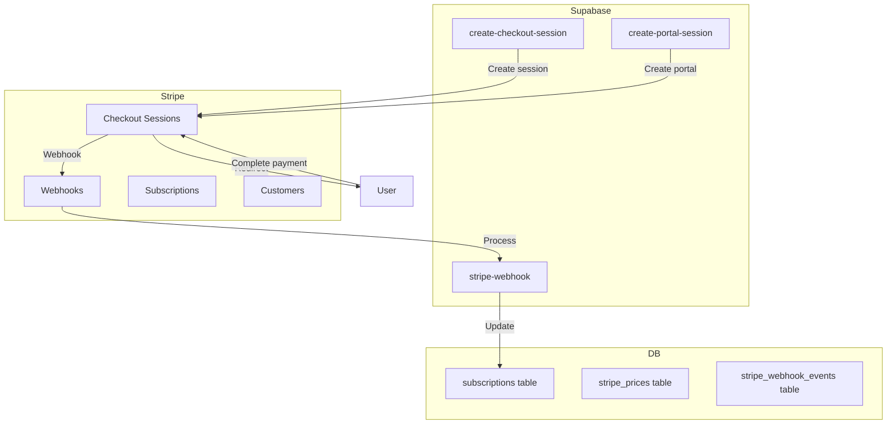
```mermaid
flowchart TD
    subgraph Supabase
        A[create-checkout-session]
        B[stripe-webhook]
        C[create-portal-session]
    end
    
    subgraph Stripe
        D[Checkout Sessions]
        E[Webhooks]
        F[Subscriptions]
        G[Customers]
    end
    
    subgraph DB
        H[subscriptions table]
        I[stripe_prices table]
        J[stripe_webhook_events table]
    end
    
    A -->|Create session| D
    D -->|Redirect| User
    User -->|Complete payment| D
    D -->|Webhook| E
    E -->|Process| B
    B -->|Update| H
    C -->|Create portal| D
```

#### 2.4.2 Checkout Flow

**Location:** `/supabase/functions/create-checkout-session/index.ts`

Handles both subscription signups and one-time credit purchases.

**Flow:**
```mermaid
sequenceDiagram
    participant React
    participant create-checkout-session
    participant Stripe
    participant DB
    
    React->>create-checkout-session: POST { plan, billing_cycle } OR { credits_pack }
    create-checkout-session->>DB: Rate limit check (20/hr per IP)
    create-checkout-session->>DB: Auth user
    create-checkout-session->>DB: Lookup Stripe price
    create-checkout-session->>DB: Get or create Stripe customer
    create-checkout-session->>Stripe: Create checkout session
    Stripe-->>create-checkout-session: { url: checkout_url }
    create-checkout-session-->>React: { url: checkout_url }
    React->>User: Redirect to Stripe
```

**Price Lookup:**
Prices are stored in the `stripe_prices` table, never hardcoded:
```sql
SELECT stripe_price_id FROM stripe_prices
WHERE kind = 'subscription' 
  AND plan = $1 
  AND billing_cycle = $2 
  AND active = true
```

**Customer Creation:**
- Uses idempotency key (`customer_create_<user_id>`) to prevent duplicate customers
- Stores Stripe customer ID in the `subscriptions` table
- Includes user metadata for reference

#### 2.4.3 Webhook Processing

**Location:** `/supabase/functions/stripe-webhook/index.ts`

Processes Stripe events with **replay protection** and **idempotent handling**.

**Key Features:**
- Signature verification using raw body (before JSON parsing)
- Replay protection via database claim mechanism
- Automatic claim release on processing failure
- Comprehensive error handling with retry support

**Event Types Handled:**

| Event Type | Action | DB Operation |
|------------|--------|--------------|
| `customer.subscription.created` | Create subscription | `stripe_apply_subscription` RPC |
| `customer.subscription.updated` | Update subscription | `stripe_apply_subscription` RPC |
| `customer.subscription.deleted` | Downgrade to free | `stripe_downgrade_to_free` RPC |
| `invoice.paid` | Reset usage counters | `stripe_reset_billing_usage` RPC |
| `checkout.session.completed` | Grant credits | `stripe_grant_credits` RPC |

**Webhook Flow:**
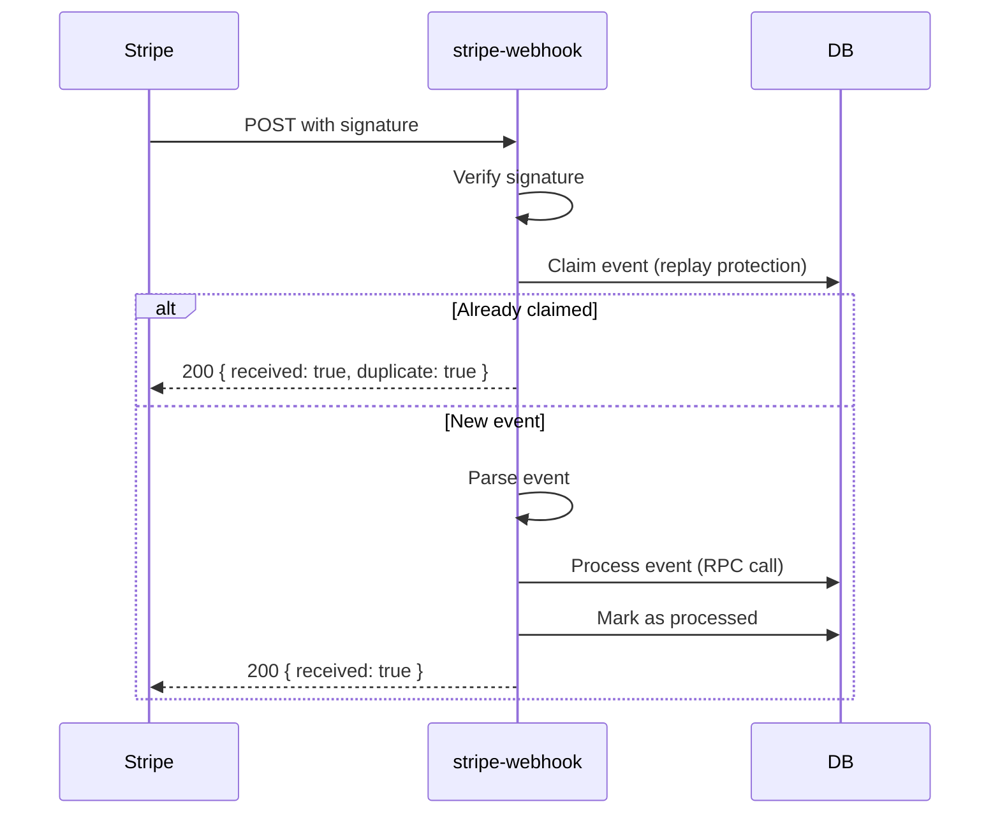
```mermaid
sequenceDiagram
    participant Stripe
    participant stripe-webhook
    participant DB
    
    Stripe->>stripe-webhook: POST with signature
    stripe-webhook->>stripe-webhook: Verify signature
    stripe-webhook->>DB: Claim event (replay protection)
    
    alt Already claimed
        stripe-webhook-->>Stripe: 200 { received: true, duplicate: true }
    else New event
        stripe-webhook->>stripe-webhook: Parse event
        stripe-webhook->>DB: Process event (RPC call)
        stripe-webhook->>DB: Mark as processed
        stripe-webhook-->>Stripe: 200 { received: true }
    end
```

**Replay Protection:**
```sql
-- Claim function
CREATE OR REPLACE FUNCTION stripe_claim_webhook_event(
  _event_id text,
  _event_type text
) RETURNS boolean AS $$
BEGIN
  INSERT INTO stripe_webhook_events (event_id, event_type, processed_at)
  VALUES (_event_id, _event_type, NOW())
  ON CONFLICT (event_id) DO NOTHING
  RETURNING true;
  
  -- If already exists, return false
  RETURN false;
END;
$$ LANGUAGE plpgsql;
```

#### 2.4.4 Customer Portal

**Location:** `/supabase/functions/create-portal-session/index.ts`

Allows users to manage their subscriptions, payment methods, and billing information.

**Flow:**
```mermaid
sequenceDiagram
    participant React
    participant create-portal-session
    participant Stripe
    
    React->>create-portal-session: POST { return_url? }
    create-portal-session->>DB: Get user's Stripe customer ID
    create-portal-session->>Stripe: Create portal session
    Stripe-->>create-portal-session: { url: portal_url }
    create-portal-session-->>React: { url: portal_url }
```

#### 2.4.5 Configuration

**Environment Variables:**
```bash
STRIPE_SECRET_KEY=<stripe-secret-key>
STRIPE_WEBHOOK_SECRET=<webhook-signing-secret>
```

**Stripe Price Table Schema:**
```sql
CREATE TABLE public.stripe_prices (
    stripe_price_id text NOT NULL,     -- PRIMARY KEY. There is no `id` column.
    kind text NOT NULL,
    plan text,
    billing_cycle text,
    credits_amount integer,            -- For credits packs
    amount_cents integer NOT NULL,
    active boolean DEFAULT true NOT NULL,
    updated_at timestamptz DEFAULT now() NOT NULL,  -- no `created_at`
    CONSTRAINT stripe_prices_billing_cycle_check
      CHECK (billing_cycle = ANY (ARRAY['monthly', 'yearly'])),
    CONSTRAINT stripe_prices_kind_check
      CHECK (kind = ANY (ARRAY['subscription', 'credits', 'seat'])),
    CONSTRAINT stripe_prices_plan_check
      CHECK (plan = ANY (ARRAY['starter', 'pro', 'business']))
);
```

Two constraints to note: the primary key is `stripe_price_id` itself, and the `plan` CHECK
allows only `starter`, `pro`, `business` — **`enterprise` and `founder` are not purchasable
through Stripe** and have no price row.

---

### 2.5 Resend Integration

**Purpose:** Transactional email delivery for invitations, notifications, shared links, and system messages.

#### 2.5.1 Architecture Pattern

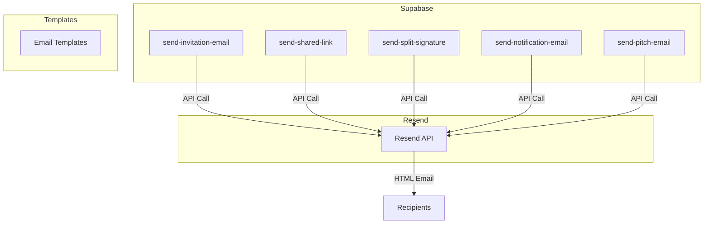
```mermaid
flowchart TD
    subgraph Supabase
        A[send-invitation-email]
        B[send-shared-link]
        C[send-split-signature]
        D[send-notification-email]
        E[send-pitch-email]
    end
    
    subgraph Resend
        F[Resend API]
    end
    
    subgraph Templates
        G[Email Templates]
    end
    
    A -->|API Call| F
    B -->|API Call| F
    C -->|API Call| F
    D -->|API Call| F
    E -->|API Call| F
    F -->|HTML Email| Recipients
```

#### 2.5.2 Email Templates

**Location:** `/supabase/functions/_shared/email-template.ts`

Provides a consistent email template structure with:
- Workspace branding (logo, colors)
- Preheader text
- Main heading
- Body content
- Call-to-action button
- Footer

**Template Builder:**
```typescript
export function buildEmail(options: {
  workspaceName: string;
  workspaceLogoUrl: string | null;
  brandColor: string | null;
  preheader: string;
  heading: string;
  body: string;
  ctaLabel: string;
  ctaUrl: string;
}): string
```

#### 2.5.3 Email Types

| Email Type | Function | Trigger |
|------------|----------|---------|
| Invitation | `send-invitation-email` | User invites team member |
| Shared Link | `send-shared-link` | User shares tracks/playlists |
| Split Signature | `send-split-signature` | Split agreement signed |
| Notification | `send-notification-email` | System notifications |
| Pitch | `send-pitch-email` | Pitch submission |
| Access Request | `send-access-request-email` | Recipient requests access |
| Waitlist Invite | `send-waitlist-invite` | Waitlist user invited |

#### 2.5.4 Invitation Email Flow

**Location:** `/supabase/functions/send-invitation-email/index.ts`

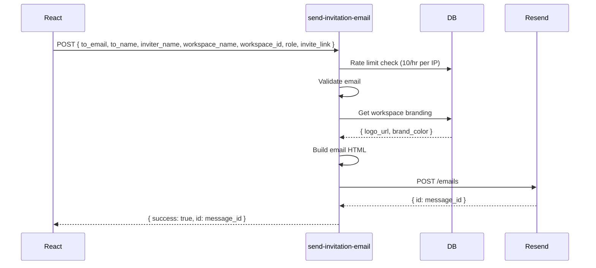
```mermaid
sequenceDiagram
    participant React
    participant send-invitation-email
    participant DB
    participant Resend
    
    React->>send-invitation-email: POST { to_email, to_name, inviter_name, workspace_name, workspace_id, role, invite_link }
    send-invitation-email->>DB: Rate limit check (10/hr per IP)
    send-invitation-email->>send-invitation-email: Validate email
    send-invitation-email->>DB: Get workspace branding
    DB-->>send-invitation-email: { logo_url, brand_color }
    send-invitation-email->>send-invitation-email: Build email HTML
    send-invitation-email->>Resend: POST /emails
    Resend-->>send-invitation-email: { id: message_id }
    send-invitation-email-->>React: { success: true, id: message_id }
```

**Email Structure:**
```json
{
  "from": "Trakalog <noreply@trakalog.com>",
  "to": ["recipient@example.com"],
  "subject": "{inviter} invited you to join {workspace} on Trakalog",
  "html": "<HTML email body>"
}
```

#### 2.5.5 Configuration

**Environment Variables:**
```bash
RESEND_API_KEY=<resend-api-key>
```

**API Endpoint:**
```
POST https://api.resend.com/emails
```

---

### 2.6 Watermark Service

**Purpose:** Audio watermarking for leak tracing and recipient identification.

#### 2.6.1 Architecture Pattern

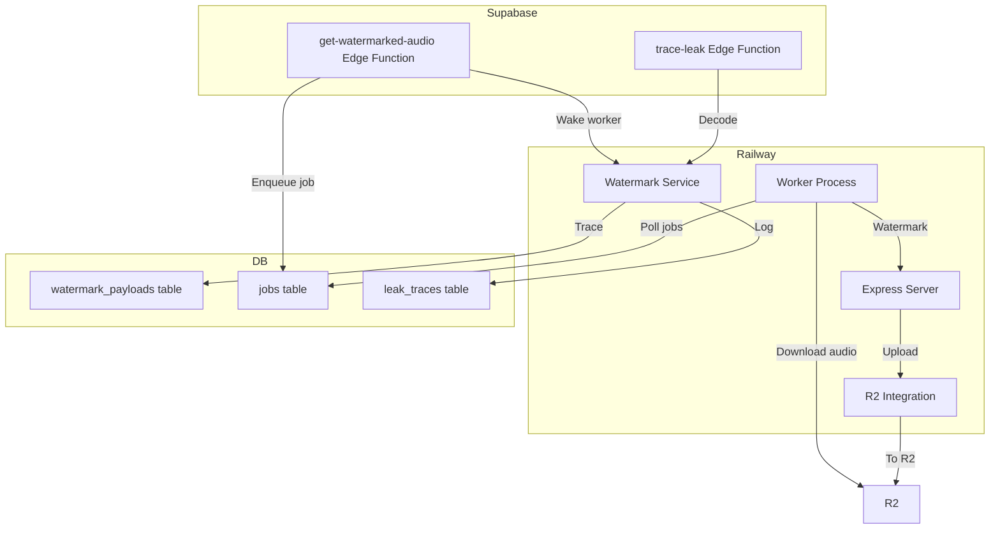
```mermaid
flowchart TD
    subgraph Railway
        A[Watermark Service]
        B[Express Server]
        C[Worker Process]
        D[R2 Integration]
    end
    
    subgraph Supabase
        E[get-watermarked-audio Edge Function]
        F[trace-leak Edge Function]
    end
    
    subgraph DB
        G[watermark_payloads table]
        H[jobs table]
        I[leak_traces table]
    end
    
    E -->|Enqueue job| H
    E -->|Wake worker| A
    C -->|Poll jobs| H
    C -->|Download audio| R2
    C -->|Watermark| B
    B -->|Upload| D
    D -->|To R2| R2
    F -->|Decode| A
    A -->|Trace| G
    A -->|Log| I
```

#### 2.6.2 Service Components

**`services/watermark/` Structure:**
```
services/watermark/
├── index.js          # Express server with /encode, /decode, /health, /wake
├── worker.js         # Background job processor
├── r2.js             # R2 upload functionality (SigV4)
├── env.js            # Environment variable helper
├── package.json
├── Dockerfile
└── README.md
```

#### 2.6.3 Watermark Pipeline

The watermarking process uses **audiowmark** (v0.6.5) with a three-step pipeline:

**1. Watermark Embedding:**
- Strength: 10 (inaudible to human ear)
- Payload: 128-bit hex string (32 hex characters)
- Format: Embedded in WAV format

**2. MP3 Compression:**
- Bitrate: 320kbps CBR
- Encoder: libmp3lame via ffmpeg
- Purpose: Reduce file size (~4x smaller than WAV)

**3. Watermark Verification:**
- Decode watermark from MP3
- Confidence threshold: 1.0
- Fallback: If verification fails, deliver WAV instead of MP3

**Pipeline Flow:**
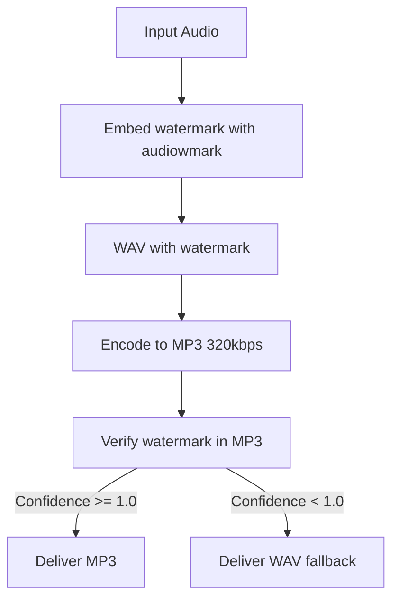
```mermaid
flowchart TD
    A[Input Audio] --> B[Embed watermark with audiowmark]
    B --> C[WAV with watermark]
    C --> D[Encode to MP3 320kbps]
    D --> E[Verify watermark in MP3]
    E -->|Confidence >= 1.0| F[Deliver MP3]
    E -->|Confidence < 1.0| G[Deliver WAV fallback]
```

#### 2.6.4 Payload Structure

Watermark payloads are designed for leak tracing:

```
rawPayload = `lid_${link_id}_v_${visitor_email}`
payloadHash = sha256(rawPayload).substring(0, 32)  // 128-bit hex
```

**Stored in `watermark_payloads` table:**
```sql
{
  hash_hex: payloadHash,
  raw_payload: rawPayload,
  link_id: link_id,
  visitor_email: visitor_email,
  visitor_name: visitor_name
}
```

#### 2.6.5 Get Watermarked Audio Flow

**Location:** `/supabase/functions/get-watermarked-audio/index.ts`

This is the primary integration point for delivering watermarked audio to shared link recipients.

**Flow:**
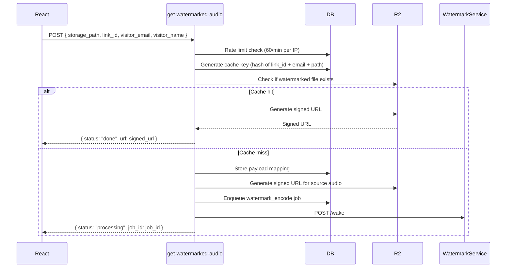
```mermaid
sequenceDiagram
    participant React
    participant get-watermarked-audio
    participant DB
    participant R2
    participant WatermarkService
    
    React->>get-watermarked-audio: POST { storage_path, link_id, visitor_email, visitor_name }
    get-watermarked-audio->>DB: Rate limit check (60/min per IP)
    get-watermarked-audio->>DB: Generate cache key (hash of link_id + email + path)
    get-watermarked-audio->>R2: Check if watermarked file exists
    
    alt Cache hit
        get-watermarked-audio->>R2: Generate signed URL
        R2-->>get-watermarked-audio: Signed URL
        get-watermarked-audio-->>React: { status: "done", url: signed_url }
    else Cache miss
        get-watermarked-audio->>DB: Store payload mapping
        get-watermarked-audio->>R2: Generate signed URL for source audio
        get-watermarked-audio->>DB: Enqueue watermark_encode job
        get-watermarked-audio->>WatermarkService: POST /wake
        get-watermarked-audio-->>React: { status: "processing", job_id: job_id }
    end
```

**Cache Key:**
```typescript
const cacheBase = (await sha256Hex(`${link_id}_${visitor_email}_${storage_path}`)) + "-v2";
const mp3Path = `${cacheBase}.mp3`;
const wavPath = `${cacheBase}.wav`;
```

The `-v2` suffix invalidates legacy objects from the old 128k/strength-12 pipeline.

#### 2.6.6 Job Queue System

**Job Types:**
- `watermark_encode`: Encode audio with watermark

**Job Payload:**
```json
{
  "source_url": "https://r2-signed-url/audio.wav",
  "payload_hex": "a1b2c3d4e5f6...",
  "output_bucket": "watermarked",
  "output_path": "cache-key-v2.mp3",
  "format": "mp3",
  "output_provider": "r2"
}
```

**Job Processing:**
1. Worker polls for queued jobs
2. Downloads source audio from signed URL
3. Runs watermark pipeline
4. Uploads result to R2
5. Updates job status

**Wake Mechanism:**
The Edge Function sends a `/wake` request to the watermark service after enqueuing a job, which triggers immediate polling instead of waiting for the next scheduled interval.

#### 2.6.7 Leak Tracing Flow

**Location:** `/supabase/functions/trace-leak/index.ts`

Allows workspace admins to trace leaked audio back to the recipient.

**Flow:**
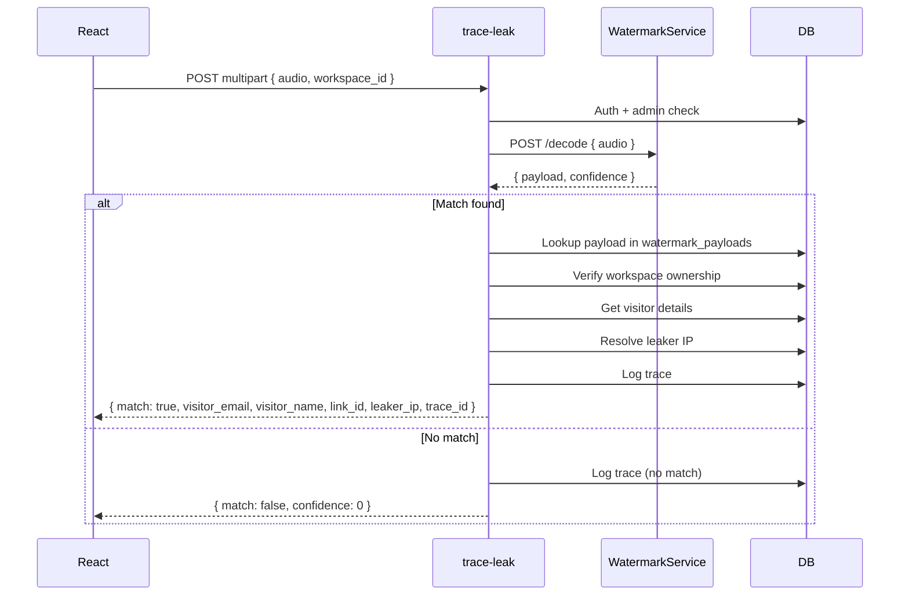
```mermaid
sequenceDiagram
    participant React
    participant trace-leak
    participant WatermarkService
    participant DB
    
    React->>trace-leak: POST multipart { audio, workspace_id }
    trace-leak->>DB: Auth + admin check
    trace-leak->>WatermarkService: POST /decode { audio }
    WatermarkService-->>trace-leak: { payload, confidence }
    
    alt Match found
        trace-leak->>DB: Lookup payload in watermark_payloads
        trace-leak->>DB: Verify workspace ownership
        trace-leak->>DB: Get visitor details
        trace-leak->>DB: Resolve leaker IP
        trace-leak->>DB: Log trace
        trace-leak-->>React: { match: true, visitor_email, visitor_name, link_id, leaker_ip, trace_id }
    else No match
        trace-leak->>DB: Log trace (no match)
        trace-leak-->>React: { match: false, confidence: 0 }
    end
```

**IP Resolution Priority:**
1. Download event by visitor on link
2. Listen/play event by visitor on link
3. Most recent IP across all downloads/events on link

**Cross-Tenant Protection:**
The watermark payloads table is global, so a hash match must be verified against the workspace before disclosing visitor PII:
```typescript
if (linkWorkspaceId && linkWorkspaceId === workspaceId) {
  // Disclose visitor details
} else {
  // Withhold PII - hash belongs to different workspace
}
```

#### 2.6.8 Configuration

**Environment Variables:**
```bash
# Service
WATERMARK_API_KEY=<internal-api-key>
PORT=3000
ALLOWED_ORIGINS=https://app.trakalog.com,https://localhost:3000
WATERMARK_ALLOWED_HOSTS=<comma-separated-r2-hosts>

# R2 (for uploads)
R2_ENDPOINT=https://<account>.r2.cloudflarestorage.com
R2_ACCESS_KEY_ID=<key>
R2_SECRET_ACCESS_KEY=<secret>
R2_BUCKET_WATERMARKED=<bucket-name>
```

**Timeouts:**
| Step | Timeout | Purpose |
|------|---------|---------|
| Add watermark | 110s | audiowmark encoding |
| FFmpeg encode | 60s | MP3 compression |
| Verify watermark | 60s | `audiowmark get` on the encoded MP3 |
| Global encode | 240s | Full pipeline |
| Global decode | 120s | Full decode |

**Dockerfile:**
```dockerfile
FROM ubuntu:24.04
ENV DEBIAN_FRONTEND=noninteractive

# Build dependencies for audiowmark, plus ffmpeg
RUN apt-get update && apt-get install -y \
    build-essential autoconf automake libtool \
    libfftw3-dev libsndfile1-dev libgcrypt20-dev \
    libzita-resampler-dev libmpg123-dev \
    ffmpeg git curl ca-certificates \
    && rm -rf /var/lib/apt/lists/*

# audiowmark is built FROM SOURCE — there is no npm package for it
RUN git clone https://github.com/swesterfeld/audiowmark.git /tmp/audiowmark \
    && cd /tmp/audiowmark \
    && ./autogen.sh && ./configure && make -j$(nproc) && make install \
    && ldconfig

# Node 22 — Node 20 lacks a global WebSocket, which @supabase/supabase-js
# requires for its realtime client
RUN curl -fsSL https://deb.nodesource.com/setup_22.x | bash - \
    && apt-get install -y nodejs

WORKDIR /app
COPY package.json .
RUN npm install --production
COPY *.js .

EXPOSE 3000
CMD ["node", "index.js"]
```

The base image is **`ubuntu:24.04`, not a Node image**, and **audiowmark is compiled from
source** — `npm install -g audiowmark` would fail, as no such package exists. Node is layered
on top afterwards, at **version 22**: the bump is load-bearing, because `@supabase/supabase-js`
needs a global `WebSocket` that Node 20 does not provide.

`COPY *.js .` copies every service source file (`index.js`, `worker.js`, `r2.js`) rather than
naming them, so a new module cannot be silently left out of the image.

(Apt-cache cleanup steps elided above for readability; see `services/watermark/Dockerfile`.)

---

## 3. Integration Patterns

### 3.1 Direct HTTP API Calls

**Used by:** Groq, Railway Sonic DNA, Resend

**Pattern:**
```typescript
const response = await fetch('https://api.service.com/endpoint', {
  method: 'POST',
  headers: {
    'Authorization': `Bearer ${API_KEY}`,
    'Content-Type': 'application/json',
  },
  body: JSON.stringify(payload),
});
```

**Characteristics:**
- Synchronous calls from Edge Functions
- API keys stored in Supabase secrets
- Rate limiting enforced at function level
- Error handling with retry logic where appropriate

### 3.2 Webhooks

**Used by:** Stripe

**Pattern:**
```typescript
// 1. Verify signature
const event = await stripe.webhooks.constructEventAsync(
  rawBody, 
  signature, 
  webhookSecret
);

// 2. Claim event (replay protection)
await supabase.rpc('stripe_claim_webhook_event', {
  _event_id: event.id,
  _event_type: event.type,
});

// 3. Process event
switch (event.type) {
  case 'customer.subscription.created':
    // Handle subscription
    break;
  // ...
}

// 4. Mark as processed
```

**Characteristics:**
- `verify_jwt = false` for webhook functions (no Supabase JWT)
- Raw body reading before JSON parsing (for signature verification)
- Idempotent processing with database-based deduplication
- Automatic retry on failure (release claim on error)

### 3.3 Signed URLs

**Used by:** R2 Storage, Supabase Storage

**Pattern:**
```typescript
// Generate signed URL
const signedUrl = await storageProvider.createSignedUrl(
  'tracks',
  'workspace-id/track-id.wav',
  300  // 5 minutes expiry
);

// Use URL
const response = await fetch(signedUrl);
const audioBlob = await response.blob();
```

**Characteristics:**
- Time-limited access (default: 300 seconds)
- AWS Signature V4 for R2 compatibility
- No API key exposure to client
- Provider abstraction allows switching between Supabase and R2

### 3.4 Background Jobs

**Used by:** Watermark encoding

**Pattern:**
```typescript
// 1. Enqueue job
await supabase.rpc('enqueue_job', {
  _job_type: 'watermark_encode',
  _payload: { ... },
  _dedupe_key: cacheBase,
  _priority: 10,
  _max_attempts: 3,
});

// 2. Worker polls for jobs
// 3. Worker processes job
// 4. Worker updates status
```

**Characteristics:**
- Job deduplication via `dedupe_key`
- Priority-based processing
- Max attempts with automatic retry
- Wake mechanism for immediate processing

### 3.5 Service-to-Service Communication

**Used by:** Edge Functions → Watermark Service, Edge Functions → Railway Sonic DNA

**Pattern:**
```typescript
const response = await fetch('https://watermark-service/wake', {
  method: 'POST',
  headers: {
    'x-api-key': WATERMARK_API_KEY,
  },
  signal: abortController.signal,
});
```

**Characteristics:**
- Internal API keys (different from external service keys)
- Timeout handling (typically 2-5 seconds)
- Non-blocking (fire-and-forget with `waitUntil` where available)
- SSRF protection (host allowlists, IP validation)

---

## 4. Security Architecture

### 4.1 Authentication Patterns

| Service | Authentication Method | Key Storage |
|---------|----------------------|-------------|
| R2 | AWS Signature V4 | Supabase secrets |
| Groq | Bearer token | Supabase secrets |
| Stripe | Bearer token | Supabase secrets |
| Resend | Bearer token | Supabase secrets |
| Railway Sonic DNA | API key header | Railway environment |
| Watermark Service | API key header | Railway environment |

### 4.2 SSRF Protection

**Implemented in:** Watermark Service (`/services/watermark/index.js`)

**Protection mechanisms:**
1. **HTTPS-only:** Rejects non-HTTPS URLs
2. **Host allowlist:** Only predefined R2 hosts allowed
3. **IP validation:** Blocks private/reserved IP ranges
4. **DNS rebinding protection:** Resolves DNS once, pins connection to resolved IP
5. **Redirect validation:** Each redirect hop is fully re-validated
6. **Size limits:** 100MB maximum download
7. **Timeout limits:** 120s download, 15s connection

**Blocked IP Ranges:**
- Private: 10.0.0.0/8, 172.16.0.0/12, 192.168.0.0/16
- Loopback: 127.0.0.0/8, ::1
- Link-local: 169.254.0.0/16, fe80::/10
- CGNAT: 100.64.0.0/10
- Unique Local: fc00::/7

### 4.3 Rate Limiting

All external service integrations implement rate limiting at multiple levels:

**Rate Limit Configuration:**

| Service | Key prefix | IP limit | Other limits |
|---|---|---|---|
| Smart A&R | `smart-ar:`, `smartar:user:`, `smartar:global` | 20 / hr | 100/hr per user · 3000/24hr global |
| Transcription | `transcribe:`, `transcribe:track:`, `transcribe:user:`, `transcribe:global` | 10 / hr | 3/24hr per track · 500/24hr per user · 2000/24hr global |
| Sonic DNA | `sonic-dna:` | 20 / hr | — |
| Stripe checkout | `checkout:` | 20 / hr | — |
| Notification email | `notif-email:` | 30 / hr | — |
| Storage signing | `get-storage-url:` | 60 / min | — |
| **Watermark** | `watermark:` | **60 / min** | — |
| Link password | `hash-pw:`, `verify-link-password:` | 5 / 5 min | — |
| Link logging | `log-access:`, `log-event:` | 120 / min | — |

Watermarking is **60 per minute**, not 5 per hour — it has to be, since a single playlist page
resolves one watermarked URL per track. The 5-per-5-minutes limit belongs to the link password
endpoints, where it is the brute-force defence.

**The IP behind every key** comes from `getClientIp(req)` in
`supabase/functions/_shared/ip.ts`, used by **30 Edge Functions** since the August 2026
hardening. It takes the **last** entry of `X-Forwarded-For`, not the raw header: the leading
entries of that chain are client-supplied and forgeable, so reading the whole header let a
caller rotate the value per request and reset their own quota. Only the final hop, written by
the Supabase edge, is trustworthy. Any new Edge Function must use this helper rather than
reading `x-forwarded-for` directly — otherwise its rate limit is decorative.

**Implementation:**
```typescript
// Using Supabase RLS + custom function
const { data: rateLimitOk } = await supabase.rpc('check_rate_limit', {
  _key: `service:${ip}`,
  _max_requests: 20,
  _window_seconds: 3600,
});

if (rateLimitOk === false) {
  return new Response(JSON.stringify({ error: "Rate limit exceeded" }), {
    status: 429,
  });
}
```

### 4.4 Input Validation

**All integrations validate:**
- UUID formats (tracks, workspaces, links, users)
- Email formats
- Storage paths (no traversal, no special characters)
- String lengths (bounded inputs)
- File sizes (where applicable)

**Example:**
```typescript
// From /supabase/functions/_shared/validation.ts
function isValidUUID(value: string): boolean {
  return /^[0-9a-f]{8}-[0-9a-f]{4}-[0-9a-f]{4}-[0-9a-f]{4}-[0-9a-f]{12}$/i.test(value);
}

function isValidEmail(value: string): boolean {
  return /^[^\s@]+@[^\s@]+\.[^\s@]+$/.test(value);
}
```

### 4.5 Cross-Tenant Isolation

**Critical for:** Watermark leak tracing, subscription management

**Implementation:**
```typescript
// In trace-leak: verify watermark belongs to workspace
if (linkWorkspaceId && linkWorkspaceId === workspaceId) {
  // Disclose visitor PII
} else {
  // Withhold - cross-tenant access attempt
}

// In stripe-webhook: process events for any customer
// but update only matching user records
```

---

## 5. Performance Characteristics

### 5.1 Latency Expectations

| Operation | Expected Latency | Notes |
|-----------|-----------------|-------|
| R2 signed URL generation | <100ms | SigV4 computation |
| R2 upload (10MB) | 500-2000ms | Network dependent |
| R2 download (10MB) | 500-2000ms | Network dependent |
| Sonic DNA analysis | 30-120s | Audio length dependent |
| Groq LLM (Smart A&R) | 5-30s | Catalog size dependent |
| Groq Whisper | 20-60s | Audio length dependent |
| Watermark encode | 10-60s | File size dependent |
| Watermark decode | 5-15s | File size dependent |
| Stripe checkout | 2-5s | Redirect to Stripe |
| Resend email | <1s | Queue + delivery |

### 5.2 Timeout Configuration

| Service | Operation | Timeout | Retry |
|---------|-----------|---------|-------|
| Sonic DNA | Analysis | 120s | No |
| Groq | LLM inference | 60s | No |
| Groq | Transcription | 120s | No |
| R2 | Signed URL generation | 30s | Yes |
| R2 | Upload/Download | 60s | Yes |
| Watermark | Encode | 240s | No |
| Watermark | Decode | 120s | No |
| Stripe | Webhook processing | 30s | Yes (Stripe retries) |

### 5.3 Asynchronous Processing

**Fire-and-forget operations:**
- Audio analysis (Sonic DNA) - triggered on upload, completes in background
- Watermark encoding - triggered on first play, completes in background
- Email delivery - queued by Resend

**Synchronous operations:**
- File uploads/downloads
- LLM inference (Smart A&R)
- Transcription
- Checkout creation
- Leak tracing

---

## 6. Operational Considerations

### 6.1 Deployment Topology

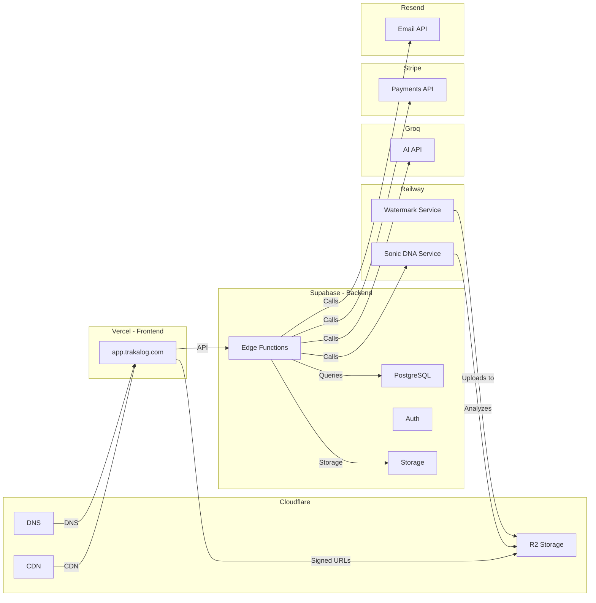
```mermaid
graph LR
    subgraph Vercel["Vercel - Frontend"]
        A[app.trakalog.com]
    end
    
    subgraph Supabase["Supabase - Backend"]
        B[PostgreSQL]
        C[Auth]
        D[Storage]
        E[Edge Functions]
    end
    
    subgraph Cloudflare["Cloudflare"]
        F[R2 Storage]
        G[CDN]
        H[DNS]
    end
    
    subgraph Railway["Railway"]
        I[Sonic DNA Service]
        J[Watermark Service]
    end
    
    subgraph Groq["Groq"]
        K[AI API]
    end
    
    subgraph Stripe["Stripe"]
        L[Payments API]
    end
    
    subgraph Resend["Resend"]
        M[Email API]
    end
    
    A -->|API| E
    A -->|Signed URLs| F
    E -->|Queries| B
    E -->|Storage| D
    E -->|Calls| I
    E -->|Calls| K
    E -->|Calls| L
    E -->|Calls| M
    I -->|Analyzes| F
    J -->|Uploads to| F
    G -->|CDN| A
    H -->|DNS| A
```

### 6.2 Scaling Characteristics

| Service | Scaling | Auto-scaling | Notes |
|---------|---------|--------------|-------|
| Frontend (Vercel) | Horizontal | ✅ Yes | Automatic |
| Edge Functions | Horizontal | ✅ Yes | Supabase managed |
| PostgreSQL | Vertical | ✅ Yes | Supabase managed |
| R2 Storage | Horizontal | ✅ Yes | Cloudflare managed |
| Railway Services | Container | ⚠️ Manual | Container scaling |
| Groq | N/A | ✅ Yes | Managed API |
| Stripe | N/A | ✅ Yes | Managed API |
| Resend | N/A | ✅ Yes | Managed API |

### 6.3 Monitoring and Observability

**Key metrics to monitor:**

| Metric | Service | Threshold |
|--------|---------|-----------|
| API latency | All | >1s warning, >5s error |
| Error rate | All | >1% error |
| Queue depth | Watermark | >10 jobs warning |
| Job duration | Watermark | >120s warning |
| LLM context usage | Groq | >80% warning |
| R2 request rate | R2 | >100/min warning |
| Webhook failures | Stripe | Any error |

**Logging strategy:**
- All service calls logged with duration
- Errors logged with full context (never API keys)
- Rate limit hits logged for debugging
- Watermark cache hits/misses logged for observability

### 6.4 Cost Optimization

| Service | Cost Driver | Optimization |
|---------|-------------|--------------|
| R2 Storage | Storage + egress | Signed URLs, no proxy |
| Groq | Token usage | Context window management |
| Stripe | Transaction fees | Direct integration |
| Resend | Email volume | Batching where possible |
| Railway | Container usage | Efficient services |

**Groq cost considerations:**
- Smart A&R: ~1,000-10,000 tokens per request (catalog size dependent)
- Transcription: ~0.01 per track
- Context window limit: 128,000 tokens

### 6.5 Failure Modes and Recovery

| Service | Failure Mode | Impact | Recovery |
|---------|--------------|--------|----------|
| R2 | Outage | No uploads/downloads | Retry, fallback to Supabase |
| Groq | Outage | AI features unavailable | Retry, degrade gracefully |
| Stripe | Outage | Payments unavailable | Queue, retry |
| Resend | Outage | Emails delayed | Queue, retry |
| Railway | Outage | Analysis/watermarking unavailable | Queue, retry |
| Supabase | Outage | Full outage | Monitor, escalate |

**Circuit breaker pattern:**
- Rate limiting prevents cascade failures
- Timeout handling prevents hanging requests
- Retry with backoff for transient failures

---

## 7. Data Flow Diagrams

### 7.1 Track Upload and Analysis Flow

```mermaid
sequenceDiagram
    participant User
    participant React
    participant Supabase
    participant R2
    participant analyse-sonic-dna
    participant SonicDNA
    participant transcribe-lyrics
    participant Groq
    
    User->>React: Upload track
    React->>R2: Request upload URL
    R2-->>React: Signed URL
    React->>R2: Upload audio file
    React->>Supabase: Create track record
    Supabase-->>React: Track created
    
    React->>analyse-sonic-dna: Trigger analysis
    analyse-sonic-dna->>R2: Get signed URL
    R2-->>analyse-sonic-dna: Signed URL
    analyse-sonic-dna->>SonicDNA: POST /analyze
    SonicDNA->>R2: Download audio
    R2-->>SonicDNA: Audio file
    SonicDNA->>SonicDNA: Run analysis
    SonicDNA-->>analyse-sonic-dna: Results
    analyse-sonic-dna->>Supabase: Update track.sonic_dna
    
    React->>transcribe-lyrics: Trigger transcription
    transcribe-lyrics->>R2: Get signed URL
    R2-->>transcribe-lyrics: Signed URL
    transcribe-lyrics->>R2: Download audio
    transcribe-lyrics->>Groq: POST /transcriptions
    Groq-->>transcribe-lyrics: Transcription
    transcribe-lyrics->>Supabase: Update track.lyrics
```

### 7.2 Shared Link Access Flow

```mermaid
sequenceDiagram
    participant Recipient
    participant React
    participant get-watermarked-audio
    participant R2
    participant DB
    participant WatermarkService
    
    Recipient->>React: Open shared link
    React->>DB: Get shared link config
    DB-->>React: Link configuration
    React->>User: Show gate screen
    Recipient->>React: Enter details
    React->>get-watermarked-audio: Request audio
    get-watermarked-audio->>R2: Check cache
    
    alt Cache hit
        R2-->>get-watermarked-audio: File exists
        get-watermarked-audio->>R2: Get signed URL
        R2-->>get-watermarked-audio: Signed URL
        get-watermarked-audio-->>React: { status: "done", url }
    else Cache miss
        get-watermarked-audio->>DB: Store payload mapping
        get-watermarked-audio->>R2: Get source signed URL
        get-watermarked-audio->>DB: Enqueue job
        get-watermarked-audio->>WatermarkService: POST /wake
        get-watermarked-audio-->>React: { status: "processing" }
        
        WatermarkService->>DB: Poll for jobs
        WatermarkService->>R2: Download source
        WatermarkService->>WatermarkService: Watermark + encode
        WatermarkService->>R2: Upload watermarked file
        
        Recipient->>React: Retry
        React->>get-watermarked-audio: Check status
        get-watermarked-audio->>R2: Check cache
        R2-->>get-watermarked-audio: File exists
        get-watermarked-audio-->>React: { status: "done", url }
    end
    
    React->>Recipient: Stream audio
```

### 7.3 Leak Tracing Flow

```mermaid
sequenceDiagram
    participant Admin
    participant React
    participant trace-leak
    participant WatermarkService
    participant DB
    
    Admin->>React: Upload leaked audio
    React->>trace-leak: POST /trace-leak
    trace-leak->>WatermarkService: POST /decode
    WatermarkService-->>trace-leak: { payload, confidence }
    
    alt Match found
        trace-leak->>DB: Lookup payload
        DB-->>trace-leak: Payload record
        trace-leak->>DB: Verify workspace
        trace-leak->>DB: Get visitor details
        trace-leak->>DB: Resolve IP
        trace-leak->>DB: Log trace
        trace-leak-->>React: { match: true, visitor_email, leaker_ip, trace_id }
    else No match
        trace-leak->>DB: Log trace (no match)
        trace-leak-->>React: { match: false }
    end
    
    React->>Admin: Show results
```

---

## 8. Configuration Reference

### 8.1 Environment Variables by Service

**Supabase Edge Functions (all functions):**
```bash
# Supabase
SUPABASE_URL=https://<project>.supabase.co
SUPABASE_SERVICE_ROLE_KEY=<service-role-key>

# R2 (when STORAGE_PROVIDER=r2)
STORAGE_PROVIDER=r2
R2_ENDPOINT=https://<account>.r2.cloudflarestorage.com
R2_ACCESS_KEY_ID=<32-char-hex>
R2_SECRET_ACCESS_KEY=<40-char-secret>
R2_BUCKET_TRACKS=<bucket-name>
R2_BUCKET_STEMS=<bucket-name>
R2_BUCKET_WATERMARKED=<bucket-name>
R2_BUCKET_COVERS=<bucket-name>
R2_BUCKET_DOCUMENTS=<bucket-name>

# Groq
GROQ_API_KEY=<groq-api-key>

# Stripe
STRIPE_SECRET_KEY=<stripe-secret-key>
STRIPE_WEBHOOK_SECRET=<webhook-signing-secret>

# Resend
RESEND_API_KEY=<resend-api-key>

# Railway Sonic DNA
SONIC_DNA_API_URL=https://<service>.up.railway.app
SONIC_DNA_API_KEY=<internal-api-key>

# Watermark Service
WATERMARK_API_URL=https://<service>.up.railway.app
WATERMARK_API_KEY=<internal-api-key>

# Feature flags
PITCH_ENABLED=false
APPROVALS_ENABLED=false
SMART_AR_ENABLED=true
WATERMARKING_ENABLED=true
```

**Railway Sonic DNA Service:**
```bash
SONIC_DNA_API_KEY=<internal-api-key>
PORT=8081
```

**Railway Watermark Service:**
```bash
WATERMARK_API_KEY=<internal-api-key>
PORT=3000
ALLOWED_ORIGINS=https://app.trakalog.com
WATERMARK_ALLOWED_HOSTS=<comma-separated-r2-hosts>

# R2
R2_ENDPOINT=https://<account>.r2.cloudflarestorage.com
R2_ACCESS_KEY_ID=<32-char-hex>
R2_SECRET_ACCESS_KEY=<40-char-secret>
R2_BUCKET_WATERMARKED=<bucket-name>
```

### 8.2 Feature Flags

**Location:** `/src/config/features.ts`

```typescript
export const FEATURES = {
  // Module toggles
  PITCH_ENABLED: false,
  APPROVALS_ENABLED: false,
  
  // AI features
  SMART_AR_ENABLED: true,
  WATERMARKING_ENABLED: true,
  
  // Billing tiers
  FREE_PLAN: 'free',
  STARTER_PLAN: 'starter',
  PRO_PLAN: 'pro',
  BUSINESS_PLAN: 'business',
  ENTERPRISE_PLAN: 'enterprise',
};
```

---

## 9. Troubleshooting Guide

### 9.1 Common Issues and Solutions

| Issue | Likely Cause | Solution |
|-------|--------------|----------|
| R2 upload fails | Invalid credentials | Verify R2_ACCESS_KEY_ID and R2_SECRET_ACCESS_KEY |
| R2 upload fails | Bucket doesn't exist | Create R2 bucket and set env vars |
| R2 signature invalid | Clock skew | Ensure server time is synchronized |
| Groq API errors | Rate limit | Check Groq dashboard, adjust rate limiting |
| Groq API errors | Invalid API key | Verify GROQ_API_KEY |
| Stripe webhook fails | Signature mismatch | Verify STRIPE_WEBHOOK_SECRET |
| Stripe webhook fails | Replay | Check stripe_webhook_events table |
| Watermark encode timeout | Large file | Increase timeouts or compress first |
| Watermark decode fails | Low confidence | Try different audio, check for processing |
| Sonic DNA timeout | Service down | Check Railway logs, restart service |
| Email not sent | Rate limit | Check Resend dashboard |

### 9.2 Debugging Logs

**Where to find logs:**

| Service | Log Location |
|---------|--------------|
| Edge Functions | Supabase Dashboard → Functions → Logs |
| Railway Services | Railway Dashboard → Deployments → Logs |
| Frontend | Browser console, Vercel logs |
| PostgreSQL | Supabase Dashboard → Database → Logs |

**Log levels:**
- `console.log` - General information
- `console.warn` - Warning conditions
- `console.error` - Errors (never includes API keys)

### 9.3 Health Checks

**Endpoints:**

| Service | Health Check |
|---------|--------------|
| Sonic DNA | `GET /health` |
| Watermark | `GET /health` |
| Supabase | Built-in status |
| R2 | Cloudflare dashboard |
| Groq | API status page |
| Stripe | Status page |
| Resend | API status page |

---

## 10. Evolution and Roadmap

### 10.1 Current Limitations

| Limitation | Impact | Planned Solution |
|------------|--------|-----------------|
| Smart A&R context window | Fails at ~1,250 tracks | Pre-filter catalog before LLM |
| Watermark MP3 verification | Some MP3s lose watermark | Fallback to WAV, investigate encoding |
| R2 signed URL expiry | 5-minute limit | Implement refresh mechanism |
| Railway scaling | Manual configuration | Implement auto-scaling |
| Groq token usage | Cost tracking | Implement usage monitoring |

### 10.2 Planned Improvements

1. **Smart A&R Optimization**
   - Pre-filter catalog based on metadata before LLM
   - Implement vector search for semantic filtering
   - Add caching for frequent briefs

2. **Watermark Improvements**
   - Investigate MP3 encoding parameters for better watermark survival
   - Implement batch processing for multiple files
   - Add watermark to stems and packs

3. **R2 Integration**
   - Implement signed URL refresh for long operations
   - Add upload progress tracking
   - Implement lifecycle policies for old files

4. **Cost Optimization**
   - Implement Groq token usage tracking
   - Add rate-based pricing awareness
   - Implement cost alerts

5. **Reliability**
   - Add circuit breakers for external services
   - Implement fallback mechanisms
   - Add comprehensive monitoring

---

## 📝 Document Metadata

| Property | Value |
|----------|-------|
| **Created** | August 11, 2026 |
| **Version** | 1.0.0 |
| **Owner** | Ishan |
| **Status** | Draft |
| **Next Review** | September 11, 2026 |
| **Related Documents** | [02 - System Architecture](02-SYSTEM_ARCHITECTURE.md), [04 - Component Architecture](04-COMPONENT_ARCHITECTURE.md), [03 - Data Architecture](03-DATA_ARCHITECTURE.md) |

---

*This document provides comprehensive documentation of Trakalog's external service integrations. For implementation details of specific integrations, see the corresponding source code in the `/supabase/functions/` directory and service repositories.*
