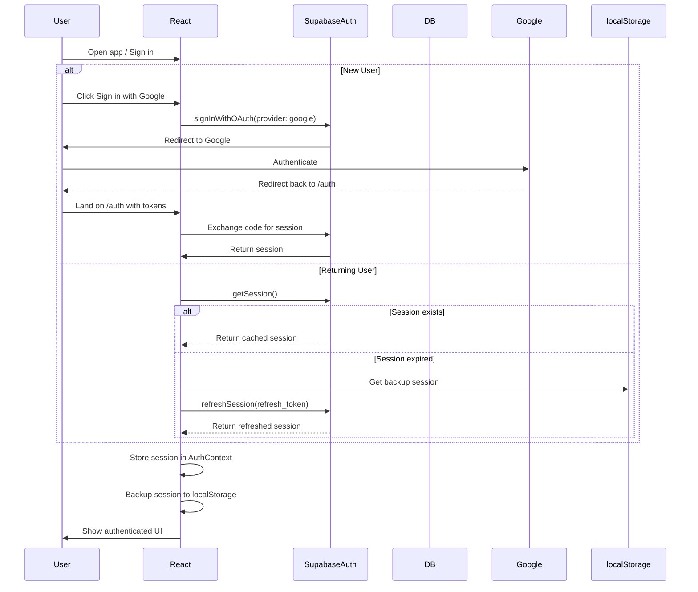
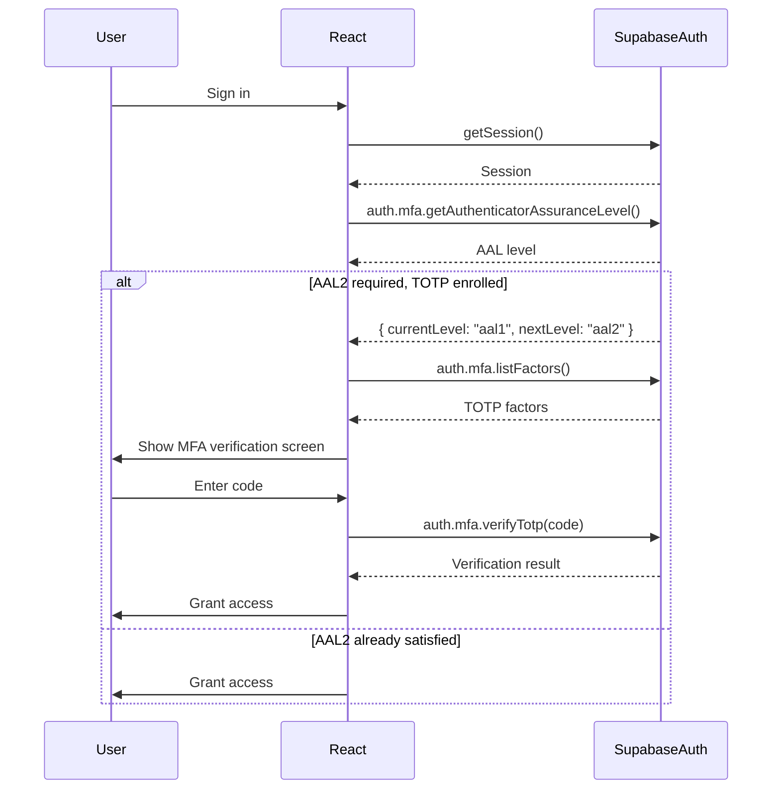

# 06 - Security Architecture

> **Status:** Draft — not audited during the September 2026 documentation remediation; its claims have not been verified against the code
> **Version:** 1.0.0  
> **Created:** August 11, 2026  
> **Last Updated:** August 11, 2026  
> **Owner:** Ishan  
> **Related:** [02 - System Architecture](02-SYSTEM_ARCHITECTURE.md), [05 - Service Architecture](05-SERVICE_ARCHITECTURE.md), [RLS_PHASE1_GUIDE.md](../_archive/rls-phases/RLS_PHASE1_GUIDE.md)

---

## Abstract

This document provides a comprehensive overview of Trakalog's security architecture, detailing the authentication, authorization, data protection, and audit mechanisms that ensure the platform's security posture. It serves as the primary reference for understanding how Trakalog secures user data, enforces access controls, and maintains compliance with security best practices.

---

## 1. Security Overview

Trakalog implements a **multi-layered security model** with defense-in-depth principles. Security is enforced at the network, application, and data layers.

### 1.1 Security Layers

```mermaid
layerDiagram
    direction TB
    layer "Network Layer" as NET {
        component "HTTPS/TLS (Cloudflare)"
        component "CORS Policies"
        component "Rate Limiting"
        component "DNS Security (Cloudflare)"
    }
    layer "Application Layer" as APP {
        component "JWT Authentication (Supabase Auth)"
        component "Session Management"
        component "Input Validation"
        component "CSRF Protection"
        component "SSRF Protection"
    }
    layer "Database Layer" as DB {
        component "Row-Level Security (RLS)"
        component "SQL Injection Prevention"
        component "Audit Logging"
    }
    layer "Storage Layer" as STORAGE {
        component "Signed URLs (R2/Supabase)"
        component "Encryption at Rest"
        component "Access Control Policies"
    }
    layer "Service Layer" as SERVICES {
        component "API Key Management"
        component "Service-to-Service Auth"
        component "Webhook Signature Verification"
    }
```

### 1.2 Security Principles

| Principle | Implementation |
|-----------|----------------|
| **Least Privilege** | RLS policies, role-based access levels |
| **Defense in Depth** | Multiple security layers (network, app, DB, storage) |
| **Fail Secure** | Default deny, explicit allow |
| **Separation of Concerns** | Auth vs authorization, client vs server validation |
| **Auditability** | Comprehensive logging, non-repudiation |
| **Secure by Default** | HTTPS everywhere, RLS enabled on all tables |

### 1.3 Threat Model

**In Scope:**
- Unauthorized data access (cross-tenant, cross-workspace)
- Data leakage through shared links
- Privilege escalation
- Session hijacking
- API abuse and rate limiting
- Injection attacks (SQL, XSS)
- SSRF attacks

**Out of Scope:**
- Physical security (handled by Cloudflare, Supabase, Railway)
- Infrastructure security (handled by providers)
- Client-side malware

---

## 2. Authentication Architecture

### 2.1 Authentication Provider

**Provider:** Supabase Auth (GoTrue)

**Features:**
- JWT-based authentication
- OAuth providers (Google)
- Email/password authentication
- Session management
- Token refresh
- Multi-factor authentication (MFA/TOTP)

### 2.2 Authentication Flow



### 2.3 Session Management

**Location:** `/src/contexts/AuthContext.tsx`

#### 2.3.1 Session Backup Mechanism

A critical feature given Supabase's session persistence challenges:

```typescript
// Custom storage that backs up auth tokens to localStorage
const customStorage = {
  getItem: (key: string) => {
    const value = localStorage.getItem(key);
    if (value) return value;
    // Fallback to backup for auth key
    if (key.startsWith('sb-') && key.endsWith('-auth-token')) {
      return localStorage.getItem('trakalog_session_backup');
    }
    return null;
  },
  setItem: (key: string, value: string) => {
    localStorage.setItem(key, value);
    if (key.startsWith('sb-') && key.endsWith('-auth-token') && value) {
      localStorage.setItem('trakalog_session_backup', value);
    }
  },
  removeItem: (key: string) => {
    localStorage.removeItem(key);
  },
};
```

**Session Lifecycle:**
1. **Initial Session:** Loaded from Supabase on app mount
2. **Backup:** Stored in `trakalog_session_backup` on any valid session
3. **Restore:** Attempted from backup if primary session fails
4. **Invalidation:** Cleared on explicit sign-out or whitelist failure

#### 2.3.2 Session Watchdog

Prevents infinite loading states:

```typescript
// Watchdog: session restore can stall (e.g. an invalid/expired refresh token
// that never settles) and leave `loading` stuck true forever
const authWatchdog = setTimeout(() => setLoading(false), 8000);
```

#### 2.3.3 MFA Support

**Status:** Enabled for premium users

**Flow:**


### 2.4 Google OAuth Configuration

```typescript
// From AUTH_PATTERNS.md
- queryParams: { prompt: "select_account" } → force sélecteur de compte
- redirectTo: window.location.origin + "/auth" → redirect post-OAuth
- Client ID: 186139495931-vf74ntbatgtig8g10o0b8ee0vi0ug4fk.apps.googleusercontent.com
- Mode production activé
```

### 2.5 Whitelist System

**Purpose:** Control access to private beta

**Implementation:**
```typescript
// In AuthContext.tsx
const checkWhitelist = async (sess: Session | null) => {
  if (!sess?.user?.email) return true;
  const allowed = await isEmailWhitelisted(sess.user.email);
  // Only an EXPLICIT server refusal (false) signs the user out
  if (allowed === false) {
    await supabase.auth.signOut();
    toast.error("Trakalog is currently in private beta. Request access at hello@trakalog.com");
    setSession(null);
    setLoading(false);
    return false;
  }
  return true;
};
```

**Whitelist Check Timing:**
- Runs on `SIGNED_IN` event
- Runs on `INITIAL_SESSION` event
- NOT run on `TOKEN_REFRESHED` (to avoid race conditions)

### 2.6 localStorage Keys

| Key | Type | Purpose |
|-----|------|---------|
| `trakalog_was_auth` | boolean string | User has had a valid session |
| `trakalog_session_backup` | JSON | Backup of last Supabase session |
| `trakalog_active_workspace` | uuid | Last active workspace ID |
| `trakalog_just_logged_in` | boolean string | Flag to open personal workspace post-login |
| `trakalog_auto_save` | slug string | Shared link to auto-save after signup |

---

## 3. Authorization Architecture

### 3.1 Access Control Model

Trakalog uses a **hybrid authorization model**:

```mermaid
flowchart TD
    subgraph Frontend
        A[RoleContext] --> B[AccessLevel: viewer/pitcher/editor/admin]
        B --> C[Permissions Matrix]
        C --> D[UI Disable/Enable]
    end
    
    subgraph Backend
        E[RLS Policies] --> F[PostgreSQL Row-Level Security]
        F --> G[Database-Level Enforcement]
    end
    
    subgraph Edge Functions
        H[Service-Role Client] --> I[Direct DB Queries]
        I --> J[assertWorkspaceMember()]
    end
    
    Frontend -->|API Calls| Backend
    Frontend -->|API Calls| Edge Functions
```

### 3.2 Access Levels

**Definition:** `/src/contexts/RoleContext.tsx`

| Level | Rank | Capabilities |
|-------|------|--------------|
| `viewer` | 1 | Read-only access, play tracks |
| `pitcher` | 2 | Upload own tracks, create playlists, send pitches, create shared links |
| `editor` | 3 | Upload any tracks, edit any tracks, manage stems, manage documents |
| `admin` | 4 | Full access including delete tracks, manage team, edit settings |

**Permission Matrix:**

| Capability | Viewer | Pitcher | Editor | Admin |
|------------|--------|---------|--------|-------|
| View tracks / play | ✅ | ✅ | ✅ | ✅ |
| Upload tracks | ❌ | ✅ | ✅ | ✅ |
| Edit tracks (metadata, lyrics, stems) | ❌ | own only | ✅ all | ✅ all |
| Delete tracks | ❌ | ❌ | ❌ | ✅ |
| Create / edit playlists | ❌ | ✅ | ✅ | ✅ |
| Send pitches | ❌ | ✅ | ✅ | ✅ |
| Create shared links | ❌ | ✅ | ✅ | ✅ |
| Manage splits | ❌ | ❌ | ❌ | ✅ |
| Invite / manage team | ❌ | ❌ | ❌ | ✅ |
| Edit branding | ❌ | ❌ | ❌ | ✅ |
| Access settings | ❌ | ❌ | ❌ | ✅ |

### 3.3 Role Context Implementation

**Location:** `/src/contexts/RoleContext.tsx`

```typescript
export type AccessLevel = "viewer" | "pitcher" | "editor" | "admin";

const accessPermissions: Record<AccessLevel, Permissions> = {
  viewer: { canViewTracks: true, canUploadTracks: false, ... },
  pitcher: { canViewTracks: true, canUploadTracks: true, canEditOwnTracks: true, ... },
  editor: { canViewTracks: true, canUploadTracks: true, canEditTracks: true, ... },
  admin: { canViewTracks: true, canUploadTracks: true, canEditTracks: true, canDeleteTracks: true, ... },
};

// Fetch access_level from workspace_members
useEffect(() => {
  if (!user || !activeWorkspace) return;
  
  // Workspace owner is always admin
  if (activeWorkspace.owner_id === user.id) {
    setAccessLevel("admin");
    return;
  }
  
  supabase
    .from("workspace_members")
    .select("access_level, professional_title")
    .eq("user_id", user.id)
    .eq("workspace_id", activeWorkspace.id)
    .maybeSingle()
    .then((res) => {
      if (res.data) {
        setAccessLevel(res.data.access_level as AccessLevel);
      } else {
        setAccessLevel("viewer");
      }
    });
}, [user, activeWorkspace]);
```

### 3.4 Workspace Context

**Location:** `/src/contexts/WorkspaceContext.tsx`

**Key Functions:**
- Auto-creates personal workspace for new users
- Fetches all user workspaces via RPC (bypasses RLS)
- Manages active workspace switching
- Provides workspace settings

**Workspace Fetching:**
```typescript
// Use RPC to bypass RLS issues with session
const { data: wsData, error: wsError } = await supabase.rpc("get_user_workspaces", {
  _user_id: user.id,
});
```

### 3.5 Legacy Role System (Deprecated)

**Status:** Legacy, being migrated away from

The original system used `user_roles` table with roles like:
- Admin, Manager, A&R, Assistant, Producer, Songwriter, Musician, Mix Engineer, Mastering Engineer, Publisher, Viewer

**Migration:**
- New system uses `workspace_members.access_level` (viewer, pitcher, editor, admin)
- RLS Phase 1-3 migrated policies from `user_roles` to `access_level`
- Legacy roles remain for backward compatibility in some UI elements

**Legacy Role Mapping:**
```typescript
const legacyRoleMap: Record<AccessLevel, AppRole> = {
  admin: "Admin",
  editor: "Manager",
  pitcher: "Publisher",
  viewer: "Viewer",
};
```

---

## 4. Row-Level Security (RLS)

### 4.1 RLS Overview

**Status:** Enabled on all tables, migrated from legacy `user_roles` to `access_level`

**Phases:**
1. **Phase 1:** Migrated 11 core tables (workspaces, workspace_members, tracks, stems, contacts, pitches, playlists, playlist_tracks, shared_links, approvals, track_documents)
2. **Phase 2:** Additional tables and edge cases
3. **Phase 3:** Final cleanup and validation

### 4.2 RLS Helper Function

**SQL Helper:** `has_workspace_access_level(_user_id uuid, _workspace_id uuid, _min_level text)`

**Purpose:** Centralized access level checking for RLS policies

**Implementation:**
```sql
CREATE OR REPLACE FUNCTION public.has_workspace_access_level(
  _user_id uuid,
  _workspace_id uuid,
  _min_level text
) RETURNS boolean
SECURITY DEFINER
LANGUAGE sql
AS $$
  -- Workspace owner is always admin
  SELECT EXISTS (
    SELECT 1 FROM workspaces 
    WHERE id = _workspace_id AND owner_id = _user_id
  )
  OR EXISTS (
    SELECT 1 FROM workspace_members wm
    JOIN (
      VALUES ('viewer'::text, 1),
             ('pitcher'::text, 2),
             ('editor'::text, 3),
             ('admin'::text, 4)
    ) levels(name, rank)
    ON wm.access_level = levels.name
    WHERE wm.user_id = _user_id
      AND wm.workspace_id = _workspace_id
      AND levels.rank >= (
        SELECT rank FROM (
          VALUES ('viewer'::text, 1),
                 ('pitcher'::text, 2),
                 ('editor'::text, 3),
                 ('admin'::text, 4)
        ) levels(name, rank)
        WHERE name = _min_level
      )
  );
$$;
```

**Edge Function Equivalent:** `/supabase/functions/_shared/auth.ts`

```typescript
const ACCESS_LEVELS: Record<string, number> = { viewer: 1, pitcher: 2, editor: 3, admin: 4 };

export async function assertWorkspaceMember(
  admin: SupabaseClient,
  userId: string,
  workspaceId: string,
  minLevel: string = "viewer",
): Promise<boolean> {
  const min = ACCESS_LEVELS[minLevel] ?? 1;
  
  // Workspace owner is always effectively admin
  const { data: ws } = await admin.from("workspaces").select("owner_id").eq("id", workspaceId).maybeSingle();
  if (ws && ws.owner_id === userId) return true;
  
  const { data: member } = await admin
    .from("workspace_members")
    .select("access_level")
    .eq("workspace_id", workspaceId)
    .eq("user_id", userId)
    .maybeSingle();
  
  const level = member?.access_level ? (ACCESS_LEVELS[member.access_level as string] ?? 0) : 0;
  if (level >= min) return true;
  
  throw new HttpError(403, "Forbidden");
}
```

### 4.3 RLS Policy Structure

**Standard Policy Pattern:**
```sql
-- SELECT: Allow members with minimum access level
CREATE POLICY "tracks_select_members" ON public.tracks
  FOR SELECT
  USING (
    EXISTS (
      SELECT 1 FROM workspace_members wm
      WHERE wm.workspace_id = tracks.workspace_id
        AND wm.user_id = auth.uid()
    )
    OR EXISTS (
      SELECT 1 FROM workspaces
      WHERE id = tracks.workspace_id
        AND owner_id = auth.uid()
    )
  );

-- INSERT: Allow members with minimum access level
CREATE POLICY "tracks_insert_pitcher" ON public.tracks
  FOR INSERT
  WITH CHECK (
    public.has_workspace_access_level(auth.uid(), workspace_id, 'pitcher')
    AND uploaded_by = auth.uid()
  );

-- UPDATE: Allow members with minimum access level
CREATE POLICY "tracks_update_editor_all" ON public.tracks
  FOR UPDATE
  USING (
    public.has_workspace_access_level(auth.uid(), workspace_id, 'editor')
  );

-- DELETE: Allow admins only
CREATE POLICY "tracks_delete_admin" ON public.tracks
  FOR DELETE
  USING (
    public.has_workspace_access_level(auth.uid(), workspace_id, 'admin')
  );
```

### 4.4 Table-Specific RLS Policies

#### 4.4.1 Workspaces

| Policy | Operation | Condition |
|--------|-----------|-----------|
| `workspaces_select_members` | SELECT | User is workspace member OR owner |
| `workspaces_insert_authenticated` | INSERT | Always (owner_id set to auth.uid()) |
| `workspaces_update_admin` | UPDATE | User is owner or admin |
| `workspaces_delete_owner` | DELETE | User is owner |

#### 4.4.2 Workspace Members

| Policy | Operation | Condition |
|--------|-----------|-----------|
| `workspace_members_select_members` | SELECT | User is workspace member |
| `workspace_members_insert_admin` | INSERT | User is admin (via RPC) |
| `workspace_members_update_admin` | UPDATE | User is admin |
| `workspace_members_delete_self` | DELETE | User is self OR user is admin |

#### 4.4.3 Tracks

| Policy | Operation | Condition |
|--------|-----------|-----------|
| `tracks_select_members` | SELECT | User is workspace member |
| `tracks_insert_pitcher` | INSERT | User has access_level >= pitcher AND uploaded_by = auth.uid() |
| `tracks_update_editor_all` | UPDATE | User has access_level >= editor |
| `tracks_update_pitcher_own` | UPDATE | User has access_level >= pitcher AND uploaded_by = auth.uid() |
| `tracks_delete_admin` | DELETE | User has access_level = admin |
| `anon_read_tracks_via_shared_link` | SELECT | Anonymous access via shared link token |

#### 4.4.4 Track Documents (P0 Critical)

**Status:** Hardened in RLS Phase 1

| Policy | Operation | Condition |
|--------|-----------|-----------|
| `track_documents_select_members` | SELECT | User is workspace member |
| `track_documents_insert_editor` | INSERT | User has access_level >= editor |
| `track_documents_update_editor` | UPDATE | User has access_level >= editor |
| `track_documents_delete_uploader_or_admin` | DELETE | uploaded_by = auth.uid() OR user is admin |

**Storage Policies:**
```sql
-- Bucket: documents
CREATE POLICY "Authenticated users can upload documents"
  ON storage.objects FOR INSERT
  TO authenticated
  WITH CHECK (
    bucket_id = 'documents'
    AND public.is_workspace_member(auth.uid(), (storage_path(#)::text ~ '^[^/]+/(.+)')::text)
  );

CREATE POLICY "Authenticated users can read documents"
  ON storage.objects FOR SELECT
  TO authenticated
  USING (
    bucket_id = 'documents'
    AND public.is_workspace_member(auth.uid(), (storage_path(#)::text ~ '^[^/]+/(.+)')::text)
  );

CREATE POLICY "Authenticated users can delete own documents"
  ON storage.objects FOR DELETE
  TO authenticated
  USING (
    bucket_id = 'documents'
    AND (metadata->>'uploaded_by')::uuid = auth.uid()
    AND public.is_workspace_member(auth.uid(), (storage_path(#)::text ~ '^[^/]+/(.+)')::text)
  );
```

#### 4.4.5 Playlists

| Policy | Operation | Condition |
|--------|-----------|-----------|
| `playlists_select_members` | SELECT | User is workspace member |
| `playlists_insert_pitcher` | INSERT | User has access_level >= pitcher AND created_by = auth.uid() |
| `playlists_update_pitcher` | UPDATE | User has access_level >= pitcher |
| `playlists_delete_admin` | DELETE | User is admin |

#### 4.4.6 Stems

| Policy | Operation | Condition |
|--------|-----------|-----------|
| `stems_select_members` | SELECT | User is workspace member |
| `stems_insert_pitcher` | INSERT | User has access_level >= pitcher |
| `stems_update_editor` | UPDATE | User has access_level >= editor |
| `stems_delete_admin` | DELETE | User is admin |

#### 4.4.7 Shared Links

| Policy | Operation | Condition |
|--------|-----------|-----------|
| `shared_links_select_members` | SELECT | User is workspace member |
| `shared_links_insert_pitcher` | INSERT | User has access_level >= pitcher AND created_by = auth.uid() |
| `shared_links_update_pitcher` | UPDATE | User has access_level >= pitcher |
| `shared_links_delete_admin` | DELETE | User is admin |
| `shared_links_delete_pitcher_own` | DELETE | created_by = auth.uid() AND user is workspace member |

#### 4.4.8 Anon Access Policies

**Purpose:** Allow public access to shared content

```sql
-- Tracks via shared links
CREATE POLICY "anon_read_tracks_via_shared_link" ON public.tracks
  FOR SELECT
  TO anon
  USING (
    EXISTS (
      SELECT 1 FROM shared_links sl
      JOIN shared_link_assets sla ON sla.link_id = sl.id
      WHERE sl.id = (current_setting('app.current_shared_link_id')::uuid)
        AND sla.track_id = tracks.id
        AND sl.status = 'active'
    )
  );

-- Playlists via shared links
CREATE POLICY "anon_read_playlists_via_shared_link" ON public.playlists
  FOR SELECT
  TO anon
  USING (
    EXISTS (
      SELECT 1 FROM shared_links sl
      WHERE sl.id = (current_setting('app.current_shared_link_id')::uuid)
        AND (
          sl.playlist_id = playlists.id
          OR sl.track_id IS NOT NULL AND EXISTS (
            SELECT 1 FROM playlist_tracks pt
            WHERE pt.playlist_id = playlists.id
              AND pt.track_id = sl.track_id
          )
        )
        AND sl.status = 'active'
    )
  );

-- Track comments (anon write for shared link recipients)
CREATE POLICY "anon_insert_track_comments" ON public.track_comments
  FOR INSERT
  TO anon
  WITH CHECK (
    EXISTS (
      SELECT 1 FROM shared_links sl
      WHERE sl.id = (current_setting('app.current_shared_link_id')::uuid)
        AND sl.allow_comments = true
        AND track_id = NEW.track_id
    )
  );
```

### 4.5 RLS Audit History

#### 4.5.1 RLS Audit 2026-05-10

**Findings:**

**P0 - BLOCKING Issues:**
1. **Complete drift between RLS and frontend** - RLS used `user_roles` table while frontend used `workspace_members.access_level`
2. **`track_documents` had no access_level check** - Any workspace member could INSERT/UPDATE
3. **Storage bucket `documents` was fully open** - Any authenticated user could read/write/delete any document
4. **`notifications` INSERT was too permissive** - No check on target user_id
5. **Public pages with anonymous writes** - Missing anon write policies for track_comments, signature_requests, studio_submissions

**P1 - TO FIX:**
6. `audit_logs` SELECT without workspace filtering
7. Non-versioned tables (catalog_shares, invitations, link_events)
8. Missing `has_workspace_access_level` helper
9. `handle_new_user` trigger inserts into `user_roles` but not `workspace_members`

#### 4.5.2 RLS Phase 1 Migration

**Scope:** 11 tables + hardening for track_documents and notifications

**Helper Function:** `has_workspace_access_level(_user_id, _workspace_id, _min_level)`

**Tables Migrated:**
- workspaces
- workspace_members
- tracks
- stems
- contacts
- pitches
- playlists
- playlist_tracks
- shared_links
- approvals
- track_documents
- notifications

#### 4.5.3 RLS Phase 2 & 3

**Phase 2:** Additional tables and edge cases
**Phase 3:** Final cleanup and validation

**Verification:**
```sql
-- Verify no policies use legacy has_workspace_role
SELECT tablename, policyname
FROM pg_policies
WHERE schemaname = 'public'
  AND (qual ILIKE '%has_workspace_role%'
       OR qual ILIKE '%has_any_workspace_role%'
       OR with_check ILIKE '%has_workspace_role%'
       OR with_check ILIKE '%has_any_workspace_role%');
-- Expected: 0 rows

-- Verify helper exists and is SECURITY DEFINER
SELECT proname, prosecdef
FROM pg_proc
WHERE pronamespace = 'public'::regnamespace
  AND proname IN ('has_workspace_access_level', 'create_notification');
-- Expected: 2 rows, prosecdef = true for both
```

---

## 5. Data Protection

### 5.1 Encryption

#### 5.1.1 At Rest

| Data | Storage | Encryption |
|------|---------|------------|
| Database | Supabase PostgreSQL | Encrypted at rest (provider-managed) |
| R2 Storage | Cloudflare R2 | Encrypted at rest (provider-managed) |
| Supabase Storage | Supabase | Encrypted at rest (provider-managed) |

#### 5.1.2 In Transit

| Connection | Protocol | Encryption |
|------------|----------|------------|
| Frontend ↔ Vercel | HTTPS | TLS 1.3 |
| Frontend ↔ Supabase | HTTPS | TLS 1.3 |
| Frontend ↔ R2 | HTTPS | TLS 1.3 |
| Edge Functions ↔ External APIs | HTTPS | TLS 1.3 |
| Webhooks | HTTPS | TLS 1.3 |

### 5.2 Signed URLs

**Purpose:** Provide time-limited access to private files without exposing long-lived credentials

**Implementation:** AWS Signature V4 for R2, Supabase signed URLs for Supabase Storage

**Default Expiry:**
- Read URLs: 300 seconds (5 minutes)
- Upload URLs: 600 seconds (10 minutes)

**Security Benefits:**
- No long-lived credentials exposed to client
- Time-limited access reduces attack window
- Can be revoked by changing bucket keys

### 5.3 Sensitive Data Classification

| Data Type | Classification | Protection |
|-----------|---------------|------------|
| User credentials | Confidential | Hashed, never logged |
| API keys | Confidential | Environment variables, never in code |
| Audio files | Internal | Signed URLs, RLS-protected |
| Documents (contracts, split sheets) | Confidential | Signed URLs, RLS-protected, access_level >= editor |
| Payment data | Confidential | Stripe PCI-DSS compliant, never stored in Trakalog DB |
| Personal data (email, name) | Internal | RLS-protected, GDPR-compliant |
| Workspace metadata | Internal | RLS-protected |

### 5.4 Data Retention

| Data Type | Retention Period | Deletion Mechanism |
|-----------|-----------------|-------------------|
| Audit logs | 1 year | Automatic cleanup RPC |
| User sessions | Until revoked | Token expiration, explicit logout |
| Track data | Until deleted | Soft delete + hard delete |
| Shared link access logs | 1 year | Automatic cleanup |
| Watermark payloads | Indefinite | Manual cleanup |

---

## 6. Audit and Logging

### 6.1 Audit Log System

**Table:** `audit_logs`

**Schema:**
```sql
CREATE TABLE audit_logs (
  id uuid PRIMARY KEY DEFAULT gen_random_uuid(),
  user_id uuid NOT NULL REFERENCES auth.users(id) ON DELETE CASCADE,
  workspace_id uuid REFERENCES workspaces(id) ON DELETE SET NULL,
  action text NOT NULL, -- e.g., "user.login", "track.create", "track.delete"
  entity_type text, -- e.g., "track", "playlist", "workspace"
  entity_id uuid,
  metadata jsonb,
  ip_address inet,
  user_agent text,
  created_at timestamp with time zone DEFAULT NOW()
);
```

**Indexing:**
```sql
CREATE INDEX idx_audit_logs_user_id ON audit_logs(user_id);
CREATE INDEX idx_audit_logs_workspace_id ON audit_logs(workspace_id);
CREATE INDEX idx_audit_logs_created_at ON audit_logs(created_at);
CREATE INDEX idx_audit_logs_action ON audit_logs(action);
```

### 6.2 Audit Log RPC

**Function:** `write_audit_log`

```sql
CREATE OR REPLACE FUNCTION public.write_audit_log(
  _user_id uuid,
  _workspace_id uuid DEFAULT NULL,
  _action text,
  _entity_type text DEFAULT NULL,
  _entity_id uuid DEFAULT NULL,
  _metadata jsonb DEFAULT NULL,
  _ip_address inet DEFAULT NULL,
  _user_agent text DEFAULT NULL
) RETURNS void
SECURITY DEFINER
LANGUAGE sql
AS $$
BEGIN
  INSERT INTO audit_logs (
    user_id, workspace_id, action, entity_type, entity_id, metadata, ip_address, user_agent
  ) VALUES (
    _user_id, _workspace_id, _action, _entity_type, _entity_id, _metadata, _ip_address, _user_agent
  );
END;
$$;
```

### 6.3 Audit Log Usage

**Frontend:**
```typescript
// In AuthContext.tsx - Login
supabase.rpc("write_audit_log", {
  _user_id: newSession.user.id,
  _workspace_id: null,
  _action: "user.login",
  _metadata: JSON.stringify({ provider: newSession.user.app_metadata?.provider || "email" })
}).then(() => {}).catch(() => {});
```

**Edge Functions:**
```typescript
// In trace-leak Edge Function
await supabaseAdmin
  .from("leak_traces")
  .insert({
    workspace_id: workspaceId,
    user_id: user.id,
    file_name: fileName || audioFile.name || "unknown",
    hash_hex: hashHex || null,
    confidence: confidence || 0,
    match,
    visitor_email: visitorEmail,
    visitor_name: visitorName,
    link_id: linkId,
    raw_payload: rawPayload,
    leaker_ip: leakerIp,
    ip_source: ipSource,
  })
  .select("id");
```

### 6.4 Logging Strategy

**Log Levels:**
- `console.log` - General information, debug data (never PII)
- `console.warn` - Warning conditions, potential issues
- `console.error` - Errors, security events (never API keys)

**What Gets Logged:**
- API call durations and outcomes
- Authentication events (login, logout, token refresh)
- Rate limit hits
- RLS policy violations (with context, no PII)
- Service errors (with context, never API keys)
- Cache hits/misses (for observability)

**What Never Gets Logged:**
- API keys or secrets
- Full JWT tokens
- Passwords or credentials
- Full PII (email addresses in error messages are masked)
- Sensitive metadata

### 6.5 Security Event Logging

**Events Logged:**
- Failed authentication attempts
- Rate limit violations
- RLS policy denials
- Cross-tenant access attempts
- Watermark leak trace attempts
- Payment webhook failures
- SSRF detection events

---

## 7. Input Validation and Sanitization

### 7.1 Validation Layer

**Location:** `/supabase/functions/_shared/validation.ts`

**Key Functions:**
```typescript
// UUID validation
export function isValidUUID(value: string): boolean {
  return /^[0-9a-f]{8}-[0-9a-f]{4}-[0-9a-f]{4}-[0-9a-f]{4}-[0-9a-f]{12}$/i.test(value);
}

// Email validation
export function isValidEmail(value: string): boolean {
  return /^[^\s@]+@[^\s@]+\.[^\s@]+$/.test(value);
}

// String length bounds
export const LIMITS = {
  EMAIL: 254,
  NAME: 100,
  STORAGE_PATH: 500,
  TRACK_ID: 36,
  // ...
};

export function boundStr(value: string | undefined | null, maxLength: number): string | null {
  if (!value) return null;
  return value.slice(0, maxLength);
}

// JSON input validation with size limit
export async function readJsonBounded(req: Request, maxSize = 100000): Promise<unknown> {
  const contentLength = req.headers.get("content-length");
  if (contentLength && parseInt(contentLength) > maxSize) {
    throw new InputError("Payload too large");
  }
  return await req.json();
}
```

### 7.2 Frontend Validation

**React Hook Form:** Used for form validation with schema-based rules

**Zod Integration:** Schema validation for complex data structures

**Example:**
```typescript
const trackSchema = z.object({
  title: z.string().min(1).max(100),
  artist: z.string().max(100).nullable(),
  genre: z.string().max(50).nullable(),
  bpm: z.number().int().min(40).max(200).nullable(),
});
```

### 7.3 Storage Path Validation

**Purpose:** Prevent path traversal attacks

**Implementation:**
```typescript
// In get-watermarked-audio Edge Function
function isValidStoragePath(p: string): boolean {
  return !!p && !p.includes('..') && !p.includes('//') && !p.startsWith('/');
}

if ((originalPath && !isValidStoragePath(originalPath)) || 
    (previewPath && !isValidStoragePath(previewPath))) {
  return new Response(JSON.stringify({ error: "Invalid file path" }), {
    status: 400,
  });
}
```

### 7.4 SQL Injection Prevention

**Supabase Client:** Uses parameterized queries by default

**RPC Functions:** SECURITY DEFINER ensures proper permissions

**Never:** String concatenation in SQL queries

**Always:** Parameterized queries or RPC calls

---

## 8. Network Security

### 8.1 CORS Configuration

**Location:** `/supabase/functions/_shared/cors.ts`

**Implementation:**
```typescript
export const ALLOWED_ORIGINS = [
  "https://app.trakalog.com",
  "https://localhost:3000",
  "https://localhost:5173",
];

export function getCorsHeaders(req: Request): Record<string, string> {
  const origin = req.headers.get("origin") || "";
  if (ALLOWED_ORIGINS.includes(origin)) {
    return { "Access-Control-Allow-Origin": origin, "Vary": "Origin" };
  }
  return { "Vary": "Origin" };
}

export function handleCors(req: Request): Response | null {
  if (req.method === "OPTIONS") {
    return new Response("OK", {
      headers: {
        ...getCorsHeaders(req),
        "Access-Control-Allow-Methods": "GET, POST, PUT, DELETE, OPTIONS",
        "Access-Control-Allow-Headers": "Authorization, Content-Type",
        "Access-Control-Max-Age": "86400",
      },
    });
  }
  return null;
}
```

### 8.2 Rate Limiting

**Mechanism:** Supabase RPC function `check_rate_limit`

**Implementation:**
```sql
CREATE OR REPLACE FUNCTION public.check_rate_limit(
  _key text,
  _max_requests integer DEFAULT 10,
  _window_seconds integer DEFAULT 60
) RETURNS boolean
LANGUAGE sql
SECURITY DEFINER
AS $$
DECLARE
  count integer;
BEGIN
  -- Count requests in the current window
  SELECT COUNT(*) INTO count
  FROM rate_limit_tracker
  WHERE key = _key
    AND created_at > NOW() - (_window_seconds || ' seconds')::interval;
  
  -- If under limit, insert and return true
  IF count < _max_requests THEN
    INSERT INTO rate_limit_tracker (key, created_at)
    VALUES (_key, NOW());
    RETURN true;
  END IF;
  
  -- Over limit
  RETURN false;
END;
$$;
```

**Usage in Edge Functions:**
```typescript
const { data: rateLimitOk } = await supabase.rpc("check_rate_limit", {
  _key: "service:" + ip,
  _max_requests: 20,
  _window_seconds: 3600,
});

if (rateLimitOk === false) {
  return new Response(JSON.stringify({ error: "Rate limit exceeded" }), {
    status: 429,
  });
}
```

### 8.3 SSRF Protection

**Implementation:** `/services/watermark/index.js`

**Protection Layers:**

1. **HTTPS Only:**
```javascript
function validateSourceUrl(urlString) {
  let u;
  try {
    u = new URL(urlString);
  } catch (_) {
    throw new Error("malformed url");
  }
  if (u.protocol !== "https:") throw new Error("only https is allowed");
  return u;
}
```

2. **Host Allowlist:**
```javascript
const ALLOWED_HOSTS = new Set(
  (env("WATERMARK_ALLOWED_HOSTS") || "")
    .split(",")
    .map((h) => h.trim().toLowerCase())
    .filter(Boolean)
);

if (!ALLOWED_HOSTS.has(u.hostname.toLowerCase())) 
  throw new Error("host not in allowlist");
```

3. **IP Validation:**
```javascript
// Blocked IPv4 ranges
function isBlockedIpv4(ip) {
  const n = ipv4ToInt(ip);
  if (n === null) return true; // unparseable → block
  return [
    ["0.0.0.0", 8],      // Default route
    ["10.0.0.0", 8],     // Private
    ["100.64.0.0", 10],  // CGNAT
    ["127.0.0.0", 8],    // Loopback
    ["169.254.0.0", 16], // Link-local
    ["172.16.0.0", 12],  // Private
    ["192.168.0.0", 16], // Private
  ].some(([b, bits]) => inCidr4(n, b, bits));
}
```

4. **DNS Rebinding Protection:**
```javascript
// Resolve DNS once, pin connection to resolved IP
async function resolveSafeIp(hostname) {
  const records = await dns.lookup(hostname, { all: true });
  if (!records || records.length === 0) throw new Error("no dns records");
  for (const r of records) {
    if (isBlockedIp(r.address, r.family)) 
      throw new Error("resolves to a blocked address");
  }
  return records[0];
}
```

5. **Redirect Validation:**
```javascript
// Each redirect hop is fully re-validated
async function downloadToFile(sourceUrl, destPath) {
  let current = sourceUrl;
  for (let hop = 0; hop <= MAX_REDIRECTS; hop++) {
    const u = validateSourceUrl(current);
    const { address, family } = await resolveSafeIp(u.hostname);
    const result = await fetchOnceToFile(u, address, family, destPath);
    if (!result.redirect) return;
    // Resolve a possibly-relative Location against the current URL
    current = new URL(result.location, u).toString();
  }
  throw new Error("too many redirects");
}
```

6. **Size Limits:**
```javascript
const MAX_DOWNLOAD_BYTES = 100 * 1024 * 1024; // 100MB
```

7. **Timeout Limits:**
```javascript
const CONNECT_TIMEOUT_MS = 15000;
const DOWNLOAD_TIMEOUT_MS = 120000;
```

### 8.4 HTTPS Enforcement

**All connections:** HTTPS only

**Cloudflare:**
- SSL/TLS encryption
- Always-on HTTPS
- TLS 1.2+ minimum

**Vercel:**
- Automatic HTTPS
- TLS 1.2+ minimum
- HSTS headers

**Supabase:**
- HTTPS only
- TLS 1.2+ minimum

---

## 9. Security in External Integrations

### 9.1 API Key Management

**Principle:** API keys never hardcoded, always in environment variables

**Storage:**
- Supabase secrets (Edge Functions)
- Railway environment variables (Services)
- Vercel environment variables (Frontend)

**Rotation:**
- API keys rotated periodically
- Old keys revoked when compromised
- Different keys for different environments

### 9.2 Service Authentication Patterns

| Service | Authentication | Key Storage |
|---------|----------------|-------------|
| R2 | AWS Signature V4 | Supabase/Railway secrets |
| Groq | Bearer token | Supabase secrets |
| Stripe | Bearer token | Supabase secrets |
| Resend | Bearer token | Supabase secrets |
| Railway Sonic DNA | Internal API key | Railway secrets |
| Watermark Service | Internal API key | Railway secrets |

### 9.3 Webhook Security

**Stripe Webhook:**
```typescript
// Verify signature BEFORE parsing JSON
const rawBody = await req.text();
const signature = req.headers.get("stripe-signature");

const event = await stripe.webhooks.constructEventAsync(
  rawBody, 
  signature, 
  webhookSecret,
  undefined, 
  cryptoProvider
);
```

**Replay Protection:**
```typescript
// Claim event atomically
const { data: claimed } = await supabase.rpc("stripe_claim_webhook_event", {
  _event_id: event.id,
  _event_type: event.type,
});

if (claimed === false) {
  // Already processed → acknowledge but don't reprocess
  return new Response(JSON.stringify({ received: true, duplicate: true }), {
    status: 200,
  });
}
```

---

## 10. Cross-Tenant Security

### 10.1 Tenant Model

**Primary Tenant:** User (auth.users)
**Secondary Tenant:** Workspace (workspaces)

**Relationship:**
- A user can belong to multiple workspaces
- A user has different access levels in different workspaces
- Workspace owner is automatically admin
- Data is scoped by workspace_id

### 10.2 Cross-Tenant Isolation Mechanisms

#### 10.2.1 RLS Scoping

All RLS policies scope by `workspace_id`:
```sql
CREATE POLICY "tracks_select_members" ON public.tracks
  FOR SELECT
  USING (
    EXISTS (
      SELECT 1 FROM workspace_members wm
      WHERE wm.workspace_id = tracks.workspace_id
        AND wm.user_id = auth.uid()
    )
    OR EXISTS (
      SELECT 1 FROM workspaces
      WHERE id = tracks.workspace_id
        AND owner_id = auth.uid()
    )
  );
```

#### 10.2.2 Explicit Workspace Checks

Edge Functions always verify workspace membership:
```typescript
// In assertWorkspaceMember
await assertWorkspaceMember(supabaseAdmin, user.id, workspaceId, "editor");
```

#### 10.2.3 Cross-Tenant Data Leaks

**Risk:** A user in workspace A could access data from workspace B

**Mitigation:**
- RLS policies enforce workspace scoping
- Edge Functions verify workspace membership
- Service-to-service calls include workspace context

#### 10.2.4 Watermark Cross-Tenant Protection

**Critical:** Watermark payloads are global, so cross-tenant checks are essential

```typescript
// In trace-leak Edge Function
if (linkWorkspaceId && linkWorkspaceId === workspaceId) {
  // Disclose visitor details
  match = true;
  visitorEmail = payloadRow.visitor_email;
  visitorName = payloadRow.visitor_name;
  linkId = payloadRow.link_id;
} else {
  // Withhold PII - hash belongs to different workspace
  console.error("trace-leak: watermark hash matched a link outside the requested workspace");
}
```

---

## 11. Public Access Security

### 11.1 Shared Links

**Purpose:** Allow anonymous users to access shared content

**Security Model:**
- Time-limited access (shared links can expire)
- Password protection (optional)
- Token-based authentication
- Rate limiting

**Implementation:**
```typescript
// SharedLinkPage uses anonymous Supabase client
const anonClient = useRef(createClient(SUPABASE_URL, SUPABASE_ANON_KEY, {
  auth: { persistSession: false, autoRefreshToken: false, detectSessionInUrl: false }
}));
```

### 11.2 Anon RLS Policies

**Principle:** Anonymous users can only access data explicitly shared with them

```sql
CREATE POLICY "anon_read_tracks_via_shared_link" ON public.tracks
  FOR SELECT
  TO anon
  USING (
    EXISTS (
      SELECT 1 FROM shared_links sl
      JOIN shared_link_assets sla ON sla.link_id = sl.id
      WHERE sl.id = (current_setting('app.current_shared_link_id')::uuid)
        AND sla.track_id = tracks.id
        AND sl.status = 'active'
    )
  );
```

### 11.3 Session Tokens

**Purpose:** Provide temporary authenticated access for password-protected links

**Implementation:**
```typescript
// In SharedLinkPage
const { data: session } = await supabase.rpc("verify_shared_link_session", {
  _token: sessionToken,
  _link_id: linkId,
});

if (session?.valid) {
  // Grant access
} else {
  // Require password
}
```

### 11.4 Anon Write Operations

**Allowed Operations:**
- Add track comments (on shared tracks with comments enabled)
- Submit digital signatures
- Submit studio uploads
- Access shared stems

**Security:**
- All anon writes are scoped to the specific shared link
- Rate limiting applied
- Audit logging for all anon actions

---

## 12. Security Testing

### 12.1 Test Matrix

| Test Category | Tests | Frequency |
|---------------|-------|-----------|
| Authentication | Login, logout, session restore | Every release |
| Authorization | Role permissions, RLS enforcement | Every release |
| Cross-tenant | Data isolation, workspace scoping | Every release |
| Input validation | SQL injection, XSS, path traversal | Every release |
| Rate limiting | Throttling, burst handling | Every release |
| SSRF | Host validation, IP blocking | Every release |
| Webhook | Signature verification, replay protection | Every release |
| Audit logging | Event capture, data retention | Periodic |

### 12.2 Permission Test Matrix

**From RLS_PHASE1_GUIDE.md:**

| Test | Viewer | Pitcher | Editor | Admin |
|------|--------|---------|--------|-------|
| View tracks / play | ✅ | ✅ | ✅ | ✅ |
| Upload tracks | ❌ | ✅ | ✅ | ✅ |
| Edit own tracks | ❌ | ✅ | ✅ | ✅ |
| Edit all tracks | ❌ | ❌ | ✅ | ✅ |
| Delete tracks | ❌ | ❌ | ❌ | ✅ |
| Create playlists | ❌ | ✅ | ✅ | ✅ |
| Edit playlists | ❌ | ✅ | ✅ | ✅ |
| Send pitches | ❌ | ✅ | ✅ | ✅ |
| Create shared links | ❌ | ✅ | ✅ | ✅ |
| Delete own shared links | ❌ | ✅ | ✅ | ✅ |
| Delete any shared links | ❌ | ❌ | ❌ | ✅ |
| Manage splits | ❌ | ❌ | ❌ | ✅ |
| Invite members | ❌ | ❌ | ❌ | ✅ |
| Edit branding | ❌ | ❌ | ❌ | ✅ |
| Access settings | ❌ | ❌ | ❌ | ✅ |

### 12.3 Penetration Testing

**Tools:**
- OWASP ZAP (automated scanning)
- Burp Suite (manual testing)
- sqlmap (SQL injection testing)
- Custom scripts (RLS bypass testing)

**Test Cases:**
- RLS policy bypass attempts
- JWT token manipulation
- Session hijacking
- Cross-workspace data access
- Storage bucket traversal
- SSRF exploitation

---

## 13. Incident Response

### 13.1 Security Incident Classification

| Severity | Description | Response Time | Example |
|----------|-------------|---------------|---------|
| **P0 - Critical** | Active breach, data exfiltration | Immediate (<1hr) | Database leak, credential compromise |
| **P1 - High** | Vulnerability with exploit available | <24hrs | RLS bypass, SSRF vulnerability |
| **P2 - Medium** | Vulnerability without known exploit | <72hrs | Missing input validation |
| **P3 - Low** | Security improvement | Next sprint | Enhanced logging |

### 13.2 Incident Response Playbooks

#### 13.2.1 Data Breach

**Detection:** Unusual access patterns, alert from monitoring

**Immediate Actions:**
1. Isolate affected systems
2. Revoke compromised credentials
3. Rotate all API keys
4. Capture forensic evidence
5. Notify affected users (if PII exposed)

**Investigation:**
1. Determine scope of access
2. Identify data accessed/exfiltrated
3. Determine attack vector
4. Document timeline

**Remediation:**
1. Fix vulnerability
2. Restore from backups (if needed)
3. Enhance monitoring
4. Conduct post-mortem

#### 13.2.2 RLS Bypass

**Detection:** Unexpected data access, user reports

**Immediate Actions:**
1. Verify RLS policies on affected tables
2. Check for policy misconfigurations
3. Review recent policy changes
4. Audit access logs

**Investigation:**
1. Determine which policies were bypassed
2. Identify affected data
3. Determine if exploit was used

**Remediation:**
1. Fix policy configuration
2. Review all similar policies
3. Add automated policy validation

#### 13.2.3 API Key Leak

**Detection:** Unexpected usage, alert from provider

**Immediate Actions:**
1. Revoke leaked key
2. Generate new key
3. Update all systems using the key
4. Rotate related keys

**Investigation:**
1. Determine how key was leaked
2. Identify all systems using the key
3. Check for unauthorized access

**Remediation:**
1. Implement key rotation
2. Enhance key storage security
3. Add key usage monitoring

---

## 14. Compliance

### 14.1 GDPR Compliance

**Applicable:** Yes (European users)

**Data Subject Rights:**
- Right to access
- Right to rectification
- Right to erasure
- Right to restriction
- Right to data portability
- Right to object

**Implementation:**
- Data export functionality
- Account deletion with data removal
- Data access requests
- Privacy policy

### 14.2 Payment Card Industry (PCI DSS)

**Applicable:** Partial (via Stripe)

**Scope:** Payment processing is delegated to Stripe (PCI DSS Level 1)

**Trakalog Responsibilities:**
- Never store full card numbers
- Never store CVV codes
- Use Stripe tokens for all payment operations
- Encrypt all communication with Stripe
- Maintain audit logs of payment events

### 14.3 Data Residency

**Current:** Multi-region (US, EU)

**Cloudflare R2:** Multi-region storage
**Supabase:** US-based (primary)
**Vercel:** Global edge network

---

## 15. Security Best Practices

### 15.1 For Developers

**Do:**
- Always use parameterized queries (never string concatenation)
- Use RLS for all database access
- Validate all user inputs
- Use SECURITY DEFINER for RPCs that need elevated permissions
- Log security events (never API keys)
- Use signed URLs for file access
- Encode output to prevent XSS

**Don't:**
- Store API keys in code (use environment variables)
- Use `auth.uid()` in RLS policies (use `has_workspace_access_level`)
- Trust client-side validation only
- Log sensitive data (PII, API keys, tokens)
- Disable RLS on tables
- Use `createClient()` at module level (creates concurrent instances)
- Use `window.location.href = "..."` (destroys session)

### 15.2 For Operations

**Do:**
- Rotate API keys periodically
- Monitor rate limit hits
- Review RLS audit logs
- Test backup restoration
- Patch dependencies regularly

**Don't:**
- Share API keys via insecure channels
- Disable rate limiting
- Ignore security alerts
- Run without backups

### 15.3 Code Review Checklist

- [ ] No hardcoded API keys or secrets
- [ ] All database queries use parameterized inputs
- [ ] RLS policies properly scope by workspace
- [ ] User inputs are validated
- [ ] Sensitive data is not logged
- [ ] Error messages don't expose sensitive information
- [ ] API endpoints have rate limiting
- [ ] File paths are validated (no traversal)
- [ ] Cross-tenant checks are in place

---

## 16. Security Roadmap

### 16.1 Short Term (Next 3 Months)

| Item | Priority | Description |
|------|----------|-------------|
| Complete RLS migration | P0 | Finish migrating remaining tables to access_level system |
| Automated RLS testing | P1 | Add automated tests for RLS policies |
| Key rotation system | P1 | Implement automated API key rotation |
| Security monitoring | P1 | Deploy comprehensive security monitoring |
| Penetration testing | P2 | Conduct third-party penetration test |

### 16.2 Medium Term (3-6 Months)

| Item | Priority | Description |
|------|----------|-------------|
| Zero Trust architecture | P2 | Implement zero trust principles |
| Data encryption at rest | P2 | Implement application-level encryption for sensitive data |
| SOC 2 compliance | P2 | Prepare for SOC 2 Type I certification |
| Bug bounty program | P3 | Launch public bug bounty program |

### 16.3 Long Term (6-12 Months)

| Item | Priority | Description |
|------|----------|-------------|
| SOC 2 Type II | P1 | Achieve SOC 2 Type II certification |
| ISO 27001 | P2 | Achieve ISO 27001 certification |
| Advanced threat detection | P2 | Implement AI-based threat detection |
| Security automation | P3 | Automate security testing and response |

---

## 17. Known Security Gaps and Mitigations

### 17.1 Current Gaps

| Gap | Risk | Mitigation | Status |
|-----|------|------------|--------|
| Legacy `user_roles` table | Data inconsistency | RLS Phase 1-3 migration | ⚠️ In Progress |
| Some non-versioned tables | Unknown RLS state | Manual verification needed | ⚠️ To Do |
| Anon write policies | Potential abuse | Rate limiting, audit logging | ✅ Mitigated |
| SSRF in watermark service | Server-side request forgery | Host allowlist, IP validation | ✅ Mitigated |
| Cross-tenant watermark lookup | PII leakage risk | Explicit workspace verification | ✅ Mitigated |

### 17.2 Open Issues

1. **RLS Policy Testing:** Need automated tests to prevent regressions
2. **Audit Log Retention:** Implement automatic cleanup for old logs
3. **Key Rotation:** Implement automated key rotation for all services
4. **Security Alerts:** Add real-time alerts for security events
5. **Compliance Documentation:** Document compliance with GDPR, PCI DSS

---

## 📝 Document Metadata

| Property | Value |
|----------|-------|
| **Created** | August 11, 2026 |
| **Version** | 1.0.0 |
| **Owner** | Ishan |
| **Status** | Draft |
| **Next Review** | September 11, 2026 |
| **Related Documents** | [02 - System Architecture](02-SYSTEM_ARCHITECTURE.md), [05 - Service Architecture](05-SERVICE_ARCHITECTURE.md), [RLS_PHASE1_GUIDE.md](../_archive/rls-phases/RLS_PHASE1_GUIDE.md), [AUTH_PATTERNS.md](AUTH_PATTERNS.md) |

---

*This document provides comprehensive documentation of Trakalog's security architecture. For implementation details, see the corresponding source code in `/src/contexts/`, `/supabase/functions/`, and `/docs/_archive/rls-phases/RLS_*.md` files.*
