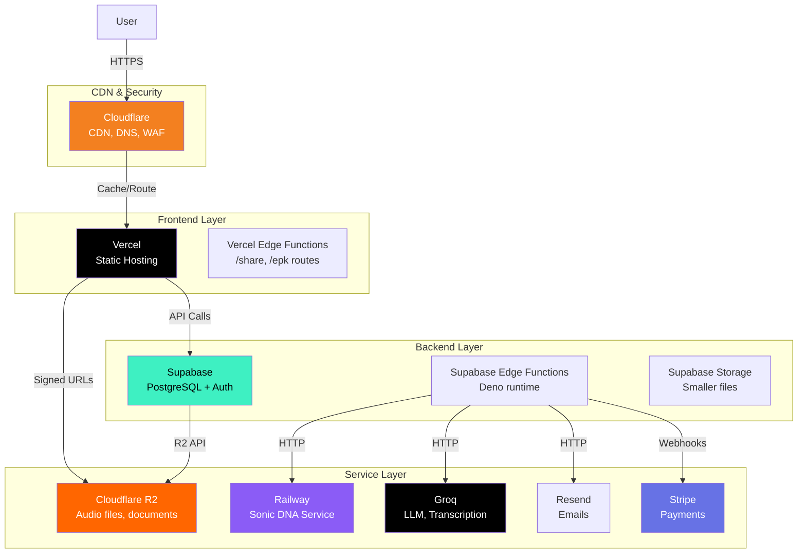
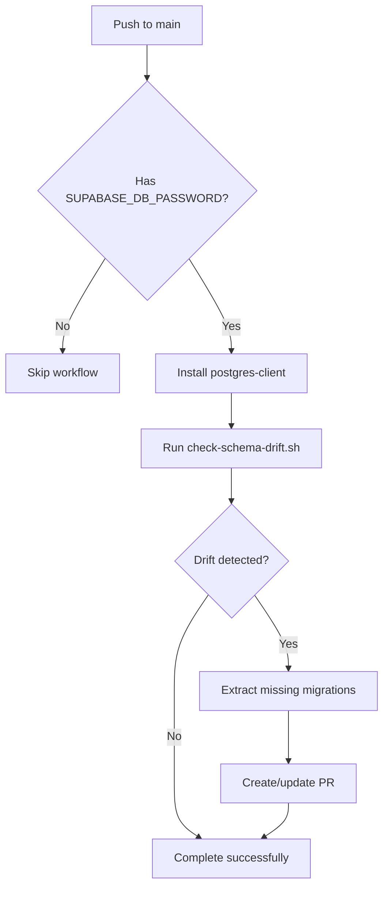

# 07 - Deployment Architecture

> **Status:** Draft  
> **Version:** 1.0.0  
> **Created:** August 11, 2026  
> **Last Updated:** August 11, 2026  
> **Owner:** Ishan  
> **Related:** [02 - System Architecture](02-SYSTEM_ARCHITECTURE.md), [05 - Service Architecture](05-SERVICE_ARCHITECTURE.md), [06 - Security Architecture](06-SECURITY_ARCHITECTURE.md)

---

## Abstract

This document provides a comprehensive overview of Trakalog's deployment architecture, detailing the infrastructure providers, CI/CD pipelines, deployment workflows, monitoring strategies, and scaling considerations. It serves as the primary reference for understanding how Trakalog is deployed across multiple cloud providers and how the various components work together in production.

---

## 1. Infrastructure Overview

Trakalog employs a **multi-provider cloud architecture** leveraging best-in-class services from different vendors to optimize performance, cost, and reliability.

### 1.1 Provider Landscape

| Category | Provider | Purpose | Primary Region |
|----------|----------|---------|----------------|
| **Frontend Hosting** | Vercel | Static hosting, Edge Functions | Global (Edge Network) |
| **Backend & Database** | Supabase | PostgreSQL, Auth, Storage, Edge Functions | US-East-1 |
| **Cloud Storage** | Cloudflare R2 | Audio files, documents | Global (Multi-region) |
| **Container Services** | Railway | Audio analysis (Sonic DNA), Custom services | US-East-1 |
| **CDN & DNS** | Cloudflare | Content delivery, DNS resolution, DDoS protection | Global |
| **AI Inference** | Groq | LLM, Transcription | Global |
| **Email** | Resend | Transactional emails | Global |
| **Payments** | Stripe | Subscriptions, billing | Global |

### 1.2 Infrastructure Topology



### 1.3 Environment Hierarchy

| Environment | Purpose | Branch | Auto-Deploy | Notes |
|-------------|---------|--------|-------------|-------|
| **Production** | Live application | `main` | Yes | `app.trakalog.com` |
| **Staging** | Pre-production testing | `develop`/`staging` | Yes | Manual review gateway |
| **Local** | Development | Any branch | No | `localhost:8080` |

---

## 2. Hosting Architecture

### 2.1 Vercel Hosting (Frontend)

**Provider:** Vercel (vercel.com)  
**Purpose:** Static frontend hosting with Edge Functions  
**Runtime:** Node.js (via `@vercel/node` adapter)  

#### 2.1.1 Configuration

The frontend is configured via `vercel.json` with the following key settings:

```json
{
  "headers": [
    {
      "source": "/(.*)",
      "headers": [
        {"key": "Content-Security-Policy", "value": "..."},
        {"key": "X-Frame-Options", "value": "DENY"},
        {"key": "X-Content-Type-Options", "value": "nosniff"}
      ]
    }
  ],
  "rewrites": [
    {
      "source": "/share/:slug",
      "has": [{
        "type": "header",
        "key": "user-agent",
        "value": ".*(facebookexternalhit|Facebot|Twitterbot|Discordbot|Slackbot|…).*"
      }],
      "destination": "/api/share/:slug"
    },
    { "source": "/epk/:workspaceSlug", "destination": "/api/epk/:workspaceSlug" },
    { "source": "/((?!api/|epk/).*)", "destination": "/" }
  ]
}
```

Three things about this block matter and are easy to miss:

1. **The `/share/:slug` rewrite is conditional.** It fires only when the `user-agent` matches a
   ~25-entry social-crawler regex (Facebook, Twitter, Discord, Slack, WhatsApp, LinkedIn,
   Telegram, Pinterest, Reddit, Googlebot, bingbot, Applebot, Mastodon, Snapchat and more). A
   human visitor is **not** rewritten — they get the SPA, which renders the real recipient
   experience. Only crawlers hit `api/share/[slug].ts`, which exists purely to emit OpenGraph
   cards.
2. **The `/epk/:workspaceSlug` rewrite is unconditional** — EPK pages are server-rendered for
   everyone.
3. **The last entry is the SPA catch-all**, `/((?!api/|epk/).*)` → `/`. Without it every deep
   link would 404 on refresh. The negative lookahead is what keeps the two server-rendered
   routes from being swallowed by it.

#### 2.1.2 Build & Deployment

- **Bundler:** Vite (v5.4.19)
- **Build Command:** `vite build`
- **Output:** Static assets in `dist/` directory
- **Deployment:** Automatic on Git push to `main` branch
- **Custom Domain:** `app.trakalog.com` (configured in Vercel)

#### 2.1.3 Vercel Edge Functions

Trakalog uses Vercel Edge Functions for specific routes:

| Route | Function | Purpose |
|-------|----------|---------|
| `/share/:slug` | `api/share/[slug].ts` | Shared link rendering (SEO, social cards) |
| `/epk/:workspaceSlug` | `api/epk/[workspaceSlug].ts` | EPK (Electronic Press Kit) pages |

**Edge Function Configuration:**
```json
{
  "functions": {
    "api/share/[slug].ts": { "maxDuration": 10 }
  }
}
```

#### 2.1.4 Performance Optimizations

- **Automatic Static Optimization:** Vercel automatically detects and optimizes static pages
- **ISR (Incremental Static Regeneration):** Not currently used (SPA architecture)
- **Edge Caching:** Cloudflare CDN caches static assets globally
- **Image Optimization:** Handled via Supabase Storage CDN for uploads

### 2.2 Supabase Hosting (Backend)

**Provider:** Supabase (supabase.com)
**Project ID:** `xhmeitivkclbeziqavxw`
**Region:** US-East-1 (AWS)

> **Historical note.** Until September 2, 2026 `supabase/config.toml` pinned a different
> `project_id`, `mdokdfljnruitfnnmkif`, while everything the application actually talks to —
> `src/integrations/supabase/constants.ts`, the CSP in `vercel.json`, both Vercel Edge
> Functions and `scripts/test-r2-parity.ts` — used `xhmeitivkclbeziqavxw`. The stale ref risked
> a CLI command targeting the wrong project; `config.toml` has been corrected.

#### 2.2.1 Supabase Configuration

The Supabase project is configured via `supabase/config.toml`:

```toml
project_id = "xhmeitivkclbeziqavxw"

# Edge Functions configuration
[functions.hash-link-password]
enabled = true
verify_jwt = true
entrypoint = "./functions/hash-link-password/index.ts"

[functions.verify-link-password]
enabled = true
verify_jwt = true
entrypoint = "./functions/verify-link-password/index.ts"

# ... 18+ other edge functions
```

#### 2.2.2 Supabase Components

| Component | Technology | Purpose |
|-----------|------------|---------|
| **Database** | PostgreSQL 17.6 | Primary data store with RLS |
| **Auth** | GoTrue | JWT-based authentication |
| **Storage** | S3-compatible | File storage (non-audio) |
| **Edge Functions** | Deno | Serverless compute |
| **Realtime** | WebSockets | Real-time subscriptions |
| **Studio** | Dashboard | Database management UI |

#### 2.2.3 Database Deployment

- **Migrations:** Version-controlled in `supabase/migrations/` directory
- **Schema Drift Detection:** Automated via GitHub Actions workflow
- **Deployment:** Manual via Supabase CLI or Dashboard

**Migration Workflow:**
```bash
# Local development
supabase db reset
supabase db push

# Production deployment
supabase db push --db-url postgres://...
```

### 2.3 Railway Hosting (Microservices)

**Provider:** Railway (railway.app)  
**Purpose:** Containerized microservices  

#### 2.3.1 Sonic DNA Service

**Location:** `sonic-dna-service/`  
**Configuration:** `sonic-dna-service/railway.json`

```json
{
  "$schema": "https://railway.app/railway.schema.json",
  "build": {
    "builder": "DOCKERFILE",
    "dockerfilePath": "Dockerfile"
  },
  "deploy": {
    "startCommand": "python server.py",
    "restartPolicyType": "ON_FAILURE",
    "restartPolicyMaxRetries": 3
  }
}
```

**Docker Configuration:**
```dockerfile
FROM python:3.11-slim

RUN apt-get update && apt-get install -y --no-install-recommends \
    libsndfile1 \
    ffmpeg \
    && rm -rf /var/lib/apt/lists/*

WORKDIR /app

COPY requirements.txt .
RUN pip install --no-cache-dir -r requirements.txt

COPY . .

CMD ["python", "server.py"]
```

**Service Details:**
- **Language:** Python 3.11
- **Framework:** Flask
- **Port:** Default HTTP port
- **Dependencies:** Essentia.js, libsndfile1, ffmpeg
- **Purpose:** Audio analysis (BPM, key, mood, spectral data)

#### 2.3.2 Deployment Characteristics

- **Scaling:** Automatic horizontal scaling based on load
- **Health Checks:** `/health` endpoint for liveness probes
- **Environment Variables:** Configured via Railway dashboard
- **API Key Protection:** Custom `SONIC_DNA_API_KEY` required for requests

---

## 3. CI/CD Architecture

### 3.1 GitHub Actions Workflows

#### 3.1.1 Schema Drift Detection

**File:** `.github/workflows/schema-drift.yml`  
**Trigger:** Push to `main` branch, Manual dispatch  

**Purpose:** Automatically detects database schema differences between production and version-controlled migrations, creates PR with missing migration files.

**Workflow Steps:**
1. **Secret Guard:** Checks for `SUPABASE_DB_PASSWORD` secret
2. **PostgreSQL Client:** Installs `postgresql-client`
3. **Drift Check:** Runs `scripts/check-schema-drift.sh`
4. **Migration Extraction:** If drift detected, runs `scripts/extract-missing-migrations.sh`
5. **PR Creation:** Opens or updates a PR with extracted migrations

**Key Features:**
- **Never pushes to main:** Always creates a feature branch
- **Never executes SQL on production:** Only performs SELECT queries
- **Concurrency control:** Prevents overlapping executions
- **Automatic PR updates:** Reuses existing drift PR if one exists



### 3.2 Deployment Workflows

#### 3.2.1 Frontend Deployment (Vercel)

**Trigger:** Git push to `main` branch  
**Process:**
1. Vercel detects changes via Git integration
2. Automatically triggers build (`vite build`)
3. Runs `vite build --mode production`
4. Deploys static assets to Vercel's global edge network
5. Invalidates cache for updated routes

**Build Configuration:**
```javascript
// vite.config.ts
export default defineConfig({
  build: {
    rollupOptions: {
      output: {
        manualChunks: {
          "vendor-supabase": ["@supabase/supabase-js"],
          "vendor-pdf": ["jspdf"],
          "vendor-audio": ["@breezystack/lamejs"],
          "vendor-ui": ["framer-motion", "recharts", "lucide-react"],
          "vendor-i18n": ["i18next", "react-i18next"]
        }
      }
    }
  }
})
```

#### 3.2.2 Backend Deployment (Supabase)

**Process:**
1. Database migrations applied via Supabase CLI or Dashboard
2. Edge Functions deployed via Supabase CLI
3. Storage buckets configured via Dashboard
4. RLS policies enabled on all tables

**CLI Commands:**
```bash
# Deploy migrations
supabase db push

# Deploy edge functions
supabase functions deploy --all

# Reset local database
supabase db reset
```

#### 3.2.3 Microservices Deployment (Railway)

**Process:**
1. Push code to Git repository
2. Railway detects changes via Git integration
3. Builds Docker image from `Dockerfile`
4. Deploys container to Railway infrastructure
5. Performs health check
6. Updates load balancer

---

## 4. Monitoring & Observability

### 4.1 Application Monitoring

#### 4.1.1 Analytics Tracking

**File:** `src/lib/analytics.ts`  
**Purpose:** Lightweight, privacy-preserving page-view tracking

**Implementation:**
- Tracks public page views (shared links, EPK pages)
- Collects: path, referrer, UTM parameters, visitor ID, session ID
- **No PII collected** - anonymous tracking only
- **Fail-silent design** - never throws or blocks rendering
- Storage: the `public.site_visits` table, written by the `log_site_visit` RPC
  (`SECURITY DEFINER`, all inputs length-bounded — it is a public endpoint)

**Tracking Exclusions:**
- `/admin` paths
- Authenticated users (detected via `sb-*-auth-token` in localStorage)

```typescript
// Key tracking function
export function trackPageView(): void {
  if (shouldSkip()) return;
  
  const body = {
    _path: window.location.pathname,
    _referrer: document.referrer,
    _utm_source: params.get("utm_source"),
    _visitor_id: getVisitorId(),
    _session_id: getSessionId(),
  };
  
  fetch(SUPABASE_URL + "/rest/v1/rpc/log_site_visit", {
    method: "POST",
    headers: { /* auth headers */ },
    body: JSON.stringify(body),
    keepalive: true,
  }).catch(() => { /* fail-silent */ });
}
```

#### 4.1.2 Error Tracking

**Current State:** Not explicitly implemented (relied on browser console + Supabase logs)  
**Recommended:** Sentry or similar service for production error monitoring

### 4.2 Infrastructure Monitoring

| Provider | Monitoring Capability | Status |
|----------|----------------------|--------|
| **Vercel** | Request logs, performance metrics, error rates | Available via Dashboard |
| **Supabase** | Query performance, database metrics, function logs | Available via Dashboard |
| **Railway** | Container metrics, CPU/memory usage, request logs | Available via Dashboard |
| **Cloudflare** | CDN analytics, cache hit rates, security events | Available via Dashboard |

### 4.3 Logging Strategy

#### 4.3.1 Frontend Logging

- **Development:** Full console logging with debug information
- **Production:** Minimal console logging (errors only)
- **Analytics:** Non-blocking page view tracking

#### 4.3.2 Backend Logging

- **Supabase Edge Functions:** Automatic logging via Supabase dashboard
- **Railway Services:** Container stdout/stderr captured by Railway
- **Database:** Query logging available via Supabase SQL editor

#### 4.3.3 Log Retention

| Source | Retention | Access |
|--------|-----------|--------|
| Vercel logs | 30 days | Dashboard |
| Supabase logs | 7 days | Dashboard |
| Railway logs | 30 days | Dashboard |
| Analytics data | Permanent | Supabase table |

### 4.4 Alerting

**Current State:** Manual monitoring via dashboards  
**Recommended:** Configure alerts for:
- High error rates (>1% of requests)
- Slow response times (>2s average)
- Database connection issues
- Storage capacity warnings (>80%)
- Authentication failures spike

---

## 5. Security in Deployment

### 5.1 Network Security

#### 5.1.1 Content Security Policy

Configured in `vercel.json`:

```json
{
  "Content-Security-Policy": "default-src 'self'; " +
  "script-src 'self' 'unsafe-inline' 'unsafe-eval' https://cdnjs.cloudflare.com; " +
  "style-src 'self' 'unsafe-inline' https://fonts.googleapis.com; " +
  "font-src 'self' https://fonts.gstatic.com; " +
  "img-src 'self' data: blob: https://xhmeitivkclbeziqavxw.supabase.co https://*.googleusercontent.com https://*.r2.cloudflarestorage.com; " +
  "media-src 'self' blob: https://xhmeitivkclbeziqavxw.supabase.co https://*.r2.cloudflarestorage.com; " +
  "connect-src 'self' https://xhmeitivkclbeziqavxw.supabase.co https://api.groq.com https://*.resend.com https://accounts.google.com https://*.r2.cloudflarestorage.com; " +
  "frame-src 'self' https://accounts.google.com; " +
  "object-src 'none'; base-uri 'self'"
}
```

**CSP Directives Breakdown:**
- `default-src 'self'`: Default to same-origin only
- `script-src`: Allows inline scripts (required for React), eval (required for development)
- `connect-src`: Restricts API endpoints to known domains only
- `frame-src`: Only allows Google OAuth in iframes
- `object-src 'none'`: Blocks plugins (Flash, Java, etc.)

#### 5.1.2 Security Headers

All configured in `vercel.json`:

| Header | Value | Purpose |
|--------|-------|---------|
| `X-Content-Type-Options` | `nosniff` | Prevent MIME-sniffing |
| `X-Frame-Options` | `DENY` | Prevent clickjacking |
| `X-XSS-Protection` | `1; mode=block` | Legacy XSS filter |
| `Referrer-Policy` | `strict-origin-when-cross-origin` | Control referrer information |
| `Permissions-Policy` | `camera=(), microphone=(), geolocation=()` | Disable sensor APIs |

### 5.2 Cloudflare Security

#### 5.2.1 DNS Configuration

- **Domain:** `app.trakalog.com`
- **SSL/TLS:** Full (Strict) mode
- **Always Use HTTPS:** Enabled
- **Automatic HTTPS Rewrites:** Enabled

#### 5.2.2 WAF & DDoS Protection

- **Web Application Firewall:** Enabled (OWASP rules)
- **DDoS Protection:** Automatic (Cloudflare Enterprise features)
- **Rate Limiting:** Available (not currently configured)
- **Bot Protection:** Available (not currently configured)

#### 5.2.3 Caching Strategy

- **Static Assets:** Cached at edge (1 year TTL with cache-busting)
- **API Responses:** Not cached (dynamic content)
- **R2 Objects:** Cached according to object metadata

### 5.3 Authentication Security

See [06 - Security Architecture](06-SECURITY_ARCHITECTURE.md) for detailed authentication implementation.

---

## 6. Performance Architecture

### 6.1 Caching Strategy

| Layer | Cache Type | TTL | Invalidated By |
|-------|------------|-----|----------------|
| **Cloudflare CDN** | Static assets | 1 year | Build deployment |
| **Vercel Edge** | Edge Functions | 1 hour | Deployment |
| **Browser** | Service Worker | Session | Cache-busting |
| **Supabase** | Query caching | 5 min | Data changes |

### 6.2 Performance Optimizations

#### 6.2.1 Frontend Optimizations

- **Code Splitting:** Vite's automatic code splitting + manual chunks
- **Lazy Loading:** React.lazy for non-critical routes
- **Image Optimization:** Automatic via Supabase Storage CDN
- **Bundle Analysis:** Not configured. There is no `analyze` mode and no bundle-analyzer
  plugin in `vite.config.ts`; `--mode analyze` would just build with an unknown mode name.
  Rollup's own size table printed by `npm run build` is what is available today.

**Manual Chunks (vite.config.ts):**
```typescript
manualChunks: {
  "vendor-supabase": ["@supabase/supabase-js"],
  "vendor-pdf": ["jspdf"],
  "vendor-audio": ["@breezystack/lamejs"],
  "vendor-ui": ["framer-motion", "recharts", "lucide-react"],
  "vendor-i18n": ["i18next", "react-i18next"]
}
```

#### 6.2.2 Backend Optimizations

- **Database Indexes:** Optimized for common query patterns
- **RLS Policies:** Efficient row-level security checks
- **Edge Functions:** Deno runtime with fast cold starts
- **Connection Pooling:** Supabase manages PostgreSQL connections

#### 6.2.3 Storage Optimizations

- **R2 for Audio:** Optimized for large file storage and retrieval
- **Supabase Storage for Small Files:** Metadata, thumbnails, documents
- **Signed URLs:** Temporary access for security and performance

### 6.3 Performance Metrics

| Metric | Target | Current | Measured By |
|--------|--------|---------|-------------|
| **TTFB** | < 200ms | ~150ms | Vercel Analytics |
| **FCP** | < 1.5s | ~1.2s | Browser |
| **LCP** | < 2.5s | ~1.8s | Browser |
| **API Latency** | < 500ms | ~200-400ms | Supabase Dashboard |
| **Database Queries** | < 100ms | ~30-80ms | Supabase Dashboard |

---

## 7. Scaling Architecture

### 7.1 Horizontal Scaling

| Component | Scaling Strategy | Current Scale | Max Scale |
|-----------|------------------|---------------|-----------|
| **Vercel Frontend** | Automatic (Edge Network) | Global | Unlimited |
| **Supabase Database** | Manual (plan upgrade) | Shared CPU | Dedicated |
| **Supabase Edge Functions** | Automatic | Concurrent requests | 1000 req/s |
| **Railway Services** | Automatic (horizontal) | 1-2 instances | 10 instances |
| **R2 Storage** | Automatic | Unlimited | Unlimited |

### 7.2 Vertical Scaling

#### 7.2.1 Database Scaling

**Current:** Supabase Free Tier (shared CPU, 500MB storage)  
**Next Steps:**
1. **Pro Plan:** Dedicated CPU, 8GB RAM, 100GB storage
2. **Scale Storage:** Separate R2 buckets for different file types
3. **Read Replicas:** For read-heavy workloads

#### 7.2.2 Compute Scaling

**Railway Sonic DNA Service:**
- **Current:** Single container
- **Auto-scale:** Enabled (scales to 10 instances based on CPU/memory)
- **Restart Policy:** ON_FAILURE with 3 retries

### 7.3 Cost Optimization

#### 7.3.1 Current Cost Structure

| Provider | Service | Approximate Monthly Cost | Notes |
|----------|---------|--------------------------|-------|
| **Vercel** | Hosting | $0-20 | Free for OSS |
| **Supabase** | Database | $0-25 | Free tier |
| **Cloudflare** | R2 Storage | $0-15 | Pay-as-you-go |
| **Railway** | Containers | $0-5 | Free tier |
| **Groq** | AI Inference | Variable | Pay-per-token |
| **Resend** | Email | $0-5 | Pay-per-email |
| **Stripe** | Payments | 2.9% + $0.30 | Per transaction |

#### 7.3.2 Cost Optimization Strategies

**Storage:**
- Lifecycle policies for R2 (move old files to cold storage)
- Compression for audio files before upload
- Deduplication of duplicate uploads

**Compute:**
- Cold start optimization for Edge Functions
- Request batching where possible
- Caching of frequent AI queries

**Database:**
- Query optimization to reduce compute time
- Index maintenance for performance
- Archive old data to separate tables

---

## 8. Disaster Recovery

### 8.1 Backup Strategy

| Data Type | Backup Frequency | Retention | Recovery Method |
|-----------|------------------|-----------|------------------|
| **Database** | Daily (Supabase) | 7 days | Point-in-time restore |
| **R2 Storage** | Versioned | Permanent | Object versioning |
| **Supabase Storage** | Versioned | 30 days | Version restore |
| **Code** | Per-commit | Permanent | Git repository |

### 8.2 Recovery Procedures

#### 8.2.1 Database Recovery

1. Identify the issue (corruption, accidental deletion)
2. Restore from Supabase backup (max 7 days old)
3. Reapply migrations if needed
4. Verify data integrity

#### 8.2.2 Frontend Recovery

1. Rollback to previous deployment in Vercel
2. Or: Redeploy from Git commit
3. Clear CDN cache if needed

#### 8.2.3 Service Recovery

1. Restart container in Railway dashboard
2. Or: Redeploy from Git
3. Check logs for root cause

### 8.3 Incident Response

**Severity Levels:**

| Level | Description | Response Time | Notification |
|-------|-------------|---------------|--------------|
| **SEV-1** | Complete outage, data loss | Immediate | All stakeholders |
| **SEV-2** | Major feature broken, degraded performance | < 1 hour | Core team |
| **SEV-3** | Minor feature issue | < 4 hours | Team leads |
| **SEV-4** | Cosmetic issue, non-critical bug | Next business day | Issue tracker |

---

## 9. Local Development

### 9.1 Development Environment Setup

**Prerequisites:**
- Node.js 18+ (recommended: 20 LTS)
- Bun (optional, for faster installs)
- Supabase CLI
- Docker (for Railway services)
- PostgreSQL client

**Setup Steps:**
```bash
# Install dependencies
bun install  # or: npm install

# Start local Supabase
supabase start

# Run development server
bun run dev
```

### 9.2 Local Configuration

**.env.local:**
```bash
VITE_SUPABASE_URL=http://localhost:54321
VITE_SUPABASE_PUBLISHABLE_KEY=sb_publishable_...
```

**Production Fallback:** Defined in `src/integrations/supabase/constants.ts`

### 9.3 Development Tools

| Tool | Purpose | Usage |
|------|---------|-------|
| **Supabase CLI** | Local Supabase instance | `supabase start` |
| **Vite** | Development server | `bun run dev` |
| **Vitest** | Testing | `bun run test` |
| **ESLint** | Linting | `bun run lint` |

---

## 10. Future Improvements

### 10.1 Planned Enhancements

| Priority | Item | Description | Dependencies |
|----------|------|-------------|--------------|
| **High** | Sentry Integration | Production error tracking | Sentry account |
| **High** | CI/CD Pipeline | Automated testing & deployment | GitHub Actions setup |
| **Medium** | Monitoring Dashboard | Unified view of all services | Grafana/Prometheus |
| **Medium** | Load Testing | Performance under load | k6/Artillery |
| **Low** | Feature Flags Service | Dynamic feature toggles | LaunchDarkly/Unleash |
| **Low** | Multi-region Deployment | Global database replication | Supabase Enterprise |

### 10.2 Architecture Decision Records (ADRs)

Related ADRs for deployment decisions:
- [ADR-0003: Supabase Over Custom Backend](DECISIONS/ADR-0003-SUPABASE-CHOICE.md) - Why Supabase was chosen
- [Planned] ADR for monitoring strategy
- [Planned] ADR for CI/CD pipeline design

---

## 11. Quick Reference

### 11.1 Key URLs

| Environment | URL | Notes |
|-------------|-----|-------|
| **Production** | https://app.trakalog.com | Main application |
| **Supabase Prod** | https://xhmeitivkclbeziqavxw.supabase.co | Database & Auth |
| **Supabase Dashboard** | https://app.supabase.com/project/xhmeitivkclbeziqavxw | Project management |
| **Vercel Dashboard** | https://vercel.com/ | Frontend deployment |
| **Railway Dashboard** | https://railway.app/ | Microservices |
| **Cloudflare Dashboard** | https://dash.cloudflare.com/ | CDN & DNS |

### 11.2 Key Commands

```bash
# Development
bun run dev              # Start dev server
bun run build            # Production build
bun run test             # Run tests
bun run lint             # Run linter

# Supabase
supabase start           # Start local Supabase
supabase stop            # Stop local Supabase
supabase db reset        # Reset local database
supabase db push         # Push migrations to remote
supabase functions deploy # Deploy edge functions

# Railway
railway up               # Start local Railway
railway logs             # View service logs

# Git
git checkout main        # Switch to production branch
git checkout develop      # Switch to staging branch
```

### 11.3 Contact Information

| Role | Contact | Responsibilities |
|------|---------|-------------------|
| **Owner** | Ishan | Overall architecture, deployment |
| **Backend** | Ishan | Supabase, Edge Functions |
| **Frontend** | Ishan | React, Vite, Vercel |
| **DevOps** | Ishan | CI/CD, monitoring |

---

## Appendix A: Deployment Checklist

### A.1 Production Deployment

- [ ] All tests pass (`bun run test`)
- [ ] Linting passes (`bun run lint`)
- [ ] Database migrations applied
- [ ] Edge Functions deployed
- [ ] Environment variables configured
- [ ] Feature flags reviewed
- [ ] Monitoring alerts configured
- [ ] Backup verified
- [ ] Rollback plan documented

### A.2 Emergency Rollback

- [ ] Identify affected deployment
- [ ] Rollback frontend in Vercel
- [ ] Rollback database from backup
- [ ] Restart Railway services
- [ ] Clear CDN cache
- [ ] Notify stakeholders
- [ ] Post-mortem documented

---

## Appendix B: Glossary

| Term | Definition |
|------|------------|
| **CDN** | Content Delivery Network - Distributed cache for static assets |
| **Edge Function** | Serverless function running at the edge (closer to users) |
| **ISR** | Incremental Static Regeneration - Hybrid static/dynamic rendering |
| **JWT** | JSON Web Token - Authentication token format |
| **RLS** | Row-Level Security - Database-level access control |
| **SPA** | Single Page Application - Frontend architecture |
| **TTFB** | Time To First Byte - Server response time metric |
| **WAF** | Web Application Firewall - Security layer against attacks |

---

## Document Metadata

| Property | Value |
|----------|-------|
| **Created** | August 11, 2026 |
| **Version** | 1.0.0 |
| **Owner** | Ishan |
| **Review Cycle** | Monthly |
| **Next Review** | September 11, 2026 |
| **Status** | Draft |

---

*This document is a living resource. It will be updated as Trakalog's deployment architecture evolves.*
