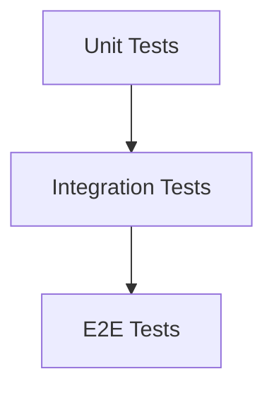

# Testing Strategy

> **Status:** Stable — verified against the code, September 2, 2026
> **Version:** 1.0.0  
> **Created:** August 18, 2026  
> **Last Updated:** September 2, 2026
> **Owner:** Ishan  
> **Related:** [CODING_STANDARDS.md](./CODING_STANDARDS.md), [04 - Component Architecture](../ARCHITECTURE/04-COMPONENT_ARCHITECTURE.md)

---

## Abstract

This document outlines Trakalog's testing strategy, including testing frameworks, patterns, organization, and best practices for ensuring application reliability and maintainability.

---

## 1. Testing Framework

### 1.1 Vitest

**Version:** 3.2.4

**Configuration:** `vitest.config.ts`

```typescript
import { defineConfig } from "vitest/config";
import react from "@vitejs/plugin-react-swc";
import path from "path";

export default defineConfig({
  plugins: [react()],
  test: {
    environment: "jsdom",
    globals: true,
    setupFiles: ["./src/test/setup.ts"],
    include: ["src/**/*.{test,spec}.{ts,tsx}"],
  },
  resolve: {
    alias: { "@": path.resolve(__dirname, "./src") },
  },
});
```

**Key Features:**
- **Environment:** `jsdom` - Simulates browser DOM
- **Globals:** `true` - Injects `describe`, `it`, `expect` without imports
- **Setup Files:** `./src/test/setup.ts` - Global test setup
- **Include:** All `*.test.ts` and `*.spec.ts` files in `src/`

### 1.2 React Testing Library

**Version:** 16.0.0

**Purpose:** Testing React components in a way that resembles how users interact with them.

**Utilities:**
- `render` - Render components into a container
- `screen` - Queries for finding elements
- `fireEvent` - Simulate DOM events
- `userEvent` - Simulate user interactions
- `waitFor` - Wait for async operations

### 1.3 Testing Library Jest DOM

**Version:** 6.6.0

**Purpose:** Custom Jest matchers for DOM testing (extends `expect`).

**Matchers:**
- `toBeInTheDocument()`
- `toHaveTextContent()`
- `toHaveAttribute()`
- `toBeVisible()`
- `toBeDisabled()`
- `toContainHTML()`

---

## 2. Test Organization

### 2.1 Directory Structure

```
src/
├── components/
│   ├── Button/
│   │   ├── Button.tsx
│   │   └── Button.test.ts       # Component tests
├── hooks/
│   ├── useTrack/
│   │   ├── useTrack.ts
│   │   └── useTrack.test.ts     # Hook tests
├── lib/
│   ├── audio.ts
│   │   └── audio.test.ts        # Utility function tests
├── pages/
│   ├── TrackDetail/
│   │   ├── TrackDetail.tsx
│   │   └── TrackDetail.test.ts  # Page tests
└── test/
    ├── setup.ts                 # Global test setup
    └── example.test.ts          # Example tests
```

### 2.2 File Naming Convention

| Type | Convention | Example |
|------|------------|---------|
| Component tests | `<ComponentName>.test.ts` | `TrackCard.test.ts` |
| Hook tests | `use<HookName>.test.ts` | `useTrack.test.ts` |
| Utility tests | `<utility>.test.ts` | `audio.test.ts` |
| Page tests | `<PageName>.test.ts` | `TrackDetail.test.ts` |
| Integration tests | `<feature>.test.ts` | `upload-flow.test.ts` |

---

## 3. Test Types & Pyramid

### 3.1 Test Pyramid



**Target Distribution:**
- Unit Tests: 70%
- Integration Tests: 20%
- E2E Tests: 10%

### 3.2 Unit Tests

**Purpose:** Test individual units of code in isolation

**Cover:**
- Utility functions
- Custom hooks
- Individual components
- Pure business logic

**Example:**
```typescript
// src/lib/audio.test.ts
import { describe, it, expect } from "vitest";
import { formatDuration } from "./audio";

describe("formatDuration", () => {
  it("formats seconds to MM:SS", () => {
    expect(formatDuration(90)).toBe("1:30");
    expect(formatDuration(3599)).toBe("59:59");
    expect(formatDuration(3600)).toBe("1:00:00");
  });

  it("handles zero duration", () => {
    expect(formatDuration(0)).toBe("0:00");
  });
});
```

### 3.3 Integration Tests

**Purpose:** Test interactions between multiple components or systems

**Cover:**
- Component compositions
- Data fetching with React Query
- Context providers
- Supabase RPC integrations

**Example:**
```typescript
// src/pages/TrackList.test.ts
import { describe, it, expect } from "vitest";
import { render, screen, waitFor } from "@testing-library/react";
import { TrackList } from "./TrackList";
import { WorkspaceProvider } from "@/contexts/WorkspaceContext";

// Mock Supabase
vi.mock("@/integrations/supabase/client", () => ({
  supabase: {
    from: () => ({
      select: () => ({
        eq: () => ({
          order: () => ({ data: [], error: null }),
        }),
      }),
    }),
  },
}));

describe("TrackList", () => {
  it("displays loading state initially", () => {
    render(
      <WorkspaceProvider>
        <TrackList workspaceId="test-workspace" />
      </WorkspaceProvider>
    );
    
    expect(screen.getByText(/loading/i)).toBeInTheDocument();
  });

  it("displays tracks after loading", async () => {
    // Mock with actual data
    const mockTracks = [{ id: "1", title: "Test Track" }];
    vi.mocked(supabase.from).mockReturnValue({
      select: vi.fn().mockReturnValue({
        eq: vi.fn().mockReturnValue({
          order: vi.fn().mockResolvedValue({ data: mockTracks, error: null }),
        }),
      }),
    });

    render(
      <WorkspaceProvider>
        <TrackList workspaceId="test-workspace" />
      </WorkspaceProvider>
    );

    await waitFor(() => {
      expect(screen.getByText("Test Track")).toBeInTheDocument();
    });
  });
});
```

### 3.4 E2E Tests (Future)

**Current State:** Not implemented

**Recommendation:** Add **Playwright** or **Cypress** for end-to-end testing

**Suggested Setup:**
```bash
npm install -D @playwright/test
npx playwright install
```

**Example Test:**
```typescript
// tests/upload-flow.spec.ts
import { test, expect } from "@playwright/test";

test("user can upload a track", async ({ page }) => {
  await page.goto("/tracks");
  await page.click("[aria-label='Upload']");
  
  // Upload audio file
  await page.setInputFiles("input[type='file']", "test-track.wav");
  
  // Fill metadata
  await page.fill("[name='title']", "Test Track");
  await page.fill("[name='artist']", "Test Artist");
  
  // Submit
  await page.click("button[type='submit']");
  
  // Verify
  await expect(page.getByText("Track uploaded successfully")).toBeVisible();
  await expect(page.getByText("Test Track")).toBeVisible();
});
```

---

## 4. Testing Patterns

### 4.1 Mocking Supabase

**Pattern:** Mock Supabase client for unit tests

```typescript
// In test files or __mocks__
import { vi } from "vitest";

const mockSupabase = {
  from: vi.fn(),
  rpc: vi.fn(),
  select: vi.fn(),
};

vi.mock("@/integrations/supabase/client", () => ({
  supabase: mockSupabase,
}));

// In tests
beforeEach(() => {
  vi.resetAllMocks();
});
```

### 4.2 Mocking React Query

**Pattern:** Use `QueryClientProvider` with mock client

```typescript
import { QueryClient, QueryClientProvider } from "@tanstack/react-query";

const queryClient = new QueryClient({
  defaultOptions: {
    queries: {
      retry: false,
    },
  },
});

function TestProvider({ children }: { children: React.ReactNode }) {
  return (
    <QueryClientProvider client={queryClient}>
      {children}
    </QueryClientProvider>
  );
}

// Usage in tests
render(
  <TestProvider>
    <MyComponent />
  </TestProvider>
);
```

### 4.3 Mocking Contexts

**Pattern:** Create test wrappers for contexts

```typescript
// src/test/context-wrappers.tsx
import { type ReactNode } from "react";
import { AuthProvider } from "@/contexts/AuthContext";
import { WorkspaceProvider } from "@/contexts/WorkspaceContext";

export function withAuth(children: ReactNode) {
  return <AuthProvider>{children}</AuthProvider>;
}

export function withWorkspace(children: ReactNode, workspace?: Workspace) {
  return (
    <WorkspaceProvider initialWorkspace={workspace}>
      {children}
    </WorkspaceProvider>
  );
}

// Usage
describe("TrackDetail", () => {
  it("renders track information", () => {
    const mockTrack = { id: "1", title: "Test" };
    render(
      withAuth(
        withWorkspace(
          <TrackDetail track={mockTrack} />,
          { id: "workspace-1", name: "Test Workspace" }
        )
      )
    );
  });
});
```

### 4.4 Mocking Custom Hooks

**Pattern:** Use `vi.mock` to mock custom hooks

```typescript
// Mock the hook
vi.mock("@/hooks/useTrack", () => ({
  useTrack: () => ({
    track: { id: "1", title: "Mock Track" },
    isLoading: false,
    error: null,
  }),
}));

// Test component that uses the hook
describe("TrackCard", () => {
  it("displays track title", () => {
    render(<TrackCard trackId="1" />);
    expect(screen.getByText("Mock Track")).toBeInTheDocument();
  });
});
```

### 4.5 Testing Async Code

**Pattern:** Use `async/await` with `waitFor`

```typescript
import { waitFor } from "@testing-library/react";

describe("AsyncComponent", () => {
  it("loads data and displays it", async () => {
    render(<AsyncComponent />);
    
    // Wait for async operation
    await waitFor(() => {
      expect(screen.getByText("Loaded data")).toBeInTheDocument();
    });
  });

  it("handles loading state", async () => {
    render(<AsyncComponent />);
    
    // Check loading state first
    expect(screen.getByText(/loading/i)).toBeInTheDocument();
    
    // Then wait for loaded state
    await waitFor(() => {
      expect(screen.queryByText(/loading/i)).not.toBeInTheDocument();
    });
  });
});
```

---

> ℹ️ **Current state of the suite.** The repository contains exactly one test file,
> `src/test/example.test.ts`, which is a placeholder assertion. Everything below
> describes the intended approach and conventions, not an existing body of tests.

## 5. Test Setup

### 5.1 Global Setup (`src/test/setup.ts`)

The real file is 15 lines — a `jest-dom` import and a `matchMedia` stub:

```typescript
import "@testing-library/jest-dom";

Object.defineProperty(window, "matchMedia", {
  writable: true,
  value: (query: string) => ({
    matches: false,
    media: query,
    onchange: null,
    addListener: () => {},
    removeListener: () => {},
    addEventListener: () => {},
    removeEventListener: () => {},
    dispatchEvent: () => {},
  }),
});
```

#### Recommended addition: storage mocks (not yet implemented)

`src/integrations/supabase/client.ts` installs a **custom `localStorage`-backed auth
store** — it mirrors the Supabase auth token into a `trakalog_session_backup` key and reads
it back on miss. Any test that imports the Supabase client therefore touches real jsdom
`localStorage`, which persists across tests in the same file and can leak auth state
between them.

Adding mocks to `setup.ts` would isolate that:

```typescript
const storageMock = () => {
  let store: Record<string, string> = {};
  return {
    getItem: (k: string) => store[k] ?? null,
    setItem: (k: string, v: string) => { store[k] = String(v); },
    removeItem: (k: string) => { delete store[k]; },
    clear: () => { store = {}; },
  };
};

Object.defineProperty(window, "localStorage", { value: storageMock() });
Object.defineProperty(window, "sessionStorage", { value: storageMock() });
```

Until that lands, tests that exercise auth should clear `localStorage` themselves in a
`beforeEach`.

### 5.2 TypeScript Support

Vitest has built-in TypeScript support. No additional configuration needed for `.ts` and `.tsx` files.

---

## 6. Test Execution

### 6.1 Scripts

| Script | Purpose |
|--------|---------|
| `npm run test` | Run all tests once |
| `npm run test:watch` | Run tests in watch mode |
| `npx vitest run` | Run all tests |
| `npx vitest --ui` | Visual test explorer — **`@vitest/ui` is not a dependency**; npx will prompt to install it ad hoc |
| `npx vitest --coverage` | Run tests with coverage |

### 6.2 Coverage

**Current:** Coverage not configured

**Recommended Setup:**
```bash
npx vitest run --coverage
```

**Coverage Thresholds (Suggested):**
```typescript
// vitest.config.ts
export default defineConfig({
  test: {
    // ...
    coverage: {
      provider: 'v8', // or 'istanbul'
      reporter: ['text', 'json', 'html'],
      thresholds: {
        lines: 80,
        functions: 80,
        branches: 80,
        statements: 80,
      },
    },
  },
});
```

---

## 7. Test Quality Standards

### 7.1 The Three A's

Every test should follow the **Arrange-Act-Assert** pattern:

```typescript
it("does something", () => {
  // Arrange - Set up test data and conditions
  const props = { track: { id: "1", title: "Test" } };
  
  // Act - Perform the action
  render(<TrackCard {...props} />);
  
  // Assert - Verify the result
  expect(screen.getByText("Test")).toBeInTheDocument();
});
```

### 7.2 Test Descriptions

**Good:**
```typescript
describe("TrackCard", () => {
  describe("when track has artwork", () => {
    it("displays the artwork image", () => { ... });
  });
  
  describe("when track has no artwork", () => {
    it("displays a placeholder", () => { ... });
  });
  
  describe("when clicked", () => {
    it("triggers the onPlay callback", () => { ... });
  });
});
```

**Bad:**
```typescript
it("test 1", () => { ... });
it("test 2", () => { ... });
```

### 7.3 Single Responsibility

Each test should verify **one thing**. Avoid tests that check multiple behaviors.

```typescript
// ✅ Good - One assertion per test
it("displays track title", () => { ... });
it("displays artist name", () => { ... });

// ❌ Bad - Multiple assertions
it("displays track info", () => {
  expect(screen.getByText("Title")).toBeInTheDocument();
  expect(screen.getByText("Artist")).toBeInTheDocument();
  expect(screen.getByText("1:30")).toBeInTheDocument();
});
```

### 7.4 Deterministic Tests

Tests should be deterministic and not depend on:
- Timing (use `waitFor` for async operations)
- External services (mock them)
- Random data (use fixed test data)
- Order of execution

---

## 8. Testing Different Scenarios

### 8.1 Happy Path

Test the expected, successful flow:
```typescript
describe("TrackUpload", () => {
  it("uploads a track successfully", async () => { ... });
});
```

### 8.2 Error Cases

Test error handling:
```typescript
describe("TrackUpload", () => {
  it("displays error when file is too large", async () => { ... });
  it("displays error when upload fails", async () => { ... });
});
```

### 8.3 Edge Cases

Test boundary conditions:
```typescript
describe("formatDuration", () => {
  it("handles zero duration", () => { ... });
  it("handles very long duration", () => { ... });
  it("handles fractional seconds", () => { ... });
});
```

### 8.4 Loading States

Test loading and empty states:
```typescript
describe("TrackList", () => {
  it("displays loading spinner when loading", () => { ... });
  it("displays empty state when no tracks", () => { ... });
  it("displays tracks when loaded", () => { ... });
});
```

---

## 9. Continuous Integration

### 9.1 GitHub Actions

**Current:** Not configured for tests

**Recommended Workflow:**
```yaml
# .github/workflows/test.yml
name: Tests

on: [push, pull_request]

jobs:
  test:
    runs-on: ubuntu-latest
    steps:
      - uses: actions/checkout@v4
      - uses: actions/setup-node@v4
        with:
          node-version: 20
      - run: npm ci
      - run: npm run test
```

### 9.2 Pre-commit Hooks (Optional)

**Recommended:** Add Husky for pre-commit hooks

```bash
npm install -D husky lint-staged
npx husky init
```

**.lintstagedrc:**
```json
{
  "*.{ts,tsx}": [
    "npm run lint",
    "vitest run --related"
  ]
}
```

---

## 10. Debugging Tests

### 10.1 Logging

```typescript
it("debug test", () => {
  console.log("Debug info"); // Visible in test output
  
  // Pretty print
  console.log("Track:", JSON.stringify(track, null, 2));
  
  // Debug DOM
  screen.debug(); // Logs entire DOM
});
```

### 10.2 Vitest UI

```bash
npx vitest --ui
```

Provides a visual interface to:
- Run specific tests
- View test results
- Inspect console output
- Explore test file structure

### 10.3 Common Issues

| Issue | Solution |
|-------|----------|
| `window is not defined` | Use `jsdom` environment or mock window |
| `localStorage is not defined` | Mock localStorage in setup file |
| `Cannot read properties of null` | Check if element exists before querying |
| `Act warnings` | Wrap state updates in `act()` or use proper async handling |
| `Network Error` | Mock API calls |

---

## Appendix A: Quick Reference

| Task | Command |
|------|---------|
| Run all tests | `npm run test` |
| Run tests in watch mode | `npm run test:watch` |
| Run with coverage | `npx vitest run --coverage` |
| Run specific test | `npx vitest MyComponent.test.ts` |
| Run tests matching pattern | `npx vitest --testNamePattern="upload"` |
| Open Vitest UI | `npx vitest --ui` |

---

## Appendix B: Document Metadata

| Property | Value |
|----------|-------|
| **Created** | August 18, 2026 |
| **Version** | 1.0.0 |
| **Owner** | Ishan |
| **Status** | Draft |
| **Phase** | 3 (Operations) |
| **Effort** | 3h |
