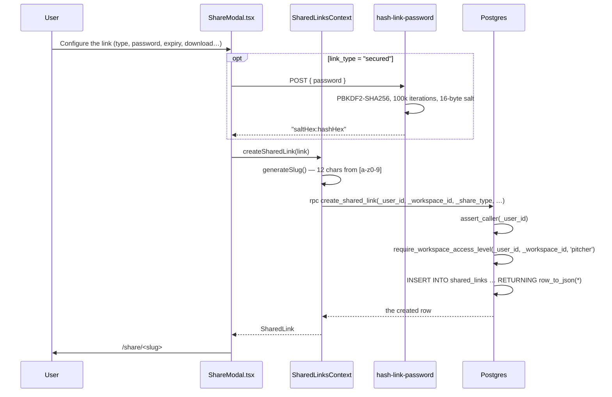
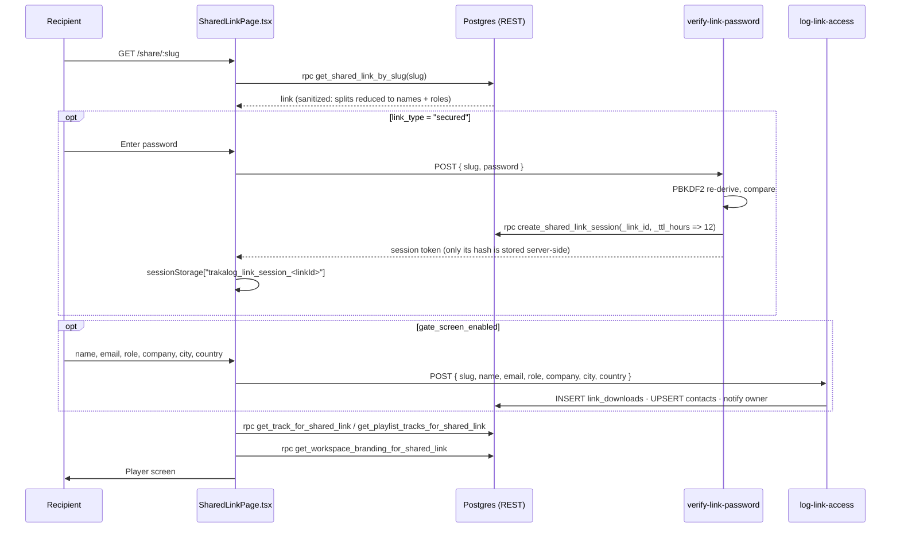
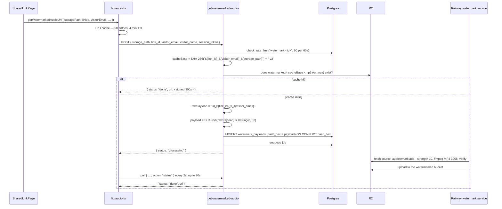

# Sharing System

> **Status:** Draft
> **Version:** 2.0.0
> **Created:** August 11, 2026
> **Last Updated:** September 2, 2026
> **Owner:** Ishan
> **Related:** [03 - Data Architecture](../ARCHITECTURE/03-DATA_ARCHITECTURE.md), [04 - Component Architecture](../ARCHITECTURE/04-COMPONENT_ARCHITECTURE.md), [05 - Service Architecture](../ARCHITECTURE/05-SERVICE_ARCHITECTURE.md), [06 - Security Architecture](../ARCHITECTURE/06-SECURITY_ARCHITECTURE.md), [WATERMARKING.md](WATERMARKING.md), [AUTH_PATTERNS.md](../ARCHITECTURE/AUTH_PATTERNS.md)

---

## Abstract

Trakalog's Sharing System distributes tracks, playlists, stems and packs to external
recipients who have no Trakalog account. It is the product's free distribution channel and its
main protection surface: every `track` and `playlist` link serves per-visitor watermarked audio
so a leak can be traced back to the individual recipient.

Every table, column, RPC, Edge Function, file path and constant below was verified against the
migrations and source on September 2, 2026.

---

## 1. Feature Overview

### 1.1 Purpose

- Share a track, a playlist, a stem set or a pack with someone who has no account.
- Gate access behind an identification screen and, optionally, a password.
- Serve **per-recipient watermarked audio** for track and playlist links, so a leaked file
  identifies its recipient.
- Capture engagement — views, plays, downloads — and timecoded comments.
- Apply the sender's workspace branding to the recipient page.

**Recipients never sign up, and a shared link never consumes a seat.** Under Billing v5.0 every
workspace *member* consumes a seat regardless of access level; the shared link is the free,
unlimited channel. See [TRAKALOG_BILLING.md](TRAKALOG_BILLING.md).

### 1.2 Share types

`share_type` is a Postgres enum with exactly four values
(`baseline_prod.sql:141` — note the declaration order):

```sql
CREATE TYPE public.share_type AS ENUM ('stems', 'track', 'playlist', 'pack');
```

| Type | Contents | Watermarked | Use case |
|---|---|---|---|
| `track` | One track | **Always** | Individual track feedback |
| `playlist` | An ordered playlist | **Always** | Multi-track review |
| `stems` | A track's stem files | No | Working material exchange |
| `pack` | Arbitrary items (`pack_items` jsonb) | No | Final masters / label handoff |

**Watermarking depends on `share_type`, never on delivery format.** A `track` or `playlist`
link routes *all* audio — playback and download, including "Download all", which delivers
individual files — through `get-watermarked-audio`. Only `pack` produces a ZIP, and it
deliberately carries clean audio because its purpose is final delivery.

> **Known gap** (tracked in CLAUDE.md): there is no warning badge when creating a `pack` link,
> no `README.txt` in the ZIP, and onboarding step 16 still wrongly promises that *all* links
> are watermarked.

### 1.3 Core pieces

| Piece | Kind | Location |
|---|---|---|
| Share modal | React component | `src/components/ShareModal.tsx` |
| Pack share modal | React component | `src/components/SharePackModal.tsx` |
| Recipient page | React page | `src/pages/SharedLinkPage.tsx` |
| Link management | React page | `src/pages/SharedLinks.tsx` |
| Stem-set page | React page | `src/pages/SharedStemAccess.tsx` |
| Link state | React Context | `src/contexts/SharedLinksContext.tsx` |
| Signed-URL helpers | Module | `src/lib/audio.ts` |
| Links table | Postgres | `public.shared_links` |
| Engagement | Postgres | `public.link_events`, `public.link_downloads` |
| Password sessions | Postgres | `public.shared_link_sessions` |
| Leak-trace mapping | Postgres | `public.watermark_payloads` |
| Watermarked audio | Edge Function | `supabase/functions/get-watermarked-audio/` |

There is **no `src/components/sharing/` directory, no `SharePage.tsx`, no
`SharedLinkManagement.tsx`, no `ShareButton.tsx`, no `ShareAudioPlayer.tsx` and no
`useSharedLink.ts` hook.** Link state lives in `SharedLinksContext`; the share trigger is a
plain button in each page that opens `ShareModal`.

---

## 2. Architecture

### 2.1 Sender side — creating a link

Creation is a **`SECURITY DEFINER` RPC**, not an Edge Function. There is no
`create-shared-link` or `validate-shared-link` function.



```sql
-- baseline_prod.sql:1009 — the guard wrapper
CREATE FUNCTION public.create_shared_link(
  _user_id uuid, _workspace_id uuid, _share_type text,
  _track_id uuid DEFAULT NULL, _playlist_id uuid DEFAULT NULL,
  _link_name text DEFAULT '', _link_slug text DEFAULT '',
  _link_type text DEFAULT 'public', _password_hash text DEFAULT NULL,
  _message text DEFAULT NULL, _allow_download boolean DEFAULT false,
  _allow_save boolean DEFAULT true, _download_quality text DEFAULT NULL,
  _expires_at timestamptz DEFAULT NULL, _pack_items text DEFAULT NULL,
  _watermarking_enabled boolean DEFAULT true, _gate_screen_enabled boolean DEFAULT true
) RETURNS json
  LANGUAGE plpgsql SECURITY DEFINER SET search_path TO 'public'
AS $func$
BEGIN
  PERFORM public.assert_caller(_user_id);
  PERFORM public.require_workspace_access_level(_user_id, _workspace_id, 'pitcher');
  RETURN public.create_shared_link_legacy_v0(…);
END;
$func$;
```

Two conventions from CLAUDE.md are visible here and worth copying in new RPCs: the explicit
`_user_id` checked by `assert_caller` (anti-impersonation), and the explicit enum casts inside
`_legacy_v0` (`_share_type::share_type`, `'active'::link_status`).

**Slug generation is client-side and is not a UUID:**

```typescript
// src/contexts/SharedLinksContext.tsx:83-92
function generateSlug(): string {
  var chars = "abcdefghijklmnopqrstuvwxyz0123456789";
  var bytes = new Uint8Array(12);
  crypto.getRandomValues(bytes);
  var slug = "";
  for (var i = 0; i < 12; i++) slug += chars.charAt(bytes[i] % chars.length);
  return slug;
}
```

Twelve characters over a 36-symbol alphabet ≈ 62 bits of entropy, from a CSPRNG. Not
sequential, not guessable at any practical rate. (It is **not** "crypto-random UUID v4".)

### 2.2 Recipient side — opening a link



The recipient page mounts **zero GoTrueClient**. Every call is a direct REST `fetch` against
`SUPABASE_URL` with `SUPABASE_PUBLISHABLE_KEY`, both imported from
`src/integrations/supabase/constants.ts`. This is the public-page rule in CLAUDE.md, and it is
why the sanitizing `SECURITY DEFINER` RPCs exist: no raw table read ever reaches an anonymous
browser.

RPCs the recipient page calls: `get_shared_link_by_slug`, `get_track_for_shared_link`,
`get_playlist_tracks_for_shared_link`, `get_workspace_branding_for_shared_link`,
`save_track_to_trakalog`, `update_track_comment_via_token`, `delete_track_comment_via_token`,
`get_user_workspaces`, `write_audit_log`.

Edge Functions it calls: `verify-link-password`, `log-link-access`, `log-link-event`,
`get-audio-url`, `get-watermarked-audio` (via `src/lib/audio.ts`), `get-shared-link-asset`,
`get-shared-link-video`, `get-track-comments`, `add-track-comment`.

### 2.3 Watermarked audio delivery



Constants, all verified:

| Constant | Value | Source |
|---|---|---|
| Cache key | `SHA-256("{link_id}_{visitor_email}_{storage_path}") + "-v2"` | `get-watermarked-audio/index.ts:95` |
| Watermark payload | `SHA-256("lid_{link_id}_v_{email}").substring(0, 32)` | `index.ts:158-160` |
| Signed-URL TTL | 300 s | `index.ts:108`, `_shared/storage.ts` |
| Rate limit | 60 requests / 60 s per IP | `index.ts:46` |
| Client poll interval | 2 000 ms | `src/lib/audio.ts:294` |
| Client timeout | 90 000 ms | `src/lib/audio.ts:295` |
| Client URL cache | 50 entries, 4 min TTL | `src/lib/audio.ts:53-54` |

The `-v2` suffix exists to invalidate objects left by the superseded 128 kbps / strength-12
pipeline. The current pipeline is **strength 10, MP3 320k CBR**. Do not reintroduce the old
values; see [WATERMARKING.md](WATERMARKING.md).

The 32-hex-character payload is 128 bits — the exact width `audiowmark` embeds — and it is the
primary key of `watermark_payloads`, so the mapping row is the only thing standing between a
leaked file and an unidentifiable leak.

> **Stale comment in source:** `src/pages/SharedLinkPage.tsx:954` still says
> "Routes through get-watermarked-audio (MP3 128k)". The pipeline has been 320k since the MP3
> report; the comment was missed. The code is correct, the comment is not.

---

## 3. Database Schema

### 3.1 `public.shared_links`

Eighteen columns, verbatim from `baseline_prod.sql:6249`:

| Column | Type | Null | Default | Notes |
|---|---|---|---|---|
| `id` | uuid | NO | `gen_random_uuid()` | PK |
| `workspace_id` | uuid | NO | — | Owning workspace |
| `created_by` | uuid | YES | — | Creator (nullable) |
| `share_type` | `share_type` | NO | — | `stems`/`track`/`playlist`/`pack` |
| `track_id` | uuid | YES | — | For `track` and `stems` |
| `playlist_id` | uuid | YES | — | For `playlist` |
| `link_name` | text | NO | — | Display name |
| `link_slug` | text | NO | — | URL slug, 12 chars |
| `link_type` | text | NO | `'public'` | CHECK `public` \| `secured` |
| `password_hash` | text | YES | — | `saltHex:hashHex`, PBKDF2 |
| `message` | text | YES | — | Note shown to the recipient |
| `allow_download` | boolean | NO | **`false`** | Download permission |
| `download_quality` | text | YES | — | CHECK `hi-res` \| `low-res` |
| `expires_at` | timestamptz | YES | — | Expiry |
| `status` | `link_status` | NO | `'active'` | `active`/`expired`/`disabled` |
| `pack_items` | jsonb | YES | `'[]'` | Items for a `pack` link |
| `allow_save` | boolean | NO | `true` | "Save to Trakalog" permission |
| `watermarking_enabled` | boolean | NO | `true` | |
| `gate_screen_enabled` | boolean | NO | `true` | |
| `created_at` / `updated_at` | timestamptz | NO | `now()` | `updated_at` by trigger |

Corrections against earlier drafts of this document, since these get guessed wrong:

- The column is **`link_name`**, not `title`; **`password_hash`**, not `password`;
  **`allow_download`**, not `download_enabled`; **`allow_save`**, not
  `save_to_trakalog_enabled`; **`watermarking_enabled`**, not `watermark_enabled`.
- **`allow_download` defaults to `false`.** Downloads are opt-in per link.
- **`download_quality` is `hi-res` or `low-res` only** — a CHECK constraint, not
  low/medium/high and not a bitrate.
- `max_accesses`, `access_count`, `branding_override`, `notification_email` and `is_active`
  **do not exist**. Link state is the `link_status` enum in `status`. There is no access cap.

Indexes: `idx_sl_slug` (lookup by slug), `idx_sl_workspace`, `idx_sl_status`
(`workspace_id, status`), `idx_sl_track`, `idx_sl_playlist`, `idx_shared_links_created_by`.

### 3.2 There is no `shared_links_access` table

Recipient activity is spread across **three** tables, each with a distinct job:

#### `public.link_events` — the engagement log

```sql
CREATE TABLE public.link_events (
    id uuid DEFAULT gen_random_uuid() NOT NULL,
    link_id uuid,
    track_id uuid,
    visitor_email text,
    event_type text NOT NULL,
    created_at timestamp with time zone DEFAULT now(),
    visitor_ip text,
    CONSTRAINT link_events_event_type_check
      CHECK (event_type = ANY (ARRAY['play', 'download', 'view']))
);
```

One row per event. `event_type` is CHECK-constrained to exactly `play`, `download`, `view` —
the same three values `log-link-event` validates before inserting.

#### `public.link_downloads` — gate submissions

```sql
CREATE TABLE public.link_downloads (
    id uuid DEFAULT gen_random_uuid() NOT NULL,
    link_id uuid NOT NULL,
    downloader_name text,
    downloader_email text,
    organization text,
    role text,
    track_name text,
    stems_downloaded text[] DEFAULT '{}',
    ip_address inet,
    user_agent text,
    downloaded_at timestamp with time zone DEFAULT now() NOT NULL,
    visitor_ip text
);
```

> **The name is misleading.** `log-link-access` inserts a `link_downloads` row on **every gate
> submission**, whether or not the visitor ever downloads anything
> (`log-link-access/index.ts:97-113`). Treat this table as "identified visitors", and count
> actual downloads from `link_events WHERE event_type = 'download'`.

#### `public.shared_link_sessions` — password sessions

```sql
CREATE TABLE public.shared_link_sessions (
    id uuid DEFAULT gen_random_uuid() NOT NULL,
    link_id uuid NOT NULL,
    token_hash text NOT NULL,
    created_at timestamp with time zone DEFAULT now() NOT NULL,
    expires_at timestamp with time zone NOT NULL
);
```

Issued by `create_shared_link_session(_link_id, _ttl_hours DEFAULT 12)` after a successful
password check. **Only the token hash is stored** — the clear token exists in the recipient's
`sessionStorage` and nowhere else server-side. `idx_sls_token_hash` is UNIQUE.

### 3.3 `public.watermark_payloads`

```sql
CREATE TABLE public.watermark_payloads (
    hash_hex text NOT NULL,          -- PRIMARY KEY: the 32-hex payload
    raw_payload text NOT NULL,       -- "lid_{link_id}_v_{email}"
    link_id uuid,
    visitor_email text,
    visitor_name text,
    created_at timestamp with time zone DEFAULT now()
);
```

**The primary key is `hash_hex`** — there is no `id` column and no `hash` column. There is also
**no `track_id`**: the payload identifies a *(link, visitor)* pair, not a track. A visitor with
one link to a five-track playlist gets one payload and five cache entries.

Indexes: `idx_watermark_payloads_link_id`, `idx_watermark_payloads_visitor_email`.

### 3.4 `public.catalog_shares` — internal workspace-to-workspace sharing

Distinct from shared links: this is Trakalog-account to Trakalog-account.

```sql
CREATE TABLE public.catalog_shares (
    id uuid DEFAULT gen_random_uuid() NOT NULL,
    track_id uuid,                              -- NULL = whole catalog
    source_workspace_id uuid NOT NULL,
    target_workspace_id uuid NOT NULL,
    shared_by uuid NOT NULL,
    access_level text DEFAULT 'pitcher' NOT NULL,
    status text DEFAULT 'active' NOT NULL,
    created_at timestamp with time zone DEFAULT now(),
    revoked_at timestamp with time zone,
    playlist_id uuid
);
```

The column is `shared_by`, not `created_by`; there is no `permissions` jsonb and no
`expires_at` — revocation is `revoked_at` plus `status`. Surfaced by
`ShareToWorkspaceModal.tsx`, `PlaylistWorkspaceShare.tsx` and `TeamSharedCatalog.tsx`.

---

## 4. Security

### 4.1 Password hashing — PBKDF2, not bcrypt

```typescript
// supabase/functions/hash-link-password/index.ts:5-18
async function hashPassword(password: string): Promise<string> {
  const encoder = new TextEncoder();
  const salt = crypto.getRandomValues(new Uint8Array(16));
  const keyMaterial = await crypto.subtle.importKey(
    "raw", encoder.encode(password), "PBKDF2", false, ["deriveBits"]
  );
  const hash = await crypto.subtle.deriveBits(
    { name: "PBKDF2", salt, iterations: 100000, hash: "SHA-256" },
    keyMaterial, 256
  );
  return saltHex + ":" + hashHex;
}
```

**PBKDF2-SHA256, 100 000 iterations, 16-byte random salt**, stored as `saltHex:hashHex` in
`shared_links.password_hash`. Not bcrypt, and there is no cost factor. `verify-link-password`
splits on `:`, re-derives with the stored salt, and compares.

PBKDF2 via Web Crypto is what the Deno Edge runtime offers without an npm dependency. It is
weaker per-iteration than bcrypt/argon2 against GPU attack; the mitigating controls are the
rate limit below and the fact that a link password protects a time-boxed share, not an account.

### 4.2 Rate limits

All enforced by the Postgres `check_rate_limit(_key, _max_requests, _window_seconds)` RPC
against the `rate_limits` table — **not Redis**.

| Edge Function | Key | Limit |
|---|---|---|
| `hash-link-password` | `hash-pw:<ip>` | 5 per 300 s |
| `verify-link-password` | `verify-link-password:<ip>` | 5 per 300 s |
| `get-watermarked-audio` | `watermark:<ip>` | 60 per 60 s |
| `get-audio-url` | `get-audio-url:<ip>` | 60 per 60 s |
| `get-shared-link-asset` | `get-shared-link-asset:<ip>` | 60 per 60 s |
| `log-link-access` | `log-access:<ip>` | 120 per 60 s |
| `log-link-event` | `log-event:<ip>` | 120 per 60 s |

Five password attempts per five minutes per IP is the real brute-force defence, and it is why
PBKDF2's lower per-guess cost is acceptable here.

### 4.3 RLS policies

Real policy names from the baseline — these exist and can be looked up:

| Table | Policy | Operation |
|---|---|---|
| `shared_links` | `shared_links_insert_pitcher` | INSERT (authenticated) |
| `shared_links` | `shared_links_update_pitcher` | UPDATE |
| `shared_links` | `shared_links_delete_pitcher_own` | DELETE, own links |
| `shared_links` | `shared_links_delete_admin` | DELETE, any link |
| `shared_links` | `Members can view shared links`, `Workspace members can view shared links` | SELECT |
| `link_events` | `Anonymous users can insert link events` | INSERT (anon) |
| `link_events` | `Authenticated users can insert link events` | INSERT |
| `link_events` | `link_events_select_workspace_member` | SELECT |
| `link_downloads` | `Anyone can log a download for valid links` | INSERT (anon + authenticated) |
| `link_downloads` | `Members can view link downloads` | SELECT |
| `catalog_shares` | `Source workspace members can share` / `…can update shares` / `…can delete shares` / `Members can view catalog shares` | INSERT/UPDATE/DELETE/SELECT |

`shared_link_sessions` and `watermark_payloads` have **RLS enabled with no policies at all**
(`baseline_prod.sql:9343`, `9645`) — they are reachable only by `service_role`, i.e. only from
Edge Functions. That is deliberate: session tokens and leak-trace mappings must never be
readable from a browser, authenticated or not.

Anonymous read paths are narrow and explicit: `anon_read_playlists_via_shared_link`,
`anon_read_playlist_tracks_via_shared_link`, `anon_read_workspace_branding`,
`track_comments_anon_select`.

Status changes go through `update_shared_link_status(_user_id, _link_id, _disabled)`, which
requires pitcher-or-above **and** (own link **or** admin) — `baseline_prod.sql:5029-5035`.

### 4.4 Recipient data and privacy

The gate screen collects six self-declared fields: **name, email, role, company, city,
country**. There is no consent checkbox and no contact opt-in checkbox.

> **Behaviour worth knowing before you write privacy copy:** `log-link-access` upserts the
> visitor into the sender's `contacts` table **unconditionally** whenever an email is present
> (`log-link-access/index.ts:114-150`) — inserting a new contact, or enriching an existing
> one's empty `city`/`country`. There is no opt-in gating this. City and country come from the
> recipient's own form input, not from IP geolocation.

The email is also the watermarking key: it is half of `lid_{link_id}_v_{email}`. A recipient
who supplies a false email gets a watermark that traces to that false identity.

### 4.5 What is *not* configurable

There are **no sharing-related environment variables** — no `SHARED_LINKS_ENABLED`,
`MAX_SHARED_LINKS_PER_TRACK`, `SHARED_LINK_DEFAULT_EXPIRY` or `RATE_LIMIT_SHARED_LINK`. The
limits are the constants in §4.2, hardcoded at each call site.

There are **no sharing feature flags**. `src/config/features.ts` holds exactly three flags —
`PITCH_ENABLED`, `APPROVALS_ENABLED`, `PITCHER_ROLE_ENABLED` — and none of them touches
sharing. Password protection, expiry and watermarking are per-link columns, always available.

---

## 5. Analytics

There is no `access_count` column and no aggregate counters. Every metric is derived by
querying the event tables.

| Metric | How to derive it |
|---|---|
| Identified visitors | `COUNT(*) FROM link_downloads WHERE link_id = …` (gate submissions) |
| Distinct visitors | `COUNT(DISTINCT downloader_email) FROM link_downloads WHERE link_id = …` |
| Views | `COUNT(*) FROM link_events WHERE link_id = … AND event_type = 'view'` |
| Plays | `… AND event_type = 'play'` |
| Downloads | `… AND event_type = 'download'` |
| Per-track engagement | group `link_events` by `track_id` |
| Password sessions | `shared_link_sessions` (service_role only) |

```sql
-- Engagement for one link, by event type
SELECT event_type, COUNT(*) AS n, COUNT(DISTINCT visitor_email) AS visitors
FROM public.link_events
WHERE link_id = '<uuid>'
GROUP BY event_type;
```

```sql
-- Who received a watermarked copy of this link
SELECT hash_hex, visitor_email, visitor_name, created_at
FROM public.watermark_payloads
WHERE link_id = '<uuid>'
ORDER BY created_at DESC;
```

`SharedLinksContext` loads `link_events` alongside `shared_links`
(`SharedLinksContext.tsx:137, 151`) and exposes download notifications through
`notifications` / `clearNotification`. The `/shared-links` page renders per-link engagement
from that data. There is no geographic heatmap and no time-on-page tracking — city and country
exist only as self-declared strings on `link_downloads` and `contacts`.

---

## 6. Leak tracing

When a file surfaces where it should not:

```bash
# 1. Extract the payload. The audiowmark subcommand is `get`, not `decode`.
audiowmark get leaked.mp3
# → pattern  0:00  a1b2c3…  1.53  0
#             ^time  ^32-hex payload  ^score
```

The second token is a **timestamp** (`0:00`) or `all`, not an integer. Railway's `/decode`
endpoint parses it with `/^pattern\s+\S+\s+([0-9a-f]{32})\s+([\d.]+)/i`. Detection threshold is
**score ≥ 1.0** — a real watermark scores around 1.5, noise around 0.2.

```sql
-- 2. Resolve the payload to a recipient
SELECT wp.hash_hex, wp.visitor_email, wp.visitor_name, wp.raw_payload,
       sl.link_name, sl.link_slug, sl.share_type, sl.workspace_id, sl.created_by
FROM public.watermark_payloads wp
JOIN public.shared_links sl ON sl.id = wp.link_id
WHERE wp.hash_hex = '<32-hex payload>';
```

In the app, the `trace-leak` Edge Function does this end-to-end: it decodes the watermark,
resolves the recipient, resolves the leaker's IP and writes a row into `leak_traces`.
Deleting `leak_traces` rows is admin-only, via an RPC guarded by
`require_workspace_access_level(…, 'admin')`.

**Tracing fails when** the file was re-encoded aggressively, time-stretched, or is a `pack`
download (clean by design). A `stems` download is also unwatermarked.

---

## 7. Edge cases

| Situation | Actual behaviour |
|---|---|
| Same visitor, two emails | Two payloads, two watermarked files — both traceable, separately |
| Same email, two links | Two payloads: `link_id` is part of `raw_payload` |
| Play then download | One cached object; the cache key covers *(link, email, path)* |
| Gate skipped (`gate_screen_enabled = false`) | No visitor email → **downloads are refused**. `SharedLinkPage.tsx` will not fall back to the un-watermarked original: no watermark, no download |
| Watermark encode fails on MP3 | The Railway service ships the watermarked **WAV** instead, so traceability is never silently lost |
| Encode exceeds 90 s | The client throws "timed out preparing protected audio"; the job continues and the next attempt hits the cache |
| Link expired | `log-link-access` returns **403** with `"Link has expired"` |
| Link disabled | `status = 'disabled'`; the recipient page renders an inactive state |
| Pack link | ZIP of `pack_items`, clean audio, by design |
| "Save to Trakalog" | Requires `allow_save` and an authenticated recipient; `save_track_to_trakalog` copies into a workspace they belong to |

---

## 8. Troubleshooting

| Symptom | Likely cause | Check |
|---|---|---|
| Recipient stuck on "preparing" | Encode slower than the 90 s client budget | Railway watermark logs; retry (cache warms) |
| Download button does nothing | `allow_download = false`, or no visitor email captured | `shared_links.allow_download`; whether the gate ran |
| Password rejected for the right password | Fewer than 5 attempts left in the window | `rate_limits` for `verify-link-password:<ip>` |
| Audio plays but is not traceable | `share_type` is `pack` or `stems` | `shared_links.share_type` |
| `audiowmark get` finds nothing | Re-encoded file, or an unwatermarked share type | Score < 1.0 means no reliable detection |
| Recipient appears in Contacts unexpectedly | Expected — the upsert is unconditional (§4.4) | `log-link-access/index.ts:114` |

```sql
-- Links for a track, newest first
SELECT id, link_name, link_slug, share_type, status, allow_download, expires_at, created_at
FROM public.shared_links
WHERE track_id = '<uuid>'
ORDER BY created_at DESC;

-- Identified visitors on a link
SELECT downloader_name, downloader_email, organization, role, downloaded_at
FROM public.link_downloads
WHERE link_id = '<uuid>'
ORDER BY downloaded_at DESC;
```

Logs live in the Supabase Edge Function dashboard (per function), Railway (watermark service)
and the browser console. There is no Sentry integration.

---

## 9. Related Edge Functions

| Function | Role |
|---|---|
| `get-watermarked-audio` | Per-visitor watermarked MP3 320k, cached; playback and download |
| `get-audio-url` | Non-watermarked playback/preview; also serves authenticated catalog reads |
| `get-shared-link-asset` | Signed URLs for stems and documents; also returns signature status |
| `get-shared-link-video` | Signed URL for an attached video |
| `hash-link-password` / `verify-link-password` | PBKDF2 hashing and verification; the latter mints a session |
| `log-link-access` | Gate submission → `link_downloads`, contacts upsert, owner notification |
| `log-link-event` | `view` / `play` / `download` → `link_events` |
| `add-track-comment` / `get-track-comments` | Timecoded recipient comments |
| `send-shared-link` | Emails the link via Resend |
| `trace-leak` | Decodes a watermark, resolves the leaker, writes `leak_traces` |

Edge Functions require a manual redeploy after a push:

```bash
supabase functions deploy get-watermarked-audio
```

---

## Appendix A: Quick Reference

| Task | How |
|---|---|
| Create a link | Track/Playlist → Share → configure → copy `/share/<slug>` |
| Manage links | `/shared-links` |
| Disable a link | `/shared-links` → disable (RPC `update_shared_link_status`) |
| Set a password | Share modal → `secured` → password hashed by `hash-link-password` |
| Allow downloads | Share modal → enable (**off by default**) |
| Trace a leak | `audiowmark get <file>` → query `watermark_payloads.hash_hex` |
| Deliver clean masters | Use a `pack` link — it is not watermarked |

---

## Appendix B: Document Metadata

| Property | Value |
|---|---|
| **Created** | August 11, 2026 |
| **Last Updated** | September 2, 2026 |
| **Version** | 2.0.0 |
| **Owner** | Ishan |
| **Status** | Draft |
| **Verified against** | migrations + `src/` + `supabase/functions/` at `15606a1`, September 2, 2026 |
