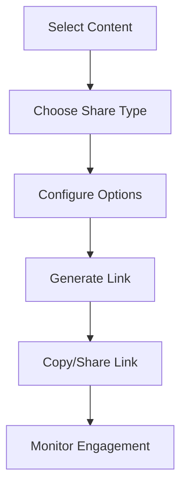
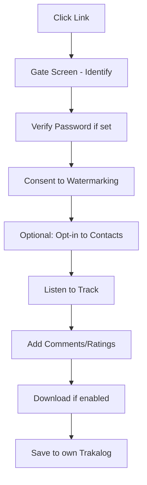
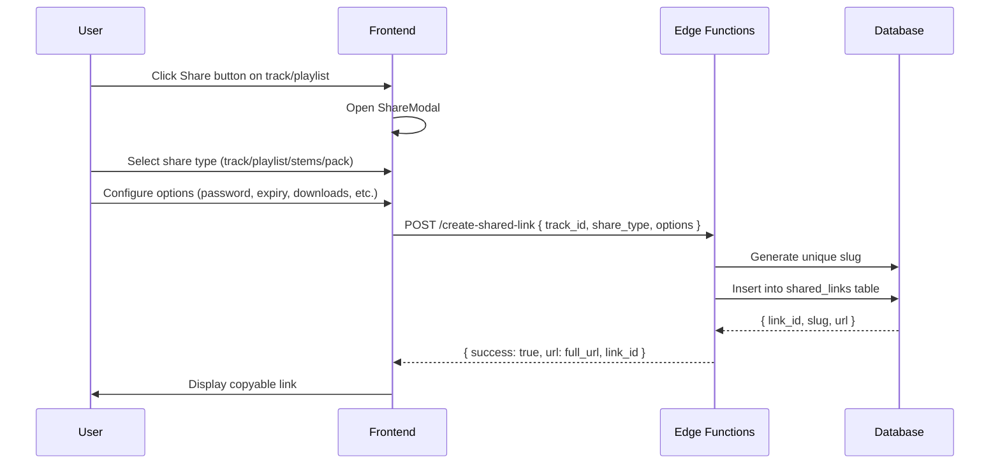
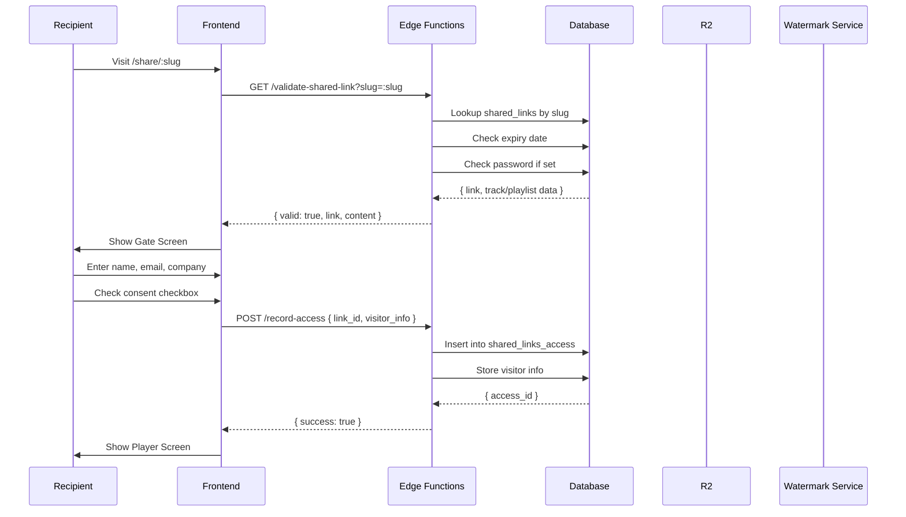
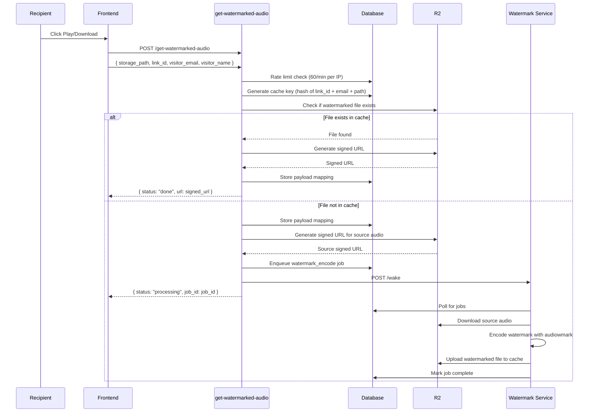

# Sharing System

> **Status:** Draft  
> **Version:** 1.0.0  
> **Created:** August 11, 2026  
> **Last Updated:** August 11, 2026  
> **Owner:** Ishan  
> **Related:** [03 - Data Architecture](../ARCHITECTURE/03-DATA_ARCHITECTURE.md), [04 - Component Architecture](../ARCHITECTURE/04-COMPONENT_ARCHITECTURE.md), [05 - Service Architecture](../ARCHITECTURE/05-SERVICE_ARCHITECTURE.md), [06 - Security Architecture](../ARCHITECTURE/06-SECURITY_ARCHITECTURE.md), [AUTH_PATTERNS.md](../ARCHITECTURE/AUTH_PATTERNS.md)

---

## Abstract

This document provides a comprehensive overview of Trakalog's Sharing System, which enables secure distribution of tracks, playlists, and stems to external recipients without requiring them to create accounts. The Sharing System is a core differentiator of Trakalog, providing **protected access** to unreleased music with built-in watermarking, feedback capture, and branding.

---

## 1. Feature Overview

### 1.1 Purpose

Trakalog's Sharing System enables creators to:

- Share individual tracks or entire playlists with external collaborators
- Control access with passwords, expiry dates, and permission settings
- Automatically watermark audio per-recipient for leak tracing
- Capture feedback and ratings from recipients
- Maintain full branding control over the recipient experience
- Track engagement metrics (plays, downloads, geography)

**Key Differentiator:** Unlike generic file-sharing services, Trakalog's Sharing System is **recipient-first** — designed around the experience of the person receiving the link, not the person sending it. Recipients never need to sign up, and every interaction is tracked and watermarked.

### 1.2 User Journey

**Sender Side:**


**Recipient Side (W4 Workflow):**


### 1.3 Share Types

Trakalog supports four distinct share types, each with different watermarking behavior:

| Type | Contents | Watermarked | Use Case |
|------|----------|-------------|----------|
| `track` | One track | **Always** | Individual track feedback |
| `playlist` | Ordered set of tracks | **Always** | Multi-track review |
| `stems` | Component audio files | **No** | Working material exchange |
| `pack` | Final delivery/masters | **No** | Clean audio for label handoff |

**Design Principle:** Watermarking depends on `share_type`, **never** on delivery format (file vs ZIP). Packs deliberately deliver clean masters for final delivery scenarios.

### 1.4 Core Components

| Component | Type | Location | Responsibility |
|-----------|------|----------|----------------|
| Share Modal | React Component | `src/components/sharing/ShareModal.tsx` | Link generation UI |
| Share Link Page | React Component | `src/pages/SharePage.tsx` | Recipient experience |
| Shared Links Table | Database Table | `public.shared_links` | Link metadata storage |
| Shared Links Access | Database Table | `public.shared_links_access` | Recipient access tracking |
| Watermark Payloads | Database Table | `public.watermark_payloads` | Hash to recipient mapping |
| Get Watermarked Audio | Edge Function | `supabase/functions/get-watermarked-audio/` | Dynamic watermark serving |

---

## 2. Architecture

### 2.1 Component Diagram

```mermaid
componentDiagram
    direction LR
    
    component Frontend {
        component "Share Button" as ShareBtn
        component "Share Modal" as ShareModal
        component "Link Management" as LinkMgmt
        component "Share Page" as SharePage
    }
    
    component Backend {
        component "Supabase DB" as DB
        component "Edge Functions" as EdgeFunc
        component "RLS Policies" as RLS
    }
    
    component Services {
        component "R2 Storage" as R2
        component "Watermark Service" as WatermarkSvc
    }
    
    ShareBtn --> ShareModal : Open modal
    ShareModal --> EdgeFunc : Create shared_link
    LinkMgmt --> DB : Query shared_links
    SharePage --> EdgeFunc : Request audio
    
    EdgeFunc --> DB : Store access records
    EdgeFunc --> R2 : Check cache
    EdgeFunc --> WatermarkSvc : Encode watermark
    EdgeFunc --> R2 : Store watermarked audio
    
    DB --> RLS : Enforce link-level permissions
```

### 2.2 Data Flow

#### Link Creation Flow



#### Recipient Access Flow



#### Watermarked Audio Serving Flow



---

## 3. Implementation Details

### 3.1 Share Configuration Options

When creating a shared link, the following options can be configured:

| Option | Type | Default | Description |
|--------|------|---------|-------------|
| `password` | string | null | Password protection for link access |
| `expires_at` | timestamp | null | Link expiration date/time |
| `download_enabled` | boolean | true | Allow recipients to download |
| `download_quality` | enum | `high` | `low` (128kbps) / `medium` (256kbps) / `high` (320kbps) |
| `save_to_trakalog_enabled` | boolean | true | Allow recipients to save to their own workspace |
| `watermark_enabled` | boolean | true | Enable per-recipient watermarking |
| `branding` | object | workspace default | Override workspace branding |
| `notification_email` | boolean | true | Notify sender when link is accessed |

### 3.2 Share Type Details

#### Track Share (`share_type = 'track'`)
- Shares a single track
- Watermarking: **Always enabled** (per-recipient)
- Download: Configurable (WAV or MP3)
- Comments: Enabled
- Ratings: Enabled (1-5 stars)

#### Playlist Share (`share_type = 'playlist'`)
- Shares multiple tracks as an ordered collection
- Watermarking: **Always enabled** (per-recipient, per-track)
- Download: Configurable (individual or ZIP of all)
- Comments: Enabled (per-track)
- Ratings: Enabled (per-track)

#### Stems Share (`share_type = 'stems'`)
- Shares component audio files (drums, bass, vocals, etc.)
- Watermarking: **Disabled** (working material, not final)
- Download: Configurable (individual or ZIP)
- Comments: Disabled
- Ratings: Disabled

#### Pack Share (`share_type = 'pack'`)
- Shares final delivery materials
- Watermarking: **Disabled by design** (clean audio for mastering/label)
- Download: Configurable (ZIP of all tracks)
- Comments: Disabled
- Ratings: Disabled

### 3.3 Key Files

| File | Purpose |
|------|---------|
| `src/components/sharing/ShareModal.tsx` | Link creation modal |
| `src/components/sharing/ShareButton.tsx` | Share trigger component |
| `src/pages/SharePage.tsx` | Recipient-facing share page |
| `src/pages/SharedLinkManagement.tsx` | Manage all issued links |
| `src/components/audio/ShareAudioPlayer.tsx` | Watermarked audio player |
| `src/hooks/useSharedLink.ts` | Share link state management |
| `supabase/functions/create-shared-link/index.ts` | Create shared link Edge Function |
| `supabase/functions/get-watermarked-audio/index.ts` | Watermarked audio delivery |
| `supabase/functions/validate-shared-link/index.ts` | Link validation |

### 3.4 Watermarking Process

Each shared link recipient receives a **uniquely watermarked** version of the audio:

1. **Payload Generation:** Unique hash generated from link_id + visitor_email + timestamp
2. **Audio Encoding:** audiowmark v0.6.5 embeds watermark inaudibly into WAV
3. **MP3 Conversion:** Watermarked WAV converted to MP3 at selected quality
4. **Storage:** Cached in R2 at `R2_BUCKET_WATERMARKED/{hash}.mp3`
5. **Tracking:** Hash and visitor info stored in `watermark_payloads` table

**Tracing:** When a leaked file is discovered, the watermark can be extracted and matched against `watermark_payloads` to identify the recipient.

### 3.5 Gate Screen Configuration

The gate screen (`/share/:slug`) captures recipient information:

| Field | Required | Purpose |
|-------|----------|---------|
| `name` | Yes | Recipient identification |
| `email` | Yes | Contact and watermarking key |
| `company` | No | Organization context |
| `role` | No | Professional role (A&R, Supervisor, etc.) |
| `consent` | Yes | Agreement to watermarking/tracing |
| `contact_opt_in` | No | Permission to add to sender's contacts |

---

## 4. Database Schema

### 4.1 Shared Links Table (`public.shared_links`)

Stores metadata for all created shared links.

| Column | Type | Nullable | Description |
|--------|------|----------|-------------|
| `id` | uuid | NO | Primary key |
| `workspace_id` | uuid | NO | Owning workspace |
| `created_by` | uuid | NO | User who created link |
| `link_slug` | text | NO | Unique URL slug |
| `share_type` | text | NO | `track` / `playlist` / `stems` / `pack` |
| `track_id` | uuid | YES | Target track (for track/stems shares) |
| `playlist_id` | uuid | YES | Target playlist (for playlist shares) |
| `title` | text | YES | Custom link title |
| `password` | text | YES | Password hash (bcrypt) |
| `expires_at` | timestamptz | YES | Link expiration timestamp |
| `max_accesses` | integer | YES | Maximum number of accesses |
| `access_count` | integer | NO | Current access count |
| `download_enabled` | boolean | NO | Download permission |
| `download_quality` | text | NO | `low` / `medium` / `high` |
| `save_to_trakalog_enabled` | boolean | NO | Allow saving to workspace |
| `watermark_enabled` | boolean | NO | Enable watermarking |
| `branding_override` | jsonb | YES | Custom branding settings |
| `notification_email` | boolean | NO | Notify on access |
| `is_active` | boolean | NO | Link is active |
| `created_at` | timestamptz | NO | Creation timestamp |
| `updated_at` | timestamptz | NO | Last update timestamp |

### 4.2 Shared Links Access Table (`public.shared_links_access`)

Tracks every recipient access to a shared link.

| Column | Type | Nullable | Description |
|--------|------|----------|-------------|
| `id` | uuid | NO | Primary key |
| `link_id` | uuid | NO | Parent shared link |
| `visitor_name` | text | YES | Recipient name |
| `visitor_email` | text | YES | Recipient email |
| `visitor_company` | text | YES | Recipient company |
| `visitor_role` | text | YES | Recipient role |
| `consent_given` | boolean | NO | Watermark consent granted |
| `contact_opt_in` | boolean | NO | Added to contacts |
| `ip_address` | inet | YES | Recipient IP address |
| `user_agent` | text | YES | Browser/device info |
| `accessed_at` | timestamptz | NO | First access timestamp |
| `last_accessed_at` | timestamptz | YES | Last access timestamp |
| `play_count` | integer | NO | Number of plays |
| `download_count` | integer | NO | Number of downloads |
| `rating` | integer | YES | Overall rating (1-5) |
| `comments` | text[] | YES | Array of timecoded comments |

### 4.3 Watermark Payloads Table (`public.watermark_payloads`)

Maps watermark hashes to recipient information for leak tracing.

| Column | Type | Nullable | Description |
|--------|------|----------|-------------|
| `id` | uuid | NO | Primary key |
| `hash` | text | NO | Unique watermark hash |
| `link_id` | uuid | NO | Parent shared link |
| `visitor_name` | text | NO | Recipient name |
| `visitor_email` | text | NO | Recipient email |
| `track_id` | uuid | NO | Watermarked track |
| `created_at` | timestamptz | NO | Watermark creation timestamp |

### 4.4 Catalog Shares Table (`public.catalog_shares`)

Workspace-to-workspace sharing (different from external shared links).

| Column | Type | Nullable | Description |
|--------|------|----------|-------------|
| `id` | uuid | NO | Primary key |
| `source_workspace_id` | uuid | NO | Source workspace |
| `target_workspace_id` | uuid | NO | Target workspace |
| `track_id` | uuid | YES | Specific track (null = entire catalog) |
| `status` | text | NO | `pending` / `active` / `revoked` / `declined` |
| `permissions` | jsonb | NO | Granular permissions object |
| `expires_at` | timestamptz | YES | Share expiration |
| `created_by` | uuid | NO | User who initiated share |
| `created_at` | timestamptz | NO | Creation timestamp |

---

## 5. Integration Points

### 5.1 With Other Features

| Feature | Integration | Description |
|---------|-------------|-------------|
| **Track Management** | Direct | Shares tracks created via Track Management |
| **Watermarking** | Core | Per-recipient watermarking for leak tracing |
| **Feedback System** | Built-in | Timecoded comments and ratings from recipients |
| **Contacts** | Optional | Recipient info can be added to workspace contacts |
| **Branding** | Applied | Workspace branding applied to share pages |
| **Catalog Sharing** | Parallel | Workspace-to-workspace sharing (separate from external links) |

### 5.2 With External Services

| Service | Integration | Description |
|---------|-------------|-------------|
| **R2 Storage** | S3-compatible API | Watermarked audio caching and retrieval |
| **Watermark Service** | HTTP API + Workers | audiowmark encoding and verification |
| **Resend** | REST API | Optional notification emails to sender |

---

## 6. Configuration

### 6.1 Environment Variables

| Variable | Purpose | Default |
|----------|---------|---------|
| `SHARED_LINKS_ENABLED` | Enable shared link feature | `true` |
| `MAX_SHARED_LINKS_PER_TRACK` | Maximum links per track | `50` |
| `SHARED_LINK_DEFAULT_EXPIRY` | Default expiry in days | `30` |
| `WATERMARK_ALLOWED_HOSTS` | Allowed R2 hosts for watermarking | - |
| `RATE_LIMIT_SHARED_LINK` | Rate limit per IP (requests/min) | `60` |

### 6.2 Feature Flags

| Flag | Location | Description |
|------|----------|-------------|
| `SAVE_TO_TRAKALOG_ENABLED` | `src/config/features.ts` | Allow recipients to save shared content |
| `PASSWORD_PROTECTION_ENABLED` | `src/config/features.ts` | Enable password on links |
| `EXPIRY_DATE_ENABLED` | `src/config/features.ts` | Enable expiry dates |
| `WATERMARK_OVERRIDE_ENABLED` | `src/config/features.ts` | Allow disabling watermark |

### 6.3 Permissions

| Operation | Required Role | RLS Policy |
|-----------|---------------|------------|
| Create shared link | Pitcher, Editor, Admin | `shared_links_insert` |
| View own links | Pitcher, Editor, Admin | `shared_links_select_own` |
| View all links | Editor, Admin | `shared_links_select_all` |
| Revoke link | Pitcher (own), Editor, Admin | `shared_links_delete` |
| Access shared link | None (public) | Link validation only |

---

## 7. Security Considerations

### 7.1 Rate Limiting

- **60 requests/minute per IP** for watermarked audio generation
- **100 link validations/hour per IP** to prevent enumeration
- **Cache watermarked files** to avoid reprocessing

### 7.2 Password Security

- Passwords stored as **bcrypt hash** (cost factor 12)
- No plaintext passwords in logs or database backups
- Password reset requires link owner authentication

### 7.3 Data Privacy

- Recipient email and name stored for **watermarking and tracing only**
- Contact opt-in is **separate and explicit** (unchecked by default)
- Access to recipient PII requires **workspace membership verification**

### 7.4 Link Security

- Unique slug generated using **crypto-random UUID v4**
- Slug is **not sequential** and cannot be guessed
- Expired links return **404, not 403** (security through obscurity)

---

## 8. Edge Cases and Considerations

### 8.1 Large-Scale Sharing

- **Bulk Link Creation:** Can create links for multiple tracks simultaneously
- **Link Duplication:** Same track can have multiple active links with different settings
- **Access Limits:** `max_accesses` can cap the number of unique recipients

### 8.2 Expiry and Revocation

- **Soft Revocation:** Revoked links return custom "Link Revoked" page
- **Hard Expiry:** Expired links return 404
- **Grace Period:** 24-hour grace period for links expiring soon (configurable)

### 8.3 Watermarking Edge Cases

- **Same Recipient Multiple Emails:** Different email = different watermark
- **Same Email Different Links:** Different link = different watermark
- **Download Then Stream:** Watermark generated once, reused for both
- **ZIP Downloads:** Each track in ZIP gets unique watermark

### 8.4 Save to Trakalog

- Recipient must be **authenticated** to use this feature
- Saved track creates a **copy** in recipient's workspace
- Original watermarking **persists** (can be traced back to source)
- Recipient becomes **owner** of their copy

---

## 9. Troubleshooting

### Common Issues

| Issue | Cause | Solution |
|-------|-------|----------|
| Link returns 404 | Link expired or revoked | Check expiry date, recreate link |
| Audio not playing | Watermark processing failed | Check watermark service logs |
| Download disabled | Link settings | Verify download_enabled in shared_links |
| Password not working | Incorrect password | Reset password or recreate link |
| Watermark extraction failed | Audio was converted/re-encoded | Use original file for tracing |

### Debugging Commands

```bash
# Check shared links for a track
psql -c "SELECT * FROM shared_links WHERE track_id = 'xxx' ORDER BY created_at DESC;"

# Check access records for a link
psql -c "SELECT * FROM shared_links_access WHERE link_id = 'xxx' ORDER BY accessed_at DESC;"

# Check watermark payloads
psql -c "SELECT * FROM watermark_payloads WHERE link_id = 'xxx';"

# Check watermark service health
curl -I https://watermark-service/health

# Check R2 watermarked bucket
rclone lsd r2:trakalog-watermarked/
```

### Leak Tracing

```bash
# Given a leaked audio file, extract watermark
ffmpeg -i leaked.mp3 -f wav - | audiowmark decode -

# Then query the hash
psql -c "SELECT * FROM watermark_payloads WHERE hash = 'extracted-hash';"

# Verify the recipient belongs to a specific workspace
psql -c "SELECT sl.* FROM shared_links sl JOIN watermark_payloads wp ON sl.id = wp.link_id WHERE wp.hash = 'extracted-hash' AND sl.workspace_id = 'workspace-uuid';"
```

### Log Locations

- **Frontend:** Browser console, Sentry error tracking
- **Backend:** Supabase Edge Functions logs
- **Watermark Service:** Railway service logs
- **Access Tracking:** Supabase database audit logs

---

## 10. Analytics and Metrics

### Tracked Metrics

| Metric | Description | Storage |
|--------|-------------|---------|
| Access Count | Total unique recipients | `shared_links.access_count` |
| Play Count | Total plays across all recipients | Sum of `shared_links_access.play_count` |
| Download Count | Total downloads | Sum of `shared_links_access.download_count` |
| Avg Rating | Average rating (1-5) | Avg of `shared_links_access.rating` |
| Geographic | Recipient locations | Derived from IP address |
| Time on Page | Engagement duration | Frontend analytics |

### Engagement Dashboard

Available at `/shared-links` for workspace admins:
- Real-time access monitoring
- Geographic heatmap of recipients
- Play/download over time charts
- Top recipients by engagement
- Link performance comparison

---

## 11. Future Enhancements

- [ ] Analytics dashboard enhancements
- [ ] Custom branding per-link (override workspace defaults)
- [ ] Scheduled link activation
- [ ] Recipient email domain restrictions
- [ ] Link A/B testing (different gate screens)
- [ ] Integration with CRM systems

---

## Appendix A: Quick Reference

| Task | How To |
|------|--------|
| Create a share link | Track/Playlist detail → Click "Share" → Configure → Copy link |
| View all links | Navigate to `/shared-links` |
| Revoke a link | `/shared-links` → "..." → "Revoke" |
| Set link password | Share modal → Enable password → Set password |
| Set expiry date | Share modal → Enable expiry → Pick date |
| View link analytics | `/shared-links` → Click on link → View Analytics tab |
| Trace a leak | Use audiowmark decode → Query watermark_payloads |

---

## Appendix B: Document Metadata

| Property | Value |
|----------|-------|
| **Created** | August 11, 2026 |
| **Version** | 1.0.0 |
| **Owner** | Ishan |
| **Status** | Draft |
| **Phase** | 2 (Depth) |
| **Effort** | 3h |
