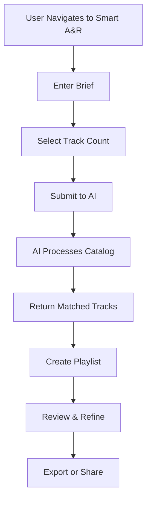
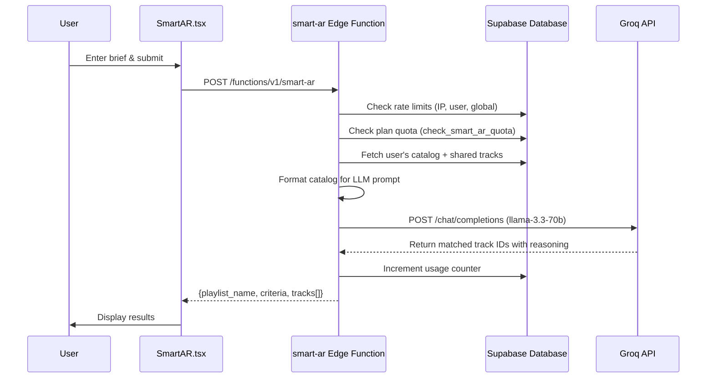

# Smart A&R

> **Status:** Draft  
> **Version:** 1.0.0  
> **Created:** August 18, 2026  
> **Last Updated:** August 18, 2026  
> **Owner:** Ishan  
> **Related:** [02 - System Architecture](../ARCHITECTURE/02-SYSTEM_ARCHITECTURE.md), [05 - Service Architecture](../ARCHITECTURE/05-SERVICE_ARCHITECTURE.md), [GROQ_USAGE_AND_COSTS.md](../ARCHITECTURE/GROQ_USAGE_AND_COSTS.md), [TRAKALOG_BILLING.md](TRAKALOG_BILLING.md)

---

## Abstract

This document provides a comprehensive overview of Trakalog's Smart A&R (Artists & Repertoire) feature, which uses AI-powered matching to help users find the best tracks in their catalog for specific briefs, opportunities, or creative needs. Smart A&R leverages Groq's LLM capabilities to analyze track metadata and match against user briefs with intelligent ranking.

---

## 1. Feature Overview

### 1.1 Purpose

Trakalog's Smart A&R feature enables:

- **AI-Powered Matching:** Automatically find tracks that match A&R briefs, mood requirements, or sync opportunities
- **Catalog Intelligence:** Leverage metadata (genre, BPM, key, mood, Sonic DNA) for precise matching
- **Natural Language Understanding:** Process free-text briefs and extract musical requirements
- **Dual Mode Operation:** Personal catalog mode (workspace + shared catalogs) and marketplace mode (public catalogs)

**Key Differentiator:** Unlike traditional search, Smart A&R understands musical context — it can match tracks based on subtle characteristics like "uplifting female vocal with tropical vibes at 120 BPM in C major" without requiring users to specify technical filters.

### 1.2 User Journey



### 1.3 Core Components

| Component | Type | Location | Responsibility |
|-----------|------|----------|----------------|
| SmartAR Page | React Component | `src/pages/SmartAR.tsx` | User interface for brief input and results |
| smart-ar Edge Function | Edge Function | `supabase/functions/smart-ar/index.ts` | AI matching logic, Groq integration |
| Groq API | External Service | `llama-3.3-70b-versatile` | LLM for matching analysis |
| Catalog Data | Database | `public.tracks`, `public.catalog_shares` | Track metadata and sharing information |
| Usage Tracking | Database | `public.subscriptions` | Quota enforcement and billing |

---

## 2. Architecture

### 2.1 Component Diagram

```mermaid
componentDiagram
    direction LR
    
    component Frontend {
        component "SmartAR Page" as SmartAR
        component "Track List" as TrackList
        component "Audio Player" as AudioPlayer
        component "Playlist Context" as PlaylistCtx
    }
    
    component Backend {
        component "smart-ar EF" as SmartARFunc
        component "Supabase DB" as DB
        component "RLS Policies" as RLS
    }
    
    component Services {
        component "Groq API" as Groq
    }
    
    SmartAR --> SmartARFunc : POST {brief, workspace_id, count, mode}
    SmartAR --> PlaylistCtx : Create playlist from results
    SmartARFunc --> DB : Query tracks, check quota
    SmartARFunc --> Groq : LLM matching
    DB --> RLS : Enforce workspace access
```

### 2.2 Data Flow



### 2.3 Integration Points

| Integration | Type | Purpose |
|-------------|------|---------|
| Groq API | External Service | LLM-powered track matching |
| Supabase RPC | Database | Quota checking (`check_smart_ar_quota`) |
| Supabase RPC | Database | Usage tracking (`increment_smart_ar_usage`) |
| Rate Limiting | Internal | Protection against abuse (IP: 20/hr, user: 100/hr, global: 3000/24hr) |
| Catalog Shares | Database | Include shared tracks in matching |
| Workspace Context | Frontend | Active workspace determination |

---

## 3. Implementation Details

### 3.1 Frontend Implementation

**Location:** `src/pages/SmartAR.tsx`

The SmartAR page provides a chat-like interface where users can:
- Enter a natural language brief (up to 2000 characters)
- Select how many tracks to return (default: 5, or "all")
- View AI-generated results with reasoning
- Create a playlist from matched tracks
- Refine their brief based on results

Key React state:
- `brief`: The user's A&R brief text
- `trackCount`: Number of tracks to return
- `messages`: Chat history (user prompts and AI responses)
- `results`: Matched tracks from the AI
- `playlistName`: Auto-generated or user-provided playlist name

### 3.2 Edge Function Implementation

**Location:** `supabase/functions/smart-ar/index.ts`

The edge function handles:

1. **Authentication & Authorization**
   - Validates JWT token from request
   - Uses `getAuthedUser()` to extract user identity
   - Enforces workspace membership via `assertWorkspaceMember()`

2. **Rate Limiting (Pre-billing guards)**
   - IP-based: 20 requests/hour per IP
   - User-based: 100 requests/hour per user
   - Global: 3000 requests/24h across all users

3. **Quota Enforcement**
   - Calls `reset_monthly_usage_if_due()` to handle billing period rollover
   - Calls `check_smart_ar_quota()` to verify user has remaining quota
   - Returns HTTP 402 `plan_limit_reached` when quota exhausted

4. **Catalog Retrieval**
   - **Personal mode:** Fetches tracks from specified workspace + shared catalogs
   - **Marketplace mode:** Fetches public tracks with `is_marketplace_public = true`
   - Handles both individual track shares and full catalog shares
   - Deduplicates tracks by ID

5. **Prompt Construction**
   - Fixed system prompt (~750 tokens) with matching rules
   - Catalog formatted as numbered list with metadata
   - For catalogs >40 tracks: omits status, featuring, language fields
   - Each track: ~100 tokens (UUID, title, artist, genre, BPM, key, mood, etc.)
   - Includes Sonic DNA data when available
   - Includes up to 30 tags per track (across all tag categories)
   - User brief appended at end (max 2000 chars)

6. **Groq Integration**
   - Uses `llama-3.3-70b-versatile` model
   - Context window: 128,000 tokens (~1250 tracks max)
   - Output format: JSON with playlist_name, criteria, and track array
   - Temperature: Configured for deterministic matching

7. **Usage Tracking**
   - Calls `increment_smart_ar_usage()` after successful query
   - Only increments on success (failed queries don't count against quota)

### 3.3 Modes of Operation

#### Mode: Personal (Default)
- Scopes to user's active workspace
- Includes tracks from that workspace
- Includes tracks shared INTO that workspace via `catalog_shares`
- Enforces workspace membership (IDOR protection)

#### Mode: Marketplace
- Scopes to all public tracks (`is_marketplace_public = true`)
- Returns limited metadata (no splits, credits, or audio URLs)
- Limit: 500 tracks maximum
- Used for discovering tracks across the Trakalog ecosystem

### 3.4 Security Considerations

1. **IDOR Protection**
   - Personal mode requires `assertWorkspaceMember()` check
   - Prevents users from querying other workspaces' catalogs
   - Shared catalogs are accessible only through the share target workspace

2. **Input Sanitization**
   - Brief capped at 2000 characters
   - Tags sanitized to remove control characters, newlines, backticks
   - Metadata fields capped at 50 characters each
   - Prompt injection mitigation via character filtering

3. **Rate Limiting Order**
   - Guards ordered from narrowest to widest scope
   - All rate limits checked BEFORE Groq API call
   - Failed calls don't count against user quota

---

## 4. Configuration

### 4.1 Environment Variables

| Variable | Required | Default | Description |
|----------|----------|---------|-------------|
| _(none)_ | — | — | Smart A&R has no environment variables and no feature flag |
| `GROQ_API_KEY` | Yes | - | API key for Groq service |
| `SUPABASE_URL` | Yes | - | Supabase project URL |
| `SUPABASE_SERVICE_ROLE_KEY` | Yes | - | Service role key for admin access |

### 4.2 Feature Flags

```typescript
// In src/config/features.ts
SMART_AR_ENABLED: true,
```

### 4.3 Plan-Based Quotas

Quotas are defined in the `plans` table and enforced via `check_smart_ar_quota()`:

| Plan | Monthly Smart A&R Queries | Lifetime Limit |
|------|----------------------------|----------------|
| Starter | Configurable | Configurable |
| Professional | Configurable | Configurable |
| Business | Configurable | Configurable |
| Enterprise | Configurable | Configurable |

Monthly usage is tracked on `subscriptions.smart_ar_queries_this_month`, incremented by the
`increment_smart_ar_usage(_user_id)` RPC after a successful query.

There is **no `subscriptions.smart_ar_queries_lifetime` column.** The lifetime cap is a *plan*
attribute, `plan_limits.smart_ar_lifetime`, enforced by the `check_smart_ar_quota(_user_id)`
RPC that `smart-ar/index.ts:30` calls before doing any work.

---

## 5. Performance Characteristics

### 5.1 Token Usage

| Catalog Size | Input Tokens | Output Tokens | Cost per Query |
|--------------|--------------|---------------|----------------|
| 50 tracks | ~5,750 | ~510 | ~$0.004 |
| 200 tracks | ~20,750 | ~910 | ~$0.013 |
| 500 tracks | ~50,750 | ~2,260 | ~$0.030 |
| 1,000 tracks | ~100,750 | ~4,510 | ~$0.060 |

**Context Window Limit:** 128,000 tokens (~1,250 tracks)

### 5.2 Latency

| Phase | Typical Duration | Notes |
|-------|-----------------|-------|
| Rate limit checks | <100ms | Postgres `check_rate_limit` against `rate_limits` |
| Quota check | <100ms | Database RPC |
| Catalog fetch | 100-500ms | Depends on catalog size |
| Groq inference | 2-5s | Model and load dependent |
| Total | 3-7s | End-to-end |

**Optimization Note:** Large catalogs (>40 tracks) use reduced metadata fields to stay within context limits.

### 5.3 Caching

- No caching implemented at the Edge Function level
- Groq responses are not cached (each query is unique)
- Catalog data fetched fresh for each query
- Future: Consider caching catalog snapshots for users with static catalogs

---

## 6. Troubleshooting

### 6.1 Common Issues

| Symptom | Cause | Solution |
|---------|-------|----------|
| HTTP 429 | Rate limit exceeded | Wait and retry (IP: 20/hr, user: 100/hr) |
| HTTP 402 | Plan quota exceeded | Upgrade plan or wait for monthly reset |
| HTTP 403 | Access denied | Verify workspace membership |
| No results | Empty catalog | Upload tracks to workspace |
| Timeout | Large catalog + slow model | Reduce catalog size or try again |
| Truncated response | Context window exceeded | Reduce catalog to <1250 tracks |

### 6.2 Debugging

**Frontend Logs:**
- Check browser console for network errors
- Verify `SMART_AR_ENABLED` feature flag
- Check `supabase.functions.invoke("smart-ar", ...)` call

**Edge Function Logs:**
```bash
# View logs for smart-ar function
supabase functions logs smart-ar
```

**Common Log Messages:**
- `smart-ar: quota reached user=...` - User hit plan limit
- `smart-ar: rate limit hit guard=...` - Rate limit triggered
- `smart-ar: Groq API fetch failed` - Groq integration error
- `smart-ar: usage increment failed` - Database error tracking usage

### 6.3 Testing

**Manual Test:**
1. Navigate to `/smart-ar`
2. Enter a brief like "uplifting tropical house track with female vocals"
3. Verify results match the brief
4. Check that usage counter increments

**Edge Function Test:**
```bash
# Direct test (requires valid JWT)
curl -X POST https://[project-ref].supabase.co/functions/v1/smart-ar \
  -H "Authorization: Bearer [JWT]" \
  -H "Content-Type: application/json" \
  -d '{"brief": "find upbeat tracks", "workspace_id": "[workspace-uuid]", "track_count": 5, "mode": "personal"}'
```

---

## 7. Future Enhancements

### 7.1 Planned Improvements

1. **Catalog Caching** - Cache catalog snapshots to reduce database queries
2. **Incremental Matching** - For large catalogs, implement pagination or chunked matching
3. **Model Fine-tuning** - Custom model trained on music industry briefs
4. **Multi-model Support** - Allow users to select different AI models
5. **Result Filtering** - Post-process results based on additional criteria
6. **History & Learning** - Remember past briefs and improve based on user feedback

### 7.2 Known Limitations

1. **Context Window Limit** - Maximum ~1250 tracks per query
2. **Static Prompt** - System prompt is fixed, not customizable per user
3. **No Result Persistence** - AI results not stored, must be saved as playlist
4. **English Only** - Brief must be in English for optimal results
5. **No Audio Analysis** - Matching based on metadata only, not audio content

---

## 8. Appendix

### 8.1 Example Prompt Structure

```
SYSTEM: You are a music A&R assistant. Analyze the following catalog and find tracks matching the brief.

CATALOG:
1. [uuid-1] Track Title - Artist | genre: Pop | bpm: 120 | key: C Major | mood: Happy | ...
2. [uuid-2] Another Track - Artist | genre: House | bpm: 128 | key: A Minor | mood: Energetic | ...
...

BRIEF: "Find uplifting tropical house tracks with female vocals for a summer playlist"

RESPONSE FORMAT: JSON with playlist_name, criteria, and tracks array
```

### 8.2 Related RPC Functions

| Function | Purpose |
|----------|---------|
| `check_smart_ar_quota(_user_id)` | Check remaining Smart A&R quota |
| `increment_smart_ar_usage(_user_id)` | Increment usage counter after successful query |
| `reset_monthly_usage_if_due(_user_id)` | Reset counters at billing period start |
| `check_rate_limit(_key, _max_requests, _window_seconds)` | Generic rate limiting function |

### 8.3 Quick Reference

| Action | Endpoint | Method |
|--------|----------|--------|
| Invoke Smart A&R | `/functions/v1/smart-ar` | POST |
| Check quota | `supabase.rpc('check_smart_ar_quota', {...})` | RPC |
| View usage | `subscriptions.smart_ar_queries_this_month` | Column |

---

## Document Metadata

| Property | Value |
|----------|-------|
| **Created** | August 18, 2026 |
| **Version** | 1.0.0 |
| **Owner** | Ishan |
| **Status** | Draft |
| **Last Review** | - |
| **Next Review** | September 18, 2026 |
| **Related Docs** | [02 - System Architecture](../ARCHITECTURE/02-SYSTEM_ARCHITECTURE.md), [05 - Service Architecture](../ARCHITECTURE/05-SERVICE_ARCHITECTURE.md) |

---

*This document is a living resource. It will be updated as the Smart A&R feature evolves.*
