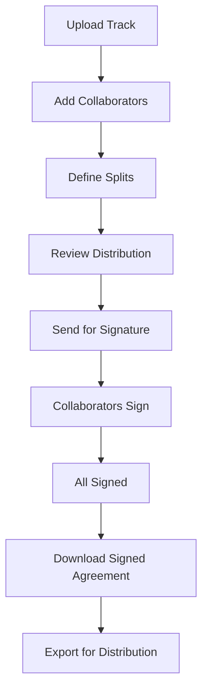
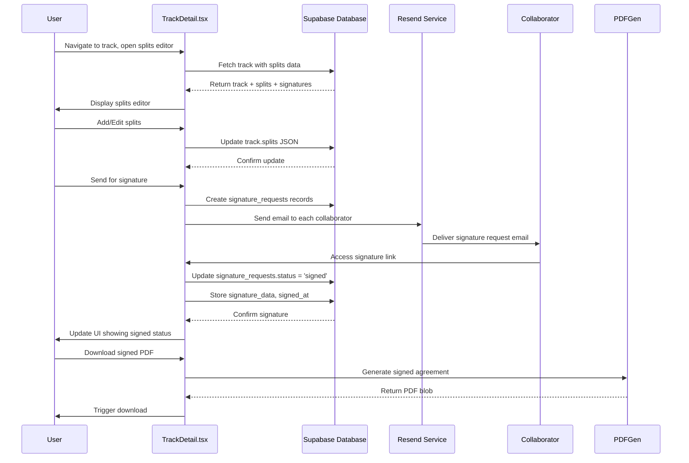

# Splits & Signatures

> **Status:** Draft  
> **Version:** 1.0.0  
> **Created:** August 18, 2026  
> **Last Updated:** August 18, 2026  
> **Owner:** Ishan  
> **Related:** [02 - System Architecture](../ARCHITECTURE/02-SYSTEM_ARCHITECTURE.md), [03 - Data Architecture](../ARCHITECTURE/03-DATA_ARCHITECTURE.md), [06 - Security Architecture](../ARCHITECTURE/06-SECURITY_ARCHITECTURE.md)

---

## Abstract

This document provides a comprehensive overview of Trakalog's Splits & Signatures system, which manages publishing ownership percentages and digital signature collection for track collaborators. This feature ensures proper credit, royalty distribution, and legal agreement tracking for music releases.

---

## 1. Feature Overview

### 1.1 Purpose

Trakalog's Splits & Signatures feature enables:

- **Ownership Management:** Define and track ownership percentages for each collaborator on a track
- **Digital Signatures:** Collect legally-binding digital signatures on split agreements
- **Automated Calculations:** Ensure splits total exactly 100% with validation
- **Role-Based Permissions:** Control who can view, edit, and sign split agreements
- **PDF Generation:** Generate signed agreements for record-keeping and distribution
- **External Signature Tracking:** Record signatures obtained outside the platform

**Key Differentiator:** Unlike traditional contract management systems, Trakalog's Splits & Signatures is deeply integrated with the track metadata, enabling seamless workflow from track upload through to release-ready documentation.

### 1.2 User Journey



### 1.3 Core Components

| Component | Type | Location | Responsibility |
|-----------|------|----------|----------------|
| TrackDetail Page | React Component | `src/pages/TrackDetail.tsx` | Splits editing and signature management UI |
| Contacts Management | React Component | `src/pages/Contacts.tsx` | Collaborator directory and role management |
| PDF Generators | Library | `src/lib/pdf-generators.ts` | Generate signed split agreement PDFs |
| Split Utilities | Library | `src/lib/split-utils.ts` | Split calculation and distribution logic |
| Signature Requests | Database | `public.signature_requests` | Track signature status and data |
| Tracks | Database | `public.tracks` | Store split definitions per track |
| RPC Functions | Database | Various RPCs | Signature sending, marking, and management |

---

## 2. Architecture

### 2.1 Component Diagram

```mermaid
componentDiagram
    direction LR
    
    component Frontend {
        component "Track Detail" as TrackDetail
        component "Contacts" as Contacts
        component "PDF Generators" as PDFGen
    }
    
    component Backend {
        component "Supabase DB" as DB
        component "RLS Policies" as RLS
        component "Edge Functions" as EdgeFunc
    }
    
    component Services {
        component "Resend" as Resend
    }
    
    TrackDetail --> DB : Read/write splits
    TrackDetail --> DB : Read signature status
    TrackDetail --> PDFGen : Generate PDF agreements
    Contacts --> DB : Manage collaborator info
    TrackDetail --> Resend : Send signature requests via email
    DB --> RLS : Enforce access control on signatures
```

### 2.2 Data Flow



### 2.3 Integration Points

| Integration | Type | Purpose |
|-------------|------|---------|
| Resend | External Service | Email delivery for signature requests |
| Supabase Storage | Cloud Storage | Store generated PDF agreements |
| RLS Policies | Database | Restrict signature access to authorized users |
| Track Context | Frontend | Provide track metadata for split calculations |
| Workspace Context | Frontend | Determine permission levels |

---

## 3. Implementation Details

### 3.1 Frontend Implementation

**Location:** `src/pages/TrackDetail.tsx` (SplitsSection)

The TrackDetail page handles splits and signatures through:

1. **Splits Editor**
   - Visual bar chart showing split distribution
   - Inline editing for each collaborator's percentage
   - Total percentage calculation with validation
   - "Equal Split" button for automatic distribution

2. **Signature Status Display**
   - Shows signing status for each collaborator
   - Visual indicators: signed (green check), pending (orange clock), declined (red X)
   - Support for externally signed agreements

3. **Permissions**
   - `splitsPermissions.canManageSplits`: Can edit splits
   - `splitsPermissions.canViewSplits`: Can view splits
   - Based on workspace role and track ownership

4. **Actions**
   - Add/Remove collaborators
   - Edit split percentages
   - Send for signature (bulk email)
   - Mark as externally signed
   - Download unsigned PDF
   - Download signed PDF (when all signed)
   - Send executed copies
   - Unmark external signatures

### 3.2 Data Model

#### Track Splits

Stored as JSON array in `tracks.splits` column:

```typescript
interface Split {
  id: string;
  name: string;           // Collaborator name
  stage_name?: string;   // Stage name / artist name
  role: string;          // Role: Artist, Producer, Writer, etc.
  share: number;         // Percentage (0-100)
  pro?: string;          // PRO affiliation (ASCAP, BMI, SOCAN, etc.)
  ipi?: string;          // IPI number
  publisher?: string;    // Publisher name
  email?: string;        // Collaborator email (for signature requests)
}
```

#### Signature Requests

Stored in `signature_requests` table:

```typescript
interface SignatureRequest {
  id: uuid;
  track_id: uuid;         // Reference to track
  collaborator_name: string;  // Name from splits
  collaborator_email: string; // Email from splits
  split_share: number;      // Percentage from splits
  status: 'pending' | 'signed' | 'declined';
  signature_data?: string;  // Base64-encoded signature image/canvas data
  signed_at?: timestamp;    // When signature was collected
  signed_externally?: boolean; // Marked as signed outside platform
  token: string;           // Unique token for signature link
  created_at: timestamp;
}
```

There is **no `updated_at`** on `signature_requests`, and no `updated_at` trigger. State moves
forward through `status` (`pending` | `signed` | `declined`, CHECK-constrained), `signed_at`
and `signed_externally`.

### 3.3 Split Calculation

**Location:** `src/lib/split-utils.ts`

The module exports exactly **two** functions — `equalSplit` and `extractArtistNameCandidates`.
Anything else described as living here is elsewhere.

1. **equalSplit(splits, shareKey)** - Distribute 100% equally among all splits
   - Each split gets `100 / n` percentage
   - Last split absorbs rounding difference
   - Example: 3 splits = [33.33, 33.33, 33.34]%

2. **Validation**
   - Sum of all shares must equal exactly 100%
   - No individual share can exceed 100%
   - All shares must be non-negative
   - Warning if total != 100% or any split has no email

### 3.4 Signature Workflow

#### Send for Signature

1. **Validation**
   - Check all splits have emails (required for signature requests)
   - Check total equals 100%
   - Check user has permission to send signatures

2. **Database Operations**
   - Create `signature_requests` record for each collaborator
   - Generate unique token for each request
   - Set status to 'pending'

3. **Email Delivery**
   - Uses Resend service for email delivery
   - Each collaborator receives personalized email
   - Email contains direct link to signature page
   - Link includes token for authentication

4. **Signature Page**
   - Collaborator accesses unique URL with token
   - Views split agreement details
   - Can sign by drawing signature or typing name
   - Signature captured as canvas data (base64)

5. **Signature Storage**
   - Signature data stored in `signature_requests.signature_data`
   - Timestamp recorded in `signed_at`
   - Status updated to 'signed'

### 3.5 PDF Generation

**Location:** `src/lib/pdf-generators.ts`

Functions:
- `generateSplitsPdf(title, artist, splits, totalShares, asBlob?)` — the unsigned split sheet
  (`pdf-generators.ts:226`). There is **no `generateUnsignedAgreementPdf`**.
- `generateSignedAgreementPdf(title, artist, entries, asBlob?)` — the executed agreement
  (`pdf-generators.ts:1115`)
- `generateSignedAgreementPdfBase64(title, artist, entries)` — same, base64 for email
  attachment (`pdf-generators.ts:1123`)

PDF Content:
- Track title and artist
- Collaborator names, roles, and percentages
- PRO, IPI, publisher information
- Signature images (when signed)
- Signing dates
- Agreement text and legal notices

### 3.6 External Signatures

For tracks with signatures obtained outside Trakalog:

1. **Mark as Signed Externally**
   - User can mark splits as signed without sending emails
   - Sets `signed_externally = true` in signature_requests
   - Requires all splits to have emails

2. **Reversible**
   - Can be unmarked if needed
   - Useful for migration scenarios or manual processes

3. **Display**
   - Shows "Signed externally" label in UI
   - Included in signed PDF generation

### 3.7 RPC Functions

Key database functions for signature management:

| Function | Signature | Purpose |
|---|---|---|
| `get_signature_agreement_by_token` | `(_token text)` | Retrieve a signature request by its token |
| `mark_splits_signed_externally` | `(_user_id uuid, _track_id uuid)` → `integer` | Mark a track's splits signed outside the platform |
| `unmark_splits_signed_externally` | `(_user_id uuid, _track_id uuid)` → `integer` | Undo that marking |
| `signature_requests_anon_immutable_cols()` | trigger | Prevent anonymous modification of signature columns |

Two corrections worth internalising:

- **There is no `create_signature_requests` RPC.** Rows are inserted by the
  `send-split-signature` Edge Function (`index.ts:139-153`), which creates the request and
  emails the collaborator in one pass — the token has to exist before the email can link to it.
- **The two `*_signed_externally` functions take `(_user_id, _track_id)`, not `(_token)`**, and
  return the number of rows affected. They are owner-side actions on a whole track, not
  recipient-side actions on one request — which is why they take `_user_id` and run through
  `assert_caller`.

---

## 4. Configuration

### 4.1 Environment Variables

| Variable | Required | Description |
|----------|----------|-------------|
| `RESEND_API_KEY` | Yes | API key for Resend email service |
| `SUPABASE_URL` | Yes | Supabase project URL |
| `SUPABASE_PUBLISHABLE_KEY` | Yes | Supabase publishable key for frontend |

### 4.2 Feature Flags

Splits and signatures are core features with no global disable flag. Controlled by:
- Workspace permissions
- Track-level permissions
- User roles

### 4.3 Permissions Matrix

| Role | Can View Splits | Can Edit Splits | Can Send Signatures | Can Sign |
|------|----------------|-----------------|---------------------|---------|
| Owner | ✅ | ✅ | ✅ | ✅ |
| Admin | ✅ | ✅ | ✅ | ✅ |
| Editor | ✅ | ✅ | ❌ | ✅ |
| Viewer | ✅ | ❌ | ❌ | ✅ |
| Guest | ❌ | ❌ | ❌ | ❌ |

---

## 5. Performance Characteristics

### 5.1 Operations

| Operation | Typical Duration | Notes |
|-----------|-----------------|-------|
| Load splits | <100ms | Database fetch + JSON parsing |
| Update split | <200ms | Database update |
| Send signatures (5 collaborators) | 2-5s | Email delivery via Resend |
| Generate PDF | 1-3s | Client-side PDF generation |
| Equal split calculation | <1ms | In-memory calculation |

### 5.2 Scalability

- Splits stored as JSON in single column (no join operations)
- Signature requests are separate table with foreign key to tracks
- No complex queries - simple CRUD operations
- PDF generation happens client-side (no server load)

---

## 6. Security Considerations

### 6.1 Access Control

1. **RLS Policies**
   - `signature_requests` table has strict RLS
   - Only track collaborators can view their signature requests
   - Only workspace members can manage splits

2. **Token-Based Access**
   - Signature links use unique tokens
   - Tokens are single-use for signature collection
   - Token validation prevents unauthorized access

3. **Immutability**
   - Signed signature requests cannot be modified anonymously
   - Trigger prevents changes to signature data once signed

### 6.2 Data Protection

1. **Signature Data**
   - Stored as base64-encoded canvas data
   - No raw image uploads accepted
   - Can be regenerated from stored data

2. **Email Data**
   - Collaborator emails stored for signature requests
   - Used only for signature-related communications
   - Not shared with other users

### 6.3 Audit Trail

1. **All Changes Logged**
   - Signature request creation timestamped
   - Signature collection timestamped
   - Status changes tracked

2. **Reversibility**
   - External signatures can be unmarked
   - Provides flexibility for corrections

---

## 7. Troubleshooting

### 7.1 Common Issues

| Symptom | Cause | Solution |
|---------|-------|----------|
| Splits don't total 100% | Manual entry error | Use "Equal Split" or adjust manually |
| Can't send signatures | Missing collaborator emails | Add emails to all splits |
| Email not received | Resend service issue | Check Resend dashboard, retry |
| PDF generation failed | Browser/compatibility issue | Try different browser, check console |
| Signature not saving | Network error | Retry signature submission |
| Can't edit splits | Permission issue | Verify workspace role |

### 7.2 Debugging

**Frontend Logs:**
- Check for split calculation errors in console
- Verify signature canvas data capture
- Check Resend API call responses

**Database Checks:**
```sql
-- Check signature requests for a track
SELECT * FROM signature_requests WHERE track_id = '[track-uuid]';

-- Check splits for a track
SELECT splits FROM tracks WHERE id = '[track-uuid]';

-- Check total percentage
SELECT 
  track_id,
  SUM((splits->>0)::json->>'share')::numeric as total
FROM (
  SELECT 
    id as track_id,
    jsonb_array_elements(splits) as splits
  FROM tracks
  WHERE id = '[track-uuid]'
) sub
GROUP BY track_id;
```

### 7.3 Validation

**Manual Test:**
1. Create a track with multiple splits
2. Verify total equals 100%
3. Send for signature (ensure all have emails)
4. Access signature link as collaborator
5. Sign and verify status updates
6. Download signed PDF
7. Verify all signatures appear in PDF

---

## 8. Future Enhancements

### 8.1 Planned Improvements

1. **Bulk Split Management** - Apply same splits across multiple tracks
2. **Template Splits** - Save and reuse common split configurations
3. **Advanced Validation** - Warn on unusual split distributions
4. **Signature Reminders** - Automated follow-up emails for unsigned collaborators
5. **Docusign Integration** - Support for e-signature platforms
6. **Split History** - Track changes to split allocations over time
7. **Royalty Calculation** - Integrate with royalty distribution systems

### 8.2 Known Limitations

1. **No Split Versioning** - Changes to splits after signatures may require re-signing
2. **Manual Email Entry** - Collaborator emails must be manually entered
3. **Client-Side PDF** - PDF generation happens in browser (limitations on very large agreements)
4. **No Bulk Operations** - Must manage splits per-track
5. **Basic Signature Capture** - Simple canvas-based signatures (not cryptographically secure)

---

## 9. Appendix

### 9.1 Split Roles

Common split roles in Trakalog:

| Role | Description | Typical Split |
|------|-------------|---------------|
| Artist | Primary performer | 30-60% |
| Producer | Track producer | 20-40% |
| Writer | Songwriter/composer | 15-30% |
| Featured Artist | Featured vocalists | 5-20% |
| Mixing Engineer | Mix engineer | 2-10% |
| Mastering Engineer | Mastering engineer | 1-5% |
| Publisher | Publishing rights | Varies |

### 9.2 PRO Organizations

Common PRO affiliations tracked:
- ASCAP (American Society of Composers, Authors and Publishers)
- BMI (Broadcast Music, Inc.)
- SOCAN (Society of Composers, Authors and Music Publishers of Canada)
- PRS (Performing Right Society, UK)
- GEMA (Gesellschaft für musikalische Aufführungs- und mechanische Vervielfältigungsrechte, Germany)
- SACEM (Société des Auteurs, Compositeurs et Éditeurs de Musique, France)

### 9.3 Related Database Tables

| Table | Purpose |
|-------|---------|
| `tracks` | Store track metadata including splits JSON |
| `signature_requests` | Track signature collection status |
| `contacts` | Collaborator directory (optional) |

### 9.4 Quick Reference

| Action | Endpoint/Function | Location |
|--------|-------------------|----------|
| View splits | Track detail page | `/track/[id]` |
| Edit splits | Track detail page | `/track/[id]` |
| Send signatures | RPC | `create_signature_requests` |
| Sign agreement | Unique URL | `/sign/:token` |
| Download PDF | Client-side | `generateSignedAgreementPdf` |

### 9.5 UI Text Keys

Translation keys for splits and signatures (from i18n):

```
signature.downloadUnsignedPdf
signature.downloadSignedPdf
signature.editSplits
signature.allSigned
signature.signedOn
signature.pendingSignature
signature.signedExternally
signature.allMustSignToDownload
signature.allNeedEmail
signature.sendForSignature
signature.sendingSignatures
signature.sendExecutedCopies
signature.allMustSignFirst
signature.markAsAlreadySigned
signature.markAsAlreadySignedHint
```

---

## Document Metadata

| Property | Value |
|----------|-------|
| **Created** | August 18, 2026 |
| **Version** | 1.0.0 |
| **Owner** | Ishan |
| **Status** | Draft |
| **Last Review** | - |
| **Next Review** | September 18, 2026 |
| **Related Docs** | [02 - System Architecture](../ARCHITECTURE/02-SYSTEM_ARCHITECTURE.md), [03 - Data Architecture](../ARCHITECTURE/03-DATA_ARCHITECTURE.md) |

---

*This document is a living resource. It will be updated as the Splits & Signatures feature evolves.*
