# Track Management

> **Status:** Stable — verified against the code, September 2, 2026
> **Version:** 2.0.0
> **Created:** August 11, 2026
> **Last Updated:** September 2, 2026
> **Owner:** Ishan
> **Related:** [03 - Data Architecture](../ARCHITECTURE/03-DATA_ARCHITECTURE.md), [04 - Component Architecture](../ARCHITECTURE/04-COMPONENT_ARCHITECTURE.md), [05 - Service Architecture](../ARCHITECTURE/05-SERVICE_ARCHITECTURE.md), [TRACK_VERSIONING.md](TRACK_VERSIONING.md), [ISRC_GENERATION.md](ISRC_GENERATION.md), [SPLITS_AND_SIGNATURES.md](SPLITS_AND_SIGNATURES.md)

---

## Abstract

Track Management covers the life of a track in Trakalog: upload, metadata, stems, splits,
background enrichment, storage and playback. It is the feature everything else is built on —
sharing, watermarking, Smart A&R and exports all read from `public.tracks`.

Every table, column, enum, RPC, Edge Function, file path and constant below was verified
against the migrations and source on September 2, 2026.

---

## 1. Feature Overview

### 1.1 Purpose

- Upload and store unreleased audio as a confidential asset.
- Attach the metadata that makes a catalog rights-ready and sync-ready.
- Enrich automatically: MP3 preview, Sonic DNA analysis, lyrics transcription.
- Manage versions, stems, splits, credits and documents per track.
- Feed the sharing, watermarking and Smart A&R features.

### 1.2 Core pieces

| Piece | Kind | Location |
|---|---|---|
| Upload wizard | React component | `src/components/UploadTrackModal.tsx` |
| Catalog | React page | `src/pages/Catalog.tsx` |
| Track detail | React page | `src/pages/TrackDetail.tsx` |
| Track edit | React component | `src/components/EditTrackModal.tsx` |
| Bulk edit | React components | `src/components/BulkEditBar.tsx`, `BulkEditModal.tsx` |
| Stems | React component | `src/components/StemsTab.tsx` |
| Versions | React component | `src/components/VersionSelector.tsx` |
| Catalog state | React Context | `src/contexts/TrackContext.tsx` |
| Signed URLs / upload | Module | `src/lib/audio.ts` |
| Client MP3 encoder | Module | `src/lib/mp3Encoder.ts` |
| Tracks table | Postgres | `public.tracks` |
| Upload URLs | Edge Function | `supabase/functions/get-upload-url/` |
| Playback URLs | Edge Function | `supabase/functions/get-audio-url/` |
| Analysis | Edge Function | `supabase/functions/analyze-sonic-dna/` |
| Transcription | Edge Function | `supabase/functions/transcribe-lyrics/` |

There is **no `UploadTrack.tsx` page, no `src/components/audio/` directory, no
`useTrackUpload.ts` hook, and no `upload-track` or `process-track` Edge Function.** Upload is a
modal (`UploadTrackModal.tsx`), and the only upload-side Edge Function is `get-upload-url`,
which mints a presigned URL the browser then `PUT`s to directly.

---

## 2. Upload

### 2.1 The flow

```mermaid
sequenceDiagram
    participant U as User
    participant M as UploadTrackModal
    participant EF as get-upload-url
    participant S as R2 / Supabase Storage
    participant DB as Postgres

    U->>M: Pick an audio file
    M->>EF: POST { bucket: "tracks", key, contentType }
    EF->>EF: check_rate_limit (60/60s) + workspace membership on the key prefix
    EF-->>M: { uploadUrl, method: "PUT", headers, expiresIn }
    M->>S: XHR PUT the bytes (progress → 0-95%)
    M->>M: Generate waveform locally (95-97%)
    M->>DB: rpc insert_track(_user_id, _workspace_id, _title, …) → uuid
    M->>DB: rpc update_track (extended metadata)
    M->>DB: rpc add_track_version (V1)

    par Background, fire-and-forget
        M->>M: encodeToMp3(file) — lamejs, in-browser
        M->>S: PUT <audio>_preview.mp3
        M->>DB: rpc update_track { audio_preview_url }
    and
        M->>EF: POST transcribe-lyrics
    and
        M->>EF: POST analyze-sonic-dna
    end
```



**Upload is direct-to-storage.** The Edge Function only signs; the bytes never pass through it.
`getStorageUploadUrl(bucket, path, contentType)` in `src/lib/audio.ts` returns the descriptor,
and `UploadTrackModal` `PUT`s with an `XMLHttpRequest` so it can report progress.

`get-upload-url` accepts four buckets — `tracks`, `stems`, `covers`, `documents` (**not**
`watermarked`, which is written only by the watermark service) — signs for 600 s by default
(clamped to at most 3600 s), and verifies workspace membership against the **first path
segment** of the key.

### 2.2 Storage path convention

```typescript
// src/components/UploadTrackModal.tsx:1010-1011
const fileExt  = currentTrack.file.name.split(".").pop() || "wav";
const filePath = activeWorkspace.id + "/" + crypto.randomUUID() + "." + fileExt;
```

`<workspace_id>/<uuid>.<ext>` inside the `tracks` bucket. The workspace-id prefix is what
`get-upload-url` authorizes against, so the layout is a security boundary, not just tidiness.
The original filename is not part of the path.

### 2.3 The wizard steps

```typescript
// src/components/UploadTrackModal.tsx:69
const STEPS_SINGLE = ["Audio", "Info", "Stems", "Splits", "Review"];
```

The per-track edit flow has six: Info, Lyrics, Stems, Details, Review, Workspaces.

A **skip-all path** exists: from the Audio step the user can upload immediately, leaving BPM,
key and analysis to the background jobs and filling in metadata later from Track Details. A
bulk path (queue of ≥ 2 files) skips Review entirely.

### 2.4 Background enrichment

Three fire-and-forget jobs run after the track row exists. Each toasts on failure and none
blocks the track.

**1 · MP3 preview — encoded in the browser.**

```typescript
// src/components/UploadTrackModal.tsx:1281-1292
const mp3Blob     = await encodeToMp3(bgFile);                       // lamejs, client-side
const previewPath = bgAudioPath.replace(/\.[^.]+$/, "_preview.mp3");  // sibling of the original
const desc        = await getStorageUploadUrl("tracks", previewPath, "audio/mp3");
await fetch(desc.uploadUrl, { method: desc.method, headers: desc.headers, body: mp3Blob });
await supabase.rpc("update_track", {
  _user_id: user!.id, _track_id: bgTrackUuid,
  _updates: { audio_preview_url: previewPath },
});
```

Two things follow, and both contradict what you might assume:

- **The preview is encoded client-side**, with lamejs (`src/lib/mp3Encoder.ts`). No Edge
  Function and no Railway service is involved.
- **The preview lives in the `tracks` bucket**, as a `_preview.mp3` sibling of the original —
  `<workspace_id>/<uuid>_preview.mp3`. There is no previews bucket (§4).

**2 · Lyrics transcription** — `POST /functions/v1/transcribe-lyrics` (Groq Whisper), only when
the user did not supply lyrics. On success the text is written to `tracks.lyrics` prefixed with
`[auto-transcribed]`, and the un-prefixed text is mirrored into
`sonic_dna.user_metadata.lyrics` so Smart A&R sees the same copy.

**3 · Sonic DNA** — `POST /functions/v1/analyze-sonic-dna` with
`{ track_id, storage_path }`, which fetches the audio through the storage abstraction, calls
the Railway Essentia/librosa service, and writes `tracks.sonic_dna`. It requires an
authenticated editor (`verify_jwt` plus an IDOR check via `assertWorkspaceMember` /
`resolveTrackWorkspace`) and can be re-run from Track Detail.

`EditTrackModal` sets `sonic_dna.user_overrides[field] = true` when a user corrects an
analysed field, so a later `analyze-sonic-dna` run never overwrites a manual correction.

---

## 3. Database Schema

### 3.1 `public.tracks`

Forty-five columns (`baseline_prod.sql:2066`). The ones that matter, with the names that are
routinely guessed wrong called out:

| Column | Type | Notes |
|---|---|---|
| `id` | uuid | PK |
| `workspace_id` | uuid | NOT NULL |
| **`uploaded_by`** | uuid | **not `created_by`** |
| `title` | text | NOT NULL |
| **`artist`** | text | NOT NULL — **a single text column, not `artists text[]`** |
| **`featuring`** | text | Featured artists, one text field |
| `track_type` | `track_type` | `instrumental`/`sample`/`acapella`/`song`, default `song` |
| `status` | `track_status` | `available`/`on_hold`/`released`, default `available` |
| **`bpm`** | **smallint** | CHECK `> 0 AND < 999` |
| `key` | text | |
| **`duration_sec`** | integer | **not `duration`**; CHECK `> 0` |
| `genre` | **text[]** | **an array** — see §3.3 |
| `mood` | text[] | default `{}` |
| `language` | text | default `'Instrumental'` |
| `gender` | `track_gender` | `male`/`female`/`duet`/`n_a` |
| `labels`, `publishers` | text[] | default `{}` |
| **`audio_url`** | text | **not `file_path`** — a storage *path*, not a URL |
| **`audio_preview_url`** | text | **not `preview_path`** |
| **`cover_url`** | text | **not `cover_path`** |
| `waveform_data` | jsonb | |
| `lyrics`, `lyrics_segments` | text / jsonb | |
| `notes` | text | |
| `splits` | jsonb | default `[]` — **a column, not a table** (§3.4) |
| `sonic_dna` | jsonb | Analysis output + `user_metadata` + `user_overrides` |
| `credits` | jsonb | default `{}` |
| `tags` | jsonb | default `{}` |
| `chapters` | jsonb | |
| `isrc`, `iswc`, `upc`, `album`, `copyright` | text | |
| `explicit` | boolean | default `false` |
| `file_size_bytes` | bigint | default `0` — storage accounting |
| `video_url`, `video_filename`, `video_visible_on_share` | text/boolean | Attached video |
| `has_versions`, `version_count` | boolean/integer | Versioning |
| `production_stage` | text | CHECK `work_in_progress` \| `finished` |
| `is_marketplace_public`, `marketplace_published_at` | boolean/timestamptz | |
| `qr_token` | text | Studio QR sessions |
| `released_at`, `created_at`, `updated_at` | timestamptz | |

**There is no `is_deleted` column and no `deleted_at`.** `tracks` has no soft delete at all —
a delete is a real `DELETE`, governed by `tracks_delete_admin`. Do not write
`.eq('is_deleted', false)` filters.

**There is no `json_metadata` column.** What an earlier draft called `json_metadata` is four
separate jsonb columns: `sonic_dna`, `tags`, `credits`, `waveform_data`.

### 3.2 `track_status` is not a processing state

```sql
CREATE TYPE public.track_status AS ENUM ('available', 'on_hold', 'released');
```

These are **catalog availability** states, not upload states. There is no `draft`,
`processing`, `ready` or `error`. A track row is created only once its audio has uploaded
successfully — `UploadTrackModal` aborts rather than insert an audioless track
(`UploadTrackModal.tsx:1022-1029`) — so there is no "processing" status to observe and no
error state to retry from. Background enrichment failures leave the track `available` with a
warning toast and an empty `sonic_dna` or `audio_preview_url`.

The other enums:

```sql
CREATE TYPE public.track_type   AS ENUM ('instrumental', 'sample', 'acapella', 'song');
CREATE TYPE public.track_gender AS ENUM ('male', 'female', 'duet', 'n_a');
CREATE TYPE public.stem_type    AS ENUM ('kick','snare','bass','guitar','vocal',
                                         'synth','drums','background_vocal','fx','other');
```

### 3.3 `tracks.genre` is `text[]`

This has caused real bugs. To collect the genres in a catalog you must flatten every array,
dedupe and sort; to filter you must use `Array.includes`, never `===`:

```typescript
const allGenres = [...new Set(tracks.flatMap((t) => t.genre ?? []))].sort();
const matches   = tracks.filter((t) => (t.genre ?? []).includes(selected));
```

`mood`, `labels` and `publishers` are `text[]` too. `contacts.pro` is also `text[]`.

### 3.4 Splits are a jsonb column, not a table

`tracks.splits` is `jsonb DEFAULT '[]'`. **There is no `splits` table.** Each entry carries a
`roles[]` array (with a retro-compatible `role` comma-string) and a `pros[]` array (likewise).
Signature state lives separately in `public.signature_requests`, keyed by `token`. See
[SPLITS_AND_SIGNATURES.md](SPLITS_AND_SIGNATURES.md).

### 3.5 Related tables

| Table | Relationship | Purpose |
|---|---|---|
| `track_versions` | one-to-many | Versions; `audio_url`, `version_name`, `version_number`, own `sonic_dna` |
| `stems` | one-to-many | `file_name`, `stem_type`, `file_url`, `file_size_bytes`, `sample_rate`, `bit_depth` |
| **`track_documents`** | one-to-many | Attached documents — **not `documents`** |
| `track_comments` | one-to-many | Timecoded comments, including from shared-link recipients |
| `track_ratings` | one-to-many | 1-5, CHECK-constrained, one per `(track, user)` |
| `playlist_tracks` | many-to-many | Playlist membership |
| `catalog_shares` | many-to-many | Workspace-to-workspace sharing |
| `shared_links` | one-to-many | External links (`track_id`) |
| `watermark_payloads` | — | Keyed on `(link_id, visitor_email)`; **no `track_id`** |
| `signature_requests` | one-to-many | Split signatures |
| `marketplace_requests` | one-to-many | Access requests on marketplace-public tracks |

### 3.6 RLS

| Operation | Policy | Requirement |
|---|---|---|
| SELECT | `Members can view tracks` | Workspace membership |
| INSERT | `tracks_insert_pitcher` | Pitcher or above |
| UPDATE (own) | `tracks_update_pitcher_own` | Pitcher, own track |
| UPDATE (any) | `tracks_update_editor_all` | Editor or above |
| DELETE | `tracks_delete_admin` | Admin |

Stems mirror this: `stems_insert_pitcher`, `stems_update_editor`, `stems_delete_editor`,
`Members can view stems`. Documents: `track_documents_insert_editor`,
`track_documents_update_editor`, `track_documents_delete_uploader_or_admin`,
`track_documents_select_members`.

Writes go through `SECURITY DEFINER` RPCs with an explicit `_user_id`, never direct table
writes from the browser.

---

## 4. Storage

### 4.1 The abstraction

`supabase/functions/_shared/storage.ts` defines **five logical buckets** and nothing else:

```typescript
export type BucketName = "tracks" | "stems" | "watermarked" | "covers" | "documents";
```

The provider is selected by `STORAGE_PROVIDER`:

```
// _shared/storage.ts:4-5
// Default: STORAGE_PROVIDER=supabase (zero regression).
// To switch to R2: supabase secrets set STORAGE_PROVIDER=r2 + redeploy.
```

**`STORAGE_PROVIDER` defaults to `supabase`, not `r2`.** Production sets it to `r2` explicitly.
A fresh Edge Function deployment without that secret falls back to Supabase Storage.

The R2 provider maps a logical name to a physical bucket through
`` `R2_BUCKET_${bucket.toUpperCase()}` `` and throws if the variable is missing:

| Logical | Env var | Physical bucket |
|---|---|---|
| `tracks` | `R2_BUCKET_TRACKS` | `trakalog-tracks` |
| `stems` | `R2_BUCKET_STEMS` | `trakalog-stems` |
| `watermarked` | `R2_BUCKET_WATERMARKED` | `trakalog-watermarked` |
| `covers` | `R2_BUCKET_COVERS` | `trakalog-covers` |
| `documents` | `R2_BUCKET_DOCUMENTS` | `trakalog-documents` |

**There is no previews bucket.** No `R2_BUCKET_PREVIEWS`, no `trakalog-previews`. MP3 previews
are `_preview.mp3` siblings inside the `tracks` bucket (§2.4).

R2 credentials are `R2_ENDPOINT`, `R2_ACCESS_KEY_ID`, `R2_SECRET_ACCESS_KEY`, and requests are
**path-style** against `R2_ENDPOINT` — not virtual-host URLs. Signed URLs default to 300 s
across the board, "to match Trakalog's DRM posture".

### 4.2 Playback

`get-audio-url` serves both the public and the authenticated path:

- **With a `slug`** — anonymous shared-link flow. It validates the link, and refuses
  `quality: "original"` unless `allow_download` is true. Playback uses `quality: "preview"`, so
  this never blocks listening.
- **Without a slug** — authenticated flow (catalog playback, Smart A&R).

When `quality === "preview"` it checks that the preview object actually exists
(`provider.exists("tracks", previewPath)`) and falls back to the original if not — a track
whose `_preview.mp3` path is recorded but whose upload has not landed still plays.

Rate limit: 60 requests / 60 s per IP.

For `track` and `playlist` shared links, audio is served instead by `get-watermarked-audio`;
see [SHARING_SYSTEM.md](SHARING_SYSTEM.md) §2.3.

### 4.3 Storage accounting

Every asset table carries its own size: `tracks.file_size_bytes`, plus the equivalents on
`track_versions`, `stems` and `track_documents`. `insert_track` and `add_track_version` accept
a trailing `_file_size_bytes bigint DEFAULT NULL`, normalised server-side with
`GREATEST(COALESCE(_file_size_bytes, 0), 0)` — a NULL or negative value becomes 0 rather than
corrupting the total. The client sanitizes first, through `sanitizeFileSizeBytes()` in
`src/lib/utils.ts`.

Roll-ups: `compute_user_storage_bytes(_user_id)` and `recompute_all_storage_usage()`
(`20260805143255_storage_usage_tracking_and_backfill.sql`), writing
`subscriptions.storage_bytes_used`. The Edge Function `backfill-storage-sizes` (service_role
only) fills sizes for objects already in R2.

Caps live in `plan_limits.storage_bytes_max`: Free 1.5 GB · Starter 40 GB · Pro 400 GB ·
Business 1 TB. Track counts in `plan_limits.tracks_max`.

> **Not yet implemented:** there is no `BEFORE INSERT` quota trigger and no quota display in
> the UI. Usage is measured, but nothing blocks an upload that exceeds the plan.

---

## 5. Key RPCs

All are `SECURITY DEFINER` with an explicit `_user_id`, guarded by `assert_caller` and
`require_workspace_access_level`.

| RPC | Signature (abridged) | Notes |
|---|---|---|
| `insert_track` | `(_user_id, _workspace_id, _title, _artist, _featuring, _type, _status, _bpm, _key, _duration_sec, _genre, _mood, _language, _gender, _labels, _publishers, _audio_url, _audio_preview_url, _cover_art_url, _lyrics, _notes, _splits, _isrc, _waveform_data, _released_at, _file_size_bytes)` → `uuid` | Returns the new track's uuid |
| `update_track` | `(_user_id, _track_id, _updates jsonb)` | The general-purpose writer |
| `add_track_version` | `(…, _file_size_bytes bigint DEFAULT NULL)` | Creates a version row |
| `insert_catalog_share` | — | Workspace-to-workspace share on upload |
| `upsert_contact` | — | Auto-adds detected collaborators |
| `save_track_to_trakalog` | — | Recipient-side copy from a shared link |

**`insert_track` does not accept every column.** Extended metadata — `written_by`, `album`,
`upc`, `copyright`, `credits`, `tags`, `explicit`, `production_stage` and the rest — is written
by a follow-up `update_track` call, not as `insert_track` parameters. `UploadTrackModal` does
exactly this: `insert_track` → `update_track` → `add_track_version`
(`UploadTrackModal.tsx:1150-1166`).

When adding a parameter, append it **last** with a `DEFAULT`, the way `_file_size_bytes` was
added, so existing call sites keep resolving. Then drop the stale overload through a `pg_proc`
loop — Postgres identifies overloads by parameter types, so a new signature otherwise creates a
duplicate (`20260805152740_drop_old_overloads_insert_track_add_version.sql`).

---

## 6. Audio formats

| Format | Upload | Notes |
|---|---|---|
| WAV | ✅ | Preferred master — lossless, best watermark carrier |
| MP3 | ✅ | Accepted; the preview is always MP3 regardless |
| FLAC | ✅ | Lossless |
| AIFF | ✅ | Lossless |

The upload path accepts what the browser reports and defaults the extension to `wav` when the
filename has none. The **WAV master is never modified** — watermarking writes only to the
`watermarked` bucket, and `audio_url` keeps pointing at the untouched original.

---

## 7. Edge cases

| Situation | Actual behaviour |
|---|---|
| Audio upload fails | The track row is **never created**. `UploadTrackModal` throws with the cause rather than inserting an audioless track |
| MP3 preview fails | Warning toast; the track stays usable and plays from the original |
| Transcription fails | Silent; `lyrics` stays empty. Whisper reporting no vocals toasts "No vocals detected" |
| Sonic DNA fails | `sonic_dna` stays null; re-runnable from Track Detail |
| User corrects an analysed field | `sonic_dna.user_overrides[field] = true` — later analysis runs will not overwrite it |
| Quota exceeded | Nothing blocks it today (§4.3) |
| Delete a track | Hard `DELETE`, admin only. No soft delete, no undo |
| Bulk upload | Queue of ≥ 2 files skips Review; each track still gets its own background jobs |

---

## 8. Troubleshooting

| Symptom | Likely cause | Check |
|---|---|---|
| Upload stalls near 95% | The PUT finished; waveform generation or `insert_track` is running | Browser console; the RPC error |
| "Audio upload failed" | Presign or PUT rejected | `get-upload-url` logs; the key's first segment must be the workspace id |
| Track plays but no waveform | `waveform_data` empty | Re-save from Track Detail |
| BPM/key empty after upload | Sonic DNA did not run or failed | Railway sonic-dna logs; re-run from Track Detail |
| Genre filter matches nothing | `genre` is `text[]` — compared with `===` | Use `Array.includes` (§3.3) |
| Track missing from the catalog | RLS | Workspace membership and access level |
| Storage total looks wrong | `file_size_bytes` never populated for older rows | `recompute_all_storage_usage()`; `backfill-storage-sizes` for R2 objects |

```sql
-- One track, the fields that usually matter
SELECT id, title, artist, status, track_type, bpm, key, duration_sec,
       genre, audio_url, audio_preview_url, file_size_bytes, uploaded_by, created_at
FROM public.tracks
WHERE id = '<uuid>';

-- Tracks missing enrichment
SELECT id, title,
       (audio_preview_url IS NULL) AS no_preview,
       (sonic_dna IS NULL)         AS no_sonic_dna,
       (lyrics IS NULL)            AS no_lyrics
FROM public.tracks
WHERE workspace_id = '<uuid>'
  AND (audio_preview_url IS NULL OR sonic_dna IS NULL);
```

Logs: Supabase Edge Function dashboard per function, Railway for sonic-dna and watermark, the
browser console for the upload path. There is no Sentry integration.

---

## 9. Integration points

| Feature | How it connects |
|---|---|
| [Sharing](SHARING_SYSTEM.md) | `shared_links.track_id`; `track`/`playlist` links serve watermarked audio |
| [Watermarking](WATERMARKING.md) | Reads `audio_url` from the `tracks` bucket, writes to `watermarked` |
| [Smart A&R](SMART_AR.md) | Matches on `sonic_dna`, `tags`, `genre`, `mood`, lyrics |
| [Splits & Signatures](SPLITS_AND_SIGNATURES.md) | `tracks.splits` jsonb + `signature_requests` |
| [Versioning](TRACK_VERSIONING.md) | `track_versions`; A/B switch via `swapAudioSource` |
| [ISRC](ISRC_GENERATION.md) | `tracks.isrc` |
| [DDEX exports](DDEX_PRO_EXPORTS.md) | Reads metadata, credits and splits |

External services: Cloudflare R2 (storage), Railway sonic-dna (Essentia/librosa analysis),
Railway watermark (audiowmark), Groq (Whisper transcription).

---

## Appendix A: Quick Reference

| Task | How |
|---|---|
| Upload a track | `/tracks` → Upload → 5 steps, or skip to upload immediately |
| Edit metadata | Track Detail → Edit (`EditTrackModal`) |
| Bulk edit | Catalog → select → `BulkEditBar` → `BulkEditModal` |
| Add stems | Upload step 3, or Track Detail → Stems tab |
| Re-run analysis | Track Detail → re-run Sonic DNA |
| Add a version | Track Detail → Versions (`add_track_version`) |
| Delete a track | Track Detail → delete — **admin only, permanent** |

---

## Appendix B: Document Metadata

| Property | Value |
|---|---|
| **Created** | August 11, 2026 |
| **Last Updated** | September 2, 2026 |
| **Version** | 2.0.0 |
| **Owner** | Ishan |
| **Status** | Draft |
| **Verified against** | migrations + `src/` + `supabase/functions/` at `15606a1`, September 2, 2026 |
