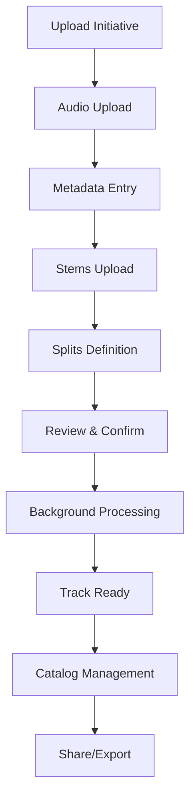
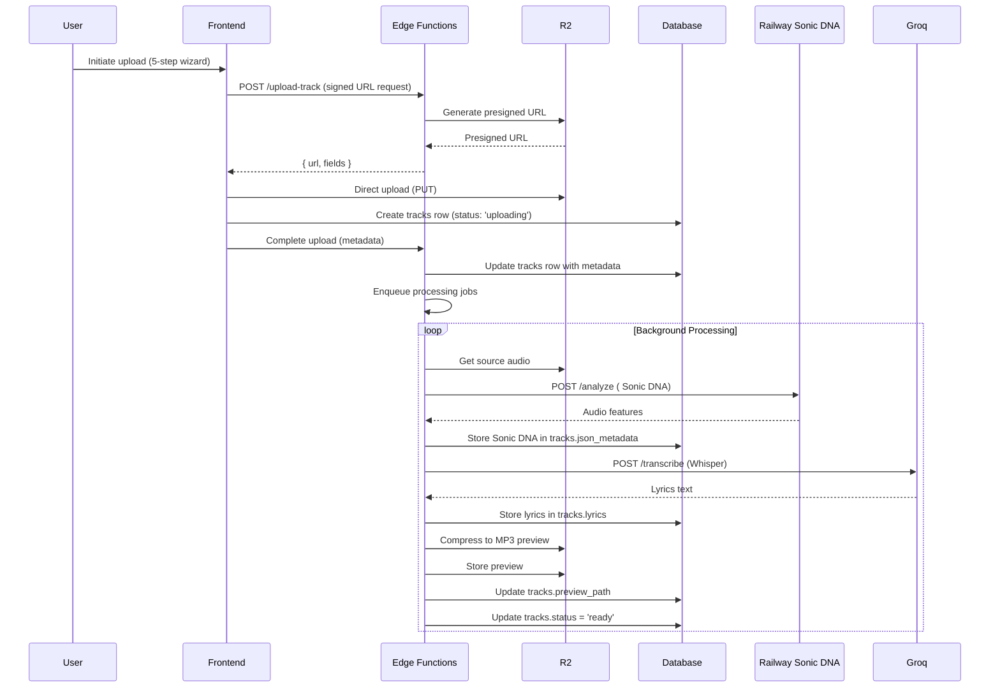
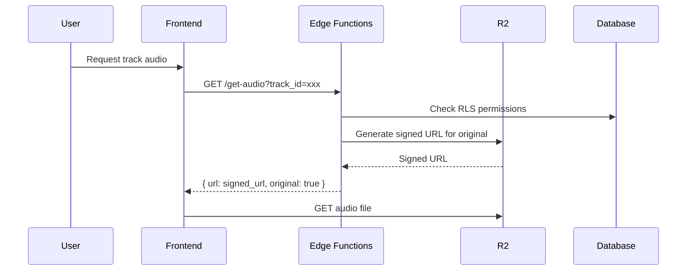

# Track Management

> **Status:** Draft  
> **Version:** 1.0.0  
> **Created:** August 11, 2026  
> **Last Updated:** August 11, 2026  
> **Owner:** Ishan  
> **Related:** [03 - Data Architecture](../ARCHITECTURE/03-DATA_ARCHITECTURE.md), [04 - Component Architecture](../ARCHITECTURE/04-COMPONENT_ARCHITECTURE.md), [05 - Service Architecture](../ARCHITECTURE/05-SERVICE_ARCHITECTURE.md), [TRACK_VERSIONING.md](../TRACK_VERSIONING.md), [ISRC_GENERATION.md](../ISRC_GENERATION.md)

---

## Abstract

This document provides a comprehensive overview of Trakalog's Track Management system, covering the complete lifecycle of a track from upload to versioning, metadata management, processing, and storage. Track Management is the core feature of Trakalog, enabling users to organize, protect, and activate their unreleased music catalogs.

---

## 1. Feature Overview

### 1.1 Purpose

Trakalog's Track Management system enables creators to:

- Upload and store unreleased audio files securely
- Attach comprehensive metadata for industry readiness
- Process audio for analysis and watermarking
- Manage versions and iterations
- Organize tracks within playlists
- Share tracks securely with external collaborators

**Key Differentiator:** Unlike general file storage (Dropbox) or music distribution platforms, Trakalog treats tracks as **confidential assets** with built-in protection (watermarking), analysis (Sonic DNA), and activation (Smart A&R) capabilities.

### 1.2 User Journey



### 1.3 Core Components

| Component | Type | Location | Responsibility |
|-----------|------|----------|----------------|
| Track Upload UI | React Component | `src/pages/UploadTrack.tsx` | User interface for upload flow |
| Track Detail Page | React Component | `src/pages/TrackDetail.tsx` | Complete track information display |
| Tracks Table | Database Table | `public.tracks` | Persistent track data storage |
| Audio Processing | Edge Function | `supabase/functions/process-track/` | MP3 compression, Sonic DNA analysis |
| Watermarking | Railway Service | `services/watermark/` | Invisible audio watermark injection |
| Storage | R2 Buckets | `R2_BUCKET_TRACKS`, `R2_BUCKET_WATERMARKED` | Audio file storage |

---

## 2. Architecture

### 2.1 Component Diagram

```mermaid
componentDiagram
    direction LR
    
    component Frontend {
        component "Upload Wizard" as UploadWiz
        component "Track List" as TrackList
        component "Track Detail" as TrackDetail
        component "Audio Player" as AudioPlayer
    }
    
    component Backend {
        component "Supabase DB" as DB
        component "Edge Functions" as EdgeFunc
        component "RLS Policies" as RLS
    }
    
    component Services {
        component "R2 Storage" as R2
        component "Railway Sonic DNA" as SonicDNA
        component "Watermark Service" as WatermarkSvc
        component "Groq" as Groq
    }
    
    UploadWiz --> EdgeFunc : Upload requests
    TrackList --> DB : Query tracks
    TrackDetail --> DB : Fetch track data
    AudioPlayer --> EdgeFunc : Request audio
    
    EdgeFunc --> R2 : Store/Retrieve files
    EdgeFunc --> SonicDNA : Audio analysis
    EdgeFunc --> WatermarkSvc : Watermark encoding
    EdgeFunc --> Groq : Lyrics transcription
    
    DB --> RLS : Enforce access control
```

### 2.2 Data Flow

#### Upload Flow



#### Audio Serving Flow (for Account Holders)



---

## 3. Implementation Details

### 3.1 Upload Process (W2 Workflow)

Five-step wizard flow defined in PRODUCT_AND_UX_OVERVIEW.md:

1. **Audio** - Upload audio file (WAV, MP3, FLAC, AIFF)
2. **Info** - Enter metadata (title, artists, featuring, etc.)
3. **Stems** - Upload component audio files (optional)
4. **Splits** - Define ownership percentages and signatures
5. **Review** - Confirm all information before finalizing

**Quick Upload Path:** Skips steps 2-4 for bulk imports, auto-extracting title and artist from filename pattern `artist - title.mp3`.

### 3.2 Key Files

| File | Purpose |
|------|---------|
| `src/pages/UploadTrack.tsx` | Main upload wizard container |
| `src/pages/TrackDetail.tsx` | Track detail view with editing |
| `src/components/audio/UploadZone.tsx` | Drag-and-drop upload component |
| `src/components/audio/AudioPlayer.tsx` | Waveform player with visualization |
| `src/hooks/useTrackUpload.ts` | Upload state management hook |
| `src/integrations/supabase/client.ts` | Supabase client for DB operations |
| `supabase/functions/upload-track/index.ts` | Edge function for upload handling |
| `supabase/functions/process-track/index.ts` | Background audio processing |
| `services/watermark/index.js` | Railway watermark service |

### 3.3 Supported Audio Formats

| Format | Upload | Playback | Notes |
|--------|--------|----------|-------|
| WAV | ✅ | ✅ | Lossless, preferred for watermarking |
| MP3 | ✅ | ✅ | Compressed, preview generation |
| FLAC | ✅ | ✅ | Lossless compression |
| AIFF | ✅ | ✅ | Lossless, Apple standard |
| AAC | ⚠️ | ✅ | Upload requires conversion |

### 3.4 Metadata Schema

Comprehensive metadata captured during upload:

#### Core Metadata
- `title` (string, required)
- `artists` (string[], required) - Primary artists
- `featuring` (string[]) - Featured artists
- `genres` (string[]) - Multiple genres
- `bpm` (number) - Beats per minute
- `key` (string) - Musical key (e.g., "C# min")
- `mood` (string[]) - Mood descriptors
- `language` (string) - Primary language
- `type` (enum) - `song` / `instrumental` / `sample` / `acapella`
- `status` (enum) - `draft` / `ready` / `processing` / `error`

#### Industry Metadata
- `isrc` (string) - International Standard Recording Code
- `upc` (string) - Universal Product Code (album level)
- `album` (string) - Album name
- `copyright` (string) - Copyright notice
- `explicit` (boolean) - Explicit content flag
- `labels` (string[]) - Record labels
- `publishers` (string[]) - Publishing entities

#### Tags
- `tags` (object) - Categorized tags:
  - `instruments` - Instrumentation
  - `lyric_themes` - Lyrical content themes
  - `mood/feel` - Atmosphere descriptors
  - `tempo_descriptor` - Tempo description
  - `sync_tags` - Synchronization suitability
  - `custom` - User-defined tags

#### Credits
- `credits` (object[]) - Array of credit entries:
  - `role` - Professional role (Producer, Songwriter, etc.)
  - `name` - Person's name
  - `percentage` - Contribution percentage (for splits)
  - `notes` - Additional notes

### 3.5 Background Processing Jobs

Three automatic jobs triggered after upload:

1. **MP3 Preview Compression** - Creates a compressed preview version for efficient streaming
2. **Sonic DNA Analysis** - Railway service extracts audio features (BPM, key, valence, arousal, brightness, warmth, sync-readiness)
3. **Lyrics Transcription** - Groq Whisper API transcribes vocals to text (Starter plan and above)

### 3.6 Storage Organization

| Bucket | Purpose | Files |
|--------|---------|-------|
| `R2_BUCKET_TRACKS` | Original uploads | Source audio files |
| `R2_BUCKET_PREVIEWS` | Compressed versions | MP3 previews |
| `R2_BUCKET_WATERMARKED` | Protected audio | Per-recipient watermarked files |
| `R2_BUCKET_COVERS` | Album art | Cover images |
| `R2_BUCKET_STEMS` | Component files | Stem files |
| `R2_BUCKET_DOCUMENTS` | Attachments | Contracts, agreements, etc. |

---

## 4. Database Schema

### 4.1 Tracks Table (`public.tracks`)

Primary table storing track information. See [03 - Data Architecture](../ARCHITECTURE/03-DATA_ARCHITECTURE.md) for complete schema.

Key columns:

| Column | Type | Nullable | Description |
|--------|------|----------|-------------|
| `id` | uuid | NO | Primary key |
| `workspace_id` | uuid | NO | Owning workspace |
| `created_by` | uuid | NO | User who uploaded |
| `title` | text | NO | Track title |
| `artists` | text[] | NO | Array of artist names |
| `duration` | integer | YES | Duration in seconds |
| `bpm` | integer | YES | Beats per minute |
| `key` | text | YES | Musical key |
| `status` | text | NO | Upload/processing status |
| `file_path` | text | NO | R2 storage path for original |
| `preview_path` | text | YES | R2 storage path for preview |
| `cover_path` | text | YES | R2 storage path for cover |
| `lyrics` | text | YES | Transcribed lyrics |
| `json_metadata` | jsonb | YES | Sonic DNA, tags, custom fields |
| `isrc` | text | YES | ISRC code |
| `created_at` | timestamptz | NO | Upload timestamp |
| `updated_at` | timestamptz | NO | Last update timestamp |
| `is_deleted` | boolean | NO | Soft delete flag |

### 4.2 Related Tables

| Table | Relationship | Purpose |
|-------|-------------|---------|
| `stems` | One-to-Many | Component audio files (drums, bass, vocals) |
| `documents` | One-to-Many | Attached files (contracts, agreements) |
| `track_comments` | One-to-Many | Timecoded comments from recipients |
| `splits` | One-to-Many | Ownership percentages and signatures |
| `playlist_tracks` | Many-to-Many | Track membership in playlists |
| `catalog_shares` | Many-to-Many | Workspace-to-workspace sharing |
| `watermark_payloads` | Many-to-One | Watermark hash to recipient mapping |

---

## 5. Integration Points

### 5.1 With Other Features

| Feature | Integration | Description |
|---------|-------------|-------------|
| **Sharing System** | Direct | Tracks can be shared via shared_links with watermarking |
| **Smart A&R** | Metadata | Sonic DNA and tags enable AI matching |
| **Watermarking** | Background | Automatic watermark encoding for shared tracks |
| **Splits & Signatures** | Upload flow | Splits entered during upload, signature requests |
| **Versioning** | Track level | Version tracking via TRACK_VERSIONING.md |

### 5.2 With External Services

| Service | Integration | Description |
|---------|-------------|-------------|
| **R2 Storage** | S3-compatible API | Audio file storage and retrieval |
| **Railway Sonic DNA** | HTTP API | Audio analysis and feature extraction |
| **Groq** | REST API | Lyrics transcription (Whisper) |
| **Watermark Service** | HTTP API + Workers | Invisible watermark injection and verification |

---

## 6. Configuration

### 6.1 Environment Variables

| Variable | Purpose | Default |
|----------|---------|---------|
| `STORAGE_PROVIDER` | Storage backend | `r2` |
| `R2_ENDPOINT` | R2 API endpoint | - |
| `R2_BUCKET_TRACKS` | Tracks bucket name | `trakalog-tracks` |
| `R2_BUCKET_PREVIEWS` | Previews bucket name | `trakalog-previews` |
| `R2_BUCKET_WATERMARKED` | Watermarked bucket name | `trakalog-watermarked` |
| `RAILWAY_SONIC_URL` | Sonic DNA service URL | - |
| `GROQ_API_KEY` | Groq API key | - |

### 6.2 Feature Flags

| Flag | Location | Description |
|------|----------|-------------|
| `QUICK_UPLOAD_ENABLED` | `src/config/features.ts` | Enable quick upload path |
| `LYRICS_TRANSCRIPTION_ENABLED` | `src/config/features.ts` | Enable automatic transcription |
| `SONIC_DNA_ENABLED` | `src/config/features.ts` | Enable Sonic DNA analysis |

### 6.3 Permissions

Track operations are governed by RLS policies and role-based access control:

| Operation | Required Role | RLS Policy |
|-----------|---------------|------------|
| Upload track | Pitcher, Editor, Admin | `tracks_insert` |
| Edit own track | Pitcher, Editor, Admin | `tracks_update_own` |
| Edit any track | Editor, Admin | `tracks_update_all` |
| Delete track | Admin | `tracks_delete` |
| View track | Viewer, Pitcher, Editor, Admin | `tracks_select` |

---

## 7. Edge Cases and Considerations

### 7.1 Large File Handling

- **Upload Limits:** Free plan: 10 tracks, 1.5 GB; Paid plans: up to 500 tracks, 40 GB
- **Chunked Uploads:** Files > 100 MB use chunked upload with resumable support
- **Timeout:** Upload timeout: 30 minutes for large files

### 7.2 Audio Processing Failures

- **Retry Logic:** Failed processing jobs retry 3 times with exponential backoff
- **Notification:** Users receive notification for processing failures
- **Fallback:** Tracks marked as 'error' status, can be retried manually

### 7.3 Metadata Completeness

- **Completeness Bar:** Visual indicator of metadata completeness
- **AI Features Dependency:** Smart A&R matching quality degrades with sparse metadata
- **Required Fields:** Title and at least one artist are mandatory

### 7.4 Version Control

- **Immutability:** Original uploads are never modified
- **Version Chain:** Each update creates a new version record
- **Rollback:** Users can revert to previous versions

---

## 8. Troubleshooting

### Common Issues

| Issue | Cause | Solution |
|-------|-------|----------|
| Upload hangs at 99% | Large file processing timeout | Check R2 upload progress, retry |
| Audio won't play | Format not supported | Convert to WAV/MP3 before upload |
| Processing stuck | Sonic DNA service down | Check Railway logs, retry |
| Metadata not saving | Validation error | Check required fields, retry |
| Track not appearing | RLS policy blocking | Verify workspace membership and role |

### Debugging Commands

```bash
# Check R2 bucket contents
rclone lsd r2:trakalog-tracks/

# Check Supabase logs for track operations
supabase logs --limit 100 | grep tracks

# Check Railway Sonic DNA service status
curl -I https://railway-sonic-service/health

# Query track by ID
psql -c "SELECT * FROM tracks WHERE id = 'xxx';"
```

### Log Locations

- **Frontend:** Browser console, Sentry error tracking
- **Backend:** Supabase Edge Functions logs
- **Services:** Railway service logs
- **Storage:** R2 access logs (Cloudflare Dashboard)

---

## 9. Performance Considerations

| Metric | Target | Current |
|--------|--------|---------|
| Upload speed | 10 MB/s | 8-12 MB/s |
| Processing time | < 5 min per track | 3-7 min (depends on queue) |
| Audio serving latency | < 500 ms | 200-400 ms |
| Catalog load (100 tracks) | < 2 s | 1.2-1.8 s |

---

## 10. Future Enhancements

- [ ] Batch upload with ZIP extraction
- [ ] Drag-and-drop reordering in catalog
- [ ] Bulk metadata editing
- [ ] AI-assisted metadata tagging
- [ ] Automatic ISRC generation integration
- [ ] DDEX export improvements

---

## Appendix A: Quick Reference

| Task | How To |
|------|--------|
| Upload a track | Navigate to `/tracks` → Click "Upload" → Follow 5-step wizard |
| Edit track metadata | Open track detail → Click "Edit" → Modify fields → Save |
| Upload stems | Track upload step 3 or Track detail → "Add Stems" |
| Replace audio file | Track detail → "Replace Audio" → Confirm |
| Delete a track | Track detail → "..." → "Delete" (Admin only) |
| View processing status | Track detail → Processing indicator |

---

## Appendix B: Document Metadata

| Property | Value |
|----------|-------|
| **Created** | August 11, 2026 |
| **Version** | 1.0.0 |
| **Owner** | Ishan |
| **Status** | Draft |
| **Phase** | 2 (Depth) |
| **Effort** | 4h |
