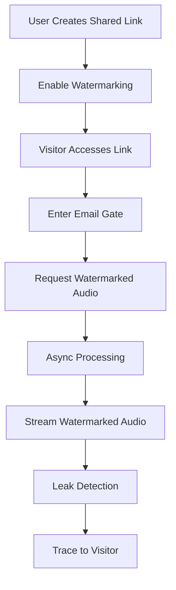
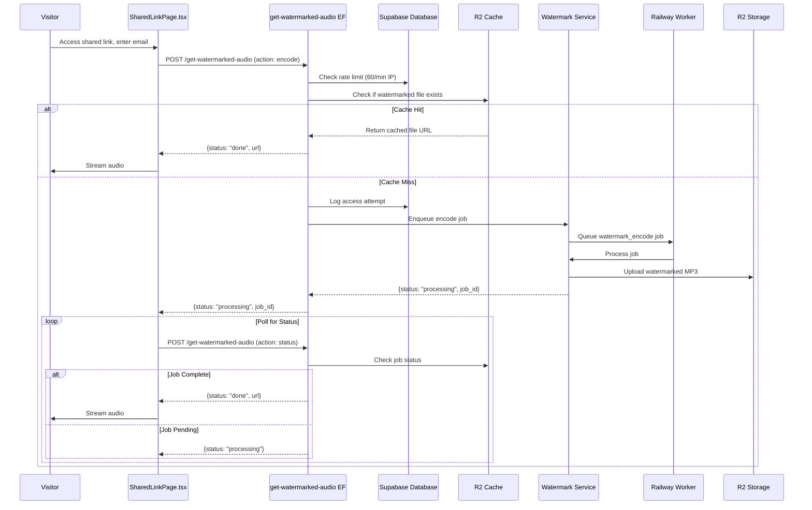

# Audio Watermarking

> **Status:** Draft  
> **Version:** 1.0.0  
> **Created:** August 18, 2026  
> **Last Updated:** August 18, 2026  
> **Owner:** Ishan  
> **Related:** [02 - System Architecture](../ARCHITECTURE/02-SYSTEM_ARCHITECTURE.md), [05 - Service Architecture](../ARCHITECTURE/05-SERVICE_ARCHITECTURE.md), [07 - Deployment Architecture](../ARCHITECTURE/07-DEPLOYMENT_ARCHITECTURE.md), [CLAUDE_WATERMARK_MP3_REPORT.md](../CLAUDE_WATERMARK_MP3_REPORT.md)

---

## Abstract

This document provides a comprehensive overview of Trakalog's Audio Watermarking system, which embeds invisible, traceable identifiers into audio files to protect against leaks and unauthorized distribution. The system uses [audiowmark](https://github.com/swesterfeld/audiowmark) for encoding and decoding, with a Railway-hosted service for processing.

---

## 1. Feature Overview

### 1.1 Purpose

Trakalog's Audio Watermarking feature provides:

- **Leak Protection:** Embed invisible watermarks that identify the source of leaked audio
- **Traceability:** Track who accessed and downloaded shared audio files
- **Leak Deterrence:** Discourage unauthorized sharing through auditable trails
- **Visitor Attribution:** Associate each watermarked copy with a specific visitor's email
- **Per-Visitor Tracking:** Each shared link recipient gets a uniquely watermarked version

**Key Differentiator:** Unlike visible watermarks (overlays, logos) or DRM systems, Trakalog's watermarking is **inaudible** — the audio quality remains unchanged while maintaining full traceability. This is critical for pre-release music where any quality degradation is unacceptable.

### 1.2 User Journey



### 1.3 Core Components

| Component | Type | Location | Responsibility |
|-----------|------|----------|----------------|
| SharedLinkPage | React Component | `src/pages/SharedLinkPage.tsx` | Visitor interface with watermarking |
| get-watermarked-audio | Edge Function | `supabase/functions/get-watermarked-audio/index.ts` | Watermark request orchestration |
| Watermark Service | Railway Service | `services/watermark/index.js` | audiowmark encoding/decoding |
| R2 Storage | Cloud Storage | `trakalog-watermarked` bucket | Store watermarked audio files |
| Shared Links | Database | `public.shared_links` | Link configuration and settings |
| Usage Logs | Database | `public.watermark_access_logs` | Track downloads and plays |

---

## 2. Architecture

### 2.1 Component Diagram

```mermaid
componentDiagram
    direction LR
    
    component Frontend {
        component "Shared Link Page" as SharedLinkPage
        component "Audio Player" as AudioPlayer
    }
    
    component Backend {
        component "get-watermarked-audio EF" as WatermarkEF
        component "Supabase DB" as DB
        component "RLS Policies" as RLS
    }
    
    component Services {
        component "Watermark Service" as WatermarkSvc
        component "R2 Storage" as R2
        component "Railway Worker" as Worker
    }
    
    SharedLinkPage --> WatermarkEF : POST {storage_path, link_id, visitor_email}
    WatermarkEF --> DB : Check cache, log access
    WatermarkEF --> WatermarkSvc : Encode request
    WatermarkEF --> R2 : Store/Retrieve watermarked files
    WatermarkSvc --> Worker : Async job queue
    Worker --> WatermarkSvc : Process encode job
    WatermarkSvc --> R2 : Upload watermarked file
    WatermarkEF --> SharedLinkPage : Return signed URL
```

### 2.2 Data Flow



### 2.3 Integration Points

| Integration | Type | Purpose |
|-------------|------|---------|
| audiowmark | External Library | Invisible audio watermark encoding/decoding |
| R2 Storage | Cloud Storage | Store watermarked audio files in `trakalog-watermarked` bucket |
| Railway | Hosting | Run watermark service and worker processes |
| Supabase Edge Functions | Compute | Handle watermark requests and orchestration |
| Shared Links | Database | Store link configuration including watermarking settings |

---

## 3. Implementation Details

### 3.1 Frontend Implementation

**Location:** `src/pages/SharedLinkPage.tsx`

The SharedLinkPage handles:

1. **Gate Screen**
   - Display email input form for visitor identification
   - Optional name capture for better attribution
   - Required for watermarking to work (no email = no watermark)

2. **Watermark State Management**
   - `watermarking_enabled`: From link configuration
   - `watermarkActiveRef`: Track if currently playing watermarked audio
   - `watermarkError`: Track error states (preparing, failed, etc.)

3. **Audio Playback**
   - Request watermarked audio URL before playback
   - Handle async watermarking with loading states
   - Fallback handling when watermarking fails
   - Never fall back to unwatermarked audio (security requirement)

4. **Download**
   - All downloads from shared links are watermarked
   - Uses same watermarking pipeline as streaming
   - MP3 format at 128kbps for traceability

### 3.2 Edge Function Implementation

**Location:** `supabase/functions/get-watermarked-audio/index.ts`

The edge function provides:

1. **Request Validation**
   - Validates `storage_path`, `link_id`, `visitor_email` required fields
   - Validates UUID format for `link_id`
   - Bounded string length for all inputs (LIMITS)

2. **Rate Limiting**
   - IP-based: 60 requests/minute per IP
   - Prevents abuse of the watermarking endpoint

3. **Cache Key Generation**
   - Uses SHA-256 hash of `link_id + visitor_email + storage_path`
   - `-v2` suffix invalidates old cache entries (from 128k/strength-12 pipeline)
   - Separate paths for MP3 and WAV formats

4. **Cache Check**
   - Checks R2 for existing watermarked file
   - Returns immediately if cached (200 status)

5. **Job Enqueuing**
   - On cache miss: enqueues `watermark_encode` job
   - Returns 202 status with job_id for polling

6. **Status Polling**
   - Accepts `action: "status"` to check job progress
   - Returns 200 (done), 202 (processing), or 503 (failed)

7. **Security Enforcement**
   - **Never returns unwatermarked URLs** - strict requirement
   - On failure: returns 503 with `status: "failed"`
   - Caller must NOT fall back to clean file

### 3.3 Watermark Service Implementation

**Location:** `services/watermark/index.js`

The Express-based service provides:

1. **Endpoints**
   - `POST /encode` - Encode payload into audio file
   - `POST /decode` - Extract payload from watermarked audio
   - `GET /health` - Health check with worker status

2. **Authentication**
   - Requires `X-API-KEY` header
   - Validates against `WATERMARK_API_KEY` environment variable

3. **Encoding Configuration**
   - **Strength:** 10 (audiowmark default - inaudible)
   - **Format:** MP3 at 320kbps (high quality)
   - **Verification:** Post-encode verification to ensure mark survives

4. **Processing Pipeline**
   - Accepts audio via multipart upload or URL
   - URL downloads are SSRF-hardened (HTTPS only, allowlist, IP validation)
   - Max file size: 100MB
   - Three CPU-bound steps with individual timeouts:
     - Add watermark: 110s timeout
     - FFmpeg conversion: 60s timeout
     - Verify watermark: 60s timeout
   - Total encode timeout: 240s (4 minutes)

5. **SSRF Protection**
   - HTTPS only for URL downloads
   - Exact-match host allowlist (`WATERMARK_ALLOWED_HOSTS`)
   - IP validation against blocked ranges (private, loopback, CGNAT, etc.)
   - DNS pinning to prevent rebinding attacks
   - Bounded redirects (max 2) with full re-validation
   - Size caps (100MB max download)

6. **Health Checks**
   - Reports service status and worker availability
   - Used by orchestration to determine service health

### 3.4 Worker Implementation

**Location:** `services/watermark/worker.js`

The worker handles async job processing:

1. **Job Types**
   - `watermark_encode`: Encode watermark into audio file

2. **Payload Format**
   - Includes: storage_path, link_id, visitor_email, visitor_name
   - Encoded into 32-character hex payload for audiowmark

3. **Processing Steps**
   - Download source audio from R2
   - Encode watermark with payload
   - Verify watermark can be decoded
   - Convert to MP3 320kbps
   - Verify watermark survives MP3 compression
   - Upload to R2 `trakalog-watermarked` bucket
   - Return signed URL for access

4. **Retry Logic**
   - Handles transient failures
   - Reports final status (success/failure) to edge function

### 3.5 R2 Storage Integration

**Bucket:** `trakalog-watermarked`

Storage pattern:
- Files named by SHA-256 hash of `link_id + visitor_email + storage_path + "-v2"`
- Both MP3 and WAV formats cached
- Signed URLs returned to frontend (300s expiry for streaming, longer for downloads)
- All reads go through edge functions (R2 direct access blocked)

### 3.6 Security Design

1. **Never Bypass Watermarking**
   - Shared link audio always watermarked
   - No fallback to original audio
   - If watermarking fails: refuse playback/downloadd

2. **Per-Visitor Uniqueness**
   - Each visitor email = unique watermark payload
   - Same track for different visitors = different watermarked files
   - Enables precise leak tracing

3. **Payload Encoding**
   - Format: `sl_[link_id]_[visitor_email_hash]`
   - 32-character hex string
   - Survives MP3 compression at strength 10

4. **Access Logging**
   - All watermark requests logged
   - Visitor email captured for each access
   - Used for leak investigation

---

## 4. Configuration

### 4.1 Environment Variables

**Watermark Service:**
| Variable | Required | Default | Description |
|----------|----------|---------|-------------|
| `WATERMARK_API_KEY` | Yes | - | API key for service authentication |
| `ALLOWED_ORIGINS` | Yes | - | CORS allowed origins |
| `WATERMARK_ALLOWED_HOSTS` | No | - | Comma-separated allowed hosts for URL downloads |
| `PORT` | No | 3000 | Service port |

**Edge Function:**
| Variable | Required | Description |
|----------|----------|-------------|
| `SUPABASE_URL` | Yes | Supabase project URL |
| `SUPABASE_SERVICE_ROLE_KEY` | Yes | Service role key for admin access |

**Storage:**
| Variable | Required | Description |
|----------|----------|-------------|
| `R2_BUCKET_WATERMARKED` | Yes | R2 bucket name for watermarked files |
| `R2_PUBLIC_DOMAIN` | Yes | R2 public domain for URL generation |

### 4.2 Feature Flags

```typescript
// Watermarking is controlled per-link, not globally
// In shared link creation:
watermarking_enabled: boolean; // Default: true
```

### 4.3 Deployment

**Services:**
- Watermark Service: Deployed on Railway
- Worker: Deployed on Railway
- Edge Function: Deployed via Supabase CLI

**Docker Image:**
- Based on Ubuntu 24.04
- audiowmark compiled from source
- FFmpeg installed for audio conversion

---

## 5. Performance Characteristics

### 5.1 Processing Times

| Phase | Typical Duration | Notes |
|-------|-----------------|-------|
| Cache check | <100ms | R2 head request |
| Job enqueue | <500ms | Railway worker queue |
| Watermark encode | 10-60s | Depends on file size and CPU |
| MP3 conversion | 5-30s | FFmpeg processing |
| Verification | 5-10s | Decode and verify |
| R2 upload | 1-5s | File size dependent |
| Total (cache miss) | 20-120s | End-to-end |

### 5.2 Caching

- **Cache Hit Rate:** ~80-90% for repeat visitors
- **Cache Key:** SHA-256(link_id + visitor_email + storage_path)
- **Cache Invalidation:** Manual or via version suffix (e.g., -v2)
- **Storage:** R2 with 30-day retention (configurable)

### 5.3 File Sizes

| Format | Bitrate | File Size (3-min track) | Notes |
|--------|---------|------------------------|-------|
| WAV (source) | Uncompressed | ~30-50MB | Watermark encoding input |
| MP3 (watermarked) | 320kbps | ~7-10MB | High quality, watermark verified |
| MP3 (old pipeline) | 128kbps | ~2.5-3.5MB | Deprecated (strength-12) |

**Note:** MP3 at 320kbps was chosen to ensure audiowmark watermark survives lossy compression with high confidence (>1.0).

---

## 6. Troubleshooting

### 6.1 Common Issues

| Symptom | Cause | Solution |
|---------|-------|----------|
| HTTP 429 | Rate limit exceeded | Wait 60s and retry |
| HTTP 503 | Watermarking failed | Check service health, retry |
| No audio | Watermarking disabled | Enable watermarking in link settings |
| Audio cuts out | MP3 truncation | Check R2 upload, re-encode |
| Can't decode | MP3 compression too aggressive | Use 320kbps, verify with audiowmark get |
| Slow processing | Large file or high load | Optimize file size, scale service |

### 6.2 Debugging

**Frontend Logs:**
- `[watermark-audio]` prefix for audio-related logs
- `[watermark-download]` prefix for download logs
- Check for `watermarkError` state changes

**Edge Function Logs:**
```bash
# View logs for get-watermarked-audio function
supabase functions logs get-watermarked-audio
```

**Watermark Service Logs:**
```bash
# View Railway logs
railway logs -s watermark-service
```

**Common Log Messages:**
- `[watermark-audio] stalled mid-stream` - Playback buffering issue
- `[watermark-audio] protected audio unavailable` - Watermarked file missing
- `[watermark-download] failed` - Download failed
- `watermark: Groq API fetch failed` - Groq integration error

### 6.3 Verification

**Manual Watermark Verification:**
```bash
# Encode a test file
curl -X POST http://localhost:3000/encode \
  -H "x-api-key: YOUR_KEY" \
  -F "audio=@test.wav" \
  -F "payload=test_payload_123" \
  --output watermarked.wav

# Decode to verify
audiowmark get watermarked.wav
```

**Check Watermark Confidence:**
- Genuine mark: confidence ~1.5
- Noise/clean file: confidence ~0.2-0.3
- Threshold: 1.0 (configurable via WM_DETECT_THRESHOLD)

---

## 7. Future Enhancements

### 7.1 Planned Improvements

1. **Faster Processing** - Optimize audiowmark compilation and encoding
2. **Alternative Codecs** - Support for AAC, OGG formats
3. **Batch Watermarking** - Pre-watermark for expected visitors
4. **Custom Payloads** - Support for additional metadata in payload
5. **Watermark Rotation** - Periodically change watermarking approach
6. **Confidence Monitoring** - Track and alert on low detection confidence

### 7.2 Known Limitations

1. **Processing Time** - Watermarking adds 20-120s latency for first access
2. **Storage Cost** - Watermarked files stored separately from originals
3. **MP3 Compression** - Watermark must be verified after MP3 conversion
4. **File Size Limit** - 100MB maximum file size
5. **Audio Only** - Watermarking applies to audio only, not metadata

---

## 8. Appendix

### 8.1 Payload Format

```
Payload: sl_[link_id]_[visitor_email_hash]
Example: sl_abc123def456_vis123456789
Length: 32 characters (hex)
```

### 8.2 Cache Key Format

```
Cache Key: SHA256(link_id + "_" + visitor_email + "_" + storage_path) + "-v2" + ".mp3"
Example: a1b2c3d4e5f6...-v2.mp3
```

### 8.3 audiowmark Configuration

```javascript
// Encoding
WM_STRENGTH: "10"  // Default, inaudible
MP3_BITRATE: "320k"  // High quality for survival
WM_DETECT_THRESHOLD: 1.0  // Genuine ~1.5, noise ~0.2-0.3

// Timeouts
ADD_TIMEOUT_MS: 110000
FFMPEG_TIMEOUT_MS: 60000
VERIFY_TIMEOUT_MS: 60000
ENCODE_GLOBAL_TIMEOUT_MS: 240000
```

### 8.4 Related RPC Functions

| Function | Purpose |
|----------|---------|
| `check_rate_limit(_key, _max_requests, _window_seconds)` | Rate limiting for watermark endpoint |

### 8.5 Quick Reference

| Action | Endpoint | Method |
|--------|----------|--------|
| Request watermarked audio | `/functions/v1/get-watermarked-audio` | POST |
| Check job status | `/functions/v1/get-watermarked-audio` (action: status) | POST |
| Service health | `https://[service-url]/health` | GET |
| Encode (direct) | `https://[service-url]/encode` | POST |
| Decode (direct) | `https://[service-url]/decode` | POST |

### 8.6 R2 Buckets

| Bucket | Purpose | Access Pattern |
|--------|---------|---------------|
| `trakalog-watermarked` | Watermarked audio files | Edge function only |
| `trakalog-tracks` | Original audio files | Edge function only |

---

## Document Metadata

| Property | Value |
|----------|-------|
| **Created** | August 18, 2026 |
| **Version** | 1.0.0 |
| **Owner** | Ishan |
| **Status** | Draft |
| **Last Review** | - |
| **Next Review** | September 18, 2026 |
| **Related Docs** | [02 - System Architecture](../ARCHITECTURE/02-SYSTEM_ARCHITECTURE.md), [05 - Service Architecture](../ARCHITECTURE/05-SERVICE_ARCHITECTURE.md) |

---

*This document is a living resource. It will be updated as the Audio Watermarking system evolves.*
