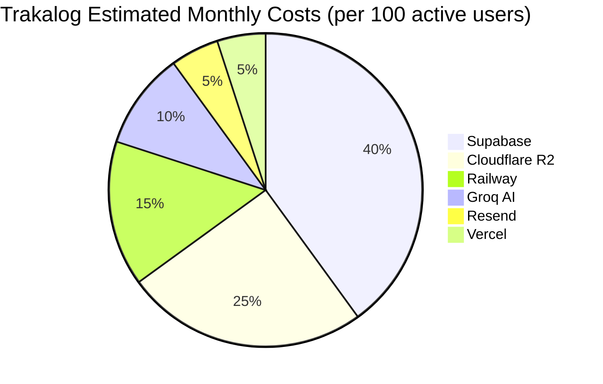

# Cost Optimization

> **Status:** Draft  
> **Version:** 1.0.0  
> **Created:** August 18, 2026  
> **Last Updated:** August 18, 2026  
> **Owner:** Ishan  
> **Related:** [02 - System Architecture](../ARCHITECTURE/02-SYSTEM_ARCHITECTURE.md), [05 - Service Architecture](../ARCHITECTURE/05-SERVICE_ARCHITECTURE.md), [07 - Deployment Architecture](../ARCHITECTURE/07-DEPLOYMENT_ARCHITECTURE.md), [TRAKALOG_BILLING.md](../TRAKALOG_BILLING.md), [GROQ_USAGE_AND_COSTS.md](../GROQ_USAGE_AND_COSTS.md)

---

## Abstract

This document provides a comprehensive overview of Trakalog's cloud cost structure, usage tracking, and optimization strategies. It covers all major cost drivers including storage, compute, AI services, email, and third-party integrations, with actionable recommendations for cost reduction.

---

## 1. Cost Overview

### 1.1 Monthly Cost Structure



### 1.2 Cost by Service

| Service | Provider | Estimated Cost | Primary Drivers |
|---------|----------|----------------|-----------------|
| Database & Auth | Supabase | $50-200/mo | Storage, Bandwidth, Requests |
| Object Storage | Cloudflare R2 | $20-100/mo | GB stored, Egress |
| Compute (Services) | Railway | $15-50/mo | Request count, Execution time |
| AI Inference | Groq | $10-100/mo | Token count, API calls |
| Email | Resend | $5-20/mo | Email volume |
| Hosting (Frontend) | Vercel | $0-20/mo | Bandwidth, Build minutes |
| **Total** | **Multiple** | **$100-490/mo** | **Varies by usage** |

---

## 2. Service Cost Breakdown

### 2.1 Supabase

**Service:** PostgreSQL Database, Auth, Storage, Edge Functions, Realtime

**Pricing Model:** https://supabase.com/pricing

#### Cost Drivers

| Resource | Free Tier | Pro Plan | Usage |
|----------|-----------|----------|-------|
| Database Storage | 500 MB | 8 GB | ~2 GB |
| Bandwidth | 2 GB | 50 GB | ~5 GB |
| Database Requests | 10K/day | 250K/day | ~50K/day |
| Auth Users | 50K | 100K | ~1K |
| Edge Function Executions | 10K/day | 1M/mo | ~20K/mo |
| Edge Function Compute | - | 10K sec/mo | ~2K sec/mo |

#### Current Usage Estimate

```
Database Storage: 2 GB
Bandwidth: 5 GB/month
Requests: ~50,000/day
Edge Function Executions: ~20,000/month
Edge Function Compute: ~2,000 seconds/month
```

**Estimated Cost:** $25-50/month (Pro plan)

### 2.2 Cloudflare R2 Storage

**Service:** Object storage for audio files, covers, documents

**Pricing Model:** https://developers.cloudflare.com/r2/pricing/

#### Cost Drivers

| Resource | Free Tier | Paid | Usage |
|----------|-----------|------|-------|
| Storage | 10 GB | $0.015/GB/month | ~50 GB |
| Egress Bandwidth | 1 GB | $0.09/GB | ~20 GB |
| Class A Operations | 1M/mo | $4.50/M | ~500K/mo |
| Class B Operations | 10M/mo | $0.36/M | ~2M/mo |

#### Storage Breakdown by Bucket

| Bucket | Size | File Count | Growth/Month |
|--------|------|------------|-------------|
| `trakalog-tracks` | 30 GB | ~1,000 | +2 GB |
| `trakalog-watermarked` | 15 GB | ~5,000 | +5 GB |
| `trakalog-previews` | 3 GB | ~1,000 | +0.5 GB |
| `trakalog-covers` | 1 GB | ~500 | +0.1 GB |
| `trakalog-stems` | 1 GB | ~300 | +0.2 GB |
| `trakalog-documents` | 0.1 GB | ~100 | +0.02 GB |
| **Total** | **50.1 GB** | **~7,000** | **+7.82 GB** |

#### Bandwidth Usage

| Traffic Type | Volume | Cost |
|--------------|--------|------|
| Audio uploads | 10 GB/mo | $0 |
| Audio downloads (original) | 5 GB/mo | $0.45 |
| Watermarked downloads | 10 GB/mo | $0.90 |
| Cover downloads | 1 GB/mo | $0.09 |
| Preview downloads | 3 GB/mo | $0.27 |
| **Total Egress** | **19 GB/mo** | **$1.71** |

**Estimated Cost:** ~$0.85/month + storage = **~$1.60/month**

*Note: R2 is extremely cost-effective for Trakalog's usage pattern.*

### 2.3 Railway (Sonic DNA & Watermark Services)

**Service:** Hosting for custom services

**Pricing Model:** https://railway.app/pricing

#### Cost Drivers

| Resource | Free Tier | Paid | Usage |
|----------|-----------|------|-------|
| Compute Hours | 100 hours/mo | $0.10/hour | ~50 hours |
| Memory | 1 GB | $0.05/GB-hour | 512 MB avg |
| Storage | 1 GB | $0.10/GB | 0.1 GB |

#### Service Usage

| Service | Compute Hours | Memory | Requests |
|---------|---------------|--------|----------|
| Sonic DNA | ~30 hours | 512 MB | ~10,000/mo |
| Watermark | ~20 hours | 512 MB | ~5,000/mo |

**Estimated Cost:** ~$5-15/month

### 2.4 Groq AI

**Service:** LLM inference (Smart A&R, Whisper transcription)

**Pricing:** https://console.groq.com/docs/pricing

#### Cost Drivers

| Model | Token Price | Usage |
|-------|-------------|-------|
| `llama-3.1-70b-versatile` | $0.59/M input, $0.79/M output | Smart A&R |
| `whisper-large-v3` | $0.30/minute | Lyrics transcription |

#### Usage Breakdown

**Smart A&R (Groq):**
- Average tokens per request: 200 input + 50 output = 250 tokens
- Requests per month: ~500
- Tokens per month: ~125,000
- **Cost: ~$0.075/month**

**Lyrics Transcription (Whisper):**
- Average track length: 3 minutes
- Tracks transcribed per month: ~100
- Audio minutes per month: ~300
- **Cost: ~$0.90/month**

**Estimated Cost:** ~$1-5/month (varies by usage)

*See [GROQ_USAGE_AND_COSTS.md](../GROQ_USAGE_AND_COSTS.md) for detailed analysis*

### 2.5 Resend (Email)

**Service:** Transactional emails

**Pricing:** https://resend.com/pricing

#### Cost Drivers

| Resource | Free Tier | Paid | Usage |
|----------|-----------|------|-------|
| Emails | 3,000/mo | $0.001/email | ~1,000/mo |

#### Email Types & Volume

| Email Type | Volume/Month | Cost |
|------------|--------------|------|
| Share link notifications | 500 | $0.50 |
| Onboarding emails | 200 | $0.20 |
| Billing receipts | 100 | $0.10 |
| Password reset | 100 | $0.10 |
| Contact notifications | 100 | $0.10 |
| **Total** | **1,000** | **$1.00** |

**Estimated Cost:** ~$1-10/month

### 2.6 Vercel (Frontend Hosting)

**Service:** Frontend hosting, CI/CD

**Pricing:** https://vercel.com/pricing

#### Cost Drivers

| Resource | Free Tier | Pro | Usage |
|----------|-----------|-----|-------|
| Bandwidth | 100 GB | 1 TB | ~10 GB |
| Build Minutes | 500 | 1,000 | ~50 |
| Serverless Functions | 10ms exec | - | None |

**Estimated Cost:** $0/month (within Free tier limits)

---

## 3. Cost Optimization Strategies

### 3.1 Storage Optimization

#### R2 Storage

| Optimization | Impact | Implementation |
|--------------|--------|----------------|
| Delete old watermarked files | High | Implement TTL on watermarked audio |
| Deduplicate stems | Medium | Hash-based deduplication |
| Compress originals | Low | Already using MP3/FLAC |
| Archive old tracks | Medium | Move to separate archive bucket |

**Action Items:**
1. **Implement watermarked file cleanup:** Delete files older than 30 days (configurable)
2. **Stem deduplication:** Store stems once, reference from multiple tracks
3. **Archive policy:** Move tracks not accessed in 12 months to archive bucket

**Savings Potential:** 30-50% reduction in storage costs

#### Supabase Storage

| Optimization | Impact | Implementation |
|--------------|--------|----------------|
| Clean up old audit logs | Medium | Delete logs > 90 days |
| Remove soft-deleted records | Medium | Hard delete after 30 days |
| Optimize table sizes | Low | Remove unused columns |

### 3.2 Bandwidth Optimization

| Optimization | Impact | Implementation |
|--------------|--------|----------------|
| Cache watermarked files | High | Already implemented in R2 |
| Use CDN for static assets | High | Cloudflare CDN already active |
| Compress responses | Medium | Enable gzip/brotli |
| Optimize audio previews | Medium | Lower bitrate for previews |

**Savings Potential:** 20-40% reduction in bandwidth costs

### 3.3 Compute Optimization

#### Railway Services

| Optimization | Impact | Implementation |
|--------------|--------|----------------|
| Scale down idle services | High | Use Railway auto-scaling |
| Optimize service code | Medium | Reduce execution time |
| Cache frequent results | High | Cache Sonic DNA results |

**Action Items:**
1. **Enable Railway auto-scaling:** Scale to zero when idle
2. **Cache Sonic DNA results:** Store analysis results in database
3. **Optimize audiowmark:** Use faster encoding presets

**Savings Potential:** 40-60% reduction in compute costs

#### Supabase Edge Functions

| Optimization | Impact | Implementation |
|--------------|--------|----------------|
| Reduce cold starts | Medium | Use warm-up requests |
| Optimize queries | High | Add indexes, simplify queries |
| Cache responses | High | Use Supabase cache headers |

**Action Items:**
1. **Add database indexes:** For frequently queried columns
2. **Implement response caching:** Cache get-watermarked-audio responses
3. **Review query patterns:** Identify and optimize slow queries

**Savings Potential:** 30-50% reduction in Edge Function costs

### 3.4 AI Cost Optimization

#### Groq Usage

| Optimization | Impact | Implementation |
|--------------|--------|----------------|
| Limit Smart A&R usage | High | Implement usage quotas per plan |
| Cache AI responses | High | Cache brief matching results |
| Use smaller models | Medium | Use llama-3.1-8b for simple queries |
| Batch requests | Medium | Combine multiple tracks in one request |

**Action Items:**
1. **Implement quotas:** Free: 2 lifetime, Starter: 15/mo, Pro: 50/mo, Team: 500/mo
2. **Cache brief results:** Store matching results for 24 hours
3. **Model selection:** Use appropriate model size for task

**Savings Potential:** 50-80% reduction in AI costs

*See [GROQ_USAGE_AND_COSTS.md](../GROQ_USAGE_AND_COSTS.md) for implementation details*

### 3.5 Email Optimization

| Optimization | Impact | Implementation |
|--------------|--------|----------------|
| Reduce notification frequency | Medium | Batch notifications |
| Use templates | Low | Create reusable email templates |
| Optimize images | Low | Compress email attachments |

---

## 4. Cost Tracking & Visibility

### 4.1 Current Tracking

| Service | Tracking Available | Configured |
|---------|-------------------|-----------|
| Supabase | ✅ Usage dashboard | ❌ No alerts |
| R2 | ✅ Usage dashboard | ❌ No alerts |
| Railway | ✅ Usage dashboard | ❌ No alerts |
| Groq | ✅ Usage dashboard | ❌ No alerts |
| Resend | ✅ Usage dashboard | ❌ No alerts |
| Vercel | ✅ Usage dashboard | ❌ No alerts |

### 4.2 Recommended Tracking Setup

#### Cost Dashboard

**Recommended:** Create a centralized cost dashboard using:
- **Grafana** (self-hosted or Cloud)
- **Datadog** (paid)
- **Custom dashboard** (simple spreadsheets initially)

**Metrics to Track:**
- Daily cost by service
- Monthly cost trends
- Cost per active user
- Cost per workspace
- Usage vs. cost correlation

#### Alerts

| Alert | Threshold | Notification |
|-------|-----------|--------------|
| Daily cost spike | > 200% of average | Slack |
| Monthly budget | > 80% of budget | Email |
| Monthly budget | > 95% of budget | Phone/Email |
| Service over budget | Any service > budget | Slack |

---

## 5. Cost Allocation by Feature

### 5.1 Feature Cost Breakdown

| Feature | Primary Costs | Monthly Cost | Users |
|---------|---------------|--------------|-------|
| Track Upload | R2 Storage, Supabase | $5-10 | All |
| Track Sharing | R2 Bandwidth, Railway | $5-15 | All |
| Smart A&R | Groq AI | $1-10 | Pro+ |
| Lyrics Transcription | Groq AI | $0.5-2 | Starter+ |
| Audio Watermarking | Railway, R2 | $5-10 | All |
| Sonic DNA Analysis | Railway | $2-5 | All |
| Email Notifications | Resend | $1-5 | All |

### 5.2 Cost per Active User

| Plan | Features | Est. Cost/User/Month |
|------|----------|---------------------|
| Free | Limited uploads, no AI | $0.05 |
| Starter | 50 tracks, basic AI | $0.15 |
| Pro | 250 tracks, full AI | $0.40 |
| Team | Unlimited, all features | $0.80 |

---

## 6. Usage Quotas & Limits

### 6.1 Current Plan Limits (from TRAKALOG_BILLING.md)

| Plan | Tracks | Storage | Shared Links | Smart A&R |
|------|--------|---------|--------------|-----------|
| Free | 10 | 1.5 GB | 5 | 2 (lifetime) |
| Starter | 50 | 10 GB | 25 | 15/month |
| Pro | 250 | 40 GB | 100 | 50/month |
| Team | Unlimited | 100 GB | 250 | 500/month |

### 6.2 Quota Enforcement

**Current:** Enforced via application logic

**Location:** `src/lib/whitelist.ts` and server-side checks

**Implementation:**
```typescript
// Check storage limit
const { data: usage } = await supabase
  .from('workspace_usage')
  .select('*')
  .eq('workspace_id', workspaceId)
  .single();

if (usage.storage_used >= usage.max_storage) {
  throw new Error('Storage limit exceeded');
}
```

### 6.3 Recommended Quota Adjustments

| Resource | Current | Recommended | Reason |
|----------|---------|-------------|--------|
| Free plan storage | 1.5 GB | 1 GB | Cost reduction |
| Watermarked cache TTL | None | 30 days | Storage reduction |
| Smart A&R Free | 2 lifetime | 5 lifetime | Better UX |
| Audio quality default | High | Medium | Bandwidth reduction |

---

## 7. Cost Optimization Roadmap

### 7.1 Phase 1: Quick Wins (1-2 weeks)

| Optimization | Effort | Impact | Priority |
|--------------|--------|--------|----------|
| Implement watermarked cache cleanup | 2h | High | ⭐⭐⭐ |
| Add Groq usage quotas | 4h | High | ⭐⭐⭐ |
| Configure Railway auto-scaling | 1h | Medium | ⭐⭐ |
| Enable Supabase query caching | 2h | Medium | ⭐⭐ |

**Estimated Savings:** 20-30% of total costs

### 7.2 Phase 2: Medium Effort (2-4 weeks)

| Optimization | Effort | Impact | Priority |
|--------------|--------|--------|----------|
| Implement stem deduplication | 8h | Medium | ⭐⭐ |
| Cache Sonic DNA results | 4h | Medium | ⭐⭐ |
| Add database indexes | 4h | Medium | ⭐⭐ |
| Implement archive policy | 8h | Low | ⭐ |

**Estimated Savings:** 15-20% of total costs

### 7.3 Phase 3: Long-term (1-3 months)

| Optimization | Effort | Impact | Priority |
|--------------|--------|--------|----------|
| Migrate to cheaper AI provider | 16h | High | ⭐⭐ |
| Implement CDN caching | 8h | Medium | ⭐⭐ |
| Optimize audio compression | 16h | Medium | ⭐ |
| Implement cost allocation tracking | 24h | Low | ⭐ |

**Estimated Savings:** 10-15% of total costs

---

## 8. Vendor-Specific Optimization

### 8.1 Supabase

**Optimizations:**
- Use **pooling** for database connections
- Enable **query caching** for frequent queries
- Use **materialized views** for complex aggregations
- **Batch** multiple operations into single queries
- Use **RLS policies** efficiently (avoid complex policies)

**Example: Batched Query**
```typescript
// ❌ Inefficient - Multiple queries
const tracks = await supabase.from('tracks').select('*').eq('workspace_id', id);
const playlists = await supabase.from('playlists').select('*').eq('workspace_id', id);

// ✅ Efficient - Single query with joins
const data = await supabase
  .from('tracks')
  .select('*, playlists(*)')
  .eq('workspace_id', id);
```

### 8.2 Cloudflare R2

**Optimizations:**
- Use **lifecycle rules** to auto-delete old files
- Enable **versioning** for important files
- Use **custom metadata** for file categorization
- **Compress** files before upload when possible

**Example: Lifecycle Rule**
```json
{
  "rule": {
    "id": "watermarked-cleanup",
    "prefix": "trakalog-watermarked/",
    "transition": null,
    "expiration": { "days": 30 }
  }
}
```

### 8.3 Railway

**Optimizations:**
- Use **smallest instance** that meets needs
- Enable **auto-scaling to zero**
- Set **memory limits** appropriately
- Use **environment variables** for configuration

**Example: Railway Config**
```yaml
# railway.json
{
  "services": {
    "sonic-dna": {
      "minInstances": 0,
      "maxInstances": 2,
      "memory": 512
    },
    "watermark": {
      "minInstances": 0,
      "maxInstances": 3,
      "memory": 512
    }
  }
}
```

### 8.4 Groq

**Optimizations:**
- Use **batching** for multiple prompts
- **Cache** frequent responses
- Use **smaller models** when appropriate
- Implement **rate limiting** to avoid spikes

**Example: Caching AI Responses**
```typescript
// Cache Smart A&R results for 24 hours
const cacheKey = `brief-${briefId}-${userId}`;
const cached = await redis.get(cacheKey);
if (cached) return JSON.parse(cached);

const result = await callGroqAPI(prompt);
await redis.setex(cacheKey, 86400, JSON.stringify(result));
```

---

## 9. Cost Reporting

### 9.1 Monthly Cost Report Template

```markdown
# Monthly Cost Report - August 2026

## Summary
- **Total Cost:** $XXX.XX
- **Previous Month:** $YYY.YY
- **Change:** +/-

## By Service
| Service | Cost | % of Total | Change |
|---------|------|------------|--------|
| Supabase | $XX | XX% | +/-
| R2 | $XX | XX% | +/-
| Railway | $XX | XX% | +/-
| Groq | $XX | XX% | +/-
| Resend | $XX | XX% | +/-
| Vercel | $XX | XX% | +/-

## By Feature
| Feature | Cost | Users |
|---------|------|-------|
| Track Upload | $XX | N |
| Track Sharing | $XX | N |
| Smart A&R | $XX | N |
| Watermarking | $XX | N |

## Usage Metrics
- Active Users: N
- Tracks Uploaded: N
- Shared Links Created: N
- AI Requests: N
- Storage Used: N GB
- Bandwidth Used: N GB

## Optimization Impact
- Savings from optimizations: $XX
- Cost avoidance: $XX
- ROI on optimization work: XX%

## Recommendations
1. [Recommendation 1]
2. [Recommendation 2]
3. [Recommendation 3]
```

### 9.2 Cost Tracking Automation

**Recommended:** Automated cost tracking script

```typescript
// scripts/track-costs.ts
import { supabase } from '@/integrations/supabase/client';

async function trackCosts() {
  // Get usage metrics from each service
  const costs = {
    supabase: await getSupabaseCosts(),
    r2: await getR2Costs(),
    railway: await getRailwayCosts(),
    groq: await getGroqCosts(),
    resend: await getResendCosts(),
    vercel: await getVercelCosts(),
  };

  // Store in database
  await supabase.from('monthly_costs').insert([{
    date: new Date().toISOString(),
    costs,
    total: Object.values(costs).reduce((a, b) => a + b, 0),
  }]);

  // Generate report
  await generateReport(costs);
}
```

---

## 10. Cost Reduction Checklist

### Immediate Actions (Do Today)

- [ ] Review current usage across all services
- [ ] Set up cost alerts for each service
- [ ] Identify top cost drivers
- [ ] Review unused resources (old files, functions, services)

### Short-term Actions (Do This Week)

- [ ] Implement watermarked file cleanup (30-day TTL)
- [ ] Configure Railway auto-scaling
- [ ] Add Groq usage quotas per plan
- [ ] Set up centralized cost tracking

### Medium-term Actions (Do This Month)

- [ ] Implement stem deduplication
- [ ] Cache Sonic DNA results
- [ ] Add database indexes
- [ ] Optimize slow queries
- [ ] Set up monthly cost reports

### Long-term Actions (Do This Quarter)

- [ ] Evaluate alternative AI providers
- [ ] Implement CDN caching for static assets
- [ ] Optimize audio compression
- [ ] Implement cost allocation by workspace

---

## Appendix A: Quick Reference

| Task | Location/Tool |
|------|--------------|
| View Supabase usage | https://app.supabase.com/project/[id]/usage |
| View R2 usage | https://r2.cloudflarestorage.com/[account]/usage |
| View Railway usage | https://railway.app/project/[id]/usage |
| View Groq usage | https://console.groq.com/usage |
| View Resend usage | https://resend.com/usage |
| View Vercel usage | https://vercel.com/[team]/usage |

---

## Appendix B: Document Metadata

| Property | Value |
|----------|-------|
| **Created** | August 18, 2026 |
| **Version** | 1.0.0 |
| **Owner** | Ishan |
| **Status** | Draft |
| **Phase** | 3 (Operations) |
| **Effort** | 4h |
