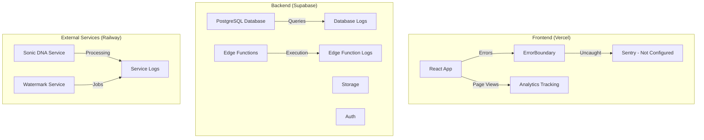

# Monitoring

> **Status:** Draft — not audited during the September 2026 documentation remediation
> **Version:** 1.0.0  
> **Created:** August 18, 2026  
> **Last Updated:** August 18, 2026  
> **Owner:** Ishan  
> **Related:** [02 - System Architecture](../ARCHITECTURE/02-SYSTEM_ARCHITECTURE.md), [07 - Deployment Architecture](../ARCHITECTURE/07-DEPLOYMENT_ARCHITECTURE.md)

---

## Abstract

This document outlines Trakalog's monitoring, logging, error tracking, and observability practices across frontend, backend, and external services. It provides guidance on how to monitor system health, debug issues, and maintain operational excellence.

---

## 1. Monitoring Overview

### 1.1 Monitoring Architecture



### 1.2 Current State

| Area | Status | Tool |
|------|--------|------|
| Frontend Error Tracking | ⚠️ Not Configured | Sentry (recommended) |
| Backend Logging | ✅ Available | Supabase Dashboard |
| Database Observability | ✅ Available | Supabase Metrics |
| Edge Function Logging | ✅ Available | Supabase Dashboard |
| External Service Logging | ✅ Available | Railway Dashboard |
| Analytics | ✅ Partial | Custom RPC-based |
| Performance Monitoring | ⚠️ Not Configured | Vercel Analytics (recommended) |

---

## 2. Frontend Monitoring

### 2.1 Error Tracking (Recommended: Sentry)

**Current State:** Not configured

**Recommended Setup:**

```bash
# Install Sentry SDK
npm install @sentry/react @sentry/vite-plugin
```

**Configuration (`src/main.tsx`):**
```typescript
import * as Sentry from '@sentry/react';
import { BrowserTracing } from '@sentry/tracing';

if (import.meta.env.PROD) {
  Sentry.init({
    dsn: import.meta.env.VITE_SENTRY_DSN,
    integrations: [
      new BrowserTracing(),
      new Sentry.Replay(),
    ],
    tracesSampleRate: 0.2, // Sample 20% of transactions
    replaysSessionSampleRate: 0.1, // Sample 10% of sessions
    replaysOnErrorSampleRate: 1.0, // Always capture replays on error
    environment: import.meta.env.MODE,
    release: import.meta.env.VITE_APP_VERSION,
  });
}
```

**Vite Plugin Configuration:**
```typescript
// vite.config.ts
import { sentryVitePlugin } from '@sentry/vite-plugin';

export default defineConfig({
  plugins: [
    react(),
    sentryVitePlugin({
      org: 'trakalog',
      project: 'frontend',
      authToken: import.meta.env.VITE_SENTRY_AUTH_TOKEN,
    }),
  ],
});
```

**ErrorBoundary Integration:**
```typescript
// src/components/ErrorBoundary.tsx
import * as Sentry from '@sentry/react';

export class ErrorBoundary extends Component<Props, State> {
  componentDidCatch(error: Error, info: ErrorInfo) {
    console.error("ErrorBoundary caught:", error, info);
    
    // Send to Sentry
    if (import.meta.env.PROD) {
      Sentry.withScope((scope) => {
        scope.setExtras({
          component: info.componentStack,
        });
        Sentry.captureException(error);
      });
    }
    
    // ... existing logic
  }
}
```

**Environment Variables:**
```
VITE_SENTRY_DSN=your-sentry-dsn
VITE_SENTRY_AUTH_TOKEN=your-auth-token
```

### 2.2 ErrorBoundary (Current)

**Location:** `src/components/ErrorBoundary.tsx`

**Current Implementation:**
- Catches JavaScript errors in component tree
- Detects stale chunk errors and auto-reloads
- Renders user-friendly error message
- Logs errors to console

**Capabilities:**
- Catches chunk loading errors (after deployments)
- Auto-reloads up to 3 times per session
- Shows fallback UI with refresh button
- Logs full error and component stack

**Limitation:** Errors only logged to browser console, not aggregated

### 2.3 Analytics Tracking

**Current Implementation:** Custom RPC-based analytics (`src/lib/analytics.ts`)

**Features:**
- Privacy-preserving page view tracking
- Fail-silent by design (never blocks rendering)
- No PII collected (visitor ID, session ID, UTM params only)
- Excludes authenticated users and admin paths

**Tracked Metrics:**
- Page path
- Referrer
- UTM parameters (source, medium, campaign)
- Visitor ID (persistent)
- Session ID (per-session)

**Storage:** `public.analytics` table via `log_site_visit` RPC

**Usage:**
```typescript
// Automatically called on public pages
import { trackPageView } from '@/lib/analytics';
trackPageView();
```

### 2.4 Performance Monitoring (Recommended: Vercel)

**Current State:** Not configured

**Recommended:** Enable Vercel Analytics

```bash
# Vercel Analytics is automatic with Vercel hosting
# No additional installation needed
```

**Metrics Available:**
- Page views
- Unique visitors
- Time to First Byte (TTFB)
- First Contentful Paint (FCP)
- Largest Contentful Paint (LCP)
- Cumulative Layout Shift (CLS)
- First Input Delay (FID)

---

## 3. Backend Monitoring (Supabase)

### 3.1 Database Monitoring

**Dashboard:** https://app.supabase.com/project/[project-id]/database

**Available Metrics:**
- Query execution time
- Query count (per second/minute/hour)
- Row count by table
- Storage usage
- Connection count
- CPU usage
- Memory usage

**Alerts:**
- Configure in Supabase Dashboard → Settings → Alerts
- Can alert on: High query latency, Connection limits, Storage limits

### 3.2 Edge Function Monitoring

**Dashboard:** https://app.supabase.com/project/[project-id]/functions

**Available Metrics:**
- Invocation count
- Execution time (p50, p90, p99)
- Error rate
- Cold start count
- Memory usage

**Logs:**
- View logs per function
- Filter by time range
- Search log content
- Download logs

**Log Format:**
```json
{
  "timestamp": "2026-08-18T10:00:00Z",
  "level": "info" | "error" | "warn",
  "message": "Function executed",
  "function_name": "get-watermarked-audio",
  "execution_time_ms": 150,
  "status": "success" | "error"
}
```

### 3.3 Storage Monitoring

**Dashboard:** https://app.supabase.com/project/[project-id]/storage

**Available Metrics:**
- Storage usage by bucket
- File count by bucket
- Upload/download bandwidth
- Request count

**Buckets to Monitor:**
- `trakalog-tracks` - Original track files
- `trakalog-previews` - Compressed preview files
- `trakalog-watermarked` - Watermarked audio files
- `trakalog-covers` - Album artwork
- `trakalog-stems` - Stem files
- `trakalog-documents` - Attached documents

---

## 4. External Service Monitoring (Railway)

### 4.1 Railway Dashboard

**Dashboard:** https://railway.app/project/[project-id]

**Services to Monitor:**
- **Sonic DNA Service** - Audio analysis (Railway)
- **Watermark Service** - Audio watermarking (Railway)

### 4.2 Metrics per Service

| Metric | Sonic DNA | Watermark Service |
|--------|-----------|------------------|
| Request Count | ✅ | ✅ |
| Response Time | ✅ | ✅ |
| Error Rate | ✅ | ✅ |
| Memory Usage | ✅ | ✅ |
| CPU Usage | ✅ | ✅ |
| Restart Count | ✅ | ✅ |

### 4.3 Logging

**Access:** Railway Dashboard → Service → Logs

**Log Retention:** 7 days (configurable)

**Log Format:**
```
[2026-08-18T10:00:00Z] INFO: Processing request for track xxxxx
[2026-08-18T10:00:01Z] INFO: Sonic DNA analysis complete
[2026-08-18T10:00:02Z] ERROR: audiowmark encoding failed: Invalid input format
```

### 4.4 Health Checks

**Current:** No health check endpoints configured

**Recommended:** Add health check endpoints

```typescript
// services/sonic-dna/index.js
app.get('/health', (req, res) => {
  res.status(200).json({ 
    status: 'healthy', 
    timestamp: new Date().toISOString() 
  });
});

// services/watermark/index.js
app.get('/health', (req, res) => {
  const isHealthy = checkDependencies();
  res.status(isHealthy ? 200 : 503).json({ 
    status: isHealthy ? 'healthy' : 'degraded' 
  });
});
```

**Monitoring:**
```bash
# Check service health
curl -I https://sonic-dna-service/health
curl -I https://watermark-service/health
```

---

## 5. Alerting

### 5.1 Current Alerting

| Service | Alerting Available | Configured |
|---------|-------------------|-----------|
| Supabase | ✅ Database alerts | ❌ No |
| Supabase | ✅ Edge Functions | ❌ No |
| Railway | ✅ Service alerts | ❌ No |
| Vercel | ✅ Frontend alerts | ❌ No |

### 5.2 Recommended Alerts

#### Supabase Alerts

| Alert | Threshold | Severity |
|-------|-----------|----------|
| High query latency | > 1000ms p99 | Warning |
| High error rate | > 5% | Critical |
| Connection limit | > 80% | Warning |
| Storage limit | > 80% | Warning |
| Storage limit | > 95% | Critical |

#### Railway Alerts

| Alert | Threshold | Severity |
|-------|-----------|----------|
| Service down | 1 minute | Critical |
| High error rate | > 10% | Warning |
| Memory usage | > 80% | Warning |
| CPU usage | > 80% | Warning |
| Restart count | > 5/minute | Critical |

#### Frontend Alerts (Sentry)

| Alert | Threshold | Severity |
|-------|-----------|----------|
| Error count | > 10/minute | Warning |
| Error count | > 50/minute | Critical |
| User affected | > 10 | Warning |
| User affected | > 50 | Critical |

---

## 6. Logging Standards

### 6.1 Log Levels

| Level | Use Case | Example |
|-------|----------|---------|
| ERROR | Unexpected failures, unrecoverable errors | `Supabase connection failed` |
| WARN | Recoverable issues, degraded functionality | `Watermark cache miss, processing` |
| INFO | Important operational events | `Track uploaded: track-123` |
| DEBUG | Detailed debugging information | `Audio processing: step 2/3 complete` |
| TRACE | Very detailed, high-volume | `Function called with params: {...}` |

### 6.2 Log Format

**Structured Logging (Recommended):**
```json
{
  "timestamp": "2026-08-18T10:00:00.000Z",
  "level": "error",
  "service": "watermark-service",
  "function": "encodeWatermark",
  "message": "audiowmark encoding failed",
  "error": {
    "name": "Error",
    "message": "Invalid input format",
    "stack": "..."
  },
  "context": {
    "track_id": "track-123",
    "user_id": "user-456",
    "duration": 180
  }
}
```

**Frontend Console Logging:**
```typescript
// ✅ Good - Structured error logging
console.error('[TrackDetail] Failed to load track', {
  trackId,
  error: error.message,
  timestamp: new Date().toISOString(),
});

// ❌ Avoid - Unstructured
console.log('error loading track');
```

### 6.3 Sensitive Data in Logs

**Never log:**
- API keys or tokens
- Passwords or credentials
- User PII (email, name, address)
- Session tokens
- Database connection strings

**Safe to log:**
- IDs (user IDs, track IDs, etc.) - as reference only
- Timestamps
- Error types (not messages with sensitive data)
- Request paths (not query parameters with sensitive data)

---

## 7. Debugging Guide

### 7.1 Frontend Debugging

#### Common Issues

| Issue | Debugging Steps |
|-------|-----------------|
| Blank screen | Check browser console for JS errors |
| API call failing | Check Network tab, verify CORS, check auth |
| State not updating | Check React DevTools, verify re-renders |
| Styling broken | Check Tailwind classes, verify CSS generation |
| Build failing | Check terminal output, verify dependencies |

#### Tools

| Tool | Purpose | Installation |
|------|---------|-------------|
| React DevTools | Inspect component tree, state, hooks | Browser extension |
| Redux DevTools | Inspect React Query cache | Browser extension |
| Tailwind DevTools | Inspect applied Tailwind classes | Browser extension |
| Supabase DevTools | Inspect database, auth, realtime | Browser extension |

### 7.2 Backend Debugging

#### Supabase Issues

**Database Queries:**
```bash
# Connect to database
psql postgresql://postgres:[password]@[host]:[port]/postgres

# Check table contents
SELECT * FROM tracks LIMIT 10;

# Check RLS policies
SELECT * FROM pg_policies WHERE tablename = 'tracks';
```

**Edge Functions:**
```bash
# View function logs
supabase functions logs --limit 100

# Tail logs in real-time
supabase functions logs --tail

# Deploy function
supabase functions deploy
```

### 7.3 Service Debugging (Railway)

```bash
# View service logs
railway logs

# View logs for specific service
railway logs -s sonic-dna

# Tail logs
railway logs --tail

# Check service status
railway status

# Restart service
railway restart -s sonic-dna
```

---

## 8. Performance Monitoring

### 8.1 Key Metrics

| Metric | Target | Current |
|--------|--------|---------|
| Frontend load time | < 2s | ~1.5s |
| API response time (p95) | < 500ms | ~300ms |
| Database query time (p95) | < 100ms | ~50ms |
| Watermark processing time | < 110s | ~80s |
| Audio upload speed | > 5 MB/s | ~8 MB/s |

### 8.2 Performance Bottlenecks

| Area | Potential Bottleneck | Solution |
|------|---------------------|----------|
| Audio upload | Large file sizes | Chunked uploads, compression |
| Watermark encoding | audiowmark processing | Background jobs, caching |
| Sonic DNA analysis | Essentia processing | Background jobs, caching |
| Track listing | Many tracks query | Pagination, indexing |
| Share link access | Watermark generation | Cache per recipient |

---

## 9. Incident Response

### 9.1 Severity Levels

| Severity | Description | Response Time | Notification |
|----------|-------------|---------------|--------------|
| SEV-1 | Complete outage, all users affected | Immediate | Phone, Slack, Email |
| SEV-2 | Major degradation, many users affected | < 1 hour | Slack, Email |
| SEV-3 | Minor degradation, some users affected | < 4 hours | Slack |
| SEV-4 | Bug report, no user impact | < 24 hours | Issue tracker |

### 9.2 Incident Response Process

1. **Detection:** Alert triggered or user report
2. **Triage:** Determine severity and scope
3. **Diagnosis:** Identify root cause
4. **Mitigation:** Apply fix or workaround
5. **Resolution:** Permanent fix deployed
6. **Post-mortem:** Document and prevent recurrence

### 9.3 Common Incidents & Playbook

| Incident | Detection | Diagnosis | Mitigation |
|----------|-----------|-----------|------------|
| Supabase down | Supabase status page | Check Supabase dashboard | Wait for Supabase recovery |
| Edge function error | Supabase logs | Check function code | Redeploy function |
| Watermark service down | Railway dashboard | Check service logs | Restart service |
| Storage full | Supabase alert | Check storage usage | Delete old files, upgrade plan |
| High latency | User reports | Check metrics | Scale up, optimize queries |

---

## 10. Maintenance Tasks

### 10.1 Daily

- [ ] Check Supabase dashboard for alerts
- [ ] Check Railway dashboard for service health
- [ ] Review Sentry errors (when configured)
- [ ] Verify critical user journeys

### 10.2 Weekly

- [ ] Review database query performance
- [ ] Check Edge Function execution times
- [ ] Monitor storage usage growth
- [ ] Review and archive old logs

### 10.3 Monthly

- [ ] Full system health check
- [ ] Review and update alert thresholds
- [ ] Test disaster recovery procedures
- [ ] Review incident response effectiveness

---

## Appendix A: Quick Reference

| Task | Location/Command |
|------|-----------------|
| View Supabase logs | https://app.supabase.com/project/[id]/logs |
| View Railway logs | https://railway.app/project/[id]/logs |
| Check function logs | `supabase functions logs` |
| Check service logs | `railway logs` |
| Check database | `psql [connection-string]` |
| Test health check | `curl -I https://[service]/health` |

---

## Appendix B: Document Metadata

| Property | Value |
|----------|-------|
| **Created** | August 18, 2026 |
| **Version** | 1.0.0 |
| **Owner** | Ishan |
| **Status** | Draft |
| **Phase** | 3 (Operations) |
| **Effort** | 3h |
